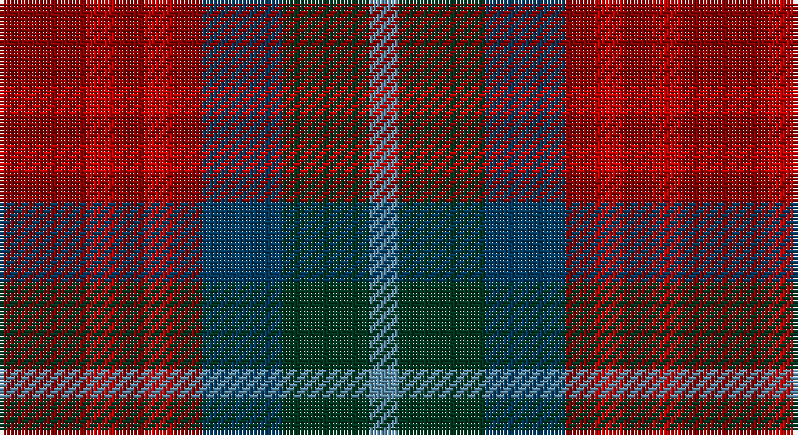

This page is one **sett** — a single exact thread-count. It belongs to the [tartan](/setts/ri12r4ri4r4ri4dt11dg12t4/)
(the same proportion at any scale), whose colour order is pattern [BGBRRRRR](/stripes/bgbrrrrr/).

Part of the [Akins](/tartans/akins/) tartan — the named design grouping this sett with its other cloths.

Sourced from house-of-tartan.  It is a [8 stripe tartan](/stripes/stripes8/).

Original link http://www.house-of-tartan.scotland.net/house/TartanViewjs.asp?colr=Def&tnam=2426

## Provenance

Earliest known date: 1822 This is the `Approved` tartan for the Akins Clan

## Also known as

This cloth is also recorded under:

- Akins Clan

## Thread count
DR/24 R8 DR8 R8 DR8 DB22 DG24 B/8

One full sett is **188 threads**.

## Palette

Palette: <strong>Tartan Register</strong>
<table><thead><tr><th>Colour</th><th>Threads</th><th>Shade</th><th>Base</th><th>OKLCh</th></tr></thead><tbody><tr><td>DR/</td><td style="text-align:right;font-variant-numeric:tabular-nums">24</td><td><code style="background-color:#880000;">#880000</code> <small style="color:#888">#880000</small></td><td>R <code style="background-color:#CC0000;">#CC0000</code></td><td><small style="color:#888">oklch(39.4% 0.162 29.2)</small></td></tr><tr><td>R</td><td style="text-align:right;font-variant-numeric:tabular-nums">8</td><td><code style="background-color:#C80000;">#C80000</code> <small style="color:#888">#C80000</small></td><td>R <code style="background-color:#CC0000;">#CC0000</code></td><td><small style="color:#888">oklch(52.3% 0.215 29.2)</small></td></tr><tr><td>DR</td><td style="text-align:right;font-variant-numeric:tabular-nums">8</td><td><code style="background-color:#880000;">#880000</code> <small style="color:#888">#880000</small></td><td>R <code style="background-color:#CC0000;">#CC0000</code></td><td><small style="color:#888">oklch(39.4% 0.162 29.2)</small></td></tr><tr><td>R</td><td style="text-align:right;font-variant-numeric:tabular-nums">8</td><td><code style="background-color:#C80000;">#C80000</code> <small style="color:#888">#C80000</small></td><td>R <code style="background-color:#CC0000;">#CC0000</code></td><td><small style="color:#888">oklch(52.3% 0.215 29.2)</small></td></tr><tr><td>DR</td><td style="text-align:right;font-variant-numeric:tabular-nums">8</td><td><code style="background-color:#880000;">#880000</code> <small style="color:#888">#880000</small></td><td>R <code style="background-color:#CC0000;">#CC0000</code></td><td><small style="color:#888">oklch(39.4% 0.162 29.2)</small></td></tr><tr><td>DB</td><td style="text-align:right;font-variant-numeric:tabular-nums">22</td><td><code style="background-color:#003C64;">#003C64</code> <small style="color:#888">#003C64</small></td><td>B <code style="background-color:#2A418A;">#2A418A</code></td><td><small style="color:#888">oklch(34.5% 0.089 246.0)</small></td></tr><tr><td>DG</td><td style="text-align:right;font-variant-numeric:tabular-nums">24</td><td><code style="background-color:#003820;">#003820</code> <small style="color:#888">#003820</small></td><td>G <code style="background-color:#006100;">#006100</code></td><td><small style="color:#888">oklch(30.0% 0.070 158.3)</small></td></tr><tr><td>B/</td><td style="text-align:right;font-variant-numeric:tabular-nums">8</td><td><code style="background-color:#5C8CA8;">#5C8CA8</code> <small style="color:#888">#5C8CA8</small></td><td>B <code style="background-color:#2A418A;">#2A418A</code></td><td><small style="color:#888">oklch(61.7% 0.067 235.0)</small></td></tr></tbody></table>

# Sample pattern

## Compared to the master

This cloth is one sett of its design; the master sett (the exemplar the design is anchored on) is below for comparison.

<figure style="margin:0"><figcaption style="color:#888;font-size:smaller">this sett</figcaption></figure>
<figure style="margin:0"><figcaption style="color:#888;font-size:smaller"><a href="/setts/m21r3m3r3m3db19g22t3/">master sett →</a></figcaption></figure>

## Nearest tartans

The nearest existing variants by ΔTartan distance, with this tartan at the top so the swatches line up against it.

ΔTartan

Tartan

Sett

—

<a href="/ttd/edit/#slug=ri12r4ri4r4ri4dt11dg12t4~x2">Akins Clan Tartan</a> <a class="nn-out" href="/variants/s8/ri12r4ri4r4ri4dt11dg12t4~x2/" title="open its dictionary page">↗</a>

1.47

<a href="/variants/s10/dy2lr1dy5k4do5o1~x4/">Huntly #3</a>

1.52

<a href="/ttd/edit/#slug=dg4r1dg3y1db3y1db3y1r4dg3r4~x2&amp;base=ri12r4ri4r4ri4dt11dg12t4~x2">University Plaid</a> <a class="nn-out" href="/variants/s11/dg4r1dg3y1db3y1db3y1r4dg3r4~x2/" title="open its dictionary page">↗</a>

1.54

<a href="/ttd/edit/#slug=r1db3dr1g3dr5lb1~x4&amp;base=ri12r4ri4r4ri4dt11dg12t4~x2">Lanark (Fashion #1)</a> <a class="nn-out" href="/variants/s6/r1db3dr1g3dr5lb1~x4/" title="open its dictionary page">↗</a>

1.57

<a href="/ttd/edit/#slug=dg2dr12db11lo6dy6dr12dg2~x2&amp;base=ri12r4ri4r4ri4dt11dg12t4~x2">Heather MacRae</a> <a class="nn-out" href="/variants/s7/dg2dr12db11lo6dy6dr12dg2~x2/" title="open its dictionary page">↗</a>

1.63

<a href="/ttd/edit/#slug=dg2ly1dg6ri4r6k1r2~x4&amp;base=ri12r4ri4r4ri4dt11dg12t4~x2">Unidentified Printing #3</a> <a class="nn-out" href="/variants/s7/dg2ly1dg6ri4r6k1r2~x4/" title="open its dictionary page">↗</a>

1.66

<a href="/ttd/edit/#slug=k5do1g3do1g3do1k5r1ri5r1~x4&amp;base=ri12r4ri4r4ri4dt11dg12t4~x2">Murdoch (Dalgliesh)</a> <a class="nn-out" href="/variants/s10/k5do1g3do1g3do1k5r1ri5r1~x4/" title="open its dictionary page">↗</a>

1.70

<a href="/ttd/edit/#slug=r10do10r4dg2r2do2r4dg12dp12dg3dp4~x2&amp;base=ri12r4ri4r4ri4dt11dg12t4~x2">Hueg (Munich) Hunting (Personal)</a> <a class="nn-out" href="/variants/s11/r10do10r4dg2r2do2r4dg12dp12dg3dp4~x2/" title="open its dictionary page">↗</a>

1.72

<a href="/ttd/edit/#slug=db5k3db18dg6k6dg6dy12r5dy12r3~x2&amp;base=ri12r4ri4r4ri4dt11dg12t4~x2">Longford, County</a> <a class="nn-out" href="/variants/s10/db5k3db18dg6k6dg6dy12r5dy12r3~x2/" title="open its dictionary page">↗</a>

1.72

<a href="/ttd/edit/#slug=dp3dg3db3dg11o8m8db4dg3m3r3m15r3~x2&amp;base=ri12r4ri4r4ri4dt11dg12t4~x2">Strathgaela (Corporate)</a> <a class="nn-out" href="/variants/s12/dp3dg3db3dg11o8m8db4dg3m3r3m15r3~x2/" title="open its dictionary page">↗</a>

1.74

<a href="/variants/s6/r4ni3n12db8ni2r4/">Bristol Gramar School Check (School)</a>

## Neighbour map

Every grey dot is one of 14360 variants placed by the first two principal components of the ΔTartan feature space (44% of its variance). Red is this tartan; blue dots are its nearest — click one to open its page.

<svg viewBox="0 0 640 380" role="img" style="max-width:100%;height:auto;border:1px solid #e0e0e0;border-radius:4px;display:block" xmlns="http://www.w3.org/2000/svg"><image href="/nn/cloud.v1.png" width="640" height="380"/><a href="/variants/s10/dy2lr1dy5k4do5o1~x4/"><circle cx="167.3" cy="261.3" r="4" fill="#3465a4"><title>Huntly #3</title></circle></a><a href="/variants/s11/dg4r1dg3y1db3y1db3y1r4dg3r4~x2/"><circle cx="170.4" cy="284.8" r="4" fill="#3465a4"><title>University Plaid</title></circle></a><a href="/variants/s6/r1db3dr1g3dr5lb1~x4/"><circle cx="180.8" cy="247.4" r="4" fill="#3465a4"><title>Lanark (Fashion #1)</title></circle></a><a href="/variants/s7/dg2dr12db11lo6dy6dr12dg2~x2/"><circle cx="228.0" cy="258.6" r="4" fill="#3465a4"><title>Heather MacRae</title></circle></a><a href="/variants/s7/dg2ly1dg6ri4r6k1r2~x4/"><circle cx="180.1" cy="236.2" r="4" fill="#3465a4"><title>Unidentified Printing #3</title></circle></a><a href="/variants/s10/k5do1g3do1g3do1k5r1ri5r1~x4/"><circle cx="147.8" cy="225.5" r="4" fill="#3465a4"><title>Murdoch (Dalgliesh)</title></circle></a><a href="/variants/s11/r10do10r4dg2r2do2r4dg12dp12dg3dp4~x2/"><circle cx="175.1" cy="239.9" r="4" fill="#3465a4"><title>Hueg (Munich) Hunting (Personal)</title></circle></a><a href="/variants/s10/db5k3db18dg6k6dg6dy12r5dy12r3~x2/"><circle cx="155.0" cy="248.0" r="4" fill="#3465a4"><title>Longford, County</title></circle></a><a href="/variants/s12/dp3dg3db3dg11o8m8db4dg3m3r3m15r3~x2/"><circle cx="146.2" cy="196.9" r="4" fill="#3465a4"><title>Strathgaela (Corporate)</title></circle></a><a href="/variants/s6/r4ni3n12db8ni2r4/"><circle cx="197.3" cy="266.6" r="4" fill="#3465a4"><title>Bristol Gramar School Check (School)</title></circle></a><circle cx="130.2" cy="270.6" r="5" fill="#c00000"/></svg>

ID: /variants/s8/ri12r4ri4r4ri4dt11dg12t4~x2/
