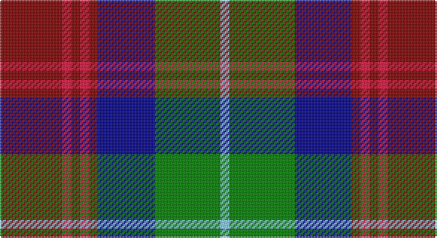

This page is one **sett** — a single exact thread-count. It belongs to the [tartan](/setts/ri21r3ri3r3ri3db19g22lt3/)
(the same proportion at any scale), whose colour order is pattern [RRRRRBGW](/stripes/rrrrrbgw/).

Sourced from register-of-tartans.  It is a [8 stripe tartan](/stripes/stripes8/).

Original link https://www.tartanregister.gov.uk/tartanDetails.aspx?ref=33

## Register references

External register numbers recorded for this tartan.

- Scottish Register of Tartans: [33](https://www.tartanregister.gov.uk/tartanDetails.aspx?ref=33)
- Scottish Tartans Authority (ITI): 2426
- Scottish Tartans World Register: 2426

## Thread count
DR/42 R6 DR6 R6 DR6 DB38 G44 LB/6

One full sett is **260 threads**.

## Palette

Palette: <strong>custom</strong>
<table><thead><tr><th>Colour</th><th>Threads</th><th>Shade</th><th>Base</th><th>OKLCh</th></tr></thead><tbody><tr><td>DR/</td><td style="text-align:right;font-variant-numeric:tabular-nums">42</td><td><code style="background-color:#800000;">#800000</code> <small style="color:#888">#800000</small></td><td>R <code style="background-color:#CC0000;">#CC0000</code></td><td><small style="color:#888">oklch(37.7% 0.155 29.2)</small></td></tr><tr><td>R</td><td style="text-align:right;font-variant-numeric:tabular-nums">6</td><td><code style="background-color:#DC143C;">#DC143C</code> <small style="color:#888">#DC143C</small></td><td>R <code style="background-color:#CC0000;">#CC0000</code></td><td><small style="color:#888">oklch(57.1% 0.222 20.1)</small></td></tr><tr><td>DR</td><td style="text-align:right;font-variant-numeric:tabular-nums">6</td><td><code style="background-color:#800000;">#800000</code> <small style="color:#888">#800000</small></td><td>R <code style="background-color:#CC0000;">#CC0000</code></td><td><small style="color:#888">oklch(37.7% 0.155 29.2)</small></td></tr><tr><td>R</td><td style="text-align:right;font-variant-numeric:tabular-nums">6</td><td><code style="background-color:#DC143C;">#DC143C</code> <small style="color:#888">#DC143C</small></td><td>R <code style="background-color:#CC0000;">#CC0000</code></td><td><small style="color:#888">oklch(57.1% 0.222 20.1)</small></td></tr><tr><td>DR</td><td style="text-align:right;font-variant-numeric:tabular-nums">6</td><td><code style="background-color:#800000;">#800000</code> <small style="color:#888">#800000</small></td><td>R <code style="background-color:#CC0000;">#CC0000</code></td><td><small style="color:#888">oklch(37.7% 0.155 29.2)</small></td></tr><tr><td>DB</td><td style="text-align:right;font-variant-numeric:tabular-nums">38</td><td><code style="background-color:#00008B;">#00008B</code> <small style="color:#888">#00008B</small></td><td>B <code style="background-color:#2A418A;">#2A418A</code></td><td><small style="color:#888">oklch(28.8% 0.199 264.1)</small></td></tr><tr><td>G</td><td style="text-align:right;font-variant-numeric:tabular-nums">44</td><td><code style="background-color:#008000;">#008000</code> <small style="color:#888">#008000</small></td><td>G <code style="background-color:#006100;">#006100</code></td><td><small style="color:#888">oklch(52.0% 0.177 142.5)</small></td></tr><tr><td>LB/</td><td style="text-align:right;font-variant-numeric:tabular-nums">6</td><td><code style="background-color:#87CEFA;">#87CEFA</code> <small style="color:#888">#87CEFA</small></td><td>W <code style="background-color:#F7F7F7;">#F7F7F7</code></td><td><small style="color:#888">oklch(82.1% 0.095 236.8)</small></td></tr></tbody></table>

# Sample pattern

## Nearest tartans

The nearest existing variants by ΔTartan distance, with this tartan at the top so the swatches line up against it.

ΔTartan

Tartan

Sett

—

<a href="/ttd/edit/#slug=ri21r3ri3r3ri3db19g22lt3~x2">Akins Clan (Personal)</a> <a class="nn-out" href="/variants/s8/ri21r3ri3r3ri3db19g22lt3~x2/" title="open its dictionary page">↗</a>

0.56

<a href="/ttd/edit/#slug=m21r3m3r3m3db19g22b3~x2&amp;base=ri21r3ri3r3ri3db19g22lt3~x2">Akins</a> <a class="nn-out" href="/variants/s8/m21r3m3r3m3db19g22b3~x2/" title="open its dictionary page">↗</a>

0.64

<a href="/ttd/edit/#slug=dp8k1g2k1dy2k6g8k1w2~x4&amp;base=ri21r3ri3r3ri3db19g22lt3~x2">Coffield-Limesand (Personal)</a> <a class="nn-out" href="/variants/s9/dp8k1g2k1dy2k6g8k1w2~x4/" title="open its dictionary page">↗</a>

0.71

<a href="/ttd/edit/#slug=o56k12o7k12o7g50db50ly10&amp;base=ri21r3ri3r3ri3db19g22lt3~x2">Sikh</a> <a class="nn-out" href="/variants/s8/o56k12o7k12o7g50db50ly10/" title="open its dictionary page">↗</a>

0.73

<a href="/ttd/edit/#slug=lr18k3lr4w3lr4k19n20k2m4~x2&amp;base=ri21r3ri3r3ri3db19g22lt3~x2">Heart of the Highlands</a> <a class="nn-out" href="/variants/s9/lr18k3lr4w3lr4k19n20k2m4~x2/" title="open its dictionary page">↗</a>

0.74

<a href="/ttd/edit/#slug=o18k3o4lb3o4k18n20k2m4~x2&amp;base=ri21r3ri3r3ri3db19g22lt3~x2">Heart of the Highlands</a> <a class="nn-out" href="/variants/s9/o18k3o4lb3o4k18n20k2m4~x2/" title="open its dictionary page">↗</a>

0.76

<a href="/ttd/edit/#slug=k1g8k4r1db8r1db1r8g1w1~x4&amp;base=ri21r3ri3r3ri3db19g22lt3~x2">Rattray of Lude</a> <a class="nn-out" href="/variants/s10/k1g8k4r1db8r1db1r8g1w1~x4/" title="open its dictionary page">↗</a>

0.93

<a href="/ttd/edit/#slug=m3k17n11m2o20w2~x2&amp;base=ri21r3ri3r3ri3db19g22lt3~x2">Commonwealth Games Council (Corp.)</a> <a class="nn-out" href="/variants/s6/m3k17n11m2o20w2~x2/" title="open its dictionary page">↗</a>

0.93

<a href="/ttd/edit/#slug=m3db14gi14db2m14db2m14db2g14db2ly3~x2&amp;base=ri21r3ri3r3ri3db19g22lt3~x2">Clare</a> <a class="nn-out" href="/variants/s11/m3db14gi14db2m14db2m14db2g14db2ly3~x2/" title="open its dictionary page">↗</a>

0.99

<a href="/ttd/edit/#slug=lb4k13g6r16lbi2r2g2~x2&amp;base=ri21r3ri3r3ri3db19g22lt3~x2">Caledonian Brewery Corporate Tartan</a> <a class="nn-out" href="/variants/s7/lb4k13g6r16lbi2r2g2~x2/" title="open its dictionary page">↗</a>

1.00

<a href="/ttd/edit/#slug=r12db3g5dbi16ly2g2~x2&amp;base=ri21r3ri3r3ri3db19g22lt3~x2">Dunbog, Primary School</a> <a class="nn-out" href="/variants/s6/r12db3g5dbi16ly2g2~x2/" title="open its dictionary page">↗</a>

## Neighbour map

Every grey dot is one of 14360 variants placed by the first two principal components of the ΔTartan feature space (44% of its variance). Red is this tartan; blue dots are its nearest — click one to open its page.

<svg viewBox="0 0 640 380" role="img" style="max-width:100%;height:auto;border:1px solid #e0e0e0;border-radius:4px;display:block" xmlns="http://www.w3.org/2000/svg"><image href="/nn/cloud.v1.png" width="640" height="380"/><a href="/variants/s8/m21r3m3r3m3db19g22b3~x2/"><circle cx="158.6" cy="191.4" r="4" fill="#3465a4"><title>Akins</title></circle></a><a href="/variants/s9/dp8k1g2k1dy2k6g8k1w2~x4/"><circle cx="128.7" cy="185.0" r="4" fill="#3465a4"><title>Coffield-Limesand (Personal)</title></circle></a><a href="/variants/s8/o56k12o7k12o7g50db50ly10/"><circle cx="142.3" cy="189.5" r="4" fill="#3465a4"><title>Sikh</title></circle></a><a href="/variants/s9/lr18k3lr4w3lr4k19n20k2m4~x2/"><circle cx="141.3" cy="164.1" r="4" fill="#3465a4"><title>Heart of the Highlands</title></circle></a><a href="/variants/s9/o18k3o4lb3o4k18n20k2m4~x2/"><circle cx="160.9" cy="175.2" r="4" fill="#3465a4"><title>Heart of the Highlands</title></circle></a><a href="/variants/s10/k1g8k4r1db8r1db1r8g1w1~x4/"><circle cx="123.5" cy="166.9" r="4" fill="#3465a4"><title>Rattray of Lude</title></circle></a><a href="/variants/s6/m3k17n11m2o20w2~x2/"><circle cx="159.8" cy="192.2" r="4" fill="#3465a4"><title>Commonwealth Games Council (Corp.)</title></circle></a><a href="/variants/s11/m3db14gi14db2m14db2m14db2g14db2ly3~x2/"><circle cx="121.8" cy="182.4" r="4" fill="#3465a4"><title>Clare</title></circle></a><a href="/variants/s7/lb4k13g6r16lbi2r2g2~x2/"><circle cx="171.7" cy="189.2" r="4" fill="#3465a4"><title>Caledonian Brewery Corporate Tartan</title></circle></a><a href="/variants/s6/r12db3g5dbi16ly2g2~x2/"><circle cx="159.6" cy="194.4" r="4" fill="#3465a4"><title>Dunbog, Primary School</title></circle></a><circle cx="145.3" cy="182.3" r="5" fill="#c00000"/></svg>

ID: /variants/s8/ri21r3ri3r3ri3db19g22lt3~x2/
