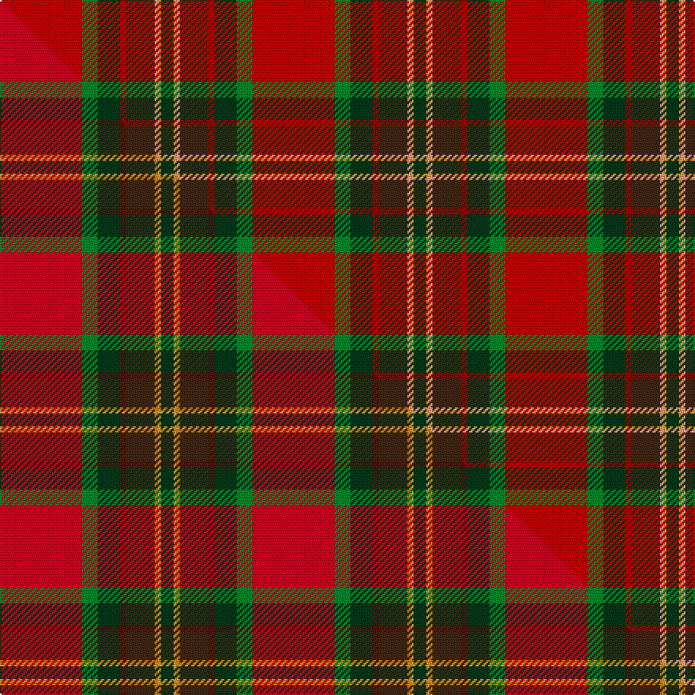

This is one **variant** — a specific cloth: this exact thread count and colourway, with its own
provenance below. It is one weaving of the [sett](/tartans/t/ta/tartan-army-whisky/) (the scale-free proportion — the
same cloth at any scale or shade), whose colour order is pattern [GYYBRGGR](/stripes/gyybrggr/).

Part of the [Tartan Army Whisky](/tartans/t/ta/tartan-army-whisky/) tartan — the named design grouping this sett with its other cloths.

Sourced from tartans-authority.  It is a [8 stripe tartan](/stripes/stripes8/).

Original link <code>http://www.tartansauthority.com/tartan-ferret/display/10975/</code> — retired · [Internet Archive copy](https://web.archive.org/web/*/http://www.tartansauthority.com/tartan-ferret/display/10975/*)

Dataset <small>— provenance for this record, inherited from the source manifest</small>

<dl class="dataset-prov">
<dt>source</dt><dd><a href="/sources/tartans-authority/">Scottish Tartans Authority</a></dd>
<dt>data captured from</dt><dd><a href="https://github.com/thetartan/tartan-database/blob/master/data/tartans-authority/data.csv">https://github.com/thetartan/tartan-database/blob/master/data/tartans-authority/data.csv</a></dd>
<dt>data date</dt><dd>2014 <small>(this record)</small></dd>
<dt>licence</dt><dd><a href="https://creativecommons.org/licenses/by-nc-nd/4.0/">CC BY-NC-ND 4.0</a></dd>
</dl>

Capture chain <small>— the hands this data passed through, oldest first; each capture carries its own licence</small>

<ol class="capture-chain">
<li><a href="https://www.tartansauthority.com/">Scottish Tartans Authority</a> <small>the heritage body’s archive — its tartan-ferret record browser is retired; dead record links are shown unlinked, with an Internet Archive copy (ITI numbers are not SRT references)</small></li>
<li><a href="https://github.com/thetartan/tartan-database">thetartan/tartan-database</a> <small>2016-2017</small> · <a href="https://creativecommons.org/licenses/by-nc-nd/4.0/">CC BY-NC-ND 4.0</a> <small>Levko Kravets's frozen compilation — the capture we vendored, and where its CC licence text came from</small></li>
<li>this dictionary <small>captured 2026-06-10 · commit 5bf86c7566</small> <small>each re-capture is a git commit to data/sources</small></li>
</ol>

## Register references

External register numbers recorded for this tartan.

- Scottish Register of Tartans: [10975](https://www.tartanregister.gov.uk/tartanDetails?ref=10975)
- Scottish Tartans Authority (ITI): 10975

## Thread count
Ri/52 G10 DG14 R4 DO18 LR2 LO2 DG/8

One full sett is **160 threads**.

## Palette
<table><thead><tr><th>Colour</th><th>Shade</th><th>OKLCh</th></tr></thead><tbody><tr><td>DG</td><td><code style="background-color:#053819;">#053819</code> <small style="color:#888">#053819</small></td><td><small style="color:#888">oklch(30.0% 0.075 151.3)</small></td></tr><tr><td>DO</td><td><code style="background-color:#412714;">#412714</code> <small style="color:#888">#412714</small></td><td><small style="color:#888">oklch(30.1% 0.050 55.7)</small></td></tr><tr><td>R</td><td><code style="background-color:#A00000;">#A00000</code> <small style="color:#888">#A00000</small></td><td><small style="color:#888">oklch(44.3% 0.182 29.2)</small></td></tr><tr><td>G</td><td><code style="background-color:#008B2A;">#008B2A</code> <small style="color:#888">#008B2A</small></td><td><small style="color:#888">oklch(55.4% 0.170 145.9)</small></td></tr><tr><td>LR</td><td><code style="background-color:#FF9C97;">#FF9C97</code> <small style="color:#888">#FF9C97</small></td><td><small style="color:#888">oklch(79.3% 0.119 23.2)</small></td></tr><tr><td>LO</td><td><code style="background-color:#FF9C34;">#FF9C34</code> <small style="color:#888">#FF9C34</small></td><td><small style="color:#888">oklch(77.9% 0.161 61.8)</small></td></tr><tr><td>R</td><td><code style="background-color:#C80000;">#C80000</code> <small style="color:#888">#C80000</small></td><td><small style="color:#888">oklch(52.3% 0.215 29.2)</small></td></tr></tbody></table>

# Sample pattern

## Compared to the master

This cloth is one sett of its design; the master sett (the exemplar the design is anchored on) is below for comparison.

Its **ΔTartan distance** from the master is **0.62** — the same measure the nearest-tartans table ranks by (0 is identical; a re-scale of the same cloth is near 0, a recolour or a different proportion further).

<figure class="master-compare" style="margin:0">

this sett
master sett ★

<figcaption style="color:#888;font-size:smaller">One weave of this sett against the <a href="/setts/r26g5dg7dr2do9lo1loi1dg4/">master sett ★</a>, split on the diagonal: a shared proportion runs seamlessly across it with only the shades shifting; a different proportion breaks on it.</figcaption>
</figure>

## Nearest tartan variants

The nearest existing variants by ΔTartan distance, with this cloth at the top so the swatches line up against it.

ΔTartan

Threads

Variant

Sett

—

160

<a href="/variants/s8/ri26g5dg7r2do9lr1lo1dg4~x2~ri2109032-r1807033/">Tartan Army Whisky</a>

<a href="/ttd/edit/#slug=r26g5dg7dr2do9lo1loi1dg4~x2~lo2706066-loi2905070&amp;base=ri26g5dg7r2do9lr1lo1dg4~x2~ri2109032-r1807033" title="compare in the TTD">0.62</a>

160

<a href="/variants/s8/r26g5dg7dr2do9lo1loi1dg4~x2~lo2706066-loi2905070/">Tartan Army Whisky</a>

<a href="/ttd/edit/#slug=g9y2g6r35db6lb1dr20db5lb2~x2~r2109032-db1004274&amp;base=ri26g5dg7r2do9lr1lo1dg4~x2~ri2109032-r1807033" title="compare in the TTD">2.75</a>

322

<a href="/variants/s9/g9y2g6r35db6lb1dr20db5lb2~x2~r2109032-db1004274/">Telfer Name Tartan</a>

<a href="/ttd/edit/#slug=g9y2g6r35db6lb1dr20db5lb2~x2&amp;base=ri26g5dg7r2do9lr1lo1dg4~x2~ri2109032-r1807033" title="compare in the TTD">3.21</a>

322

<a href="/variants/s9/g9y2g6r35db6lb1dr20db5lb2~x2/">Telfer (Name)</a>

<a href="/ttd/edit/#slug=dr5dg8do13o21y34lr55dg3&amp;base=ri26g5dg7r2do9lr1lo1dg4~x2~ri2109032-r1807033" title="compare in the TTD">3.22</a>

270

<a href="/variants/s7/dr5dg8do13o21y34lr55dg3/">Canadian Shield (Personal)</a>

<a href="/ttd/edit/#slug=y3o24db4o8w2o2g10r12oi2r5w2~x2~o1604043-oi2102055&amp;base=ri26g5dg7r2do9lr1lo1dg4~x2~ri2109032-r1807033" title="compare in the TTD">3.24</a>

286

<a href="/variants/s11/y3o24db4o8w2o2g10r12oi2r5w2~x2~o1604043-oi2102055/">Unidentified 31</a>

<a href="/ttd/edit/#slug=g9dy2g6r35db6lb1dr20db5lb2~x2&amp;base=ri26g5dg7r2do9lr1lo1dg4~x2~ri2109032-r1807033" title="compare in the TTD">3.25</a>

322

<a href="/variants/s9/g9dy2g6r35db6lb1dr20db5lb2~x2/">Telfer</a>

<a href="/ttd/edit/#slug=r40dg2r2dp2r2g2r2dr5dg20y2dp20~x2&amp;base=ri26g5dg7r2do9lr1lo1dg4~x2~ri2109032-r1807033" title="compare in the TTD">3.33</a>

276

<a href="/variants/s11/r40dg2r2dp2r2g2r2dr5dg20y2dp20~x2/">Cadden-Phillips (Personal)</a>

<a href="/ttd/edit/#slug=w3o1r29o16g23db3g3y2~x2&amp;base=ri26g5dg7r2do9lr1lo1dg4~x2~ri2109032-r1807033" title="compare in the TTD">3.54</a>

310

<a href="/variants/s8/w3o1r29o16g23db3g3y2~x2/">Etienne, Paschal Tache Sir...</a>

<a href="/ttd/edit/#slug=dg18g2dt5r45db3dt18db3r5w2~dg1806142-g2408144-dt1204274-db1406275&amp;base=ri26g5dg7r2do9lr1lo1dg4~x2~ri2109032-r1807033" title="compare in the TTD">3.59</a>

182

<a href="/variants/s9/dg18g2db5r45dbi3db18dbi3r5w2~dg1806142-g2408144-db1204274-dbi1406275/">MacNiven Family Tartan</a>

<a href="/ttd/edit/#slug=o3n20r1n4r2n2r4n2r5g2dr20w3~x2~o2500000-n1900000&amp;base=ri26g5dg7r2do9lr1lo1dg4~x2~ri2109032-r1807033" title="compare in the TTD">3.60</a>

260

<a href="/variants/s12/o3n20r1n4r2n2r4n2r5g2dr20w3~x2~o2500000-n1900000/">Ryutokukan High School (Corporate)</a>

## Neighbour map

Every grey dot is one of 13656 variants placed by the first two principal components of the ΔTartan feature space (42% of its variance). Red is this tartan; blue dots are its nearest — click one to open its page. The map is a flat projection of a many-dimensional space — [how to read it](/posts/neighbourhood-maps/).

<svg viewBox="0 0 640 380" role="img" style="max-width:100%;height:auto;border:1px solid #e0e0e0;border-radius:4px;display:block" xmlns="http://www.w3.org/2000/svg"><image href="/nn/cloud.v1.png" width="640" height="380"/><a href="/variants/s8/r26g5dg7dr2do9lo1loi1dg4~x2~lo2706066-loi2905070/"><circle cx="266.9" cy="109.0" r="4" fill="#3465a4"><title>Tartan Army Whisky</title></circle></a><a href="/variants/s9/g9y2g6r35db6lb1dr20db5lb2~x2~r2109032-db1004274/"><circle cx="250.6" cy="108.4" r="4" fill="#3465a4"><title>Telfer Name Tartan</title></circle></a><a href="/variants/s9/g9y2g6r35db6lb1dr20db5lb2~x2/"><circle cx="240.6" cy="104.7" r="4" fill="#3465a4"><title>Telfer (Name)</title></circle></a><a href="/variants/s7/dr5dg8do13o21y34lr55dg3/"><circle cx="215.6" cy="162.7" r="4" fill="#3465a4"><title>Canadian Shield (Personal)</title></circle></a><a href="/variants/s11/y3o24db4o8w2o2g10r12oi2r5w2~x2~o1604043-oi2102055/"><circle cx="214.8" cy="137.7" r="4" fill="#3465a4"><title>Unidentified 31</title></circle></a><a href="/variants/s9/g9dy2g6r35db6lb1dr20db5lb2~x2/"><circle cx="239.9" cy="104.4" r="4" fill="#3465a4"><title>Telfer</title></circle></a><a href="/variants/s11/r40dg2r2dp2r2g2r2dr5dg20y2dp20~x2/"><circle cx="285.6" cy="106.1" r="4" fill="#3465a4"><title>Cadden-Phillips (Personal)</title></circle></a><a href="/variants/s8/w3o1r29o16g23db3g3y2~x2/"><circle cx="246.7" cy="132.7" r="4" fill="#3465a4"><title>Etienne, Paschal Tache Sir...</title></circle></a><a href="/variants/s9/dg18g2db5r45dbi3db18dbi3r5w2~dg1806142-g2408144-db1204274-dbi1406275/"><circle cx="279.0" cy="112.7" r="4" fill="#3465a4"><title>MacNiven Family Tartan</title></circle></a><a href="/variants/s12/o3n20r1n4r2n2r4n2r5g2dr20w3~x2~o2500000-n1900000/"><circle cx="260.5" cy="125.3" r="4" fill="#3465a4"><title>Ryutokukan High School (Corporate)</title></circle></a><circle cx="274.7" cy="112.1" r="5" fill="#c00000"/><text x="320" y="376" text-anchor="middle" font-size="11" fill="#999">ground</text><text x="11" y="190" text-anchor="middle" font-size="11" fill="#999" transform="rotate(-90 11 190)">complexity</text></svg>

ID: /variants/s8/ri26g5dg7r2do9lr1lo1dg4~x2~ri2109032-r1807033/
