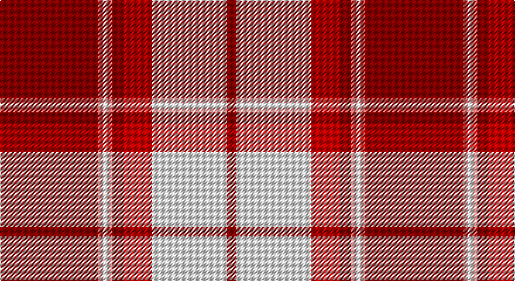

This page is one **sett** — a single exact thread-count. It belongs to the [tartan](/setts/ri42rii2w2rii2ri5r12w32ri4/)
(the same proportion at any scale), whose colour order is pattern [RRWRRRWR](/stripes/rrwrrrwr/).

Sourced from register-of-tartans.  It is a [8 stripe tartan](/stripes/stripes8/).

Original link https://www.tartanregister.gov.uk/tartanDetails.aspx?ref=2206

## Also known as

This cloth is also recorded under:

- Longniddry, Burgundy
- Longniddry, dress Burgundy

2 attestations — the source records this cloth was collapsed from (oldest owns this page)

<ul>
<li>01/01/2002 — Longniddry Burgundy (Dance) (register-of-tartans, <a href="https://www.tartanregister.gov.uk/tartanDetails.aspx?ref=2206">record</a>)</li>
<li>pre 2002 — Longniddry, Burgundy (Dance) (tartans-authority, <a href="http://www.tartansauthority.com/tartan-ferret/display/1651/">record</a>)</li>
</ul>

## Register references

External register numbers recorded for this tartan.

- Scottish Register of Tartans: [2206](https://www.tartanregister.gov.uk/tartanDetails.aspx?ref=2206)
- Scottish Tartans Authority (ITI): 1651
- Scottish Tartans World Register: 1651

## Thread count
DR/84 LR4 LN4 LR4 DR10 R24 LN64 DR/8

One full sett is **312 threads**.

## Palette

Palette: <strong>Tartan Register</strong>
<table><thead><tr><th>Colour</th><th>Threads</th><th>Shade</th><th>Base</th><th>OKLCh</th></tr></thead><tbody><tr><td>DR/</td><td style="text-align:right;font-variant-numeric:tabular-nums">84</td><td><code style="background-color:#880000;">#880000</code> <small style="color:#888">#880000</small></td><td>R <code style="background-color:#CC0000;">#CC0000</code></td><td><small style="color:#888">oklch(39.4% 0.162 29.2)</small></td></tr><tr><td>LR</td><td style="text-align:right;font-variant-numeric:tabular-nums">4</td><td><code style="background-color:#E87878;">#E87878</code> <small style="color:#888">#E87878</small></td><td>R <code style="background-color:#CC0000;">#CC0000</code></td><td><small style="color:#888">oklch(70.0% 0.139 21.2)</small></td></tr><tr><td>LN</td><td style="text-align:right;font-variant-numeric:tabular-nums">4</td><td><code style="background-color:#E0E0E0;">#E0E0E0</code> <small style="color:#888">#E0E0E0</small></td><td>W <code style="background-color:#F7F7F7;">#F7F7F7</code></td><td><small style="color:#888">oklch(90.7% 0.000 89.9)</small></td></tr><tr><td>LR</td><td style="text-align:right;font-variant-numeric:tabular-nums">4</td><td><code style="background-color:#E87878;">#E87878</code> <small style="color:#888">#E87878</small></td><td>R <code style="background-color:#CC0000;">#CC0000</code></td><td><small style="color:#888">oklch(70.0% 0.139 21.2)</small></td></tr><tr><td>DR</td><td style="text-align:right;font-variant-numeric:tabular-nums">10</td><td><code style="background-color:#880000;">#880000</code> <small style="color:#888">#880000</small></td><td>R <code style="background-color:#CC0000;">#CC0000</code></td><td><small style="color:#888">oklch(39.4% 0.162 29.2)</small></td></tr><tr><td>R</td><td style="text-align:right;font-variant-numeric:tabular-nums">24</td><td><code style="background-color:#C80000;">#C80000</code> <small style="color:#888">#C80000</small></td><td>R <code style="background-color:#CC0000;">#CC0000</code></td><td><small style="color:#888">oklch(52.3% 0.215 29.2)</small></td></tr><tr><td>LN</td><td style="text-align:right;font-variant-numeric:tabular-nums">64</td><td><code style="background-color:#E0E0E0;">#E0E0E0</code> <small style="color:#888">#E0E0E0</small></td><td>W <code style="background-color:#F7F7F7;">#F7F7F7</code></td><td><small style="color:#888">oklch(90.7% 0.000 89.9)</small></td></tr><tr><td>DR/</td><td style="text-align:right;font-variant-numeric:tabular-nums">8</td><td><code style="background-color:#880000;">#880000</code> <small style="color:#888">#880000</small></td><td>R <code style="background-color:#CC0000;">#CC0000</code></td><td><small style="color:#888">oklch(39.4% 0.162 29.2)</small></td></tr></tbody></table>

# Sample pattern

## Nearest tartans

The nearest existing variants by ΔTartan distance, with this tartan at the top so the swatches line up against it.

ΔTartan

Tartan

Sett

—

<a href="/ttd/edit/#slug=ri42rii2w2rii2ri5r12w32ri4~x2">Longniddry Burgundy (Dance)</a> <a class="nn-out" href="/variants/s8/ri42rii2w2rii2ri5r12w32ri4~x2/" title="open its dictionary page">↗</a>

0.48

<a href="/ttd/edit/#slug=rii42r2w2r2rii5ri12w32rii4~x2&amp;base=ri42rii2w2rii2ri5r12w32ri4~x2">Longniddry, dress Burgundy</a> <a class="nn-out" href="/variants/s8/rii42r2w2r2rii5ri12w32rii4~x2/" title="open its dictionary page">↗</a>

0.51

<a href="/ttd/edit/#slug=r35db2w2db2r4ri10w25r3~x2&amp;base=ri42rii2w2rii2ri5r12w32ri4~x2">Longniddry Dress, Red (Dance)</a> <a class="nn-out" href="/variants/s8/r35db2w2db2r4ri10w25r3~x2/" title="open its dictionary page">↗</a>

0.93

<a href="/ttd/edit/#slug=r25n2r3lo2r3n11w13lo1~x2&amp;base=ri42rii2w2rii2ri5r12w32ri4~x2">Citylink Gold (Corporate)</a> <a class="nn-out" href="/variants/s8/r25n2r3lo2r3n11w13lo1~x2/" title="open its dictionary page">↗</a>

0.95

<a href="/ttd/edit/#slug=ly27k4w4r64w4r4k4r4k12~x2&amp;base=ri42rii2w2rii2ri5r12w32ri4~x2">O'Meehan (Name)</a> <a class="nn-out" href="/variants/s9/ly27k4w4r64w4r4k4r4k12~x2/" title="open its dictionary page">↗</a>

1.00

<a href="/ttd/edit/#slug=ri3r2db2r30w30db2w3~x2&amp;base=ri42rii2w2rii2ri5r12w32ri4~x2">Torridon, Cherry (Dance)</a> <a class="nn-out" href="/variants/s7/ri3r2db2r30w30db2w3~x2/" title="open its dictionary page">↗</a>

1.05

<a href="/ttd/edit/#slug=r3ri3w23ri3r3ri23k2ri3~x2&amp;base=ri42rii2w2rii2ri5r12w32ri4~x2">Cameron, Hose for E</a> <a class="nn-out" href="/variants/s8/r3ri3w23ri3r3ri23k2ri3~x2/" title="open its dictionary page">↗</a>

1.06

<a href="/ttd/edit/#slug=r40w40k5w2k6w2k5w6~x2&amp;base=ri42rii2w2rii2ri5r12w32ri4~x2">Masai Shuka 14 (Artefact)</a> <a class="nn-out" href="/variants/s8/r40w40k5w2k6w2k5w6~x2/" title="open its dictionary page">↗</a>

1.11

<a href="/ttd/edit/#slug=w1r12g2r2w16r2g2r12lo1~x4&amp;base=ri42rii2w2rii2ri5r12w32ri4~x2">MacFie Dress</a> <a class="nn-out" href="/variants/s9/w1r12g2r2w16r2g2r12lo1~x4/" title="open its dictionary page">↗</a>

1.22

<a href="/ttd/edit/#slug=r50ly8k2w2k2ly8k22r3~x2&amp;base=ri42rii2w2rii2ri5r12w32ri4~x2">FIRES Center of Excelence</a> <a class="nn-out" href="/variants/s8/r50ly8k2w2k2ly8k22r3~x2/" title="open its dictionary page">↗</a>

1.23

<a href="/ttd/edit/#slug=r3k2r23ri3r3lb23r3ri3~x2&amp;base=ri42rii2w2rii2ri5r12w32ri4~x2">Hose #2</a> <a class="nn-out" href="/variants/s8/r3k2r23ri3r3lb23r3ri3~x2/" title="open its dictionary page">↗</a>

## Neighbour map

Every grey dot is one of 14360 variants placed by the first two principal components of the ΔTartan feature space (44% of its variance). Red is this tartan; blue dots are its nearest — click one to open its page.

<svg viewBox="0 0 640 380" role="img" style="max-width:100%;height:auto;border:1px solid #e0e0e0;border-radius:4px;display:block" xmlns="http://www.w3.org/2000/svg"><image href="/nn/cloud.v1.png" width="640" height="380"/><a href="/variants/s8/rii42r2w2r2rii5ri12w32rii4~x2/"><circle cx="304.6" cy="117.4" r="4" fill="#3465a4"><title>Longniddry, dress Burgundy</title></circle></a><a href="/variants/s8/r35db2w2db2r4ri10w25r3~x2/"><circle cx="296.5" cy="122.6" r="4" fill="#3465a4"><title>Longniddry Dress, Red (Dance)</title></circle></a><a href="/variants/s8/r25n2r3lo2r3n11w13lo1~x2/"><circle cx="303.4" cy="128.5" r="4" fill="#3465a4"><title>Citylink Gold (Corporate)</title></circle></a><a href="/variants/s9/ly27k4w4r64w4r4k4r4k12~x2/"><circle cx="325.6" cy="110.0" r="4" fill="#3465a4"><title>O'Meehan (Name)</title></circle></a><a href="/variants/s7/ri3r2db2r30w30db2w3~x2/"><circle cx="283.3" cy="126.8" r="4" fill="#3465a4"><title>Torridon, Cherry (Dance)</title></circle></a><a href="/variants/s8/r3ri3w23ri3r3ri23k2ri3~x2/"><circle cx="284.0" cy="137.4" r="4" fill="#3465a4"><title>Cameron, Hose for E</title></circle></a><a href="/variants/s8/r40w40k5w2k6w2k5w6~x2/"><circle cx="294.7" cy="126.4" r="4" fill="#3465a4"><title>Masai Shuka 14 (Artefact)</title></circle></a><a href="/variants/s9/w1r12g2r2w16r2g2r12lo1~x4/"><circle cx="308.1" cy="134.6" r="4" fill="#3465a4"><title>MacFie Dress</title></circle></a><a href="/variants/s8/r50ly8k2w2k2ly8k22r3~x2/"><circle cx="336.0" cy="107.6" r="4" fill="#3465a4"><title>FIRES Center of Excelence</title></circle></a><a href="/variants/s8/r3k2r23ri3r3lb23r3ri3~x2/"><circle cx="306.2" cy="150.2" r="4" fill="#3465a4"><title>Hose #2</title></circle></a><circle cx="300.3" cy="116.6" r="5" fill="#c00000"/></svg>

ID: /variants/s8/ri42rii2w2rii2ri5r12w32ri4~x2/
