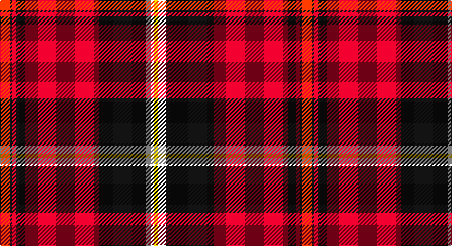

This page is one **sett** — a single exact thread-count. It belongs to the [tartan](/setts/ri5k1r2k4r36k23w4ly2/)
(the same proportion at any scale), whose colour order is pattern [RKRKRKWY](/stripes/rkrkrkwy/).

Part of the [Aberdeen Football Club](/tartans/aberdeen-football-club/) tartan — the named design grouping this sett with its other cloths.

Sourced from register-of-tartans.  It is a [8 stripe tartan](/stripes/stripes8/).

Original link https://www.tartanregister.gov.uk/tartanDetails.aspx?ref=17

## Also known as

This cloth is also recorded under:

- Aberdeen F. C.
- Aberdeen F.C.

## Register references

External register numbers recorded for this tartan.

- Scottish Register of Tartans: [17](https://www.tartanregister.gov.uk/tartanDetails.aspx?ref=17)
- Scottish Tartans World Register: 2694

## Thread count
R/10 K2 Ra4 K8 Ra72 K46 LN8 Y/4

One full sett is **294 threads**.

## Palette

Palette: <strong>Tartan Register</strong> <small style="color:#888">(3 of 5 colours)</small>
<table><thead><tr><th>Colour</th><th>Threads</th><th>Shade</th><th>Base</th><th>OKLCh</th></tr></thead><tbody><tr><td>R/</td><td style="text-align:right;font-variant-numeric:tabular-nums">10</td><td><code style="background-color:#E13200;">#E13200</code> <small style="color:#888">#E13200</small></td><td>R <code style="background-color:#CC0000;">#CC0000</code></td><td><small style="color:#888">oklch(59.2% 0.215 33.6)</small></td></tr><tr><td>K</td><td style="text-align:right;font-variant-numeric:tabular-nums">2</td><td><code style="background-color:#101010;">#101010</code> <small style="color:#888">#101010</small></td><td>K <code style="background-color:#000000;">#000000</code></td><td><small style="color:#888">oklch(17.3% 0.000 89.9)</small></td></tr><tr><td>Ra</td><td style="text-align:right;font-variant-numeric:tabular-nums">4</td><td><code style="background-color:#C80028;">#C80028</code> <small style="color:#888">#C80028</small></td><td>R <code style="background-color:#CC0000;">#CC0000</code></td><td><small style="color:#888">oklch(52.5% 0.212 23.0)</small></td></tr><tr><td>K</td><td style="text-align:right;font-variant-numeric:tabular-nums">8</td><td><code style="background-color:#101010;">#101010</code> <small style="color:#888">#101010</small></td><td>K <code style="background-color:#000000;">#000000</code></td><td><small style="color:#888">oklch(17.3% 0.000 89.9)</small></td></tr><tr><td>Ra</td><td style="text-align:right;font-variant-numeric:tabular-nums">72</td><td><code style="background-color:#C80028;">#C80028</code> <small style="color:#888">#C80028</small></td><td>R <code style="background-color:#CC0000;">#CC0000</code></td><td><small style="color:#888">oklch(52.5% 0.212 23.0)</small></td></tr><tr><td>K</td><td style="text-align:right;font-variant-numeric:tabular-nums">46</td><td><code style="background-color:#101010;">#101010</code> <small style="color:#888">#101010</small></td><td>K <code style="background-color:#000000;">#000000</code></td><td><small style="color:#888">oklch(17.3% 0.000 89.9)</small></td></tr><tr><td>LN</td><td style="text-align:right;font-variant-numeric:tabular-nums">8</td><td><code style="background-color:#E0E0E0;">#E0E0E0</code> <small style="color:#888">#E0E0E0</small></td><td>W <code style="background-color:#F7F7F7;">#F7F7F7</code></td><td><small style="color:#888">oklch(90.7% 0.000 89.9)</small></td></tr><tr><td>Y/</td><td style="text-align:right;font-variant-numeric:tabular-nums">4</td><td><code style="background-color:#E8C000;">#E8C000</code> <small style="color:#888">#E8C000</small></td><td>Y <code style="background-color:#F2BF00;">#F2BF00</code></td><td><small style="color:#888">oklch(81.9% 0.168 93.7)</small></td></tr></tbody></table>

# Sample pattern

## Compared to the master

This cloth is one sett of its design; the master sett (the exemplar the design is anchored on) is below for comparison.

<figure style="margin:0"><figcaption style="color:#888;font-size:smaller">this sett</figcaption></figure>
<figure style="margin:0"><figcaption style="color:#888;font-size:smaller"><a href="/setts/w2k1r28k3m28k1w2/">master sett →</a></figcaption></figure>

## Nearest tartans

The nearest existing variants by ΔTartan distance, with this tartan at the top so the swatches line up against it.

ΔTartan

Tartan

Sett

—

<a href="/ttd/edit/#slug=ri5k1r2k4r36k23w4ly2~x2">Aberdeen Football Club (1999)</a> <a class="nn-out" href="/variants/s8/ri5k1r2k4r36k23w4ly2~x2/" title="open its dictionary page">↗</a>

0.85

<a href="/ttd/edit/#slug=o5k1r2k4r36k23w4ly2~x2&amp;base=ri5k1r2k4r36k23w4ly2~x2">Aberdeen F.C.</a> <a class="nn-out" href="/variants/s8/o5k1r2k4r36k23w4ly2~x2/" title="open its dictionary page">↗</a>

0.99

<a href="/ttd/edit/#slug=lo5dt1r2dt4r36dt22w4ly2~x2&amp;base=ri5k1r2k4r36k23w4ly2~x2">Aberdeen F.C. Corporate Tartan</a> <a class="nn-out" href="/variants/s8/lo5dt1r2dt4r36dt22w4ly2~x2/" title="open its dictionary page">↗</a>

1.01

<a href="/ttd/edit/#slug=r28dg4k4dg4k4t6ly1~x2&amp;base=ri5k1r2k4r36k23w4ly2~x2">Livingstone MacLay MacLeay</a> <a class="nn-out" href="/variants/s7/r28dg4k4dg4k4t6ly1~x2/" title="open its dictionary page">↗</a>

1.04

<a href="/ttd/edit/#slug=r28g4k4g4k4t6ly1~x2&amp;base=ri5k1r2k4r36k23w4ly2~x2">Livingstone, MacLay MacLeay</a> <a class="nn-out" href="/variants/s7/r28g4k4g4k4t6ly1~x2/" title="open its dictionary page">↗</a>

1.12

<a href="/ttd/edit/#slug=w3k3w3k37r40w1r2lo3~x2&amp;base=ri5k1r2k4r36k23w4ly2~x2">Marjoribanks (Clan)</a> <a class="nn-out" href="/variants/s8/w3k3w3k37r40w1r2lo3~x2/" title="open its dictionary page">↗</a>

1.13

<a href="/ttd/edit/#slug=ly3g9db9k1ly2k15r37g2~x2&amp;base=ri5k1r2k4r36k23w4ly2~x2">Mensah</a> <a class="nn-out" href="/variants/s8/ly3g9db9k1ly2k15r37g2~x2/" title="open its dictionary page">↗</a>

1.14

<a href="/ttd/edit/#slug=r27g4k4g4k4db6lo1~x4&amp;base=ri5k1r2k4r36k23w4ly2~x2">MacLeay (Clan)</a> <a class="nn-out" href="/variants/s7/r27g4k4g4k4db6lo1~x4/" title="open its dictionary page">↗</a>

1.22

<a href="/ttd/edit/#slug=r30w1dp4ly1dg14r6dp4lt2w1~x4&amp;base=ri5k1r2k4r36k23w4ly2~x2">Perth - 1819 (District)</a> <a class="nn-out" href="/variants/s9/r30w1dp4ly1dg14r6dp4lt2w1~x4/" title="open its dictionary page">↗</a>

1.23

<a href="/ttd/edit/#slug=r4k6ly1k6r4db16r32k1~x2&amp;base=ri5k1r2k4r36k23w4ly2~x2">Leslie</a> <a class="nn-out" href="/variants/s8/r4k6ly1k6r4db16r32k1~x2/" title="open its dictionary page">↗</a>

1.24

<a href="/ttd/edit/#slug=w8r100k42g42r5k3r5t42r100w8&amp;base=ri5k1r2k4r36k23w4ly2~x2">Unidentified Plaid 10</a> <a class="nn-out" href="/variants/s10/w8r100k42g42r5k3r5t42r100w8/" title="open its dictionary page">↗</a>

## Neighbour map

Every grey dot is one of 14360 variants placed by the first two principal components of the ΔTartan feature space (44% of its variance). Red is this tartan; blue dots are its nearest — click one to open its page.

<svg viewBox="0 0 640 380" role="img" style="max-width:100%;height:auto;border:1px solid #e0e0e0;border-radius:4px;display:block" xmlns="http://www.w3.org/2000/svg"><image href="/nn/cloud.v1.png" width="640" height="380"/><a href="/variants/s8/o5k1r2k4r36k23w4ly2~x2/"><circle cx="299.5" cy="84.6" r="4" fill="#3465a4"><title>Aberdeen F.C.</title></circle></a><a href="/variants/s8/lo5dt1r2dt4r36dt22w4ly2~x2/"><circle cx="327.3" cy="94.7" r="4" fill="#3465a4"><title>Aberdeen F.C. Corporate Tartan</title></circle></a><a href="/variants/s7/r28dg4k4dg4k4t6ly1~x2/"><circle cx="323.9" cy="110.5" r="4" fill="#3465a4"><title>Livingstone MacLay MacLeay</title></circle></a><a href="/variants/s7/r28g4k4g4k4t6ly1~x2/"><circle cx="308.9" cy="107.5" r="4" fill="#3465a4"><title>Livingstone, MacLay MacLeay</title></circle></a><a href="/variants/s8/w3k3w3k37r40w1r2lo3~x2/"><circle cx="327.3" cy="93.8" r="4" fill="#3465a4"><title>Marjoribanks (Clan)</title></circle></a><a href="/variants/s8/ly3g9db9k1ly2k15r37g2~x2/"><circle cx="279.4" cy="97.6" r="4" fill="#3465a4"><title>Mensah</title></circle></a><a href="/variants/s7/r27g4k4g4k4db6lo1~x4/"><circle cx="324.9" cy="121.0" r="4" fill="#3465a4"><title>MacLeay (Clan)</title></circle></a><a href="/variants/s9/r30w1dp4ly1dg14r6dp4lt2w1~x4/"><circle cx="324.9" cy="74.7" r="4" fill="#3465a4"><title>Perth - 1819 (District)</title></circle></a><a href="/variants/s8/r4k6ly1k6r4db16r32k1~x2/"><circle cx="359.0" cy="119.9" r="4" fill="#3465a4"><title>Leslie</title></circle></a><a href="/variants/s10/w8r100k42g42r5k3r5t42r100w8/"><circle cx="324.3" cy="95.4" r="4" fill="#3465a4"><title>Unidentified Plaid 10</title></circle></a><circle cx="315.3" cy="88.2" r="5" fill="#c00000"/></svg>

ID: /variants/s8/ri5k1r2k4r36k23w4ly2~x2/
