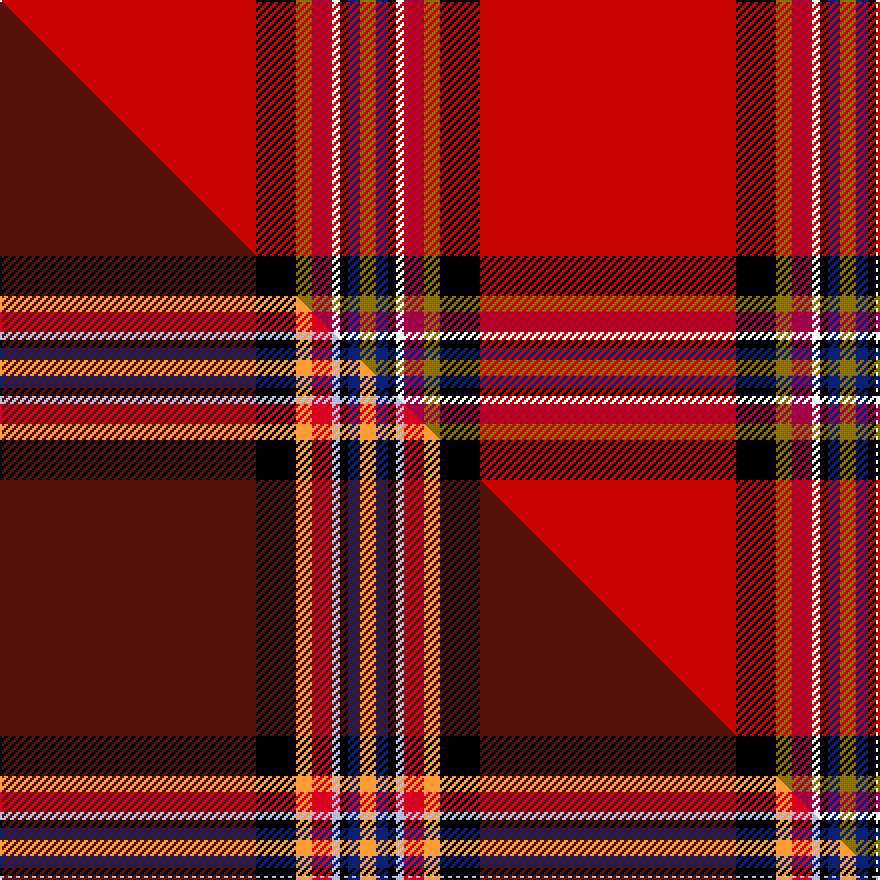

This is one **variant** — a specific cloth: this exact thread count and colourway, with its own
provenance below. It is one weaving of the [sett](/tartans/c/co/conroy/) (the scale-free proportion — the
same cloth at any scale or shade), whose colour order is pattern [GBKWRGKR](/stripes/gbkwrgkr/).

Part of the [Conroy](/tartans/c/co/conroy/) tartan — the named design grouping this sett with its other cloths.

Sourced from house-of-tartan.  It is a [8 stripe tartan](/stripes/stripes8/).

Original link [http://www.house-of-tartan.scotland.net/house/TartanViewjs.asp?colr=Def&tnam=1626](http://www.house-of-tartan.scotland.net/house/TartanViewjs.asp?colr=Def&tnam=1626)

## Provenance

Earliest known date: 1986

Dataset <small>— provenance for this record, inherited from the source manifest</small>

<dl class="dataset-prov">
<dt>source</dt><dd><a href="/sources/house-of-tartan/">House of Tartan</a></dd>
<dt>data captured from</dt><dd><a href="https://github.com/thetartan/tartan-database/blob/master/data/house-of-tartan/data.csv">https://github.com/thetartan/tartan-database/blob/master/data/house-of-tartan/data.csv</a></dd>
<dt>data date</dt><dd>1986 <small>(this record)</small></dd>
<dt>licence</dt><dd><a href="https://creativecommons.org/licenses/by-nc-nd/4.0/">CC BY-NC-ND 4.0</a></dd>
</dl>

Capture chain <small>— the hands this data passed through, oldest first; each capture carries its own licence</small>

<ol class="capture-chain">
<li><a href="http://www.house-of-tartan.scotland.net/">House of Tartan</a> <small>the weaver/retailer's database — the site is now offline; the URL is kept as the ultimate source's identity</small></li>
<li><a href="https://github.com/thetartan/tartan-database">thetartan/tartan-database</a> <small>2016-2017</small> · <a href="https://creativecommons.org/licenses/by-nc-nd/4.0/">CC BY-NC-ND 4.0</a> <small>Levko Kravets's frozen compilation — the capture we vendored, and where its CC licence text came from</small></li>
<li>this dictionary <small>captured 2026-06-10 · commit 5bf86c7566</small> <small>each re-capture is a git commit to data/sources</small></li>
</ol>

## Thread count
Ri/128 K20 Y8 R10 W4 K4 DB6 Y/8

One full sett is **240 threads**.

## Palette
<table><thead><tr><th>Colour</th><th>Shade</th><th>OKLCh</th></tr></thead><tbody><tr><td>DB</td><td><code style="background-color:#082077;">#082077</code> <small style="color:#888">#082077</small></td><td><small style="color:#888">oklch(30.0% 0.149 265.1)</small></td></tr><tr><td>K</td><td><code style="background-color:#000000;">#000000</code> <small style="color:#888">#000000</small></td><td><small style="color:#888">oklch(0.0% 0.000 0.0)</small></td></tr><tr><td>W</td><td><code style="background-color:#F7F7F7;">#F7F7F7</code> <small style="color:#888">#F7F7F7</small></td><td><small style="color:#888">oklch(97.6% 0.000 89.9)</small></td></tr><tr><td>R</td><td><code style="background-color:#A00048;">#A00048</code> <small style="color:#888">#A00048</small></td><td><small style="color:#888">oklch(45.4% 0.182 5.3)</small></td></tr><tr><td>R</td><td><code style="background-color:#C80000;">#C80000</code> <small style="color:#888">#C80000</small></td><td><small style="color:#888">oklch(52.3% 0.215 29.2)</small></td></tr><tr><td>Y</td><td><code style="background-color:#8B6E00;">#8B6E00</code> <small style="color:#888">#8B6E00</small></td><td><small style="color:#888">oklch(55.1% 0.113 90.4)</small></td></tr></tbody></table>

# Sample pattern

[Sample sheet (PDF)](swatch.pdf) — the woven sample, thread count and palette on one printable A4, rendered on demand (the same sheet the TTD print page downloads).

## Compared to the master

This cloth is one sett of its design; the master sett (the exemplar the design is anchored on) is below for comparison.

Its **ΔTartan distance** from the master is **2.54** — the same measure the nearest-tartans table ranks by (0 is identical; a re-scale of the same cloth is near 0, a recolour or a different proportion further).

<figure class="master-compare" style="margin:0">

this sett
master sett ★

<figcaption style="color:#888;font-size:smaller">One weave of this sett against the <a href="/setts/dr64k10lo4r5lb2k2db3lo4/">master sett ★</a>, split on the diagonal: a shared proportion runs seamlessly across it with only the shades shifting; a different proportion breaks on it.</figcaption>
</figure>

## Nearest tartan variants

The nearest existing variants by ΔTartan distance, with this cloth at the top so the swatches line up against it.

ΔTartan

Threads

Variant

Sett

—

240

<a href="/variants/s8/ri64k10y4r5w2k2db3y4~x2~ri5221030-r4518006/">Conroy Family Tartan</a>

<a href="/ttd/edit/#slug=ri64k10y4r5w2k2db3y4~x2~ri5021030-r4116015&amp;base=ri64k10y4r5w2k2db3y4~x2~ri5221030-r4518006" title="compare in the TTD">0.03</a>

240

<a href="/variants/s8/ri64k10y4r5w2k2db3y4~x2~ri5021030-r4116015/">Conroy</a>

<a href="/ttd/edit/#slug=r87db8k11y2k3w2k3g13r11k2r5w3&amp;base=ri64k10y4r5w2k2db3y4~x2~ri5221030-r4518006" title="compare in the TTD">2.46</a>

210

<a href="/variants/s12/r87db8k11y2k3w2k3g13r11k2r5w3/">Stewart/Stuart, Royal</a>

<a href="/ttd/edit/#slug=dr64k10lo4r5lb2k2db3lo4~x2~lb82&amp;base=ri64k10y4r5w2k2db3y4~x2~ri5221030-r4518006" title="compare in the TTD">2.54</a>

240

<a href="/variants/s8/dr64k10lo4r5lb2k2db3lo4~x2~lb82/">Conroy (Personal)</a>

<a href="/ttd/edit/#slug=dr64k10lo4r5lb2k2db3lo4~x2&amp;base=ri64k10y4r5w2k2db3y4~x2~ri5221030-r4518006" title="compare in the TTD">2.54</a>

240

<a href="/variants/s8/dr64k10lo4r5lb2k2db3lo4~x2/">Conroy (Personal)</a>

<a href="/ttd/edit/#slug=r70k2y1dg18r10k4lb4w1~x2&amp;base=ri64k10y4r5w2k2db3y4~x2~ri5221030-r4518006" title="compare in the TTD">2.56</a>

298

<a href="/variants/s8/r70k2y1dg18r10k4lb4w1~x2/">MacIngust</a>

<a href="/ttd/edit/#slug=r66db2k11y4k2w4k11g2r8k2r8w2&amp;base=ri64k10y4r5w2k2db3y4~x2~ri5221030-r4518006" title="compare in the TTD">2.57</a>

176

<a href="/variants/s12/r66db2k11y4k2w4k11g2r8k2r8w2/">TIlted Kilt</a>

<a href="/ttd/edit/#slug=r72db6y1db12k4w1n4w1k5~x2&amp;base=ri64k10y4r5w2k2db3y4~x2~ri5221030-r4518006" title="compare in the TTD">2.58</a>

270

<a href="/variants/s9/r72db6y1db12k4w1n4w1k5~x2/">Inverness Cathedral (Corporate)</a>

<a href="/ttd/edit/#slug=r66db2k11ly4k2w4k11g2r8k2r8w2&amp;base=ri64k10y4r5w2k2db3y4~x2~ri5221030-r4518006" title="compare in the TTD">2.65</a>

176

<a href="/variants/s12/r66db2k11ly4k2w4k11g2r8k2r8w2/">Tilted Kilt (Corporate)</a>

<a href="/ttd/edit/#slug=y1k1db2w1y1t3r31k2y5k2t1~x2~db2911276-t5313246&amp;base=ri64k10y4r5w2k2db3y4~x2~ri5221030-r4518006" title="compare in the TTD">2.76</a>

196

<a href="/variants/s11/y1k1db2w1y1t3r31k2y5k2t1~x2~db2911276-t5313246/">Scottish Banner, The</a>

<a href="/ttd/edit/#slug=r52k5y5ly5do5k2r6k1y2~x2&amp;base=ri64k10y4r5w2k2db3y4~x2~ri5221030-r4518006" title="compare in the TTD">2.79</a>

224

<a href="/variants/s9/r52k5y5ly5do5k2r6k1y2~x2/">Braemar Castle (Fashion)</a>

## Neighbour map

Every grey dot is one of 13662 variants placed by the first two principal components of the ΔTartan feature space (42% of its variance). Red is this tartan; blue dots are its nearest — click one to open its page. The map is a flat projection of a many-dimensional space — [how to read it](/posts/neighbourhood-maps/).

<svg viewBox="0 0 640 380" role="img" style="max-width:100%;height:auto;border:1px solid #e0e0e0;border-radius:4px;display:block" xmlns="http://www.w3.org/2000/svg"><image href="/nn/cloud.v1.png" width="640" height="380"/><a href="/variants/s8/ri64k10y4r5w2k2db3y4~x2~ri5021030-r4116015/"><circle cx="393.4" cy="49.8" r="4" fill="#3465a4"><title>Conroy</title></circle></a><a href="/variants/s12/r87db8k11y2k3w2k3g13r11k2r5w3/"><circle cx="379.4" cy="14.0" r="4" fill="#3465a4"><title>Stewart/Stuart, Royal</title></circle></a><a href="/variants/s8/dr64k10lo4r5lb2k2db3lo4~x2~lb82/"><circle cx="396.2" cy="59.1" r="4" fill="#3465a4"><title>Conroy (Personal)</title></circle></a><a href="/variants/s8/dr64k10lo4r5lb2k2db3lo4~x2/"><circle cx="397.0" cy="59.3" r="4" fill="#3465a4"><title>Conroy (Personal)</title></circle></a><a href="/variants/s8/r70k2y1dg18r10k4lb4w1~x2/"><circle cx="443.9" cy="36.6" r="4" fill="#3465a4"><title>MacIngust</title></circle></a><a href="/variants/s12/r66db2k11y4k2w4k11g2r8k2r8w2/"><circle cx="352.9" cy="22.5" r="4" fill="#3465a4"><title>TIlted Kilt</title></circle></a><a href="/variants/s9/r72db6y1db12k4w1n4w1k5~x2/"><circle cx="400.5" cy="20.4" r="4" fill="#3465a4"><title>Inverness Cathedral (Corporate)</title></circle></a><a href="/variants/s12/r66db2k11ly4k2w4k11g2r8k2r8w2/"><circle cx="350.8" cy="22.0" r="4" fill="#3465a4"><title>Tilted Kilt (Corporate)</title></circle></a><a href="/variants/s11/y1k1db2w1y1t3r31k2y5k2t1~x2~db2911276-t5313246/"><circle cx="341.8" cy="34.1" r="4" fill="#3465a4"><title>Scottish Banner, The</title></circle></a><a href="/variants/s9/r52k5y5ly5do5k2r6k1y2~x2/"><circle cx="432.0" cy="42.3" r="4" fill="#3465a4"><title>Braemar Castle (Fashion)</title></circle></a><circle cx="390.7" cy="48.4" r="5" fill="#c00000"/><text x="320" y="376" text-anchor="middle" font-size="11" fill="#999">ground</text><text x="11" y="190" text-anchor="middle" font-size="11" fill="#999" transform="rotate(-90 11 190)">complexity</text></svg>

ID: /variants/s8/ri64k10y4r5w2k2db3y4~x2~ri5221030-r4518006/
