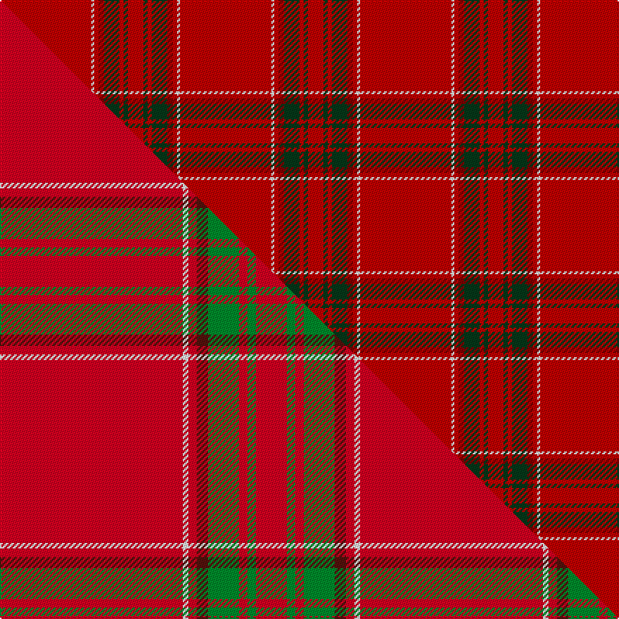

This is one **variant** — a specific cloth: this exact thread count and colourway, with its own
provenance below. It is one weaving of the [sett](/setts/ri65w2ri3r4dg11ri3dg3ri11/) (the scale-free proportion — the
same cloth at any scale or shade), whose colour order is pattern [RGRGRRWR](/stripes/rgrgrrwr/).

Part of the [Gudbrandsdalen, Rondastakken](/tartans/g/gu/gudbrandsdalen-rondastakken-2/) tartan — the named design grouping this sett with its other cloths.

Sourced from weddslist.  It is a [8 stripe tartan](/stripes/stripes8/).

Original link [http://www.weddslist.com/cgi-bin/tartans/pg.pl?source=sts](http://www.weddslist.com/cgi-bin/tartans/pg.pl?source=sts)

Dataset <small>— provenance for this record, inherited from the source manifest</small>

<dl class="dataset-prov">
<dt>source</dt><dd><a href="/sources/weddslist/">Weddslist</a></dd>
<dt>data captured from</dt><dd><a href="https://github.com/thetartan/tartan-database/blob/master/data/weddslist/data.csv">https://github.com/thetartan/tartan-database/blob/master/data/weddslist/data.csv</a></dd>
<dt>data date</dt><dd>2016-11-17 <small>(dataset default)</small></dd>
<dt>licence</dt><dd><a href="https://creativecommons.org/licenses/by-nc-nd/4.0/">CC BY-NC-ND 4.0</a></dd>
</dl>

Capture chain <small>— the hands this data passed through, oldest first; each capture carries its own licence</small>

<ol class="capture-chain">
<li><a href="https://www.weddslist.com/tartans/">Weddslist</a> <small>the living privately compiled reference</small></li>
<li><a href="https://github.com/thetartan/tartan-database">thetartan/tartan-database</a> <small>2016-2017</small> · <a href="https://creativecommons.org/licenses/by-nc-nd/4.0/">CC BY-NC-ND 4.0</a> <small>Levko Kravets's frozen compilation — the capture we vendored, and where its CC licence text came from</small></li>
<li>this dictionary <small>captured 2026-06-10 · commit 5bf86c7566</small> <small>each re-capture is a git commit to data/sources</small></li>
</ol>

## Thread count
Ri/65 W2 Ri3 R4 DG11 Ri3 DG3 Ri/11

One full sett is **128 threads**.

## Palette
<table><thead><tr><th>Colour</th><th>Shade</th><th>OKLCh</th></tr></thead><tbody><tr><td>DG</td><td><code style="background-color:#053819;">#053819</code> <small style="color:#888">#053819</small></td><td><small style="color:#888">oklch(30.0% 0.075 151.3)</small></td></tr><tr><td>R</td><td><code style="background-color:#800000;">#800000</code> <small style="color:#888">#800000</small></td><td><small style="color:#888">oklch(37.7% 0.155 29.2)</small></td></tr><tr><td>W</td><td><code style="background-color:#F7F7F7;">#F7F7F7</code> <small style="color:#888">#F7F7F7</small></td><td><small style="color:#888">oklch(97.6% 0.000 89.9)</small></td></tr><tr><td>R</td><td><code style="background-color:#C00000;">#C00000</code> <small style="color:#888">#C00000</small></td><td><small style="color:#888">oklch(50.7% 0.208 29.2)</small></td></tr></tbody></table>

# Sample pattern

## Compared to the master

This cloth is one sett of its design; the master sett (the exemplar the design is anchored on) is below for comparison.

Its **ΔTartan distance** from the master is **0.14** — the same measure the nearest-tartans table ranks by (0 is identical; a re-scale of the same cloth is near 0, a recolour or a different proportion further).

<figure class="master-compare" style="margin:0">

this sett
master sett ★

<figcaption style="color:#888;font-size:smaller">One weave of this sett against the <a href="/setts/r65w2r3dr4g11r3g3r11/">master sett ★</a>, split on the diagonal: a shared proportion runs seamlessly across it with only the shades shifting; a different proportion breaks on it.</figcaption>
</figure>

## Nearest tartan variants

The nearest existing variants by ΔTartan distance, with this cloth at the top so the swatches line up against it.

ΔTartan

Threads

Variant

Sett

—

128

<a href="/variants/s8/ri65w2ri3r4dg11ri3dg3ri11~ri2008029-r1506028/">Gudbrandsdalen, Rondastakken</a>

<a href="/ttd/edit/#slug=r65w2r3dr4g11r3g3r11~x2&amp;base=ri65w2ri3r4dg11ri3dg3ri11~ri2008029-r1506028" title="compare in the TTD">0.14</a>

256

<a href="/variants/s8/r65w2r3dr4g11r3g3r11~x2/">Gudbrandsdalen, Rondastakken</a>

<a href="/ttd/edit/#slug=r42dp4ly1dp6g1dp1g1r12~x2&amp;base=ri65w2ri3r4dg11ri3dg3ri11~ri2008029-r1506028" title="compare in the TTD">1.89</a>

164

<a href="/variants/s8/r42dp4ly1dp6g1dp1g1r12~x2/">Earl of Inverness (Artefact)</a>

<a href="/ttd/edit/#slug=r114g10w3g16ly3g3ly3r28~x2&amp;base=ri65w2ri3r4dg11ri3dg3ri11~ri2008029-r1506028" title="compare in the TTD">1.90</a>

436

<a href="/variants/s8/r114g10w3g16ly3g3ly3r28~x2/">Duke of Sussex (Earl of Inverness)</a>

<a href="/ttd/edit/#slug=r42db4y1db6g1db1g1r12~x2&amp;base=ri65w2ri3r4dg11ri3dg3ri11~ri2008029-r1506028" title="compare in the TTD">2.76</a>

164

<a href="/variants/s8/r42db4y1db6g1db1g1r12~x2/">Inverness Earl of... District Tartan</a>

<a href="/ttd/edit/#slug=r92db10r8w3r8g4r8lo3~x2&amp;base=ri65w2ri3r4dg11ri3dg3ri11~ri2008029-r1506028" title="compare in the TTD">3.30</a>

354

<a href="/variants/s8/r92db10r8w3r8g4r8lo3~x2/">Burnett of Leys</a>

<a href="/ttd/edit/#slug=r39g6r2g3w1~x2&amp;base=ri65w2ri3r4dg11ri3dg3ri11~ri2008029-r1506028" title="compare in the TTD">3.31</a>

124

<a href="/variants/s5/r39g6r2g3w1~x2/">MacGregor #2</a>

<a href="/ttd/edit/#slug=r60db5r5w2r5g2r5y2~x2&amp;base=ri65w2ri3r4dg11ri3dg3ri11~ri2008029-r1506028" title="compare in the TTD">3.63</a>

220

<a href="/variants/s8/r60db5r5w2r5g2r5y2~x2/">Burnett of Leys Family Tartan</a>

<a href="/ttd/edit/#slug=r52dg2r2dg2r3w3db2w2db2~x4&amp;base=ri65w2ri3r4dg11ri3dg3ri11~ri2008029-r1506028" title="compare in the TTD">3.86</a>

344

<a href="/variants/s9/r52dg2r2dg2r3w3db2w2db2~x4/">Prince of Denmark (Corporate)</a>

<a href="/ttd/edit/#slug=r92db10r8w3r8g4r8ri4~x2~r1506019-ri2109032&amp;base=ri65w2ri3r4dg11ri3dg3ri11~ri2008029-r1506028" title="compare in the TTD">3.89</a>

356

<a href="/variants/s8/r92db10r8w3r8g4r8ri4~x2~r1506019-ri2109032/">Burnett of Leys Hunting</a>

## Neighbour map

Every grey dot is one of 13656 variants placed by the first two principal components of the ΔTartan feature space (42% of its variance). Red is this tartan; blue dots are its nearest — click one to open its page. The map is a flat projection of a many-dimensional space — [how to read it](/posts/neighbourhood-maps/).

<svg viewBox="0 0 640 380" role="img" style="max-width:100%;height:auto;border:1px solid #e0e0e0;border-radius:4px;display:block" xmlns="http://www.w3.org/2000/svg"><image href="/nn/cloud.v1.png" width="640" height="380"/><a href="/variants/s8/r65w2r3dr4g11r3g3r11~x2/"><circle cx="594.7" cy="107.3" r="4" fill="#3465a4"><title>Gudbrandsdalen, Rondastakken</title></circle></a><a href="/variants/s8/r42dp4ly1dp6g1dp1g1r12~x2/"><circle cx="609.8" cy="100.6" r="4" fill="#3465a4"><title>Earl of Inverness (Artefact)</title></circle></a><a href="/variants/s8/r114g10w3g16ly3g3ly3r28~x2/"><circle cx="584.0" cy="101.4" r="4" fill="#3465a4"><title>Duke of Sussex (Earl of Inverness)</title></circle></a><a href="/variants/s8/r42db4y1db6g1db1g1r12~x2/"><circle cx="576.3" cy="91.8" r="4" fill="#3465a4"><title>Inverness Earl of... District Tartan</title></circle></a><a href="/variants/s8/r92db10r8w3r8g4r8lo3~x2/"><circle cx="616.8" cy="88.0" r="4" fill="#3465a4"><title>Burnett of Leys</title></circle></a><a href="/variants/s5/r39g6r2g3w1~x2/"><circle cx="625.3" cy="140.9" r="4" fill="#3465a4"><title>MacGregor #2</title></circle></a><a href="/variants/s8/r60db5r5w2r5g2r5y2~x2/"><circle cx="626.0" cy="89.7" r="4" fill="#3465a4"><title>Burnett of Leys Family Tartan</title></circle></a><a href="/variants/s9/r52dg2r2dg2r3w3db2w2db2~x4/"><circle cx="570.9" cy="83.0" r="4" fill="#3465a4"><title>Prince of Denmark (Corporate)</title></circle></a><a href="/variants/s8/r92db10r8w3r8g4r8ri4~x2~r1506019-ri2109032/"><circle cx="626.0" cy="99.8" r="4" fill="#3465a4"><title>Burnett of Leys Hunting</title></circle></a><circle cx="608.1" cy="112.0" r="5" fill="#c00000"/><text x="320" y="376" text-anchor="middle" font-size="11" fill="#999">ground</text><text x="11" y="190" text-anchor="middle" font-size="11" fill="#999" transform="rotate(-90 11 190)">complexity</text></svg>

ID: /variants/s8/ri65w2ri3r4dg11ri3dg3ri11~ri2008029-r1506028/
