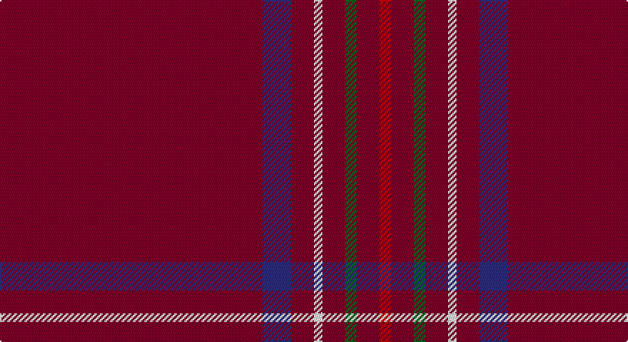

This page is one **sett** — a single exact thread-count. It belongs to the [tartan](/setts/ri92db10ri8w3ri8g4ri8r4/)
(the same proportion at any scale), whose colour order is pattern [RBRWRGRR](/stripes/rbrwrgrr/).

Part of the [Burnett of Leys Hunting](/tartans/burnett-of-leys-hunting/) tartan — the named design grouping this sett with its other cloths.

Sourced from register-of-tartans.  It is a [8 stripe tartan](/stripes/stripes8/).

Original link https://www.tartanregister.gov.uk/tartanDetails.aspx?ref=445

## Also known as

This cloth is also recorded under:

- Burnett of Leys Htg
- Burnett, of Leys hunting

## Register references

External register numbers recorded for this tartan.

- Scottish Register of Tartans: [445](https://www.tartanregister.gov.uk/tartanDetails.aspx?ref=445)
- Scottish Tartans Authority (ITI): 1657
- Scottish Tartans World Register: 1657

## Thread count
DR/184 DB20 DR16 W6 DR16 G8 DR16 R/8

One full sett is **356 threads**.

## Palette

Palette: <strong>Tartan Register</strong>
<table><thead><tr><th>Colour</th><th>Threads</th><th>Shade</th><th>Base</th><th>OKLCh</th></tr></thead><tbody><tr><td>DR/</td><td style="text-align:right;font-variant-numeric:tabular-nums">184</td><td><code style="background-color:#800028;">#800028</code> <small style="color:#888">#800028</small></td><td>R <code style="background-color:#CC0000;">#CC0000</code></td><td><small style="color:#888">oklch(38.2% 0.152 14.5)</small></td></tr><tr><td>DB</td><td style="text-align:right;font-variant-numeric:tabular-nums">20</td><td><code style="background-color:#2C2C80;">#2C2C80</code> <small style="color:#888">#2C2C80</small></td><td>B <code style="background-color:#2A418A;">#2A418A</code></td><td><small style="color:#888">oklch(35.0% 0.138 276.6)</small></td></tr><tr><td>DR</td><td style="text-align:right;font-variant-numeric:tabular-nums">16</td><td><code style="background-color:#800028;">#800028</code> <small style="color:#888">#800028</small></td><td>R <code style="background-color:#CC0000;">#CC0000</code></td><td><small style="color:#888">oklch(38.2% 0.152 14.5)</small></td></tr><tr><td>W</td><td style="text-align:right;font-variant-numeric:tabular-nums">6</td><td><code style="background-color:#F8F8F8;">#F8F8F8</code> <small style="color:#888">#F8F8F8</small></td><td>W <code style="background-color:#F7F7F7;">#F7F7F7</code></td><td><small style="color:#888">oklch(97.9% 0.000 89.9)</small></td></tr><tr><td>DR</td><td style="text-align:right;font-variant-numeric:tabular-nums">16</td><td><code style="background-color:#800028;">#800028</code> <small style="color:#888">#800028</small></td><td>R <code style="background-color:#CC0000;">#CC0000</code></td><td><small style="color:#888">oklch(38.2% 0.152 14.5)</small></td></tr><tr><td>G</td><td style="text-align:right;font-variant-numeric:tabular-nums">8</td><td><code style="background-color:#006818;">#006818</code> <small style="color:#888">#006818</small></td><td>G <code style="background-color:#006100;">#006100</code></td><td><small style="color:#888">oklch(45.0% 0.142 145.0)</small></td></tr><tr><td>DR</td><td style="text-align:right;font-variant-numeric:tabular-nums">16</td><td><code style="background-color:#800028;">#800028</code> <small style="color:#888">#800028</small></td><td>R <code style="background-color:#CC0000;">#CC0000</code></td><td><small style="color:#888">oklch(38.2% 0.152 14.5)</small></td></tr><tr><td>R/</td><td style="text-align:right;font-variant-numeric:tabular-nums">8</td><td><code style="background-color:#C80000;">#C80000</code> <small style="color:#888">#C80000</small></td><td>R <code style="background-color:#CC0000;">#CC0000</code></td><td><small style="color:#888">oklch(52.3% 0.215 29.2)</small></td></tr></tbody></table>

# Sample pattern

## Nearest tartans

The nearest existing variants by ΔTartan distance, with this tartan at the top so the swatches line up against it.

ΔTartan

Tartan

Sett

—

<a href="/ttd/edit/#slug=ri92db10ri8w3ri8g4ri8r4~x2">Burnett of Leys Hunting</a> <a class="nn-out" href="/variants/s8/ri92db10ri8w3ri8g4ri8r4~x2/" title="open its dictionary page">↗</a>

0.88

<a href="/ttd/edit/#slug=ri75db6ri6w2ri6g2ri6r2~x2&amp;base=ri92db10ri8w3ri8g4ri8r4~x2">Burnett of Leys Htg (Clan)</a> <a class="nn-out" href="/variants/s8/ri75db6ri6w2ri6g2ri6r2~x2/" title="open its dictionary page">↗</a>

1.57

<a href="/ttd/edit/#slug=r25dt5o2r12oi1w1~x2&amp;base=ri92db10ri8w3ri8g4ri8r4~x2">Fernie (Personal)</a> <a class="nn-out" href="/variants/s6/r25dt5o2r12oi1w1~x2/" title="open its dictionary page">↗</a>

1.71

<a href="/variants/s8/dr90k1ki2t10ki5r2k2t2~x2/">Lock in Northumberland</a>

1.71

<a href="/ttd/edit/#slug=r6k2r4ly3r60db14r3db3w1~x2&amp;base=ri92db10ri8w3ri8g4ri8r4~x2">Stenhousemuir Football Club (Sports)</a> <a class="nn-out" href="/variants/s9/r6k2r4ly3r60db14r3db3w1~x2/" title="open its dictionary page">↗</a>

1.78

<a href="/ttd/edit/#slug=r42db4ly1db6g1db1g1r12~x2&amp;base=ri92db10ri8w3ri8g4ri8r4~x2">Inverness, Earl of</a> <a class="nn-out" href="/variants/s8/r42db4ly1db6g1db1g1r12~x2/" title="open its dictionary page">↗</a>

1.82

<a href="/ttd/edit/#slug=m6k2m4ly3m60db14m3db3w1~x2&amp;base=ri92db10ri8w3ri8g4ri8r4~x2">Stenhousemuir F.C.</a> <a class="nn-out" href="/variants/s9/m6k2m4ly3m60db14m3db3w1~x2/" title="open its dictionary page">↗</a>

1.88

<a href="/ttd/edit/#slug=r60db5r5w2r5g2r5ly2~x2&amp;base=ri92db10ri8w3ri8g4ri8r4~x2">Burnett, of Leys</a> <a class="nn-out" href="/variants/s8/r60db5r5w2r5g2r5ly2~x2/" title="open its dictionary page">↗</a>

1.88

<a href="/ttd/edit/#slug=r92db10r8w3r8g4r8lo3~x2&amp;base=ri92db10ri8w3ri8g4ri8r4~x2">Burnett of Leys</a> <a class="nn-out" href="/variants/s8/r92db10r8w3r8g4r8lo3~x2/" title="open its dictionary page">↗</a>

1.93

<a href="/ttd/edit/#slug=r36db3w1db6g1k1g1r9~x2&amp;base=ri92db10ri8w3ri8g4ri8r4~x2">Inverness</a> <a class="nn-out" href="/variants/s8/r36db3w1db6g1k1g1r9~x2/" title="open its dictionary page">↗</a>

1.96

<a href="/ttd/edit/#slug=r80w2r5k10r6lr4r10k2lr6&amp;base=ri92db10ri8w3ri8g4ri8r4~x2">Hampden-Sydney College</a> <a class="nn-out" href="/variants/s9/r80w2r5k10r6lr4r10k2lr6/" title="open its dictionary page">↗</a>

## Neighbour map

Every grey dot is one of 14360 variants placed by the first two principal components of the ΔTartan feature space (44% of its variance). Red is this tartan; blue dots are its nearest — click one to open its page.

<svg viewBox="0 0 640 380" role="img" style="max-width:100%;height:auto;border:1px solid #e0e0e0;border-radius:4px;display:block" xmlns="http://www.w3.org/2000/svg"><image href="/nn/cloud.v1.png" width="640" height="380"/><a href="/variants/s8/ri75db6ri6w2ri6g2ri6r2~x2/"><circle cx="626.0" cy="119.0" r="4" fill="#3465a4"><title>Burnett of Leys Htg (Clan)</title></circle></a><a href="/variants/s6/r25dt5o2r12oi1w1~x2/"><circle cx="572.1" cy="161.5" r="4" fill="#3465a4"><title>Fernie (Personal)</title></circle></a><a href="/variants/s8/dr90k1ki2t10ki5r2k2t2~x2/"><circle cx="626.0" cy="104.3" r="4" fill="#3465a4"><title>Lock in Northumberland</title></circle></a><a href="/variants/s9/r6k2r4ly3r60db14r3db3w1~x2/"><circle cx="578.7" cy="91.7" r="4" fill="#3465a4"><title>Stenhousemuir Football Club (Sports)</title></circle></a><a href="/variants/s8/r42db4ly1db6g1db1g1r12~x2/"><circle cx="621.3" cy="115.7" r="4" fill="#3465a4"><title>Inverness, Earl of</title></circle></a><a href="/variants/s9/m6k2m4ly3m60db14m3db3w1~x2/"><circle cx="584.9" cy="99.4" r="4" fill="#3465a4"><title>Stenhousemuir F.C.</title></circle></a><a href="/variants/s8/r60db5r5w2r5g2r5ly2~x2/"><circle cx="626.0" cy="104.8" r="4" fill="#3465a4"><title>Burnett, of Leys</title></circle></a><a href="/variants/s8/r92db10r8w3r8g4r8lo3~x2/"><circle cx="626.0" cy="100.4" r="4" fill="#3465a4"><title>Burnett of Leys</title></circle></a><a href="/variants/s8/r36db3w1db6g1k1g1r9~x2/"><circle cx="561.3" cy="96.4" r="4" fill="#3465a4"><title>Inverness</title></circle></a><a href="/variants/s9/r80w2r5k10r6lr4r10k2lr6/"><circle cx="601.4" cy="97.4" r="4" fill="#3465a4"><title>Hampden-Sydney College</title></circle></a><circle cx="626.0" cy="126.1" r="5" fill="#c00000"/></svg>

ID: /variants/s8/ri92db10ri8w3ri8g4ri8r4~x2/
