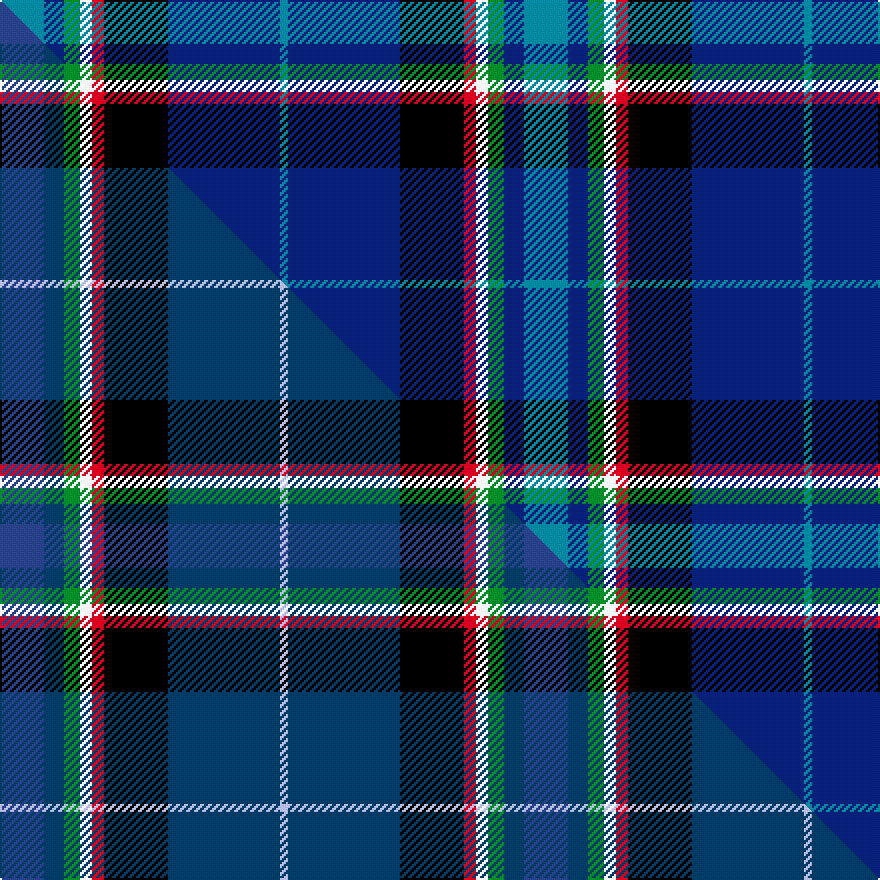

This is one **variant** — a specific cloth: this exact thread count and colourway, with its own
provenance below. It is one weaving of the [sett](/setts/t11db5g4w3r3k16db28t2/) (the scale-free proportion — the
same cloth at any scale or shade), whose colour order is pattern [BBGWRKBB](/stripes/bbgwrkbb/).

Part of the [Scottish Italian](/tartans/scottish-italian/) tartan — the named design grouping this sett with its other cloths.

Sourced from tartans-authority.  It is a [8 stripe tartan](/stripes/stripes8/).

Original link [https://www.tartanregister.gov.uk/tartanDetails.aspx?ref=11248](https://www.tartanregister.gov.uk/tartanDetails.aspx?ref=11248)

Dataset <small>— provenance for this record, inherited from the source manifest</small>

<dl class="dataset-prov">
<dt>source</dt><dd><a href="/sources/tartans-authority/">Scottish Tartans Authority</a></dd>
<dt>data captured from</dt><dd><a href="https://github.com/thetartan/tartan-database/blob/master/data/tartans-authority/data.csv">https://github.com/thetartan/tartan-database/blob/master/data/tartans-authority/data.csv</a></dd>
<dt>data date</dt><dd>2015 <small>(this record)</small></dd>
<dt>licence</dt><dd><a href="https://creativecommons.org/licenses/by-nc-nd/4.0/">CC BY-NC-ND 4.0</a></dd>
</dl>

Capture chain <small>— the hands this data passed through, oldest first; each capture carries its own licence</small>

<ol class="capture-chain">
<li><a href="https://www.tartansauthority.com/">Scottish Tartans Authority</a> <small>the heritage body's archive — its tartan-ferret record browser is retired (links repaired to the SRT, above)</small></li>
<li><a href="https://github.com/thetartan/tartan-database">thetartan/tartan-database</a> <small>2016-2017</small> · <a href="https://creativecommons.org/licenses/by-nc-nd/4.0/">CC BY-NC-ND 4.0</a> <small>Levko Kravets's frozen compilation — the capture we vendored, and where its CC licence text came from</small></li>
<li>this dictionary <small>captured 2026-06-10 · commit 5bf86c7566</small> <small>each re-capture is a git commit to data/sources</small></li>
</ol>

## Register references

External register numbers recorded for this tartan.

- Scottish Register of Tartans: [11248](https://www.tartanregister.gov.uk/tartanDetails?ref=11248)
- Scottish Tartans Authority (ITI): 11248

## Thread count
T/22 DB10 G8 W6 R6 K32 DB56 T/4

One full sett is **262 threads**.

## Palette
<table><thead><tr><th>Colour</th><th>Shade</th><th>OKLCh</th></tr></thead><tbody><tr><td>T</td><td><code style="background-color:#00879F;">#00879F</code> <small style="color:#888">#00879F</small></td><td><small style="color:#888">oklch(57.4% 0.102 216.1)</small></td></tr><tr><td>DB</td><td><code style="background-color:#082077;">#082077</code> <small style="color:#888">#082077</small></td><td><small style="color:#888">oklch(30.0% 0.149 265.1)</small></td></tr><tr><td>G</td><td><code style="background-color:#008B2A;">#008B2A</code> <small style="color:#888">#008B2A</small></td><td><small style="color:#888">oklch(55.4% 0.170 145.9)</small></td></tr><tr><td>K</td><td><code style="background-color:#000000;">#000000</code> <small style="color:#888">#000000</small></td><td><small style="color:#888">oklch(0.0% 0.000 0.0)</small></td></tr><tr><td>R</td><td><code style="background-color:#D60020;">#D60020</code> <small style="color:#888">#D60020</small></td><td><small style="color:#888">oklch(55.2% 0.224 25.5)</small></td></tr><tr><td>W</td><td><code style="background-color:#F7F7F7;">#F7F7F7</code> <small style="color:#888">#F7F7F7</small></td><td><small style="color:#888">oklch(97.6% 0.000 89.9)</small></td></tr></tbody></table>

# Sample pattern

## Compared to the master

This cloth is one sett of its design; the master sett (the exemplar the design is anchored on) is below for comparison.

Its **ΔTartan distance** from the master is **1.00** — the same measure the nearest-tartans table ranks by (0 is identical; a re-scale of the same cloth is near 0, a recolour or a different proportion further).

<figure class="master-compare" style="margin:0">

this sett
master sett ★

<figcaption style="color:#888;font-size:smaller">One weave of this sett against the <a href="/setts/dbi11db5g4w3r3k16db28lb2/">master sett ★</a>, split on the diagonal: a shared proportion runs seamlessly across it with only the shades shifting; a different proportion breaks on it.</figcaption>
</figure>

## Nearest tartan variants

The nearest existing variants by ΔTartan distance, with this cloth at the top so the swatches line up against it.

ΔTartan

Threads

Variant

Sett

—

262

<a href="/variants/s8/t11db5g4w3r3k16db28t2~x2/">Scottish Italian</a>

<a href="/ttd/edit/#slug=dbi11db5g4w3r3k16db28lb2~x2~dbi1605267-db1404245&amp;base=t11db5g4w3r3k16db28t2~x2" title="compare in the TTD">1.00</a>

262

<a href="/variants/s8/dbi11db5g4w3r3k16db28lb2~x2~dbi1605267-db1404245/">Scottish Italian</a>

<a href="/ttd/edit/#slug=r2lb5k4y1k4db16k3g2~x4&amp;base=t11db5g4w3r3k16db28t2~x2" title="compare in the TTD">1.33</a>

280

<a href="/variants/s8/r2lb5k4y1k4db16k3g2~x4/">Arundel County (Dalgleish)</a>

<a href="/ttd/edit/#slug=db4y2db24k2db5r3k14g14w3r3db3~x2&amp;base=t11db5g4w3r3k16db28t2~x2" title="compare in the TTD">1.95</a>

294

<a href="/variants/s11/db4y2db24k2db5r3k14g14w3r3db3~x2/">Czech National (District)</a>

<a href="/ttd/edit/#slug=k7db20lb2r6lb2k20y3g20db27r3db6~x2&amp;base=t11db5g4w3r3k16db28t2~x2" title="compare in the TTD">2.01</a>

438

<a href="/variants/s11/k7db20lb2r6lb2k20y3g20db27r3db6~x2/">Stinson Ancient U.S.A. Tartan</a>

<a href="/ttd/edit/#slug=db10g42dbi8lb8dbi8k24dbi8db71r10~db1106275-dbi1406275&amp;base=t11db5g4w3r3k16db28t2~x2" title="compare in the TTD">2.08</a>

358

<a href="/variants/s9/db10g42dbi8lb8dbi8k24dbi8db71r10~db1106275-dbi1406275/">Robert Burns Legacy</a>

<a href="/ttd/edit/#slug=k17lb2k3db16t28db2t3lo2~x2~lb3300000-t2204245&amp;base=t11db5g4w3r3k16db28t2~x2" title="compare in the TTD">2.14</a>

254

<a href="/variants/s8/k17lb2k3db16t28db2t3lo2~x2~lb3300000-t2204245/">Banff and Buchan</a>

<a href="/ttd/edit/#slug=w1dp3g6k1db12ly1db2ly1~x4&amp;base=t11db5g4w3r3k16db28t2~x2" title="compare in the TTD">2.18</a>

208

<a href="/variants/s8/w1dp3g6k1db12ly1db2ly1~x4/">Lambert, Patrice (Personal)</a>

<a href="/ttd/edit/#slug=y4g22r3k17r3db37w3~x2&amp;base=t11db5g4w3r3k16db28t2~x2" title="compare in the TTD">2.21</a>

342

<a href="/variants/s7/y4g22r3k17r3db37w3~x2/">Souza Nery</a>

<a href="/ttd/edit/#slug=db33r8k12dy2k4w4k4g12db8k4db4w2~x2&amp;base=t11db5g4w3r3k16db28t2~x2" title="compare in the TTD">2.26</a>

318

<a href="/variants/s12/db33r8k12dy2k4w4k4g12db8k4db4w2~x2/">MacLulich</a>

<a href="/ttd/edit/#slug=db33r8k12y2k4w4k4g12db8k4db4w2~x2&amp;base=t11db5g4w3r3k16db28t2~x2" title="compare in the TTD">2.29</a>

318

<a href="/variants/s12/db33r8k12y2k4w4k4g12db8k4db4w2~x2/">MacLulich Clan Tartan</a>

## Neighbour map

Every grey dot is one of 13621 variants placed by the first two principal components of the ΔTartan feature space (42% of its variance). Red is this tartan; blue dots are its nearest — click one to open its page.

<svg viewBox="0 0 640 380" role="img" style="max-width:100%;height:auto;border:1px solid #e0e0e0;border-radius:4px;display:block" xmlns="http://www.w3.org/2000/svg"><image href="/nn/cloud.v1.png" width="640" height="380"/><a href="/variants/s8/dbi11db5g4w3r3k16db28lb2~x2~dbi1605267-db1404245/"><circle cx="159.3" cy="125.1" r="4" fill="#3465a4"><title>Scottish Italian</title></circle></a><a href="/variants/s8/r2lb5k4y1k4db16k3g2~x4/"><circle cx="160.0" cy="124.6" r="4" fill="#3465a4"><title>Arundel County (Dalgleish)</title></circle></a><a href="/variants/s11/db4y2db24k2db5r3k14g14w3r3db3~x2/"><circle cx="157.6" cy="123.1" r="4" fill="#3465a4"><title>Czech National (District)</title></circle></a><a href="/variants/s11/k7db20lb2r6lb2k20y3g20db27r3db6~x2/"><circle cx="156.8" cy="133.8" r="4" fill="#3465a4"><title>Stinson Ancient U.S.A. Tartan</title></circle></a><a href="/variants/s9/db10g42dbi8lb8dbi8k24dbi8db71r10~db1106275-dbi1406275/"><circle cx="152.7" cy="151.3" r="4" fill="#3465a4"><title>Robert Burns Legacy</title></circle></a><a href="/variants/s8/k17lb2k3db16t28db2t3lo2~x2~lb3300000-t2204245/"><circle cx="192.8" cy="147.9" r="4" fill="#3465a4"><title>Banff and Buchan</title></circle></a><a href="/variants/s8/w1dp3g6k1db12ly1db2ly1~x4/"><circle cx="212.0" cy="135.2" r="4" fill="#3465a4"><title>Lambert, Patrice (Personal)</title></circle></a><a href="/variants/s7/y4g22r3k17r3db37w3~x2/"><circle cx="143.5" cy="142.8" r="4" fill="#3465a4"><title>Souza Nery</title></circle></a><a href="/variants/s12/db33r8k12dy2k4w4k4g12db8k4db4w2~x2/"><circle cx="163.1" cy="103.1" r="4" fill="#3465a4"><title>MacLulich</title></circle></a><a href="/variants/s12/db33r8k12y2k4w4k4g12db8k4db4w2~x2/"><circle cx="162.1" cy="102.9" r="4" fill="#3465a4"><title>MacLulich Clan Tartan</title></circle></a><circle cx="167.9" cy="135.2" r="5" fill="#c00000"/><text x="320" y="376" text-anchor="middle" font-size="11" fill="#999">ground</text><text x="11" y="190" text-anchor="middle" font-size="11" fill="#999" transform="rotate(-90 11 190)">complexity</text></svg>

ID: /variants/s8/t11db5g4w3r3k16db28t2~x2/
