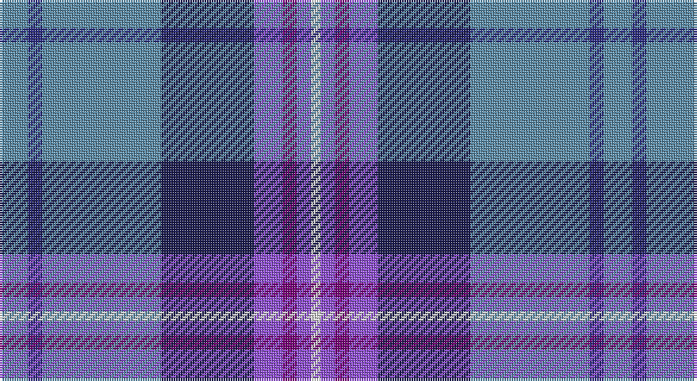

This page is one **sett** — a single exact thread-count. It belongs to the [tartan](/setts/t12db6t50dbi39p12dp6p6w4/)
(the same proportion at any scale), whose colour order is pattern [BBBBBBBW](/stripes/bbbbbbbw/).

Sourced from tartans-authority.  It is a [8 stripe tartan](/stripes/stripes8/).

Original link http://www.tartansauthority.com/tartan-ferret/display/8026/

## Register references

External register numbers recorded for this tartan.

- Scottish Tartans Authority (ITI): 8026

## Thread count
B/12 DB6 B50 DBa39 P12 Pa6 P6 LN/4

One full sett is **254 threads**.

## Palette

Palette: <strong>Tartan Register</strong> <small style="color:#888">(5 of 6 colours)</small>
<table><thead><tr><th>Colour</th><th>Threads</th><th>Shade</th><th>Base</th><th>OKLCh</th></tr></thead><tbody><tr><td>B/</td><td style="text-align:right;font-variant-numeric:tabular-nums">12</td><td><code style="background-color:#5C8CA8;">#5C8CA8</code> <small style="color:#888">#5C8CA8</small></td><td>B <code style="background-color:#2A418A;">#2A418A</code></td><td><small style="color:#888">oklch(61.7% 0.067 235.0)</small></td></tr><tr><td>DB</td><td style="text-align:right;font-variant-numeric:tabular-nums">6</td><td><code style="background-color:#2C2C80;">#2C2C80</code> <small style="color:#888">#2C2C80</small></td><td>B <code style="background-color:#2A418A;">#2A418A</code></td><td><small style="color:#888">oklch(35.0% 0.138 276.6)</small></td></tr><tr><td>B</td><td style="text-align:right;font-variant-numeric:tabular-nums">50</td><td><code style="background-color:#5C8CA8;">#5C8CA8</code> <small style="color:#888">#5C8CA8</small></td><td>B <code style="background-color:#2A418A;">#2A418A</code></td><td><small style="color:#888">oklch(61.7% 0.067 235.0)</small></td></tr><tr><td>DBa</td><td style="text-align:right;font-variant-numeric:tabular-nums">39</td><td><code style="background-color:#1C1C50;">#1C1C50</code> <small style="color:#888">#1C1C50</small></td><td>B <code style="background-color:#2A418A;">#2A418A</code></td><td><small style="color:#888">oklch(26.2% 0.093 277.9)</small></td></tr><tr><td>P</td><td style="text-align:right;font-variant-numeric:tabular-nums">12</td><td><code style="background-color:#9050D8;">#9050D8</code> <small style="color:#888">#9050D8</small></td><td>B <code style="background-color:#2A418A;">#2A418A</code></td><td><small style="color:#888">oklch(57.3% 0.201 302.1)</small></td></tr><tr><td>Pa</td><td style="text-align:right;font-variant-numeric:tabular-nums">6</td><td><code style="background-color:#780078;">#780078</code> <small style="color:#888">#780078</small></td><td>B <code style="background-color:#2A418A;">#2A418A</code></td><td><small style="color:#888">oklch(40.2% 0.185 328.4)</small></td></tr><tr><td>P</td><td style="text-align:right;font-variant-numeric:tabular-nums">6</td><td><code style="background-color:#9050D8;">#9050D8</code> <small style="color:#888">#9050D8</small></td><td>B <code style="background-color:#2A418A;">#2A418A</code></td><td><small style="color:#888">oklch(57.3% 0.201 302.1)</small></td></tr><tr><td>LN/</td><td style="text-align:right;font-variant-numeric:tabular-nums">4</td><td><code style="background-color:#E0E0E0;">#E0E0E0</code> <small style="color:#888">#E0E0E0</small></td><td>W <code style="background-color:#F7F7F7;">#F7F7F7</code></td><td><small style="color:#888">oklch(90.7% 0.000 89.9)</small></td></tr></tbody></table>

# Sample pattern

## Nearest tartans

The nearest existing variants by ΔTartan distance, with this tartan at the top so the swatches line up against it.

ΔTartan

Tartan

Sett

—

<a href="/ttd/edit/#slug=t12db6t50dbi39p12dp6p6w4">Pride of the Nation (Fashion)</a> <a class="nn-out" href="/variants/s8/t12db6t50dbi39p12dp6p6w4/" title="open its dictionary page">↗</a>

0.77

<a href="/ttd/edit/#slug=t27db9lb3g6db33lb3dr3ly2~x2&amp;base=t12db6t50dbi39p12dp6p6w4">Blue Ridge Highlands Heritage</a> <a class="nn-out" href="/variants/s8/t27db9lb3g6db33lb3dr3ly2~x2/" title="open its dictionary page">↗</a>

0.82

<a href="/variants/s10/db28r3w3r3w3r3db28k12b38wi8/">GYL family (Personal)</a>

0.92

<a href="/ttd/edit/#slug=b16db6k1ly1k1db6b4m4k1r1~x4&amp;base=t12db6t50dbi39p12dp6p6w4">Kirk in the Hills</a> <a class="nn-out" href="/variants/s10/b16db6k1ly1k1db6b4m4k1r1~x4/" title="open its dictionary page">↗</a>

0.93

<a href="/ttd/edit/#slug=t4lo2t34db10lr4db4dp4db23w3~x2&amp;base=t12db6t50dbi39p12dp6p6w4">Heirloom Blue Alba (Fashion)</a> <a class="nn-out" href="/variants/s9/t4lo2t34db10lr4db4dp4db23w3~x2/" title="open its dictionary page">↗</a>

1.03

<a href="/ttd/edit/#slug=dp12r1g4r2dp10t20db3t9w1~x2&amp;base=t12db6t50dbi39p12dp6p6w4">Japan-Scotland Society (Corporate)</a> <a class="nn-out" href="/variants/s9/dp12r1g4r2dp10t20db3t9w1~x2/" title="open its dictionary page">↗</a>

1.06

<a href="/ttd/edit/#slug=db30b10lb10db5m3ly3g3~x2&amp;base=t12db6t50dbi39p12dp6p6w4">Wrigglesworth (Name)</a> <a class="nn-out" href="/variants/s7/db30b10lb10db5m3ly3g3~x2/" title="open its dictionary page">↗</a>

1.07

<a href="/ttd/edit/#slug=lr5lbi3lb7lr5lb27b8dt43w3lb3&amp;base=t12db6t50dbi39p12dp6p6w4">Queensferry High (School)</a> <a class="nn-out" href="/variants/s9/lr5lbi3lb7lr5lb27b8dt43w3lb3/" title="open its dictionary page">↗</a>

1.08

<a href="/ttd/edit/#slug=w1db15r1o10g2lp1~x4&amp;base=t12db6t50dbi39p12dp6p6w4">Peterson, Oren (Name)</a> <a class="nn-out" href="/variants/s6/w1db15r1o10g2lp1~x4/" title="open its dictionary page">↗</a>

1.11

<a href="/ttd/edit/#slug=w4dbi8r3dbi25k13db4t29dbi3t8dbi2r3~x2&amp;base=t12db6t50dbi39p12dp6p6w4">Royal Air Force Regimental Tartan</a> <a class="nn-out" href="/variants/s11/w4dbi8r3dbi25k13db4t29dbi3t8dbi2r3~x2/" title="open its dictionary page">↗</a>

1.12

<a href="/ttd/edit/#slug=db4g2db24g8t2r2t2ly2t10db2w3~x2&amp;base=t12db6t50dbi39p12dp6p6w4">McCartney (Evening/Night)</a> <a class="nn-out" href="/variants/s11/db4g2db24g8t2r2t2ly2t10db2w3~x2/" title="open its dictionary page">↗</a>

## Neighbour map

Every grey dot is one of 14360 variants placed by the first two principal components of the ΔTartan feature space (44% of its variance). Red is this tartan; blue dots are its nearest — click one to open its page.

<svg viewBox="0 0 640 380" role="img" style="max-width:100%;height:auto;border:1px solid #e0e0e0;border-radius:4px;display:block" xmlns="http://www.w3.org/2000/svg"><image href="/nn/cloud.v1.png" width="640" height="380"/><a href="/variants/s8/t27db9lb3g6db33lb3dr3ly2~x2/"><circle cx="263.2" cy="146.6" r="4" fill="#3465a4"><title>Blue Ridge Highlands Heritage</title></circle></a><a href="/variants/s10/db28r3w3r3w3r3db28k12b38wi8/"><circle cx="183.4" cy="139.1" r="4" fill="#3465a4"><title>GYL family (Personal)</title></circle></a><a href="/variants/s10/b16db6k1ly1k1db6b4m4k1r1~x4/"><circle cx="240.7" cy="121.8" r="4" fill="#3465a4"><title>Kirk in the Hills</title></circle></a><a href="/variants/s9/t4lo2t34db10lr4db4dp4db23w3~x2/"><circle cx="237.5" cy="131.0" r="4" fill="#3465a4"><title>Heirloom Blue Alba (Fashion)</title></circle></a><a href="/variants/s9/dp12r1g4r2dp10t20db3t9w1~x2/"><circle cx="250.6" cy="140.4" r="4" fill="#3465a4"><title>Japan-Scotland Society (Corporate)</title></circle></a><a href="/variants/s7/db30b10lb10db5m3ly3g3~x2/"><circle cx="238.1" cy="160.4" r="4" fill="#3465a4"><title>Wrigglesworth (Name)</title></circle></a><a href="/variants/s9/lr5lbi3lb7lr5lb27b8dt43w3lb3/"><circle cx="196.4" cy="122.8" r="4" fill="#3465a4"><title>Queensferry High (School)</title></circle></a><a href="/variants/s6/w1db15r1o10g2lp1~x4/"><circle cx="269.5" cy="150.4" r="4" fill="#3465a4"><title>Peterson, Oren (Name)</title></circle></a><a href="/variants/s11/w4dbi8r3dbi25k13db4t29dbi3t8dbi2r3~x2/"><circle cx="174.6" cy="135.9" r="4" fill="#3465a4"><title>Royal Air Force Regimental Tartan</title></circle></a><a href="/variants/s11/db4g2db24g8t2r2t2ly2t10db2w3~x2/"><circle cx="226.1" cy="131.1" r="4" fill="#3465a4"><title>McCartney (Evening/Night)</title></circle></a><circle cx="217.0" cy="153.8" r="5" fill="#c00000"/></svg>

ID: /variants/s8/t12db6t50dbi39p12dp6p6w4/
