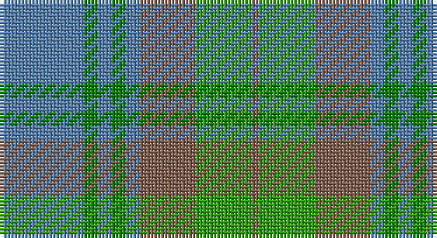

This page is one **sett** — a single exact thread-count. It belongs to the [tartan](/setts/t12g2t2g2t2o8gi8o1/)
(the same proportion at any scale), whose colour order is pattern [BGBGBRGR](/stripes/bgbgbrgr/).

Sourced from weddslist.  It is a [8 stripe tartan](/stripes/stripes8/).

Original link http://www.weddslist.com/cgi-bin/tartans/pg.pl?source=sts

## Thread count
B/24 Ga4 B4 Ga4 B4 LT16 G16 LT/2

One full sett is **122 threads**.

## Palette

Palette: <strong>custom</strong>
<table><thead><tr><th>Colour</th><th>Threads</th><th>Shade</th><th>Base</th><th>OKLCh</th></tr></thead><tbody><tr><td>B/</td><td style="text-align:right;font-variant-numeric:tabular-nums">24</td><td><code style="background-color:#5480B0;">#5480B0</code> <small style="color:#888">#5480B0</small></td><td>B <code style="background-color:#2A418A;">#2A418A</code></td><td><small style="color:#888">oklch(58.8% 0.089 251.5)</small></td></tr><tr><td>Ga</td><td style="text-align:right;font-variant-numeric:tabular-nums">4</td><td><code style="background-color:#008000;">#008000</code> <small style="color:#888">#008000</small></td><td>G <code style="background-color:#006100;">#006100</code></td><td><small style="color:#888">oklch(52.0% 0.177 142.5)</small></td></tr><tr><td>B</td><td style="text-align:right;font-variant-numeric:tabular-nums">4</td><td><code style="background-color:#5480B0;">#5480B0</code> <small style="color:#888">#5480B0</small></td><td>B <code style="background-color:#2A418A;">#2A418A</code></td><td><small style="color:#888">oklch(58.8% 0.089 251.5)</small></td></tr><tr><td>Ga</td><td style="text-align:right;font-variant-numeric:tabular-nums">4</td><td><code style="background-color:#008000;">#008000</code> <small style="color:#888">#008000</small></td><td>G <code style="background-color:#006100;">#006100</code></td><td><small style="color:#888">oklch(52.0% 0.177 142.5)</small></td></tr><tr><td>B</td><td style="text-align:right;font-variant-numeric:tabular-nums">4</td><td><code style="background-color:#5480B0;">#5480B0</code> <small style="color:#888">#5480B0</small></td><td>B <code style="background-color:#2A418A;">#2A418A</code></td><td><small style="color:#888">oklch(58.8% 0.089 251.5)</small></td></tr><tr><td>LT</td><td style="text-align:right;font-variant-numeric:tabular-nums">16</td><td><code style="background-color:#806050;">#806050</code> <small style="color:#888">#806050</small></td><td>R <code style="background-color:#CC0000;">#CC0000</code></td><td><small style="color:#888">oklch(51.7% 0.049 47.8)</small></td></tr><tr><td>G</td><td style="text-align:right;font-variant-numeric:tabular-nums">16</td><td><code style="background-color:#30A010;">#30A010</code> <small style="color:#888">#30A010</small></td><td>G <code style="background-color:#006100;">#006100</code></td><td><small style="color:#888">oklch(61.9% 0.195 140.5)</small></td></tr><tr><td>LT/</td><td style="text-align:right;font-variant-numeric:tabular-nums">2</td><td><code style="background-color:#806050;">#806050</code> <small style="color:#888">#806050</small></td><td>R <code style="background-color:#CC0000;">#CC0000</code></td><td><small style="color:#888">oklch(51.7% 0.049 47.8)</small></td></tr></tbody></table>

# Sample pattern

## Nearest tartans

The nearest existing variants by ΔTartan distance, with this tartan at the top so the swatches line up against it.

ΔTartan

Tartan

Sett

—

<a href="/ttd/edit/#slug=t12g2t2g2t2o8gi8o1~x2">Universal, Ancient</a> <a class="nn-out" href="/variants/s8/t12g2t2g2t2o8gi8o1~x2/" title="open its dictionary page">↗</a>

1.12

<a href="/ttd/edit/#slug=t12gi2t2gi2t2dy8g8dy1~x2&amp;base=t12g2t2g2t2o8gi8o1~x2">Universal Ancient International Tartan</a> <a class="nn-out" href="/variants/s8/t12gi2t2gi2t2dy8g8dy1~x2/" title="open its dictionary page">↗</a>

1.13

<a href="/ttd/edit/#slug=yi12dg2yi2dg2yi2dy8y8dy1~x2&amp;base=t12g2t2g2t2o8gi8o1~x2">Ancient Universal (Fashion?)</a> <a class="nn-out" href="/variants/s8/yi12dg2yi2dg2yi2dy8y8dy1~x2/" title="open its dictionary page">↗</a>

1.45

<a href="/ttd/edit/#slug=g2t15lr5g2t2g7w2~x4&amp;base=t12g2t2g2t2o8gi8o1~x2">Chambers Bay</a> <a class="nn-out" href="/variants/s7/g2t15lr5g2t2g7w2~x4/" title="open its dictionary page">↗</a>

1.49

<a href="/ttd/edit/#slug=t12dg2t2dg2t2dy8g8dy1~x2&amp;base=t12g2t2g2t2o8gi8o1~x2">Universal Ancient</a> <a class="nn-out" href="/variants/s8/t12dg2t2dg2t2dy8g8dy1~x2/" title="open its dictionary page">↗</a>

1.49

<a href="/ttd/edit/#slug=b5lg2b2lg9k3b9g3b3g25lr2~x2&amp;base=t12g2t2g2t2o8gi8o1~x2">Un-named (D C Dalgliesh) #2</a> <a class="nn-out" href="/variants/s10/b5lg2b2lg9k3b9g3b3g25lr2~x2/" title="open its dictionary page">↗</a>

1.52

<a href="/ttd/edit/#slug=g4o25g6t12g12t3~x2&amp;base=t12g2t2g2t2o8gi8o1~x2">Canadian Fancy</a> <a class="nn-out" href="/variants/s6/g4o25g6t12g12t3~x2/" title="open its dictionary page">↗</a>

1.60

<a href="/ttd/edit/#slug=k3lr15t3lr4t3lr4t10y30w3~x2&amp;base=t12g2t2g2t2o8gi8o1~x2">Highland Road (Fashion)</a> <a class="nn-out" href="/variants/s9/k3lr15t3lr4t3lr4t10y30w3~x2/" title="open its dictionary page">↗</a>

1.66

<a href="/ttd/edit/#slug=g32o7g7o16db32ly3o8~x2&amp;base=t12g2t2g2t2o8gi8o1~x2">Strange Of Balcaskie</a> <a class="nn-out" href="/variants/s7/g32o7g7o16db32ly3o8~x2/" title="open its dictionary page">↗</a>

1.69

<a href="/ttd/edit/#slug=t3k3t21g49t21k3t3w3~x2&amp;base=t12g2t2g2t2o8gi8o1~x2">Irvine of Drum</a> <a class="nn-out" href="/variants/s8/t3k3t21g49t21k3t3w3~x2/" title="open its dictionary page">↗</a>

1.70

<a href="/ttd/edit/#slug=gi14t2gi2t2gi3t6g12r2~x2&amp;base=t12g2t2g2t2o8gi8o1~x2">Cranston</a> <a class="nn-out" href="/variants/s8/gi14t2gi2t2gi3t6g12r2~x2/" title="open its dictionary page">↗</a>

## Neighbour map

Every grey dot is one of 14360 variants placed by the first two principal components of the ΔTartan feature space (44% of its variance). Red is this tartan; blue dots are its nearest — click one to open its page.

<svg viewBox="0 0 640 380" role="img" style="max-width:100%;height:auto;border:1px solid #e0e0e0;border-radius:4px;display:block" xmlns="http://www.w3.org/2000/svg"><image href="/nn/cloud.v1.png" width="640" height="380"/><a href="/variants/s8/t12gi2t2gi2t2dy8g8dy1~x2/"><circle cx="264.9" cy="222.1" r="4" fill="#3465a4"><title>Universal Ancient International Tartan</title></circle></a><a href="/variants/s8/yi12dg2yi2dg2yi2dy8y8dy1~x2/"><circle cx="283.4" cy="227.7" r="4" fill="#3465a4"><title>Ancient Universal (Fashion?)</title></circle></a><a href="/variants/s7/g2t15lr5g2t2g7w2~x4/"><circle cx="305.5" cy="243.8" r="4" fill="#3465a4"><title>Chambers Bay</title></circle></a><a href="/variants/s8/t12dg2t2dg2t2dy8g8dy1~x2/"><circle cx="254.5" cy="219.5" r="4" fill="#3465a4"><title>Universal Ancient</title></circle></a><a href="/variants/s10/b5lg2b2lg9k3b9g3b3g25lr2~x2/"><circle cx="286.6" cy="189.9" r="4" fill="#3465a4"><title>Un-named (D C Dalgliesh) #2</title></circle></a><a href="/variants/s6/g4o25g6t12g12t3~x2/"><circle cx="315.4" cy="295.0" r="4" fill="#3465a4"><title>Canadian Fancy</title></circle></a><a href="/variants/s9/k3lr15t3lr4t3lr4t10y30w3~x2/"><circle cx="268.2" cy="202.1" r="4" fill="#3465a4"><title>Highland Road (Fashion)</title></circle></a><a href="/variants/s7/g32o7g7o16db32ly3o8~x2/"><circle cx="237.9" cy="236.3" r="4" fill="#3465a4"><title>Strange Of Balcaskie</title></circle></a><a href="/variants/s8/t3k3t21g49t21k3t3w3~x2/"><circle cx="367.3" cy="200.9" r="4" fill="#3465a4"><title>Irvine of Drum</title></circle></a><a href="/variants/s8/gi14t2gi2t2gi3t6g12r2~x2/"><circle cx="270.7" cy="251.5" r="4" fill="#3465a4"><title>Cranston</title></circle></a><circle cx="290.1" cy="235.2" r="5" fill="#c00000"/></svg>

ID: /variants/s8/t12g2t2g2t2o8gi8o1~x2/
