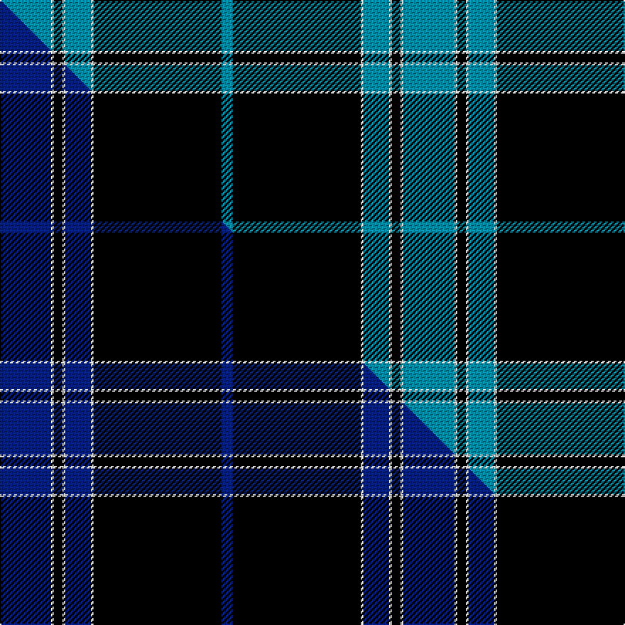

This page is one **sett** — a single exact thread-count. It belongs to the [tartan](/setts/t18w1k3w1t9w1k45t4/)
(the same proportion at any scale), whose colour order is pattern [BKWBWKWB](/stripes/bkwbwkwb/).

Part of the [Lynn](/tartans/lynn/) tartan — the named design grouping this sett with its other cloths.

Sourced from tartans-authority.  It is a [8 stripe tartan](/stripes/stripes8/).

Original link http://www.tartansauthority.com/tartan-ferret/display/5933/

## Register references

External register numbers recorded for this tartan.

- Scottish Tartans Authority (ITI): 5933

## Thread count
T/36 W2 K6 W2 T18 W2 K90 T/8

One full sett is **284 threads**.

## Palette
<table><thead><tr><th>Colour</th><th>Shade</th><th>OKLCh</th></tr></thead><tbody><tr><td>T</td><td><code style="background-color:#00879F;">#00879F</code> <small style="color:#888">#00879F</small></td><td><small style="color:#888">oklch(57.4% 0.102 216.1)</small></td></tr><tr><td>K</td><td><code style="background-color:#000000;">#000000</code> <small style="color:#888">#000000</small></td><td><small style="color:#888">oklch(0.0% 0.000 0.0)</small></td></tr><tr><td>W</td><td><code style="background-color:#F7F7F7;">#F7F7F7</code> <small style="color:#888">#F7F7F7</small></td><td><small style="color:#888">oklch(97.6% 0.000 89.9)</small></td></tr></tbody></table>

# Sample pattern

## Compared to the master

This cloth is one sett of its design; the master sett (the exemplar the design is anchored on) is below for comparison.

Its **ΔTartan distance** from the master is **1.46** — the same measure the nearest-tartans table ranks by (0 is identical; a re-scale of the same cloth is near 0, a recolour or a different proportion further).

<figure class="master-compare" style="margin:0">

this sett
master sett ★

<figcaption style="color:#888;font-size:smaller">One weave of this sett against the <a href="/setts/db18w1k3w1db9w1k45db4/">master sett ★</a>, split on the diagonal: a shared proportion runs seamlessly across it with only the shades shifting; a different proportion breaks on it.</figcaption>
</figure>

## Nearest variants

The nearest existing variants by ΔTartan distance, with this cloth at the top so the swatches line up against it.

ΔTartan

Threads

Variant

Sett

—

284

<a href="/variants/s8/t18w1k3w1t9w1k45t4~x2/">Lynn (Name)</a>

<a href="/ttd/edit/#slug=db18w1k3w1db9w1k45db4~x2&amp;base=t18w1k3w1t9w1k45t4~x2" title="compare in the TTD">0.00</a>

284

<a href="/variants/s8/db18w1k3w1db9w1k45db4~x2/">Lynn (Personal)</a>

<a href="/ttd/edit/#slug=db56k4w1db6k20w2k20~x2&amp;base=t18w1k3w1t9w1k45t4~x2" title="compare in the TTD">2.29</a>

284

<a href="/variants/s7/db56k4w1db6k20w2k20~x2/">Dalziel Rugby Club (Corporate)</a>

<a href="/ttd/edit/#slug=k4w1dp5w1k20db37w4db4~x2&amp;base=t18w1k3w1t9w1k45t4~x2" title="compare in the TTD">2.55</a>

288

<a href="/variants/s8/k4w1dp5w1k20db37w4db4~x2/">Finnie (Personal)</a>

<a href="/ttd/edit/#slug=k4y1k20t20k1t4~x4&amp;base=t18w1k3w1t9w1k45t4~x2" title="compare in the TTD">2.70</a>

368

<a href="/variants/s6/k4y1k20t20k1t4~x4/">Oakleigh (Corporate)</a>

<a href="/ttd/edit/#slug=k4lb2k28t30k1t3~x2&amp;base=t18w1k3w1t9w1k45t4~x2" title="compare in the TTD">2.72</a>

258

<a href="/variants/s6/k4lb2k28t30k1t3~x2/">Ramsay Blue Hunting</a>

<a href="/ttd/edit/#slug=r3t14y2k2t14k36y2k2y2~x2&amp;base=t18w1k3w1t9w1k45t4~x2" title="compare in the TTD">2.84</a>

298

<a href="/variants/s9/r3t14y2k2t14k36y2k2y2~x2/">Ewbank</a>

<a href="/ttd/edit/#slug=k36r3k3r3k9t36g3t2~x2&amp;base=t18w1k3w1t9w1k45t4~x2" title="compare in the TTD">2.90</a>

304

<a href="/variants/s8/k36r3k3r3k9t36g3t2~x2/">Home (Clan)</a>

<a href="/ttd/edit/#slug=k3r1k30w1db28r1db1w3~x2&amp;base=t18w1k3w1t9w1k45t4~x2" title="compare in the TTD">2.92</a>

260

<a href="/variants/s8/k3r1k30w1db28r1db1w3~x2/">Dunlop</a>

## Neighbour map

Every grey dot is one of 13620 variants placed by the first two principal components of the ΔTartan feature space (42% of its variance). Red is this tartan; blue dots are its nearest — click one to open its page.

<svg viewBox="0 0 640 380" role="img" style="max-width:100%;height:auto;border:1px solid #e0e0e0;border-radius:4px;display:block" xmlns="http://www.w3.org/2000/svg"><image href="/nn/cloud.v1.png" width="640" height="380"/><a href="/variants/s8/db18w1k3w1db9w1k45db4~x2/"><circle cx="399.1" cy="106.8" r="4" fill="#3465a4"><title>Lynn (Personal)</title></circle></a><a href="/variants/s7/db56k4w1db6k20w2k20~x2/"><circle cx="399.6" cy="124.3" r="4" fill="#3465a4"><title>Dalziel Rugby Club (Corporate)</title></circle></a><a href="/variants/s8/k4w1dp5w1k20db37w4db4~x2/"><circle cx="314.8" cy="106.3" r="4" fill="#3465a4"><title>Finnie (Personal)</title></circle></a><a href="/variants/s6/k4y1k20t20k1t4~x4/"><circle cx="299.7" cy="165.4" r="4" fill="#3465a4"><title>Oakleigh (Corporate)</title></circle></a><a href="/variants/s6/k4lb2k28t30k1t3~x2/"><circle cx="311.9" cy="145.5" r="4" fill="#3465a4"><title>Ramsay Blue Hunting</title></circle></a><a href="/variants/s9/r3t14y2k2t14k36y2k2y2~x2/"><circle cx="266.0" cy="120.4" r="4" fill="#3465a4"><title>Ewbank</title></circle></a><a href="/variants/s8/k36r3k3r3k9t36g3t2~x2/"><circle cx="259.9" cy="127.9" r="4" fill="#3465a4"><title>Home (Clan)</title></circle></a><a href="/variants/s8/k3r1k30w1db28r1db1w3~x2/"><circle cx="294.5" cy="99.5" r="4" fill="#3465a4"><title>Dunlop</title></circle></a><circle cx="364.9" cy="99.8" r="5" fill="#c00000"/><text x="320" y="376" text-anchor="middle" font-size="11" fill="#999">ground</text><text x="11" y="190" text-anchor="middle" font-size="11" fill="#999" transform="rotate(-90 11 190)">complexity</text></svg>

ID: /variants/s8/t18w1k3w1t9w1k45t4~x2/
