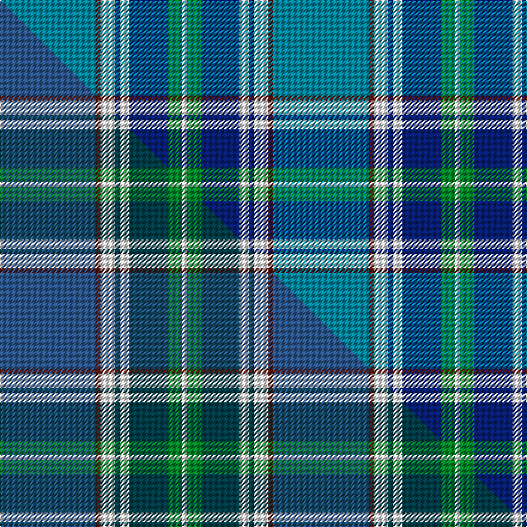

This is one **variant** — a specific cloth: this exact thread count and colourway, with its own
provenance below. It is one weaving of the [sett](/setts/t20dr1w3db1w2db8g3w1/) (the scale-free proportion — the
same cloth at any scale or shade), whose colour order is pattern [BBWBWBGW](/stripes/bbwbwbgw/).

Part of the [Kruenaegel and Schropp](/tartans/kruenaegel-and-schropp/) tartan — the named design grouping this sett with its other cloths.

Sourced from tartans-authority.  It is a [8 stripe tartan](/stripes/stripes8/).

Original link [https://www.tartanregister.gov.uk/tartanDetails.aspx?ref=10591](https://www.tartanregister.gov.uk/tartanDetails.aspx?ref=10591)

Dataset <small>— provenance for this record, inherited from the source manifest</small>

<dl class="dataset-prov">
<dt>source</dt><dd><a href="/sources/tartans-authority/">Scottish Tartans Authority</a></dd>
<dt>data captured from</dt><dd><a href="https://github.com/thetartan/tartan-database/blob/master/data/tartans-authority/data.csv">https://github.com/thetartan/tartan-database/blob/master/data/tartans-authority/data.csv</a></dd>
<dt>data date</dt><dd>20/03/2012 <small>(this record)</small></dd>
<dt>licence</dt><dd><a href="https://creativecommons.org/licenses/by-nc-nd/4.0/">CC BY-NC-ND 4.0</a></dd>
</dl>

Capture chain <small>— the hands this data passed through, oldest first; each capture carries its own licence</small>

<ol class="capture-chain">
<li><a href="https://www.tartansauthority.com/">Scottish Tartans Authority</a> <small>the heritage body's archive — its tartan-ferret record browser is retired (links repaired to the SRT, above)</small></li>
<li><a href="https://github.com/thetartan/tartan-database">thetartan/tartan-database</a> <small>2016-2017</small> · <a href="https://creativecommons.org/licenses/by-nc-nd/4.0/">CC BY-NC-ND 4.0</a> <small>Levko Kravets's frozen compilation — the capture we vendored, and where its CC licence text came from</small></li>
<li>this dictionary <small>captured 2026-06-10 · commit 5bf86c7566</small> <small>each re-capture is a git commit to data/sources</small></li>
</ol>

## Register references

External register numbers recorded for this tartan.

- Scottish Register of Tartans: [10591](https://www.tartanregister.gov.uk/tartanDetails?ref=10591)
- Scottish Tartans Authority (ITI): 10591

## Thread count
T/80 DR4 W12 DB4 W8 DB32 G12 W/4

One full sett is **228 threads**.

## Palette
<table><thead><tr><th>Colour</th><th>Shade</th><th>OKLCh</th></tr></thead><tbody><tr><td>T</td><td><code style="background-color:#00879F;">#00879F</code> <small style="color:#888">#00879F</small></td><td><small style="color:#888">oklch(57.4% 0.102 216.1)</small></td></tr><tr><td>DB</td><td><code style="background-color:#082077;">#082077</code> <small style="color:#888">#082077</small></td><td><small style="color:#888">oklch(30.0% 0.149 265.1)</small></td></tr><tr><td>DR</td><td><code style="background-color:#55120C;">#55120C</code> <small style="color:#888">#55120C</small></td><td><small style="color:#888">oklch(30.0% 0.099 29.3)</small></td></tr><tr><td>G</td><td><code style="background-color:#008B2A;">#008B2A</code> <small style="color:#888">#008B2A</small></td><td><small style="color:#888">oklch(55.4% 0.170 145.9)</small></td></tr><tr><td>W</td><td><code style="background-color:#F7F7F7;">#F7F7F7</code> <small style="color:#888">#F7F7F7</small></td><td><small style="color:#888">oklch(97.6% 0.000 89.9)</small></td></tr></tbody></table>

# Sample pattern

## Compared to the master

This cloth is one sett of its design; the master sett (the exemplar the design is anchored on) is below for comparison.

Its **ΔTartan distance** from the master is **0.16** — the same measure the nearest-tartans table ranks by (0 is identical; a re-scale of the same cloth is near 0, a recolour or a different proportion further).

<figure class="master-compare" style="margin:0">

this sett
master sett ★

<figcaption style="color:#888;font-size:smaller">One weave of this sett against the <a href="/setts/db20dr1w3dt1w2dt8g3w1/">master sett ★</a>, split on the diagonal: a shared proportion runs seamlessly across it with only the shades shifting; a different proportion breaks on it.</figcaption>
</figure>

## Nearest tartan variants

The nearest existing variants by ΔTartan distance, with this cloth at the top so the swatches line up against it.

ΔTartan

Threads

Variant

Sett

—

228

<a href="/variants/s8/t20dr1w3db1w2db8g3w1~x4/">Kruenaegel and Schropp (Name)</a>

<a href="/ttd/edit/#slug=db20dr1w3dt1w2dt8g3w1~x4~db1804259-dt1302222&amp;base=t20dr1w3db1w2db8g3w1~x4" title="compare in the TTD">0.16</a>

228

<a href="/variants/s8/db20dr1w3dt1w2dt8g3w1~x4~db1804259-dt1302222/">Kruenaegel and Schropp</a>

<a href="/ttd/edit/#slug=db20m1w3dt1w2dt8g3w1~x4~db1804259-dt1302222&amp;base=t20dr1w3db1w2db8g3w1~x4" title="compare in the TTD">0.16</a>

228

<a href="/variants/s8/db20m1w3dt1w2dt8g3w1~x4~db1804259-dt1302222/">Kruenaegel-Schropp Name Tartan</a>

<a href="/ttd/edit/#slug=w3lg15db6dbi2db1dbi2db1dbi21y2~x2~db1004274-dbi1406275&amp;base=t20dr1w3db1w2db8g3w1~x4" title="compare in the TTD">2.28</a>

202

<a href="/variants/s9/w3lg15db6dbi2db1dbi2db1dbi21y2~x2~db1004274-dbi1406275/">Blue Knights, The</a>

<a href="/ttd/edit/#slug=lb20lo2n5lb4db2n2db2n2dg1~x2&amp;base=t20dr1w3db1w2db8g3w1~x4" title="compare in the TTD">2.31</a>

118

<a href="/variants/s9/lb20lo2n5lb4db2n2db2n2dg1~x2/">Boucherville Dress</a>

<a href="/ttd/edit/#slug=lb5dy6w2g7w2t44w2~x2&amp;base=t20dr1w3db1w2db8g3w1~x4" title="compare in the TTD">2.57</a>

258

<a href="/variants/s7/lb5dy6w2g7w2t44w2~x2/">Leblant-Macqueron (Personal)</a>

<a href="/ttd/edit/#slug=w15y2db5lr3n40db10~lr2800000-n2402249&amp;base=t20dr1w3db1w2db8g3w1~x4" title="compare in the TTD">2.76</a>

125

<a href="/variants/s6/w15y2db5lr3n40db10~lr2800000-n2402249/">Herriot (New Zealand) (Name)</a>

<a href="/ttd/edit/#slug=w4lb1y2lb22db20w2db4w2~x2&amp;base=t20dr1w3db1w2db8g3w1~x4" title="compare in the TTD">2.88</a>

216

<a href="/variants/s8/w4lb1y2lb22db20w2db4w2~x2/">Gorman Blue (Personal)</a>

<a href="/ttd/edit/#slug=t45dy6t3dy6lb3dp5lb3dp5lb20t2lb3~x2&amp;base=t20dr1w3db1w2db8g3w1~x4" title="compare in the TTD">3.16</a>

308

<a href="/variants/s11/t45dy6t3dy6lb3dp5lb3dp5lb20t2lb3~x2/">Dunn</a>

<a href="/ttd/edit/#slug=dr1g4ly1g3dr4db15w1~x4&amp;base=t20dr1w3db1w2db8g3w1~x4" title="compare in the TTD">3.18</a>

224

<a href="/variants/s7/dr1g4ly1g3dr4db15w1~x4/">Bressuire (District)</a>

<a href="/ttd/edit/#slug=t45y6t3y6t3w3db5w3db5w20t2w3~x2&amp;base=t20dr1w3db1w2db8g3w1~x4" title="compare in the TTD">3.21</a>

320

<a href="/variants/s12/t45y6t3y6t3w3db5w3db5w20t2w3~x2/">Dunn (Scotland) (Name)</a>

## Neighbour map

Every grey dot is one of 13621 variants placed by the first two principal components of the ΔTartan feature space (42% of its variance). Red is this tartan; blue dots are its nearest — click one to open its page.

<svg viewBox="0 0 640 380" role="img" style="max-width:100%;height:auto;border:1px solid #e0e0e0;border-radius:4px;display:block" xmlns="http://www.w3.org/2000/svg"><image href="/nn/cloud.v1.png" width="640" height="380"/><a href="/variants/s8/db20dr1w3dt1w2dt8g3w1~x4~db1804259-dt1302222/"><circle cx="314.6" cy="156.4" r="4" fill="#3465a4"><title>Kruenaegel and Schropp</title></circle></a><a href="/variants/s8/db20m1w3dt1w2dt8g3w1~x4~db1804259-dt1302222/"><circle cx="294.1" cy="142.5" r="4" fill="#3465a4"><title>Kruenaegel-Schropp Name Tartan</title></circle></a><a href="/variants/s9/w3lg15db6dbi2db1dbi2db1dbi21y2~x2~db1004274-dbi1406275/"><circle cx="263.2" cy="146.4" r="4" fill="#3465a4"><title>Blue Knights, The</title></circle></a><a href="/variants/s9/lb20lo2n5lb4db2n2db2n2dg1~x2/"><circle cx="378.5" cy="149.7" r="4" fill="#3465a4"><title>Boucherville Dress</title></circle></a><a href="/variants/s7/lb5dy6w2g7w2t44w2~x2/"><circle cx="443.9" cy="163.5" r="4" fill="#3465a4"><title>Leblant-Macqueron (Personal)</title></circle></a><a href="/variants/s6/w15y2db5lr3n40db10~lr2800000-n2402249/"><circle cx="318.8" cy="176.5" r="4" fill="#3465a4"><title>Herriot (New Zealand) (Name)</title></circle></a><a href="/variants/s8/w4lb1y2lb22db20w2db4w2~x2/"><circle cx="282.1" cy="166.9" r="4" fill="#3465a4"><title>Gorman Blue (Personal)</title></circle></a><a href="/variants/s11/t45dy6t3dy6lb3dp5lb3dp5lb20t2lb3~x2/"><circle cx="346.4" cy="154.6" r="4" fill="#3465a4"><title>Dunn</title></circle></a><a href="/variants/s7/dr1g4ly1g3dr4db15w1~x4/"><circle cx="303.5" cy="176.4" r="4" fill="#3465a4"><title>Bressuire (District)</title></circle></a><a href="/variants/s12/t45y6t3y6t3w3db5w3db5w20t2w3~x2/"><circle cx="321.7" cy="141.2" r="4" fill="#3465a4"><title>Dunn (Scotland) (Name)</title></circle></a><circle cx="305.6" cy="156.1" r="5" fill="#c00000"/><text x="320" y="376" text-anchor="middle" font-size="11" fill="#999">ground</text><text x="11" y="190" text-anchor="middle" font-size="11" fill="#999" transform="rotate(-90 11 190)">complexity</text></svg>

ID: /variants/s8/t20dr1w3db1w2db8g3w1~x4/
