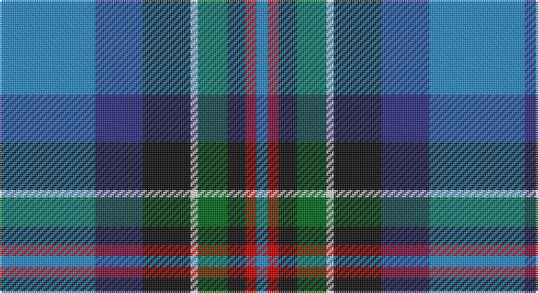

This page is one **sett** — a single exact thread-count. It belongs to the [tartan](/setts/t26db13k13w2g8k5r3t3/)
(the same proportion at any scale), whose colour order is pattern [BBKWGKRB](/stripes/bbkwgkrb/).

Part of the [Moran](/tartans/moran/) tartan — the named design grouping this sett with its other cloths.

Sourced from register-of-tartans.  It is a [8 stripe tartan](/stripes/stripes8/).

Original link https://www.tartanregister.gov.uk/tartanDetails.aspx?ref=6005

## Also known as

This cloth is also recorded under:

- Moran Blue
- Moran Personal

## Register references

External register numbers recorded for this tartan.

- Scottish Register of Tartans: [6005](https://www.tartanregister.gov.uk/tartanDetails.aspx?ref=6005)

## Thread count
B/52 DB26 K26 LN4 G16 K10 R6 B/6

One full sett is **234 threads**.

## Palette

Palette: <strong>Tartan Register</strong>
<table><thead><tr><th>Colour</th><th>Threads</th><th>Shade</th><th>Base</th><th>OKLCh</th></tr></thead><tbody><tr><td>B/</td><td style="text-align:right;font-variant-numeric:tabular-nums">52</td><td><code style="background-color:#2888C4;">#2888C4</code> <small style="color:#888">#2888C4</small></td><td>B <code style="background-color:#2A418A;">#2A418A</code></td><td><small style="color:#888">oklch(60.1% 0.125 241.5)</small></td></tr><tr><td>DB</td><td style="text-align:right;font-variant-numeric:tabular-nums">26</td><td><code style="background-color:#2C2C80;">#2C2C80</code> <small style="color:#888">#2C2C80</small></td><td>B <code style="background-color:#2A418A;">#2A418A</code></td><td><small style="color:#888">oklch(35.0% 0.138 276.6)</small></td></tr><tr><td>K</td><td style="text-align:right;font-variant-numeric:tabular-nums">26</td><td><code style="background-color:#101010;">#101010</code> <small style="color:#888">#101010</small></td><td>K <code style="background-color:#000000;">#000000</code></td><td><small style="color:#888">oklch(17.3% 0.000 89.9)</small></td></tr><tr><td>LN</td><td style="text-align:right;font-variant-numeric:tabular-nums">4</td><td><code style="background-color:#E0E0E0;">#E0E0E0</code> <small style="color:#888">#E0E0E0</small></td><td>W <code style="background-color:#F7F7F7;">#F7F7F7</code></td><td><small style="color:#888">oklch(90.7% 0.000 89.9)</small></td></tr><tr><td>G</td><td style="text-align:right;font-variant-numeric:tabular-nums">16</td><td><code style="background-color:#006818;">#006818</code> <small style="color:#888">#006818</small></td><td>G <code style="background-color:#006100;">#006100</code></td><td><small style="color:#888">oklch(45.0% 0.142 145.0)</small></td></tr><tr><td>K</td><td style="text-align:right;font-variant-numeric:tabular-nums">10</td><td><code style="background-color:#101010;">#101010</code> <small style="color:#888">#101010</small></td><td>K <code style="background-color:#000000;">#000000</code></td><td><small style="color:#888">oklch(17.3% 0.000 89.9)</small></td></tr><tr><td>R</td><td style="text-align:right;font-variant-numeric:tabular-nums">6</td><td><code style="background-color:#C80000;">#C80000</code> <small style="color:#888">#C80000</small></td><td>R <code style="background-color:#CC0000;">#CC0000</code></td><td><small style="color:#888">oklch(52.3% 0.215 29.2)</small></td></tr><tr><td>B/</td><td style="text-align:right;font-variant-numeric:tabular-nums">6</td><td><code style="background-color:#2888C4;">#2888C4</code> <small style="color:#888">#2888C4</small></td><td>B <code style="background-color:#2A418A;">#2A418A</code></td><td><small style="color:#888">oklch(60.1% 0.125 241.5)</small></td></tr></tbody></table>

# Sample pattern

## Compared to the master

This cloth is one sett of its design; the master sett (the exemplar the design is anchored on) is below for comparison.

<figure style="margin:0"><figcaption style="color:#888;font-size:smaller">this sett</figcaption></figure>
<figure style="margin:0"><figcaption style="color:#888;font-size:smaller"><a href="/setts/db5m3gi2m3g12b34gi2w2/">master sett →</a></figcaption></figure>

## Nearest tartans

The nearest existing variants by ΔTartan distance, with this tartan at the top so the swatches line up against it.

ΔTartan

Tartan

Sett

—

<a href="/ttd/edit/#slug=t26db13k13w2g8k5r3t3~x2">Moran (Coilessan) (Personal)</a> <a class="nn-out" href="/variants/s8/t26db13k13w2g8k5r3t3~x2/" title="open its dictionary page">↗</a>

0.45

<a href="/ttd/edit/#slug=t3r3k5g8w2k13db13t26w3~x2&amp;base=t26db13k13w2g8k5r3t3~x2">Moran (Virgin Islands) (Personal)</a> <a class="nn-out" href="/variants/s9/t3r3k5g8w2k13db13t26w3~x2/" title="open its dictionary page">↗</a>

0.67

<a href="/ttd/edit/#slug=dp4db2t8db25k8g13ly4~x2&amp;base=t26db13k13w2g8k5r3t3~x2">Renfrewshire</a> <a class="nn-out" href="/variants/s7/dp4db2t8db25k8g13ly4~x2/" title="open its dictionary page">↗</a>

0.68

<a href="/ttd/edit/#slug=k16w6k4b64m19k8g42ly6&amp;base=t26db13k13w2g8k5r3t3~x2">Unidentified (Woven sample)</a> <a class="nn-out" href="/variants/s8/k16w6k4b64m19k8g42ly6/" title="open its dictionary page">↗</a>

0.69

<a href="/ttd/edit/#slug=p4db2t8db25k8g13ly4~x2&amp;base=t26db13k13w2g8k5r3t3~x2">Renfrewshire Tartan</a> <a class="nn-out" href="/variants/s7/p4db2t8db25k8g13ly4~x2/" title="open its dictionary page">↗</a>

0.88

<a href="/ttd/edit/#slug=db60t5w4o12g42p12t5p12&amp;base=t26db13k13w2g8k5r3t3~x2">St Columba</a> <a class="nn-out" href="/variants/s8/db60t5w4o12g42p12t5p12/" title="open its dictionary page">↗</a>

0.91

<a href="/ttd/edit/#slug=m4db2t7db20k7g10ly4~x2&amp;base=t26db13k13w2g8k5r3t3~x2">Renfrewshire District Tartan</a> <a class="nn-out" href="/variants/s7/m4db2t7db20k7g10ly4~x2/" title="open its dictionary page">↗</a>

0.96

<a href="/ttd/edit/#slug=g5m2g2m9k9lr9db30w5~x2&amp;base=t26db13k13w2g8k5r3t3~x2">Alexander of Menstry</a> <a class="nn-out" href="/variants/s8/g5m2g2m9k9lr9db30w5~x2/" title="open its dictionary page">↗</a>

0.97

<a href="/ttd/edit/#slug=w4db8m3db25k13g4t29db3t8db2m3~x2&amp;base=t26db13k13w2g8k5r3t3~x2">Air Force</a> <a class="nn-out" href="/variants/s11/w4db8m3db25k13g4t29db3t8db2m3~x2/" title="open its dictionary page">↗</a>

1.00

<a href="/ttd/edit/#slug=ly4g22r3k17r3db37w3~x2&amp;base=t26db13k13w2g8k5r3t3~x2">Souza Nery (Personal)</a> <a class="nn-out" href="/variants/s7/ly4g22r3k17r3db37w3~x2/" title="open its dictionary page">↗</a>

1.03

<a href="/ttd/edit/#slug=db35r2k16ly2t25w2t6~x2&amp;base=t26db13k13w2g8k5r3t3~x2">US Forces (Thurso) Regimental Tartan</a> <a class="nn-out" href="/variants/s7/db35r2k16ly2t25w2t6~x2/" title="open its dictionary page">↗</a>

## Neighbour map

Every grey dot is one of 14360 variants placed by the first two principal components of the ΔTartan feature space (44% of its variance). Red is this tartan; blue dots are its nearest — click one to open its page.

<svg viewBox="0 0 640 380" role="img" style="max-width:100%;height:auto;border:1px solid #e0e0e0;border-radius:4px;display:block" xmlns="http://www.w3.org/2000/svg"><image href="/nn/cloud.v1.png" width="640" height="380"/><a href="/variants/s9/t3r3k5g8w2k13db13t26w3~x2/"><circle cx="133.1" cy="146.0" r="4" fill="#3465a4"><title>Moran (Virgin Islands) (Personal)</title></circle></a><a href="/variants/s7/dp4db2t8db25k8g13ly4~x2/"><circle cx="168.0" cy="174.7" r="4" fill="#3465a4"><title>Renfrewshire</title></circle></a><a href="/variants/s8/k16w6k4b64m19k8g42ly6/"><circle cx="161.5" cy="136.3" r="4" fill="#3465a4"><title>Unidentified (Woven sample)</title></circle></a><a href="/variants/s7/p4db2t8db25k8g13ly4~x2/"><circle cx="149.0" cy="165.5" r="4" fill="#3465a4"><title>Renfrewshire Tartan</title></circle></a><a href="/variants/s8/db60t5w4o12g42p12t5p12/"><circle cx="166.3" cy="138.4" r="4" fill="#3465a4"><title>St Columba</title></circle></a><a href="/variants/s7/m4db2t7db20k7g10ly4~x2/"><circle cx="139.0" cy="184.8" r="4" fill="#3465a4"><title>Renfrewshire District Tartan</title></circle></a><a href="/variants/s8/g5m2g2m9k9lr9db30w5~x2/"><circle cx="163.7" cy="135.9" r="4" fill="#3465a4"><title>Alexander of Menstry</title></circle></a><a href="/variants/s11/w4db8m3db25k13g4t29db3t8db2m3~x2/"><circle cx="161.2" cy="130.8" r="4" fill="#3465a4"><title>Air Force</title></circle></a><a href="/variants/s7/ly4g22r3k17r3db37w3~x2/"><circle cx="176.0" cy="156.3" r="4" fill="#3465a4"><title>Souza Nery (Personal)</title></circle></a><a href="/variants/s7/db35r2k16ly2t25w2t6~x2/"><circle cx="198.7" cy="147.5" r="4" fill="#3465a4"><title>US Forces (Thurso) Regimental Tartan</title></circle></a><circle cx="150.7" cy="160.2" r="5" fill="#c00000"/></svg>

ID: /variants/s8/t26db13k13w2g8k5r3t3~x2/
