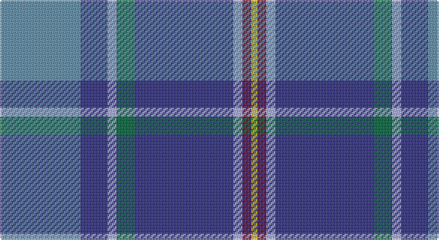

This page is one **sett** — a single exact thread-count. It belongs to the [tartan](/setts/t27db9lb3g6db33lb3dr3ly2/)
(the same proportion at any scale), whose colour order is pattern [BBWGBWBY](/stripes/bbwgbwby/).

Sourced from register-of-tartans.  It is a [8 stripe tartan](/stripes/stripes8/).

Original link https://www.tartanregister.gov.uk/tartanDetails.aspx?ref=304

2 attestations — the source records this cloth was collapsed from (oldest owns this page)

<ul>
<li>01/04/2005 — Blue Ridge Highlands Heritage (register-of-tartans, <a href="https://www.tartanregister.gov.uk/tartanDetails.aspx?ref=304">record</a>)</li>
<li>2005 April — Blue Ridge Highlands Heritage (Dist) (tartans-authority, <a href="http://www.tartansauthority.com/tartan-ferret/display/6637/">record</a>)</li>
</ul>

## Register references

External register numbers recorded for this tartan.

- Scottish Register of Tartans: [304](https://www.tartanregister.gov.uk/tartanDetails.aspx?ref=304)
- Scottish Tartans Authority (ITI): 6637

## Thread count
B/54 DBa18 LP6 G12 DBa66 LP6 DR6 Y/4

One full sett is **286 threads**.

## Palette

Palette: <strong>Tartan Register</strong>
<table><thead><tr><th>Colour</th><th>Threads</th><th>Shade</th><th>Base</th><th>OKLCh</th></tr></thead><tbody><tr><td>B/</td><td style="text-align:right;font-variant-numeric:tabular-nums">54</td><td><code style="background-color:#5C8CA8;">#5C8CA8</code> <small style="color:#888">#5C8CA8</small></td><td>B <code style="background-color:#2A418A;">#2A418A</code></td><td><small style="color:#888">oklch(61.7% 0.067 235.0)</small></td></tr><tr><td>DBa</td><td style="text-align:right;font-variant-numeric:tabular-nums">18</td><td><code style="background-color:#2C2C80;">#2C2C80</code> <small style="color:#888">#2C2C80</small></td><td>B <code style="background-color:#2A418A;">#2A418A</code></td><td><small style="color:#888">oklch(35.0% 0.138 276.6)</small></td></tr><tr><td>LP</td><td style="text-align:right;font-variant-numeric:tabular-nums">6</td><td><code style="background-color:#A8ACE8;">#A8ACE8</code> <small style="color:#888">#A8ACE8</small></td><td>W <code style="background-color:#F7F7F7;">#F7F7F7</code></td><td><small style="color:#888">oklch(76.3% 0.086 281.2)</small></td></tr><tr><td>G</td><td style="text-align:right;font-variant-numeric:tabular-nums">12</td><td><code style="background-color:#00643C;">#00643C</code> <small style="color:#888">#00643C</small></td><td>G <code style="background-color:#006100;">#006100</code></td><td><small style="color:#888">oklch(44.3% 0.104 157.7)</small></td></tr><tr><td>DBa</td><td style="text-align:right;font-variant-numeric:tabular-nums">66</td><td><code style="background-color:#2C2C80;">#2C2C80</code> <small style="color:#888">#2C2C80</small></td><td>B <code style="background-color:#2A418A;">#2A418A</code></td><td><small style="color:#888">oklch(35.0% 0.138 276.6)</small></td></tr><tr><td>LP</td><td style="text-align:right;font-variant-numeric:tabular-nums">6</td><td><code style="background-color:#A8ACE8;">#A8ACE8</code> <small style="color:#888">#A8ACE8</small></td><td>W <code style="background-color:#F7F7F7;">#F7F7F7</code></td><td><small style="color:#888">oklch(76.3% 0.086 281.2)</small></td></tr><tr><td>DR</td><td style="text-align:right;font-variant-numeric:tabular-nums">6</td><td><code style="background-color:#680028;">#680028</code> <small style="color:#888">#680028</small></td><td>B <code style="background-color:#2A418A;">#2A418A</code></td><td><small style="color:#888">oklch(33.1% 0.133 8.3)</small></td></tr><tr><td>Y/</td><td style="text-align:right;font-variant-numeric:tabular-nums">4</td><td><code style="background-color:#E8C000;">#E8C000</code> <small style="color:#888">#E8C000</small></td><td>Y <code style="background-color:#F2BF00;">#F2BF00</code></td><td><small style="color:#888">oklch(81.9% 0.168 93.7)</small></td></tr></tbody></table>

# Sample pattern

## Nearest tartans

The nearest existing variants by ΔTartan distance, with this tartan at the top so the swatches line up against it.

ΔTartan

Tartan

Sett

—

<a href="/ttd/edit/#slug=t27db9lb3g6db33lb3dr3ly2~x2">Blue Ridge Highlands Heritage</a> <a class="nn-out" href="/variants/s8/t27db9lb3g6db33lb3dr3ly2~x2/" title="open its dictionary page">↗</a>

0.77

<a href="/ttd/edit/#slug=t12db6t50dbi39p12dp6p6w4&amp;base=t27db9lb3g6db33lb3dr3ly2~x2">Pride of the Nation (Fashion)</a> <a class="nn-out" href="/variants/s8/t12db6t50dbi39p12dp6p6w4/" title="open its dictionary page">↗</a>

0.82

<a href="/ttd/edit/#slug=t4lo2t34db10lr4db4dp4db23w3~x2&amp;base=t27db9lb3g6db33lb3dr3ly2~x2">Heirloom Blue Alba (Fashion)</a> <a class="nn-out" href="/variants/s9/t4lo2t34db10lr4db4dp4db23w3~x2/" title="open its dictionary page">↗</a>

0.95

<a href="/ttd/edit/#slug=w1db15r1o10g2lp1~x4&amp;base=t27db9lb3g6db33lb3dr3ly2~x2">Peterson, Oren (Name)</a> <a class="nn-out" href="/variants/s6/w1db15r1o10g2lp1~x4/" title="open its dictionary page">↗</a>

0.97

<a href="/ttd/edit/#slug=ly4db24t5g2db3k5t33r2~x2&amp;base=t27db9lb3g6db33lb3dr3ly2~x2">Los Angeles</a> <a class="nn-out" href="/variants/s8/ly4db24t5g2db3k5t33r2~x2/" title="open its dictionary page">↗</a>

0.97

<a href="/ttd/edit/#slug=m4k3b18r3dt34w3~x2&amp;base=t27db9lb3g6db33lb3dr3ly2~x2">Margach, William (Personal)</a> <a class="nn-out" href="/variants/s6/m4k3b18r3dt34w3~x2/" title="open its dictionary page">↗</a>

0.99

<a href="/ttd/edit/#slug=dg10w2dt3g2m14dti26dg2dti6~x2&amp;base=t27db9lb3g6db33lb3dr3ly2~x2">Spirit of Fife (Corporate)</a> <a class="nn-out" href="/variants/s8/dg10w2dt3g2m14dti26dg2dti6~x2/" title="open its dictionary page">↗</a>

1.00

<a href="/ttd/edit/#slug=dbi30w2r3w2db14lr3dg14dbi18r2dbi3~x2&amp;base=t27db9lb3g6db33lb3dr3ly2~x2">Kansai St Andrews Society</a> <a class="nn-out" href="/variants/s10/dbi30w2r3w2db14lr3dg14dbi18r2dbi3~x2/" title="open its dictionary page">↗</a>

1.07

<a href="/ttd/edit/#slug=dp12r1g4r2dp10t20db3t9w1~x2&amp;base=t27db9lb3g6db33lb3dr3ly2~x2">Japan-Scotland Society (Corporate)</a> <a class="nn-out" href="/variants/s9/dp12r1g4r2dp10t20db3t9w1~x2/" title="open its dictionary page">↗</a>

1.10

<a href="/ttd/edit/#slug=db4g2db24g8t2r2t2ly2t10db2w3~x2&amp;base=t27db9lb3g6db33lb3dr3ly2~x2">McCartney (Evening/Night)</a> <a class="nn-out" href="/variants/s11/db4g2db24g8t2r2t2ly2t10db2w3~x2/" title="open its dictionary page">↗</a>

1.11

<a href="/ttd/edit/#slug=b16db6k1ly1k1db6b4m4k1r1~x4&amp;base=t27db9lb3g6db33lb3dr3ly2~x2">Kirk in the Hills</a> <a class="nn-out" href="/variants/s10/b16db6k1ly1k1db6b4m4k1r1~x4/" title="open its dictionary page">↗</a>

## Neighbour map

Every grey dot is one of 14360 variants placed by the first two principal components of the ΔTartan feature space (44% of its variance). Red is this tartan; blue dots are its nearest — click one to open its page.

<svg viewBox="0 0 640 380" role="img" style="max-width:100%;height:auto;border:1px solid #e0e0e0;border-radius:4px;display:block" xmlns="http://www.w3.org/2000/svg"><image href="/nn/cloud.v1.png" width="640" height="380"/><a href="/variants/s8/t12db6t50dbi39p12dp6p6w4/"><circle cx="217.0" cy="153.8" r="4" fill="#3465a4"><title>Pride of the Nation (Fashion)</title></circle></a><a href="/variants/s9/t4lo2t34db10lr4db4dp4db23w3~x2/"><circle cx="237.5" cy="131.0" r="4" fill="#3465a4"><title>Heirloom Blue Alba (Fashion)</title></circle></a><a href="/variants/s6/w1db15r1o10g2lp1~x4/"><circle cx="269.5" cy="150.4" r="4" fill="#3465a4"><title>Peterson, Oren (Name)</title></circle></a><a href="/variants/s8/ly4db24t5g2db3k5t33r2~x2/"><circle cx="250.6" cy="128.9" r="4" fill="#3465a4"><title>Los Angeles</title></circle></a><a href="/variants/s6/m4k3b18r3dt34w3~x2/"><circle cx="275.8" cy="176.3" r="4" fill="#3465a4"><title>Margach, William (Personal)</title></circle></a><a href="/variants/s8/dg10w2dt3g2m14dti26dg2dti6~x2/"><circle cx="252.2" cy="168.3" r="4" fill="#3465a4"><title>Spirit of Fife (Corporate)</title></circle></a><a href="/variants/s10/dbi30w2r3w2db14lr3dg14dbi18r2dbi3~x2/"><circle cx="282.3" cy="149.2" r="4" fill="#3465a4"><title>Kansai St Andrews Society</title></circle></a><a href="/variants/s9/dp12r1g4r2dp10t20db3t9w1~x2/"><circle cx="250.6" cy="140.4" r="4" fill="#3465a4"><title>Japan-Scotland Society (Corporate)</title></circle></a><a href="/variants/s11/db4g2db24g8t2r2t2ly2t10db2w3~x2/"><circle cx="226.1" cy="131.1" r="4" fill="#3465a4"><title>McCartney (Evening/Night)</title></circle></a><a href="/variants/s10/b16db6k1ly1k1db6b4m4k1r1~x4/"><circle cx="240.7" cy="121.8" r="4" fill="#3465a4"><title>Kirk in the Hills</title></circle></a><circle cx="263.2" cy="146.6" r="5" fill="#c00000"/></svg>

ID: /variants/s8/t27db9lb3g6db33lb3dr3ly2~x2/
