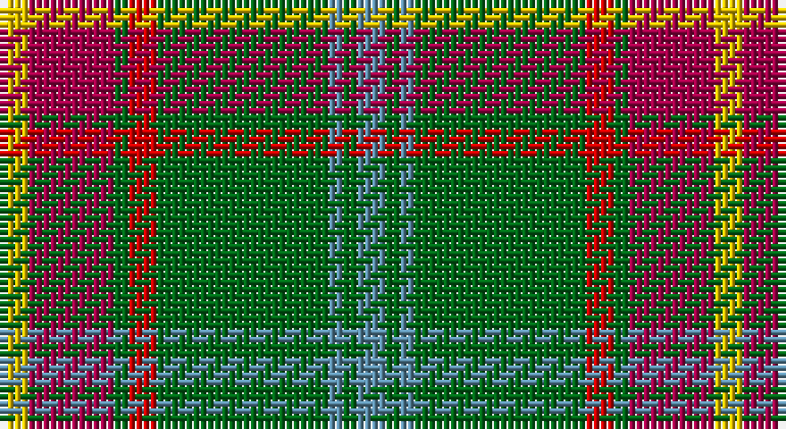

This page is one **sett** — a single exact thread-count. It belongs to the [tartan](/setts/t2g1t1g12r2g1m6ly2/)
(the same proportion at any scale), whose colour order is pattern [BGBGRGRY](/stripes/bgbgrgry/).

Sourced from house-of-tartan.  It is a [8 stripe tartan](/stripes/stripes8/).

Original link http://www.house-of-tartan.scotland.net/house/TartanViewjs.asp?colr=Def&tnam=146

## Provenance

Earliest known date: 1962 The tartan as it would appear with red in place of green, the 'G' of green having been interpreted as 'Gules'. The designer, Hugh Kirkwood Rankine, clearly intended a green stripe. This version can be found in the shops.

## Thread count
Y/4 R12 G2 Ra4 G24 B2 G2 B/4

One full sett is **100 threads**.

## Palette

Palette: <strong>Tartan Register</strong>
<table><thead><tr><th>Colour</th><th>Threads</th><th>Shade</th><th>Base</th><th>OKLCh</th></tr></thead><tbody><tr><td>Y/</td><td style="text-align:right;font-variant-numeric:tabular-nums">4</td><td><code style="background-color:#E8C000;">#E8C000</code> <small style="color:#888">#E8C000</small></td><td>Y <code style="background-color:#F2BF00;">#F2BF00</code></td><td><small style="color:#888">oklch(81.9% 0.168 93.7)</small></td></tr><tr><td>R</td><td style="text-align:right;font-variant-numeric:tabular-nums">12</td><td><code style="background-color:#A00048;">#A00048</code> <small style="color:#888">#A00048</small></td><td>R <code style="background-color:#CC0000;">#CC0000</code></td><td><small style="color:#888">oklch(45.4% 0.182 5.3)</small></td></tr><tr><td>G</td><td style="text-align:right;font-variant-numeric:tabular-nums">2</td><td><code style="background-color:#006818;">#006818</code> <small style="color:#888">#006818</small></td><td>G <code style="background-color:#006100;">#006100</code></td><td><small style="color:#888">oklch(45.0% 0.142 145.0)</small></td></tr><tr><td>Ra</td><td style="text-align:right;font-variant-numeric:tabular-nums">4</td><td><code style="background-color:#C80000;">#C80000</code> <small style="color:#888">#C80000</small></td><td>R <code style="background-color:#CC0000;">#CC0000</code></td><td><small style="color:#888">oklch(52.3% 0.215 29.2)</small></td></tr><tr><td>G</td><td style="text-align:right;font-variant-numeric:tabular-nums">24</td><td><code style="background-color:#006818;">#006818</code> <small style="color:#888">#006818</small></td><td>G <code style="background-color:#006100;">#006100</code></td><td><small style="color:#888">oklch(45.0% 0.142 145.0)</small></td></tr><tr><td>B</td><td style="text-align:right;font-variant-numeric:tabular-nums">2</td><td><code style="background-color:#5C8CA8;">#5C8CA8</code> <small style="color:#888">#5C8CA8</small></td><td>B <code style="background-color:#2A418A;">#2A418A</code></td><td><small style="color:#888">oklch(61.7% 0.067 235.0)</small></td></tr><tr><td>G</td><td style="text-align:right;font-variant-numeric:tabular-nums">2</td><td><code style="background-color:#006818;">#006818</code> <small style="color:#888">#006818</small></td><td>G <code style="background-color:#006100;">#006100</code></td><td><small style="color:#888">oklch(45.0% 0.142 145.0)</small></td></tr><tr><td>B/</td><td style="text-align:right;font-variant-numeric:tabular-nums">4</td><td><code style="background-color:#5C8CA8;">#5C8CA8</code> <small style="color:#888">#5C8CA8</small></td><td>B <code style="background-color:#2A418A;">#2A418A</code></td><td><small style="color:#888">oklch(61.7% 0.067 235.0)</small></td></tr></tbody></table>

# Sample pattern

## Nearest tartans

The nearest existing variants by ΔTartan distance, with this tartan at the top so the swatches line up against it.

ΔTartan

Tartan

Sett

—

<a href="/ttd/edit/#slug=t2g1t1g12r2g1m6ly2~x2">Manitoba District Tartan</a> <a class="nn-out" href="/variants/s8/t2g1t1g12r2g1m6ly2~x2/" title="open its dictionary page">↗</a>

0.48

<a href="/ttd/edit/#slug=t2dg1t1dg12r2dg1ri6ly2~x2&amp;base=t2g1t1g12r2g1m6ly2~x2">Manitoba Red</a> <a class="nn-out" href="/variants/s8/t2dg1t1dg12r2dg1ri6ly2~x2/" title="open its dictionary page">↗</a>

0.51

<a href="/ttd/edit/#slug=t2g1t1g12r2g1ri6ly2~x2&amp;base=t2g1t1g12r2g1m6ly2~x2">Manitoba</a> <a class="nn-out" href="/variants/s8/t2g1t1g12r2g1ri6ly2~x2/" title="open its dictionary page">↗</a>

0.69

<a href="/ttd/edit/#slug=t2g1t1g12dg2g1r6ly2~x4&amp;base=t2g1t1g12r2g1m6ly2~x2">Manitoba District Tartan</a> <a class="nn-out" href="/variants/s8/t2g1t1g12dg2g1r6ly2~x4/" title="open its dictionary page">↗</a>

0.90

<a href="/ttd/edit/#slug=t2g1t1g12dg2g1m6ly2~x4&amp;base=t2g1t1g12r2g1m6ly2~x2">Manitoba</a> <a class="nn-out" href="/variants/s8/t2g1t1g12dg2g1m6ly2~x4/" title="open its dictionary page">↗</a>

0.92

<a href="/ttd/edit/#slug=r1o1dg6o15dy2o1dy6w1~x4&amp;base=t2g1t1g12r2g1m6ly2~x2">Connacht #2</a> <a class="nn-out" href="/variants/s8/r1o1dg6o15dy2o1dy6w1~x4/" title="open its dictionary page">↗</a>

1.02

<a href="/ttd/edit/#slug=r2lo24r2lo3r2g24k8ly2~x2&amp;base=t2g1t1g12r2g1m6ly2~x2">Botherston (Name)</a> <a class="nn-out" href="/variants/s8/r2lo24r2lo3r2g24k8ly2~x2/" title="open its dictionary page">↗</a>

1.12

<a href="/ttd/edit/#slug=w6g5r5g45k4lo24k4g5~x2&amp;base=t2g1t1g12r2g1m6ly2~x2">O'Neill (Name)</a> <a class="nn-out" href="/variants/s8/w6g5r5g45k4lo24k4g5~x2/" title="open its dictionary page">↗</a>

1.15

<a href="/ttd/edit/#slug=r4t3r32db30r4g32r3g32r3g3~x2&amp;base=t2g1t1g12r2g1m6ly2~x2">Unidentified Plaid 6</a> <a class="nn-out" href="/variants/s10/r4t3r32db30r4g32r3g32r3g3~x2/" title="open its dictionary page">↗</a>

1.15

<a href="/ttd/edit/#slug=r2db10w1m1g1r1g6m1g10w1~x2&amp;base=t2g1t1g12r2g1m6ly2~x2">Tennessee</a> <a class="nn-out" href="/variants/s10/r2db10w1m1g1r1g6m1g10w1~x2/" title="open its dictionary page">↗</a>

1.19

<a href="/ttd/edit/#slug=r6g4do14w4do7g30lo4~x2&amp;base=t2g1t1g12r2g1m6ly2~x2">Newfoundland</a> <a class="nn-out" href="/variants/s7/r6g4do14w4do7g30lo4~x2/" title="open its dictionary page">↗</a>

## Neighbour map

Every grey dot is one of 14360 variants placed by the first two principal components of the ΔTartan feature space (44% of its variance). Red is this tartan; blue dots are its nearest — click one to open its page.

<svg viewBox="0 0 640 380" role="img" style="max-width:100%;height:auto;border:1px solid #e0e0e0;border-radius:4px;display:block" xmlns="http://www.w3.org/2000/svg"><image href="/nn/cloud.v1.png" width="640" height="380"/><a href="/variants/s8/t2dg1t1dg12r2dg1ri6ly2~x2/"><circle cx="273.5" cy="164.5" r="4" fill="#3465a4"><title>Manitoba Red</title></circle></a><a href="/variants/s8/t2g1t1g12r2g1ri6ly2~x2/"><circle cx="268.2" cy="162.1" r="4" fill="#3465a4"><title>Manitoba</title></circle></a><a href="/variants/s8/t2g1t1g12dg2g1r6ly2~x4/"><circle cx="280.1" cy="173.4" r="4" fill="#3465a4"><title>Manitoba District Tartan</title></circle></a><a href="/variants/s8/t2g1t1g12dg2g1m6ly2~x4/"><circle cx="266.8" cy="167.6" r="4" fill="#3465a4"><title>Manitoba</title></circle></a><a href="/variants/s8/r1o1dg6o15dy2o1dy6w1~x4/"><circle cx="283.6" cy="143.8" r="4" fill="#3465a4"><title>Connacht #2</title></circle></a><a href="/variants/s8/r2lo24r2lo3r2g24k8ly2~x2/"><circle cx="226.4" cy="162.5" r="4" fill="#3465a4"><title>Botherston (Name)</title></circle></a><a href="/variants/s8/w6g5r5g45k4lo24k4g5~x2/"><circle cx="299.0" cy="167.7" r="4" fill="#3465a4"><title>O'Neill (Name)</title></circle></a><a href="/variants/s10/r4t3r32db30r4g32r3g32r3g3~x2/"><circle cx="260.7" cy="183.6" r="4" fill="#3465a4"><title>Unidentified Plaid 6</title></circle></a><a href="/variants/s10/r2db10w1m1g1r1g6m1g10w1~x2/"><circle cx="246.8" cy="163.2" r="4" fill="#3465a4"><title>Tennessee</title></circle></a><a href="/variants/s7/r6g4do14w4do7g30lo4~x2/"><circle cx="232.5" cy="197.7" r="4" fill="#3465a4"><title>Newfoundland</title></circle></a><circle cx="273.7" cy="163.8" r="5" fill="#c00000"/></svg>

ID: /variants/s8/t2g1t1g12r2g1m6ly2~x2/
