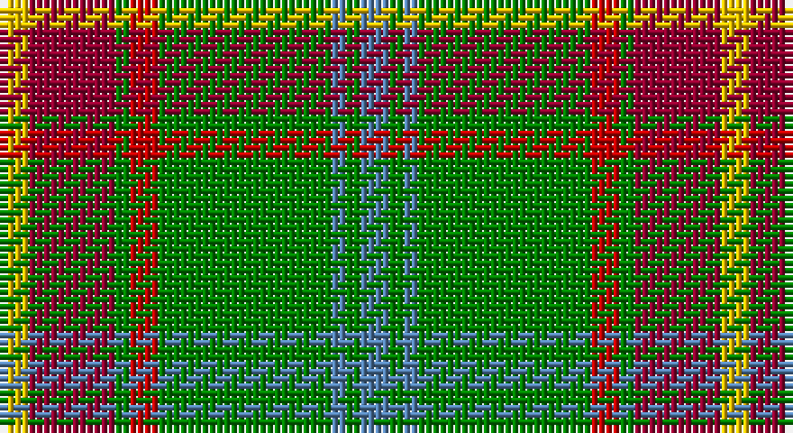

This page is one **sett** — a single exact thread-count. It belongs to the [tartan](/setts/t2g1t1g12r2g1ri6ly2/)
(the same proportion at any scale), whose colour order is pattern [BGBGRGRY](/stripes/bgbgrgry/).

Sourced from weddslist.  It is a [8 stripe tartan](/stripes/stripes8/).

Original link http://www.weddslist.com/cgi-bin/tartans/pg.pl?source=sts

## Thread count
Y/4 DR12 G2 R4 G24 B2 G2 B/4

One full sett is **100 threads**.

## Palette

Palette: <strong>custom</strong>
<table><thead><tr><th>Colour</th><th>Threads</th><th>Shade</th><th>Base</th><th>OKLCh</th></tr></thead><tbody><tr><td>Y/</td><td style="text-align:right;font-variant-numeric:tabular-nums">4</td><td><code style="background-color:#F0C000;">#F0C000</code> <small style="color:#888">#F0C000</small></td><td>Y <code style="background-color:#F2BF00;">#F2BF00</code></td><td><small style="color:#888">oklch(82.7% 0.169 90.5)</small></td></tr><tr><td>DR</td><td style="text-align:right;font-variant-numeric:tabular-nums">12</td><td><code style="background-color:#900030;">#900030</code> <small style="color:#888">#900030</small></td><td>R <code style="background-color:#CC0000;">#CC0000</code></td><td><small style="color:#888">oklch(41.6% 0.166 13.6)</small></td></tr><tr><td>G</td><td style="text-align:right;font-variant-numeric:tabular-nums">2</td><td><code style="background-color:#008000;">#008000</code> <small style="color:#888">#008000</small></td><td>G <code style="background-color:#006100;">#006100</code></td><td><small style="color:#888">oklch(52.0% 0.177 142.5)</small></td></tr><tr><td>R</td><td style="text-align:right;font-variant-numeric:tabular-nums">4</td><td><code style="background-color:#C00000;">#C00000</code> <small style="color:#888">#C00000</small></td><td>R <code style="background-color:#CC0000;">#CC0000</code></td><td><small style="color:#888">oklch(50.7% 0.208 29.2)</small></td></tr><tr><td>G</td><td style="text-align:right;font-variant-numeric:tabular-nums">24</td><td><code style="background-color:#008000;">#008000</code> <small style="color:#888">#008000</small></td><td>G <code style="background-color:#006100;">#006100</code></td><td><small style="color:#888">oklch(52.0% 0.177 142.5)</small></td></tr><tr><td>B</td><td style="text-align:right;font-variant-numeric:tabular-nums">2</td><td><code style="background-color:#5480B0;">#5480B0</code> <small style="color:#888">#5480B0</small></td><td>B <code style="background-color:#2A418A;">#2A418A</code></td><td><small style="color:#888">oklch(58.8% 0.089 251.5)</small></td></tr><tr><td>G</td><td style="text-align:right;font-variant-numeric:tabular-nums">2</td><td><code style="background-color:#008000;">#008000</code> <small style="color:#888">#008000</small></td><td>G <code style="background-color:#006100;">#006100</code></td><td><small style="color:#888">oklch(52.0% 0.177 142.5)</small></td></tr><tr><td>B/</td><td style="text-align:right;font-variant-numeric:tabular-nums">4</td><td><code style="background-color:#5480B0;">#5480B0</code> <small style="color:#888">#5480B0</small></td><td>B <code style="background-color:#2A418A;">#2A418A</code></td><td><small style="color:#888">oklch(58.8% 0.089 251.5)</small></td></tr></tbody></table>

# Sample pattern

## Nearest tartans

The nearest existing variants by ΔTartan distance, with this tartan at the top so the swatches line up against it.

ΔTartan

Tartan

Sett

—

<a href="/ttd/edit/#slug=t2g1t1g12r2g1ri6ly2~x2">Manitoba</a> <a class="nn-out" href="/variants/s8/t2g1t1g12r2g1ri6ly2~x2/" title="open its dictionary page">↗</a>

0.51

<a href="/ttd/edit/#slug=t2g1t1g12r2g1m6ly2~x2&amp;base=t2g1t1g12r2g1ri6ly2~x2">Manitoba District Tartan</a> <a class="nn-out" href="/variants/s8/t2g1t1g12r2g1m6ly2~x2/" title="open its dictionary page">↗</a>

0.61

<a href="/ttd/edit/#slug=t2g1t1g12dg2g1m6ly2~x4&amp;base=t2g1t1g12r2g1ri6ly2~x2">Manitoba</a> <a class="nn-out" href="/variants/s8/t2g1t1g12dg2g1m6ly2~x4/" title="open its dictionary page">↗</a>

0.72

<a href="/ttd/edit/#slug=t2g1t1g12dg2g1r6ly2~x4&amp;base=t2g1t1g12r2g1ri6ly2~x2">Manitoba District Tartan</a> <a class="nn-out" href="/variants/s8/t2g1t1g12dg2g1r6ly2~x4/" title="open its dictionary page">↗</a>

0.89

<a href="/ttd/edit/#slug=w6g5r5g45k4lo24k4g5~x2&amp;base=t2g1t1g12r2g1ri6ly2~x2">O'Neill (Name)</a> <a class="nn-out" href="/variants/s8/w6g5r5g45k4lo24k4g5~x2/" title="open its dictionary page">↗</a>

0.94

<a href="/ttd/edit/#slug=t2dg1t1dg12r2dg1ri6ly2~x2&amp;base=t2g1t1g12r2g1ri6ly2~x2">Manitoba Red</a> <a class="nn-out" href="/variants/s8/t2dg1t1dg12r2dg1ri6ly2~x2/" title="open its dictionary page">↗</a>

0.99

<a href="/ttd/edit/#slug=r2lo24r2lo3r2g24k8ly2~x2&amp;base=t2g1t1g12r2g1ri6ly2~x2">Botherston (Name)</a> <a class="nn-out" href="/variants/s8/r2lo24r2lo3r2g24k8ly2~x2/" title="open its dictionary page">↗</a>

1.09

<a href="/ttd/edit/#slug=w6g5r5g45k4o24k4g5~x2&amp;base=t2g1t1g12r2g1ri6ly2~x2">O'Neill</a> <a class="nn-out" href="/variants/s8/w6g5r5g45k4o24k4g5~x2/" title="open its dictionary page">↗</a>

1.09

<a href="/ttd/edit/#slug=r1o1dg6o15dy2o1dy6w1~x4&amp;base=t2g1t1g12r2g1ri6ly2~x2">Connacht #2</a> <a class="nn-out" href="/variants/s8/r1o1dg6o15dy2o1dy6w1~x4/" title="open its dictionary page">↗</a>

1.13

<a href="/ttd/edit/#slug=ly5g14dy4db4dy27g3dy4ly5~x2&amp;base=t2g1t1g12r2g1ri6ly2~x2">Invertere (Daks #2) (Fashion)</a> <a class="nn-out" href="/variants/s8/ly5g14dy4db4dy27g3dy4ly5~x2/" title="open its dictionary page">↗</a>

1.15

<a href="/ttd/edit/#slug=t6g2t2g41dg6g2r21ly6&amp;base=t2g1t1g12r2g1ri6ly2~x2">Manitoba</a> <a class="nn-out" href="/variants/s8/t6g2t2g41dg6g2r21ly6/" title="open its dictionary page">↗</a>

## Neighbour map

Every grey dot is one of 14360 variants placed by the first two principal components of the ΔTartan feature space (44% of its variance). Red is this tartan; blue dots are its nearest — click one to open its page.

<svg viewBox="0 0 640 380" role="img" style="max-width:100%;height:auto;border:1px solid #e0e0e0;border-radius:4px;display:block" xmlns="http://www.w3.org/2000/svg"><image href="/nn/cloud.v1.png" width="640" height="380"/><a href="/variants/s8/t2g1t1g12r2g1m6ly2~x2/"><circle cx="273.7" cy="163.8" r="4" fill="#3465a4"><title>Manitoba District Tartan</title></circle></a><a href="/variants/s8/t2g1t1g12dg2g1m6ly2~x4/"><circle cx="266.8" cy="167.6" r="4" fill="#3465a4"><title>Manitoba</title></circle></a><a href="/variants/s8/t2g1t1g12dg2g1r6ly2~x4/"><circle cx="280.1" cy="173.4" r="4" fill="#3465a4"><title>Manitoba District Tartan</title></circle></a><a href="/variants/s8/w6g5r5g45k4lo24k4g5~x2/"><circle cx="299.0" cy="167.7" r="4" fill="#3465a4"><title>O'Neill (Name)</title></circle></a><a href="/variants/s8/t2dg1t1dg12r2dg1ri6ly2~x2/"><circle cx="273.5" cy="164.5" r="4" fill="#3465a4"><title>Manitoba Red</title></circle></a><a href="/variants/s8/r2lo24r2lo3r2g24k8ly2~x2/"><circle cx="226.4" cy="162.5" r="4" fill="#3465a4"><title>Botherston (Name)</title></circle></a><a href="/variants/s8/w6g5r5g45k4o24k4g5~x2/"><circle cx="282.8" cy="159.7" r="4" fill="#3465a4"><title>O'Neill</title></circle></a><a href="/variants/s8/r1o1dg6o15dy2o1dy6w1~x4/"><circle cx="283.6" cy="143.8" r="4" fill="#3465a4"><title>Connacht #2</title></circle></a><a href="/variants/s8/ly5g14dy4db4dy27g3dy4ly5~x2/"><circle cx="277.8" cy="195.0" r="4" fill="#3465a4"><title>Invertere (Daks #2) (Fashion)</title></circle></a><a href="/variants/s8/t6g2t2g41dg6g2r21ly6/"><circle cx="288.2" cy="127.6" r="4" fill="#3465a4"><title>Manitoba</title></circle></a><circle cx="268.2" cy="162.1" r="5" fill="#c00000"/></svg>

ID: /variants/s8/t2g1t1g12r2g1ri6ly2~x2/
