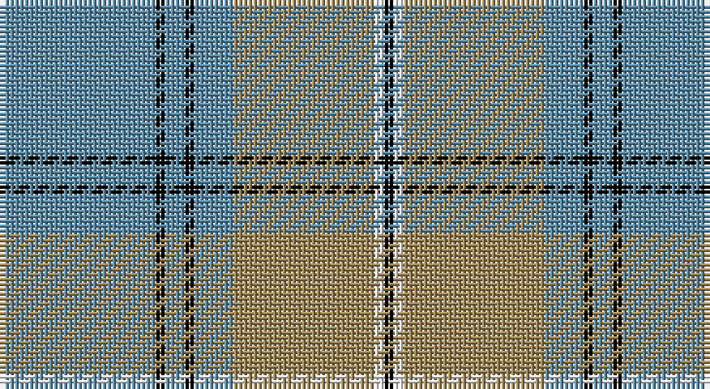

This page is one **sett** — a single exact thread-count. It belongs to the [tartan](/setts/t32k2t4k2t8lo29w2k2/)
(the same proportion at any scale), whose colour order is pattern [BKBKBYWK](/stripes/bkbkbywk/).

Sourced from register-of-tartans.  It is a [8 stripe tartan](/stripes/stripes8/).

Original link https://www.tartanregister.gov.uk/tartanDetails.aspx?ref=11624

## Register references

External register numbers recorded for this tartan.

- Scottish Register of Tartans: [11624](https://www.tartanregister.gov.uk/tartanDetails.aspx?ref=11624)

## Thread count
B/32 K2 B4 K2 B8 LT29 W2 K/2

One full sett is **128 threads**.

## Palette

Palette: <strong>Tartan Register</strong>
<table><thead><tr><th>Colour</th><th>Threads</th><th>Shade</th><th>Base</th><th>OKLCh</th></tr></thead><tbody><tr><td>B/</td><td style="text-align:right;font-variant-numeric:tabular-nums">32</td><td><code style="background-color:#5C8CA8;">#5C8CA8</code> <small style="color:#888">#5C8CA8</small></td><td>B <code style="background-color:#2A418A;">#2A418A</code></td><td><small style="color:#888">oklch(61.7% 0.067 235.0)</small></td></tr><tr><td>K</td><td style="text-align:right;font-variant-numeric:tabular-nums">2</td><td><code style="background-color:#000000;">#000000</code> <small style="color:#888">#000000</small></td><td>K <code style="background-color:#000000;">#000000</code></td><td><small style="color:#888">oklch(0.0% 0.000 0.0)</small></td></tr><tr><td>B</td><td style="text-align:right;font-variant-numeric:tabular-nums">4</td><td><code style="background-color:#5C8CA8;">#5C8CA8</code> <small style="color:#888">#5C8CA8</small></td><td>B <code style="background-color:#2A418A;">#2A418A</code></td><td><small style="color:#888">oklch(61.7% 0.067 235.0)</small></td></tr><tr><td>K</td><td style="text-align:right;font-variant-numeric:tabular-nums">2</td><td><code style="background-color:#000000;">#000000</code> <small style="color:#888">#000000</small></td><td>K <code style="background-color:#000000;">#000000</code></td><td><small style="color:#888">oklch(0.0% 0.000 0.0)</small></td></tr><tr><td>B</td><td style="text-align:right;font-variant-numeric:tabular-nums">8</td><td><code style="background-color:#5C8CA8;">#5C8CA8</code> <small style="color:#888">#5C8CA8</small></td><td>B <code style="background-color:#2A418A;">#2A418A</code></td><td><small style="color:#888">oklch(61.7% 0.067 235.0)</small></td></tr><tr><td>LT</td><td style="text-align:right;font-variant-numeric:tabular-nums">29</td><td><code style="background-color:#A08858;">#A08858</code> <small style="color:#888">#A08858</small></td><td>Y <code style="background-color:#F2BF00;">#F2BF00</code></td><td><small style="color:#888">oklch(63.7% 0.071 84.0)</small></td></tr><tr><td>W</td><td style="text-align:right;font-variant-numeric:tabular-nums">2</td><td><code style="background-color:#F8F8F8;">#F8F8F8</code> <small style="color:#888">#F8F8F8</small></td><td>W <code style="background-color:#F7F7F7;">#F7F7F7</code></td><td><small style="color:#888">oklch(97.9% 0.000 89.9)</small></td></tr><tr><td>K/</td><td style="text-align:right;font-variant-numeric:tabular-nums">2</td><td><code style="background-color:#000000;">#000000</code> <small style="color:#888">#000000</small></td><td>K <code style="background-color:#000000;">#000000</code></td><td><small style="color:#888">oklch(0.0% 0.000 0.0)</small></td></tr></tbody></table>

# Sample pattern

## Nearest tartans

The nearest existing variants by ΔTartan distance, with this tartan at the top so the swatches line up against it.

ΔTartan

Tartan

Sett

—

<a href="/ttd/edit/#slug=t32k2t4k2t8lo29w2k2">Southern Lakes</a> <a class="nn-out" href="/variants/s8/t32k2t4k2t8lo29w2k2/" title="open its dictionary page">↗</a>

0.76

<a href="/ttd/edit/#slug=o10t11k2t3k2t2k8o40w4~x2&amp;base=t32k2t4k2t8lo29w2k2">Doune (District)</a> <a class="nn-out" href="/variants/s9/o10t11k2t3k2t2k8o40w4~x2/" title="open its dictionary page">↗</a>

0.99

<a href="/ttd/edit/#slug=o8ly4o35db2t8db2o4db21o4~x2&amp;base=t32k2t4k2t8lo29w2k2">Bedford Academy (Corporate)</a> <a class="nn-out" href="/variants/s9/o8ly4o35db2t8db2o4db21o4~x2/" title="open its dictionary page">↗</a>

1.02

<a href="/variants/s9/o10t11ki2t3ki2t2ki8o40k4~x2/">Doune District Tartan</a>

1.37

<a href="/ttd/edit/#slug=r2b4lb18n2lb2n41w2~x2&amp;base=t32k2t4k2t8lo29w2k2">Haddrell (2013)</a> <a class="nn-out" href="/variants/s7/r2b4lb18n2lb2n41w2~x2/" title="open its dictionary page">↗</a>

1.37

<a href="/ttd/edit/#slug=k10t30g3t3g3t3r6~x2&amp;base=t32k2t4k2t8lo29w2k2">Kinding (Personal)</a> <a class="nn-out" href="/variants/s7/k10t30g3t3g3t3r6~x2/" title="open its dictionary page">↗</a>

1.37

<a href="/ttd/edit/#slug=b6k3b37ly41w3ly6w3~x2&amp;base=t32k2t4k2t8lo29w2k2">Tilburg Hunting (District)</a> <a class="nn-out" href="/variants/s7/b6k3b37ly41w3ly6w3~x2/" title="open its dictionary page">↗</a>

1.38

<a href="/ttd/edit/#slug=y19k2w2k2n5k2n5~x4&amp;base=t32k2t4k2t8lo29w2k2">Kyle</a> <a class="nn-out" href="/variants/s7/y19k2w2k2n5k2n5~x4/" title="open its dictionary page">↗</a>

1.40

<a href="/ttd/edit/#slug=k2w1g5r1t18r2~x2&amp;base=t32k2t4k2t8lo29w2k2">Norris (1998) (Name)</a> <a class="nn-out" href="/variants/s6/k2w1g5r1t18r2~x2/" title="open its dictionary page">↗</a>

1.45

<a href="/ttd/edit/#slug=lo72dt16w9dt4w5dt16~x2&amp;base=t32k2t4k2t8lo29w2k2">Machair</a> <a class="nn-out" href="/variants/s6/lo72dt16w9dt4w5dt16~x2/" title="open its dictionary page">↗</a>

1.48

<a href="/ttd/edit/#slug=lb3k3lb3k3o15r1~x4&amp;base=t32k2t4k2t8lo29w2k2">Tiree Grey</a> <a class="nn-out" href="/variants/s6/lb3k3lb3k3o15r1~x4/" title="open its dictionary page">↗</a>

## Neighbour map

Every grey dot is one of 14360 variants placed by the first two principal components of the ΔTartan feature space (44% of its variance). Red is this tartan; blue dots are its nearest — click one to open its page.

<svg viewBox="0 0 640 380" role="img" style="max-width:100%;height:auto;border:1px solid #e0e0e0;border-radius:4px;display:block" xmlns="http://www.w3.org/2000/svg"><image href="/nn/cloud.v1.png" width="640" height="380"/><a href="/variants/s9/o10t11k2t3k2t2k8o40w4~x2/"><circle cx="374.5" cy="145.4" r="4" fill="#3465a4"><title>Doune (District)</title></circle></a><a href="/variants/s9/o8ly4o35db2t8db2o4db21o4~x2/"><circle cx="357.0" cy="166.0" r="4" fill="#3465a4"><title>Bedford Academy (Corporate)</title></circle></a><a href="/variants/s9/o10t11ki2t3ki2t2ki8o40k4~x2/"><circle cx="366.2" cy="143.0" r="4" fill="#3465a4"><title>Doune District Tartan</title></circle></a><a href="/variants/s7/r2b4lb18n2lb2n41w2~x2/"><circle cx="380.4" cy="134.1" r="4" fill="#3465a4"><title>Haddrell (2013)</title></circle></a><a href="/variants/s7/k10t30g3t3g3t3r6~x2/"><circle cx="339.2" cy="186.0" r="4" fill="#3465a4"><title>Kinding (Personal)</title></circle></a><a href="/variants/s7/b6k3b37ly41w3ly6w3~x2/"><circle cx="287.2" cy="161.8" r="4" fill="#3465a4"><title>Tilburg Hunting (District)</title></circle></a><a href="/variants/s7/y19k2w2k2n5k2n5~x4/"><circle cx="292.4" cy="193.3" r="4" fill="#3465a4"><title>Kyle</title></circle></a><a href="/variants/s6/k2w1g5r1t18r2~x2/"><circle cx="367.5" cy="156.5" r="4" fill="#3465a4"><title>Norris (1998) (Name)</title></circle></a><a href="/variants/s6/lo72dt16w9dt4w5dt16~x2/"><circle cx="381.1" cy="179.0" r="4" fill="#3465a4"><title>Machair</title></circle></a><a href="/variants/s6/lb3k3lb3k3o15r1~x4/"><circle cx="290.6" cy="171.5" r="4" fill="#3465a4"><title>Tiree Grey</title></circle></a><circle cx="342.0" cy="164.3" r="5" fill="#c00000"/></svg>

ID: /variants/s8/t32k2t4k2t8lo29w2k2/
