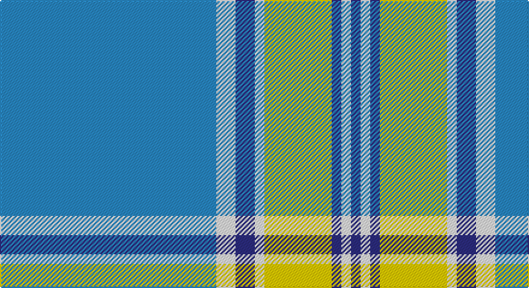

This page is one **sett** — a single exact thread-count. It belongs to the [tartan](/setts/t45w4db4w2ly14db2w2db2/)
(the same proportion at any scale), whose colour order is pattern [BWBWYBWB](/stripes/bwbwybwb/).

Sourced from tartans-authority.  It is a [8 stripe tartan](/stripes/stripes8/).

Original link http://www.tartansauthority.com/tartan-ferret/display/8600/

## Register references

External register numbers recorded for this tartan.

- Scottish Tartans Authority (ITI): 8600

## Thread count
B/180 W16 DB16 W8 Y56 DB8 W8 DB/8

One full sett is **412 threads**.

## Palette

Palette: <strong>Tartan Register</strong>
<table><thead><tr><th>Colour</th><th>Threads</th><th>Shade</th><th>Base</th><th>OKLCh</th></tr></thead><tbody><tr><td>B/</td><td style="text-align:right;font-variant-numeric:tabular-nums">180</td><td><code style="background-color:#2888C4;">#2888C4</code> <small style="color:#888">#2888C4</small></td><td>B <code style="background-color:#2A418A;">#2A418A</code></td><td><small style="color:#888">oklch(60.1% 0.125 241.5)</small></td></tr><tr><td>W</td><td style="text-align:right;font-variant-numeric:tabular-nums">16</td><td><code style="background-color:#FCFCFC;">#FCFCFC</code> <small style="color:#888">#FCFCFC</small></td><td>W <code style="background-color:#F7F7F7;">#F7F7F7</code></td><td><small style="color:#888">oklch(99.1% 0.000 89.9)</small></td></tr><tr><td>DB</td><td style="text-align:right;font-variant-numeric:tabular-nums">16</td><td><code style="background-color:#2C2C80;">#2C2C80</code> <small style="color:#888">#2C2C80</small></td><td>B <code style="background-color:#2A418A;">#2A418A</code></td><td><small style="color:#888">oklch(35.0% 0.138 276.6)</small></td></tr><tr><td>W</td><td style="text-align:right;font-variant-numeric:tabular-nums">8</td><td><code style="background-color:#FCFCFC;">#FCFCFC</code> <small style="color:#888">#FCFCFC</small></td><td>W <code style="background-color:#F7F7F7;">#F7F7F7</code></td><td><small style="color:#888">oklch(99.1% 0.000 89.9)</small></td></tr><tr><td>Y</td><td style="text-align:right;font-variant-numeric:tabular-nums">56</td><td><code style="background-color:#FCCC00;">#FCCC00</code> <small style="color:#888">#FCCC00</small></td><td>Y <code style="background-color:#F2BF00;">#F2BF00</code></td><td><small style="color:#888">oklch(86.2% 0.176 91.5)</small></td></tr><tr><td>DB</td><td style="text-align:right;font-variant-numeric:tabular-nums">8</td><td><code style="background-color:#2C2C80;">#2C2C80</code> <small style="color:#888">#2C2C80</small></td><td>B <code style="background-color:#2A418A;">#2A418A</code></td><td><small style="color:#888">oklch(35.0% 0.138 276.6)</small></td></tr><tr><td>W</td><td style="text-align:right;font-variant-numeric:tabular-nums">8</td><td><code style="background-color:#FCFCFC;">#FCFCFC</code> <small style="color:#888">#FCFCFC</small></td><td>W <code style="background-color:#F7F7F7;">#F7F7F7</code></td><td><small style="color:#888">oklch(99.1% 0.000 89.9)</small></td></tr><tr><td>DB/</td><td style="text-align:right;font-variant-numeric:tabular-nums">8</td><td><code style="background-color:#2C2C80;">#2C2C80</code> <small style="color:#888">#2C2C80</small></td><td>B <code style="background-color:#2A418A;">#2A418A</code></td><td><small style="color:#888">oklch(35.0% 0.138 276.6)</small></td></tr></tbody></table>

# Sample pattern

## Nearest tartans

The nearest existing variants by ΔTartan distance, with this tartan at the top so the swatches line up against it.

ΔTartan

Tartan

Sett

—

<a href="/ttd/edit/#slug=t45w4db4w2ly14db2w2db2~x4">Madras 1 (Fashion)</a> <a class="nn-out" href="/variants/s8/t45w4db4w2ly14db2w2db2~x4/" title="open its dictionary page">↗</a>

1.21

<a href="/ttd/edit/#slug=t42k2w2k2t5n12w32t4~x2&amp;base=t45w4db4w2ly14db2w2db2~x4">Longniddry, dress (Turquoise)</a> <a class="nn-out" href="/variants/s8/t42k2w2k2t5n12w32t4~x2/" title="open its dictionary page">↗</a>

1.26

<a href="/ttd/edit/#slug=b45ly6b3ly6b3w3db5w3db5w20b2w3~x2&amp;base=t45w4db4w2ly14db2w2db2~x4">Dunn (Scotland) (Name)</a> <a class="nn-out" href="/variants/s12/b45ly6b3ly6b3w3db5w3db5w20b2w3~x2/" title="open its dictionary page">↗</a>

1.26

<a href="/ttd/edit/#slug=lo15k2lo3k2b50k2lo3k2w10k4~x2&amp;base=t45w4db4w2ly14db2w2db2~x4">D.E.B.S. (Fashion)</a> <a class="nn-out" href="/variants/s10/lo15k2lo3k2b50k2lo3k2w10k4~x2/" title="open its dictionary page">↗</a>

1.30

<a href="/ttd/edit/#slug=b120g9r7ly12g33ly33b26&amp;base=t45w4db4w2ly14db2w2db2~x4">Supporter.com</a> <a class="nn-out" href="/variants/s7/b120g9r7ly12g33ly33b26/" title="open its dictionary page">↗</a>

1.38

<a href="/ttd/edit/#slug=n3b2w10b2n6b26k2~x2&amp;base=t45w4db4w2ly14db2w2db2~x4">MacLintock #2</a> <a class="nn-out" href="/variants/s7/n3b2w10b2n6b26k2~x2/" title="open its dictionary page">↗</a>

1.41

<a href="/ttd/edit/#slug=db9lb27db2ly4db2lb10db2w3~x2&amp;base=t45w4db4w2ly14db2w2db2~x4">Alaska Highlanders P &amp; D (Corporate)</a> <a class="nn-out" href="/variants/s8/db9lb27db2ly4db2lb10db2w3~x2/" title="open its dictionary page">↗</a>

1.46

<a href="/ttd/edit/#slug=t42db10lo2db2lb2db2t10lb6db2lb3t2~x2&amp;base=t45w4db4w2ly14db2w2db2~x4">Goil Dress</a> <a class="nn-out" href="/variants/s11/t42db10lo2db2lb2db2t10lb6db2lb3t2~x2/" title="open its dictionary page">↗</a>

1.54

<a href="/ttd/edit/#slug=b4r2b40k11g2w16r2~x2&amp;base=t45w4db4w2ly14db2w2db2~x4">Jack Sinclair (Personal)</a> <a class="nn-out" href="/variants/s7/b4r2b40k11g2w16r2~x2/" title="open its dictionary page">↗</a>

1.54

<a href="/ttd/edit/#slug=dt3n2w2n30w30r2w3~x2&amp;base=t45w4db4w2ly14db2w2db2~x4">Torridon, Royal Blue (Dance)</a> <a class="nn-out" href="/variants/s7/dt3n2w2n30w30r2w3~x2/" title="open its dictionary page">↗</a>

1.56

<a href="/ttd/edit/#slug=lb98n12k16w5k5w5k5n28lb16k5lb16w6&amp;base=t45w4db4w2ly14db2w2db2~x4">Glen Moy Tartan</a> <a class="nn-out" href="/variants/s12/lb98n12k16w5k5w5k5n28lb16k5lb16w6/" title="open its dictionary page">↗</a>

## Neighbour map

Every grey dot is one of 14360 variants placed by the first two principal components of the ΔTartan feature space (44% of its variance). Red is this tartan; blue dots are its nearest — click one to open its page.

<svg viewBox="0 0 640 380" role="img" style="max-width:100%;height:auto;border:1px solid #e0e0e0;border-radius:4px;display:block" xmlns="http://www.w3.org/2000/svg"><image href="/nn/cloud.v1.png" width="640" height="380"/><a href="/variants/s8/t42k2w2k2t5n12w32t4~x2/"><circle cx="296.5" cy="138.3" r="4" fill="#3465a4"><title>Longniddry, dress (Turquoise)</title></circle></a><a href="/variants/s12/b45ly6b3ly6b3w3db5w3db5w20b2w3~x2/"><circle cx="285.9" cy="104.8" r="4" fill="#3465a4"><title>Dunn (Scotland) (Name)</title></circle></a><a href="/variants/s10/lo15k2lo3k2b50k2lo3k2w10k4~x2/"><circle cx="320.5" cy="108.2" r="4" fill="#3465a4"><title>D.E.B.S. (Fashion)</title></circle></a><a href="/variants/s7/b120g9r7ly12g33ly33b26/"><circle cx="340.2" cy="166.3" r="4" fill="#3465a4"><title>Supporter.com</title></circle></a><a href="/variants/s7/n3b2w10b2n6b26k2~x2/"><circle cx="315.1" cy="170.1" r="4" fill="#3465a4"><title>MacLintock #2</title></circle></a><a href="/variants/s8/db9lb27db2ly4db2lb10db2w3~x2/"><circle cx="332.5" cy="153.9" r="4" fill="#3465a4"><title>Alaska Highlanders P &amp; D (Corporate)</title></circle></a><a href="/variants/s11/t42db10lo2db2lb2db2t10lb6db2lb3t2~x2/"><circle cx="409.6" cy="124.1" r="4" fill="#3465a4"><title>Goil Dress</title></circle></a><a href="/variants/s7/b4r2b40k11g2w16r2~x2/"><circle cx="286.2" cy="119.9" r="4" fill="#3465a4"><title>Jack Sinclair (Personal)</title></circle></a><a href="/variants/s7/dt3n2w2n30w30r2w3~x2/"><circle cx="284.2" cy="142.4" r="4" fill="#3465a4"><title>Torridon, Royal Blue (Dance)</title></circle></a><a href="/variants/s12/lb98n12k16w5k5w5k5n28lb16k5lb16w6/"><circle cx="329.8" cy="101.6" r="4" fill="#3465a4"><title>Glen Moy Tartan</title></circle></a><circle cx="352.4" cy="119.4" r="5" fill="#c00000"/></svg>

ID: /variants/s8/t45w4db4w2ly14db2w2db2~x4/
