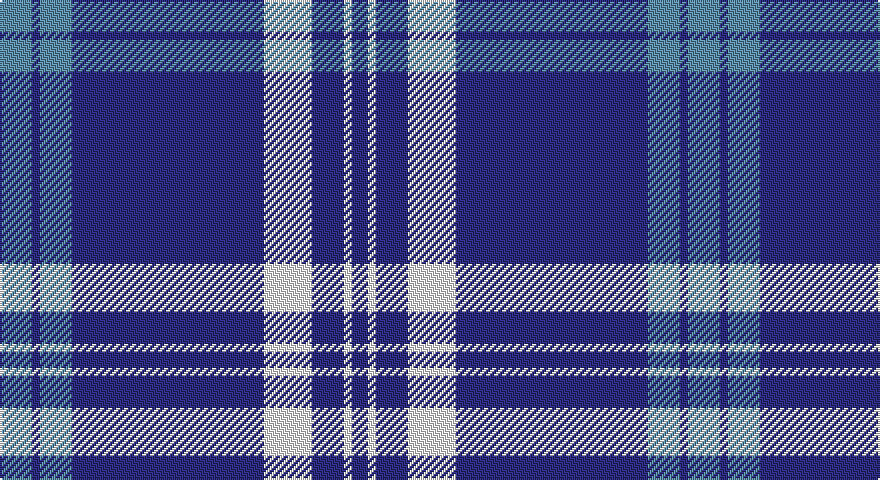

This page is one **sett** — a single exact thread-count. It belongs to the [tartan](/setts/t4db1t4db24w6db4w1db2/)
(the same proportion at any scale), whose colour order is pattern [BBBBWBWB](/stripes/bbbbwbwb/).

Part of the [Antigonish](/tartans/antigonish/) tartan — the named design grouping this sett with its other cloths.

Sourced from register-of-tartans.  It is a [8 stripe tartan](/stripes/stripes8/).

Original link https://www.tartanregister.gov.uk/tartanDetails.aspx?ref=95

## Also known as

This cloth is also recorded under:

- Antigonish Centennial

## Register references

External register numbers recorded for this tartan.

- Scottish Register of Tartans: [95](https://www.tartanregister.gov.uk/tartanDetails.aspx?ref=95)
- Scottish Tartans Authority (ITI): 3870
- Scottish Tartans World Register: 2790

## Thread count
B/16 DB4 B16 DB96 W24 DB16 W4 DB/8

One full sett is **344 threads**.

## Palette

Palette: <strong>Tartan Register</strong>
<table><thead><tr><th>Colour</th><th>Threads</th><th>Shade</th><th>Base</th><th>OKLCh</th></tr></thead><tbody><tr><td>B/</td><td style="text-align:right;font-variant-numeric:tabular-nums">16</td><td><code style="background-color:#5C8CA8;">#5C8CA8</code> <small style="color:#888">#5C8CA8</small></td><td>B <code style="background-color:#2A418A;">#2A418A</code></td><td><small style="color:#888">oklch(61.7% 0.067 235.0)</small></td></tr><tr><td>DB</td><td style="text-align:right;font-variant-numeric:tabular-nums">4</td><td><code style="background-color:#2C2C80;">#2C2C80</code> <small style="color:#888">#2C2C80</small></td><td>B <code style="background-color:#2A418A;">#2A418A</code></td><td><small style="color:#888">oklch(35.0% 0.138 276.6)</small></td></tr><tr><td>B</td><td style="text-align:right;font-variant-numeric:tabular-nums">16</td><td><code style="background-color:#5C8CA8;">#5C8CA8</code> <small style="color:#888">#5C8CA8</small></td><td>B <code style="background-color:#2A418A;">#2A418A</code></td><td><small style="color:#888">oklch(61.7% 0.067 235.0)</small></td></tr><tr><td>DB</td><td style="text-align:right;font-variant-numeric:tabular-nums">96</td><td><code style="background-color:#2C2C80;">#2C2C80</code> <small style="color:#888">#2C2C80</small></td><td>B <code style="background-color:#2A418A;">#2A418A</code></td><td><small style="color:#888">oklch(35.0% 0.138 276.6)</small></td></tr><tr><td>W</td><td style="text-align:right;font-variant-numeric:tabular-nums">24</td><td><code style="background-color:#FCFCFC;">#FCFCFC</code> <small style="color:#888">#FCFCFC</small></td><td>W <code style="background-color:#F7F7F7;">#F7F7F7</code></td><td><small style="color:#888">oklch(99.1% 0.000 89.9)</small></td></tr><tr><td>DB</td><td style="text-align:right;font-variant-numeric:tabular-nums">16</td><td><code style="background-color:#2C2C80;">#2C2C80</code> <small style="color:#888">#2C2C80</small></td><td>B <code style="background-color:#2A418A;">#2A418A</code></td><td><small style="color:#888">oklch(35.0% 0.138 276.6)</small></td></tr><tr><td>W</td><td style="text-align:right;font-variant-numeric:tabular-nums">4</td><td><code style="background-color:#FCFCFC;">#FCFCFC</code> <small style="color:#888">#FCFCFC</small></td><td>W <code style="background-color:#F7F7F7;">#F7F7F7</code></td><td><small style="color:#888">oklch(99.1% 0.000 89.9)</small></td></tr><tr><td>DB/</td><td style="text-align:right;font-variant-numeric:tabular-nums">8</td><td><code style="background-color:#2C2C80;">#2C2C80</code> <small style="color:#888">#2C2C80</small></td><td>B <code style="background-color:#2A418A;">#2A418A</code></td><td><small style="color:#888">oklch(35.0% 0.138 276.6)</small></td></tr></tbody></table>

# Sample pattern

## Compared to the master

This cloth is one sett of its design; the master sett (the exemplar the design is anchored on) is below for comparison.

<figure style="margin:0"><figcaption style="color:#888;font-size:smaller">this sett</figcaption></figure>
<figure style="margin:0"><figcaption style="color:#888;font-size:smaller"><a href="/setts/k4lb2db5lb7db9g14o4g1o4/">master sett →</a></figcaption></figure>

## Nearest tartans

The nearest existing variants by ΔTartan distance, with this tartan at the top so the swatches line up against it.

ΔTartan

Tartan

Sett

—

<a href="/ttd/edit/#slug=t4db1t4db24w6db4w1db2~x4">Antigonish</a> <a class="nn-out" href="/variants/s8/t4db1t4db24w6db4w1db2~x4/" title="open its dictionary page">↗</a>

1.21

<a href="/ttd/edit/#slug=db96ly11db8ly11db16ly6w4ly16w8&amp;base=t4db1t4db24w6db4w1db2~x4">University of North Carolina at Greensboro, The</a> <a class="nn-out" href="/variants/s9/db96ly11db8ly11db16ly6w4ly16w8/" title="open its dictionary page">↗</a>

1.22

<a href="/ttd/edit/#slug=db28dr3w1dr3db4w2dp1w5~x4&amp;base=t4db1t4db24w6db4w1db2~x4">Baker Family Tartan</a> <a class="nn-out" href="/variants/s8/db28dr3w1dr3db4w2dp1w5~x4/" title="open its dictionary page">↗</a>

1.23

<a href="/ttd/edit/#slug=db28ly3w1ly3db4w2r1w5~x4&amp;base=t4db1t4db24w6db4w1db2~x4">Baker Dress Family Tartan</a> <a class="nn-out" href="/variants/s8/db28ly3w1ly3db4w2r1w5~x4/" title="open its dictionary page">↗</a>

1.27

<a href="/ttd/edit/#slug=db40r1lr4r2db8lr24~x2&amp;base=t4db1t4db24w6db4w1db2~x4">Loevenstein Castle #3</a> <a class="nn-out" href="/variants/s6/db40r1lr4r2db8lr24~x2/" title="open its dictionary page">↗</a>

1.33

<a href="/ttd/edit/#slug=db28o3w1o3db4w2p1w5~x4&amp;base=t4db1t4db24w6db4w1db2~x4">Baker</a> <a class="nn-out" href="/variants/s8/db28o3w1o3db4w2p1w5~x4/" title="open its dictionary page">↗</a>

1.35

<a href="/ttd/edit/#slug=db5w12db4w4db4w3db37w3db3r4~x2&amp;base=t4db1t4db24w6db4w1db2~x4">Unidentified #26</a> <a class="nn-out" href="/variants/s10/db5w12db4w4db4w3db37w3db3r4~x2/" title="open its dictionary page">↗</a>

1.37

<a href="/ttd/edit/#slug=w6db2w3db2g2db20r1~x2&amp;base=t4db1t4db24w6db4w1db2~x4">Gonzaga University’s True Blue and White</a> <a class="nn-out" href="/variants/s7/w6db2w3db2g2db20r1~x2/" title="open its dictionary page">↗</a>

1.37

<a href="/ttd/edit/#slug=db8r2db18r1db2w10db4~x2&amp;base=t4db1t4db24w6db4w1db2~x4">Nike ACG Lunarstorm (Fashion)</a> <a class="nn-out" href="/variants/s7/db8r2db18r1db2w10db4~x2/" title="open its dictionary page">↗</a>

1.40

<a href="/ttd/edit/#slug=db5k1lb2k1w6k1lb2db25lb2~x2&amp;base=t4db1t4db24w6db4w1db2~x4">Christopher Newport University</a> <a class="nn-out" href="/variants/s9/db5k1lb2k1w6k1lb2db25lb2~x2/" title="open its dictionary page">↗</a>

1.40

<a href="/ttd/edit/#slug=db28o3w1o3db4w2dp1w5~x4&amp;base=t4db1t4db24w6db4w1db2~x4">Baker</a> <a class="nn-out" href="/variants/s8/db28o3w1o3db4w2dp1w5~x4/" title="open its dictionary page">↗</a>

## Neighbour map

Every grey dot is one of 14360 variants placed by the first two principal components of the ΔTartan feature space (44% of its variance). Red is this tartan; blue dots are its nearest — click one to open its page.

<svg viewBox="0 0 640 380" role="img" style="max-width:100%;height:auto;border:1px solid #e0e0e0;border-radius:4px;display:block" xmlns="http://www.w3.org/2000/svg"><image href="/nn/cloud.v1.png" width="640" height="380"/><a href="/variants/s9/db96ly11db8ly11db16ly6w4ly16w8/"><circle cx="424.4" cy="130.2" r="4" fill="#3465a4"><title>University of North Carolina at Greensboro, The</title></circle></a><a href="/variants/s8/db28dr3w1dr3db4w2dp1w5~x4/"><circle cx="427.3" cy="122.7" r="4" fill="#3465a4"><title>Baker Family Tartan</title></circle></a><a href="/variants/s8/db28ly3w1ly3db4w2r1w5~x4/"><circle cx="411.7" cy="112.9" r="4" fill="#3465a4"><title>Baker Dress Family Tartan</title></circle></a><a href="/variants/s6/db40r1lr4r2db8lr24~x2/"><circle cx="403.1" cy="156.9" r="4" fill="#3465a4"><title>Loevenstein Castle #3</title></circle></a><a href="/variants/s8/db28o3w1o3db4w2p1w5~x4/"><circle cx="434.7" cy="125.4" r="4" fill="#3465a4"><title>Baker</title></circle></a><a href="/variants/s10/db5w12db4w4db4w3db37w3db3r4~x2/"><circle cx="393.8" cy="158.3" r="4" fill="#3465a4"><title>Unidentified #26</title></circle></a><a href="/variants/s7/w6db2w3db2g2db20r1~x2/"><circle cx="376.0" cy="139.3" r="4" fill="#3465a4"><title>Gonzaga University’s True Blue and White</title></circle></a><a href="/variants/s7/db8r2db18r1db2w10db4~x2/"><circle cx="408.2" cy="184.3" r="4" fill="#3465a4"><title>Nike ACG Lunarstorm (Fashion)</title></circle></a><a href="/variants/s9/db5k1lb2k1w6k1lb2db25lb2~x2/"><circle cx="381.3" cy="116.4" r="4" fill="#3465a4"><title>Christopher Newport University</title></circle></a><a href="/variants/s8/db28o3w1o3db4w2dp1w5~x4/"><circle cx="413.7" cy="116.1" r="4" fill="#3465a4"><title>Baker</title></circle></a><circle cx="415.8" cy="151.4" r="5" fill="#c00000"/></svg>

ID: /variants/s8/t4db1t4db24w6db4w1db2~x4/
