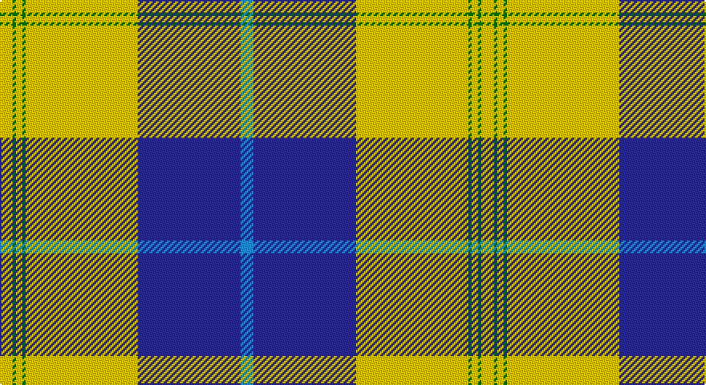

This page is one **sett** — a single exact thread-count. It belongs to the [tartan](/setts/t4db32ly3ly32g1ly2g1ly4/)
(the same proportion at any scale), whose colour order is pattern [BBYYGYGY](/stripes/bbyygygy/).

Part of the [McClurg](/tartans/mcclurg/) tartan — the named design grouping this sett with its other cloths.

Sourced from tartans-authority.  It is a [8 stripe tartan](/stripes/stripes8/).

Original link http://www.tartansauthority.com/tartan-ferret/display/7911/

## Also known as

This cloth is also recorded under:

- McClurg, William Thomas

## Register references

External register numbers recorded for this tartan.

- Scottish Register of Tartans: [7911](https://www.tartanregister.gov.uk/tartanDetails?ref=7911)
- Scottish Tartans Authority (ITI): 7911

## Thread count
Y/8 G2 Ya4 G2 Ya64 Ya6 DB64 B/8

One full sett is **300 threads**.

## Palette

Palette: <strong>Tartan Register</strong>
<table><thead><tr><th>Colour</th><th>Threads</th><th>Shade</th><th>Base</th><th>OKLCh</th></tr></thead><tbody><tr><td>Y/</td><td style="text-align:right;font-variant-numeric:tabular-nums">8</td><td><code style="background-color:#E8C000;">#E8C000</code> <small style="color:#888">#E8C000</small></td><td>Y <code style="background-color:#F2BF00;">#F2BF00</code></td><td><small style="color:#888">oklch(81.9% 0.168 93.7)</small></td></tr><tr><td>G</td><td style="text-align:right;font-variant-numeric:tabular-nums">2</td><td><code style="background-color:#006818;">#006818</code> <small style="color:#888">#006818</small></td><td>G <code style="background-color:#006100;">#006100</code></td><td><small style="color:#888">oklch(45.0% 0.142 145.0)</small></td></tr><tr><td>Ya</td><td style="text-align:right;font-variant-numeric:tabular-nums">4</td><td><code style="background-color:#E8C000;">#E8C000</code> <small style="color:#888">#E8C000</small></td><td>Y <code style="background-color:#F2BF00;">#F2BF00</code></td><td><small style="color:#888">oklch(81.9% 0.168 93.7)</small></td></tr><tr><td>G</td><td style="text-align:right;font-variant-numeric:tabular-nums">2</td><td><code style="background-color:#006818;">#006818</code> <small style="color:#888">#006818</small></td><td>G <code style="background-color:#006100;">#006100</code></td><td><small style="color:#888">oklch(45.0% 0.142 145.0)</small></td></tr><tr><td>Ya</td><td style="text-align:right;font-variant-numeric:tabular-nums">64</td><td><code style="background-color:#E8C000;">#E8C000</code> <small style="color:#888">#E8C000</small></td><td>Y <code style="background-color:#F2BF00;">#F2BF00</code></td><td><small style="color:#888">oklch(81.9% 0.168 93.7)</small></td></tr><tr><td>Ya</td><td style="text-align:right;font-variant-numeric:tabular-nums">6</td><td><code style="background-color:#E8C000;">#E8C000</code> <small style="color:#888">#E8C000</small></td><td>Y <code style="background-color:#F2BF00;">#F2BF00</code></td><td><small style="color:#888">oklch(81.9% 0.168 93.7)</small></td></tr><tr><td>DB</td><td style="text-align:right;font-variant-numeric:tabular-nums">64</td><td><code style="background-color:#2C2C80;">#2C2C80</code> <small style="color:#888">#2C2C80</small></td><td>B <code style="background-color:#2A418A;">#2A418A</code></td><td><small style="color:#888">oklch(35.0% 0.138 276.6)</small></td></tr><tr><td>B/</td><td style="text-align:right;font-variant-numeric:tabular-nums">8</td><td><code style="background-color:#2888C4;">#2888C4</code> <small style="color:#888">#2888C4</small></td><td>B <code style="background-color:#2A418A;">#2A418A</code></td><td><small style="color:#888">oklch(60.1% 0.125 241.5)</small></td></tr></tbody></table>

# Sample pattern

## Compared to the master

This cloth is one sett of its design; the master sett (the exemplar the design is anchored on) is below for comparison.

<figure style="margin:0"><figcaption style="color:#888;font-size:smaller">this sett</figcaption></figure>
<figure style="margin:0"><figcaption style="color:#888;font-size:smaller"><a href="/setts/k4ly1g2ly1g32lt1g3db32lt3/">master sett →</a></figcaption></figure>

## Nearest tartans

The nearest existing variants by ΔTartan distance, with this tartan at the top so the swatches line up against it.

ΔTartan

Tartan

Sett

—

<a href="/ttd/edit/#slug=t4db32ly3ly32g1ly2g1ly4~x2">McClurg (Name)</a> <a class="nn-out" href="/variants/s8/t4db32ly3ly32g1ly2g1ly4~x2/" title="open its dictionary page">↗</a>

1.15

<a href="/ttd/edit/#slug=w50k3gi10g11w1k1r20w3r5~x2&amp;base=t4db32ly3ly32g1ly2g1ly4~x2">Drummond of Perth Dress (Dance)</a> <a class="nn-out" href="/variants/s9/w50k3gi10g11w1k1r20w3r5~x2/" title="open its dictionary page">↗</a>

1.15

<a href="/ttd/edit/#slug=r6dg2w21dg2lo2k8lo2dg32w1k3~x2&amp;base=t4db32ly3ly32g1ly2g1ly4~x2">Fiander, Julian (Personal)</a> <a class="nn-out" href="/variants/s10/r6dg2w21dg2lo2k8lo2dg32w1k3~x2/" title="open its dictionary page">↗</a>

1.17

<a href="/ttd/edit/#slug=k28ly1w2ly1k3w17k5w3db2w10g2~x2&amp;base=t4db32ly3ly32g1ly2g1ly4~x2">Bro-Roazhon</a> <a class="nn-out" href="/variants/s11/k28ly1w2ly1k3w17k5w3db2w10g2~x2/" title="open its dictionary page">↗</a>

1.21

<a href="/ttd/edit/#slug=ly6dg36w5b4w30b1w2~x2&amp;base=t4db32ly3ly32g1ly2g1ly4~x2">Pearce Scotch Plaid 4 (Fashion)</a> <a class="nn-out" href="/variants/s7/ly6dg36w5b4w30b1w2~x2/" title="open its dictionary page">↗</a>

1.22

<a href="/ttd/edit/#slug=w3r2p31g30ly2g2ly1~x2&amp;base=t4db32ly3ly32g1ly2g1ly4~x2">Caig (Personal)</a> <a class="nn-out" href="/variants/s7/w3r2p31g30ly2g2ly1~x2/" title="open its dictionary page">↗</a>

1.22

<a href="/ttd/edit/#slug=k1w31k4g8r1g2dt7r4k1r4w1~x2&amp;base=t4db32ly3ly32g1ly2g1ly4~x2">Hohenzollern</a> <a class="nn-out" href="/variants/s11/k1w31k4g8r1g2dt7r4k1r4w1~x2/" title="open its dictionary page">↗</a>

1.23

<a href="/ttd/edit/#slug=r2w28db4w2k6w2g7r4k1r2w1~x2&amp;base=t4db32ly3ly32g1ly2g1ly4~x2">Rothesay, Duke of</a> <a class="nn-out" href="/variants/s11/r2w28db4w2k6w2g7r4k1r2w1~x2/" title="open its dictionary page">↗</a>

1.26

<a href="/ttd/edit/#slug=r6g2w21ly2k8ly2g32w1k3~x2&amp;base=t4db32ly3ly32g1ly2g1ly4~x2">Fiander, Julian (Personal)</a> <a class="nn-out" href="/variants/s9/r6g2w21ly2k8ly2g32w1k3~x2/" title="open its dictionary page">↗</a>

1.27

<a href="/ttd/edit/#slug=lr60k6lr8k2lr8w2r12k49lo4&amp;base=t4db32ly3ly32g1ly2g1ly4~x2">Motherwell Football Club. Modern</a> <a class="nn-out" href="/variants/s9/lr60k6lr8k2lr8w2r12k49lo4/" title="open its dictionary page">↗</a>

1.28

<a href="/ttd/edit/#slug=lo1n8lb2k15lb20r1lb1r1lb8n3lb1~x2&amp;base=t4db32ly3ly32g1ly2g1ly4~x2">Harris (Personal)</a> <a class="nn-out" href="/variants/s11/lo1n8lb2k15lb20r1lb1r1lb8n3lb1~x2/" title="open its dictionary page">↗</a>

## Neighbour map

Every grey dot is one of 14360 variants placed by the first two principal components of the ΔTartan feature space (44% of its variance). Red is this tartan; blue dots are its nearest — click one to open its page.

<svg viewBox="0 0 640 380" role="img" style="max-width:100%;height:auto;border:1px solid #e0e0e0;border-radius:4px;display:block" xmlns="http://www.w3.org/2000/svg"><image href="/nn/cloud.v1.png" width="640" height="380"/><a href="/variants/s9/w50k3gi10g11w1k1r20w3r5~x2/"><circle cx="288.8" cy="60.6" r="4" fill="#3465a4"><title>Drummond of Perth Dress (Dance)</title></circle></a><a href="/variants/s10/r6dg2w21dg2lo2k8lo2dg32w1k3~x2/"><circle cx="227.7" cy="80.7" r="4" fill="#3465a4"><title>Fiander, Julian (Personal)</title></circle></a><a href="/variants/s11/k28ly1w2ly1k3w17k5w3db2w10g2~x2/"><circle cx="263.2" cy="81.4" r="4" fill="#3465a4"><title>Bro-Roazhon</title></circle></a><a href="/variants/s7/ly6dg36w5b4w30b1w2~x2/"><circle cx="268.8" cy="114.9" r="4" fill="#3465a4"><title>Pearce Scotch Plaid 4 (Fashion)</title></circle></a><a href="/variants/s7/w3r2p31g30ly2g2ly1~x2/"><circle cx="297.8" cy="110.0" r="4" fill="#3465a4"><title>Caig (Personal)</title></circle></a><a href="/variants/s11/k1w31k4g8r1g2dt7r4k1r4w1~x2/"><circle cx="245.4" cy="56.8" r="4" fill="#3465a4"><title>Hohenzollern</title></circle></a><a href="/variants/s11/r2w28db4w2k6w2g7r4k1r2w1~x2/"><circle cx="274.7" cy="63.8" r="4" fill="#3465a4"><title>Rothesay, Duke of</title></circle></a><a href="/variants/s9/r6g2w21ly2k8ly2g32w1k3~x2/"><circle cx="216.3" cy="87.0" r="4" fill="#3465a4"><title>Fiander, Julian (Personal)</title></circle></a><a href="/variants/s9/lr60k6lr8k2lr8w2r12k49lo4/"><circle cx="292.3" cy="97.9" r="4" fill="#3465a4"><title>Motherwell Football Club. Modern</title></circle></a><a href="/variants/s11/lo1n8lb2k15lb20r1lb1r1lb8n3lb1~x2/"><circle cx="254.5" cy="101.9" r="4" fill="#3465a4"><title>Harris (Personal)</title></circle></a><circle cx="274.7" cy="87.9" r="5" fill="#c00000"/></svg>

ID: /variants/s8/t4db32ly3ly32g1ly2g1ly4~x2/
