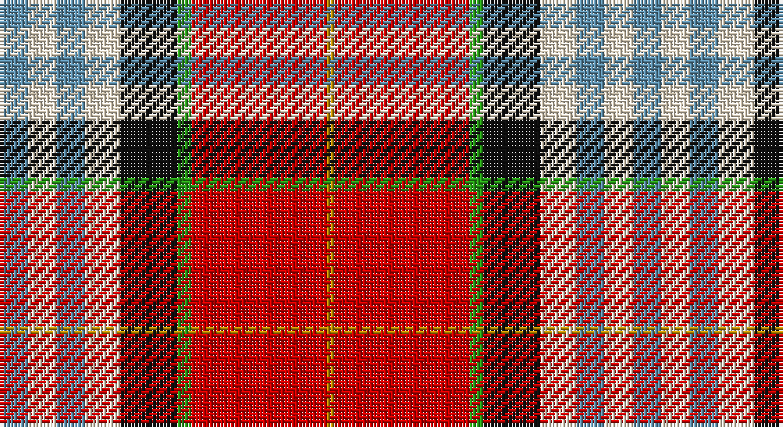

This page is one **sett** — a single exact thread-count. It belongs to the [tartan](/setts/t4w4t4w5k8g2r19lo1/)
(the same proportion at any scale), whose colour order is pattern [BWBWKGRY](/stripes/bwbwkgry/).

Part of the [Edinburgh Napier University](/tartans/edinburgh-napier-university/) tartan — the named design grouping this sett with its other cloths.

Sourced from tartans-authority.  It is a [8 stripe tartan](/stripes/stripes8/).

Original link http://www.tartansauthority.com/tartan-ferret/display/10005/

## Provenance

Earliest known date: Feb. 2009 Based on the Clan Napier sett and incorporating the colours from the University's coat of arms. Against a red background the white is predominant. The red square divided by a dark green line and a border of gold corresponds to the four red roses with fine green leaves and gold seeds, featured on the coat of arms. This red also represents the main colour of the University's logo, the red triangle. The three azure blue lines correspond to the three crescent moon shapes. Exclusively design by Kinloch Anderson for Edinburgh Napier University. Restricted availability. Please contact Kinloch Anderson regarding its use.

2 attestations — the source records this cloth was collapsed from (oldest owns this page)

<ul>
<li>Feb. 2009 — Edinburgh Napier University (Corp.) (tartans-authority, <a href="http://www.tartansauthority.com/tartan-ferret/display/10005/">record</a>)</li>
<li>undated — Edinburgh Napier University Corporate Tartan (house-of-tartan, <a href="http://www.house-of-tartan.scotland.net/house/TartanViewjs.asp?colr=Def&tnam=10005">record</a>)</li>
</ul>

## Register references

External register numbers recorded for this tartan.

- Scottish Register of Tartans: [10005](https://www.tartanregister.gov.uk/tartanDetails?ref=10005)
- Scottish Tartans Authority (ITI): 10005

## Thread count
B/8 W8 B8 W10 K16 G4 R38 DY/2

One full sett is **178 threads**.

## Palette

Palette: <strong>Tartan Register</strong> <small style="color:#888">(5 of 6 colours)</small>
<table><thead><tr><th>Colour</th><th>Threads</th><th>Shade</th><th>Base</th><th>OKLCh</th></tr></thead><tbody><tr><td>B/</td><td style="text-align:right;font-variant-numeric:tabular-nums">8</td><td><code style="background-color:#5C8CA8;">#5C8CA8</code> <small style="color:#888">#5C8CA8</small></td><td>B <code style="background-color:#2A418A;">#2A418A</code></td><td><small style="color:#888">oklch(61.7% 0.067 235.0)</small></td></tr><tr><td>W</td><td style="text-align:right;font-variant-numeric:tabular-nums">8</td><td><code style="background-color:#F0E4CC;">#F0E4CC</code> <small style="color:#888">#F0E4CC</small></td><td>W <code style="background-color:#F7F7F7;">#F7F7F7</code></td><td><small style="color:#888">oklch(92.2% 0.034 84.6)</small></td></tr><tr><td>B</td><td style="text-align:right;font-variant-numeric:tabular-nums">8</td><td><code style="background-color:#5C8CA8;">#5C8CA8</code> <small style="color:#888">#5C8CA8</small></td><td>B <code style="background-color:#2A418A;">#2A418A</code></td><td><small style="color:#888">oklch(61.7% 0.067 235.0)</small></td></tr><tr><td>W</td><td style="text-align:right;font-variant-numeric:tabular-nums">10</td><td><code style="background-color:#F0E4CC;">#F0E4CC</code> <small style="color:#888">#F0E4CC</small></td><td>W <code style="background-color:#F7F7F7;">#F7F7F7</code></td><td><small style="color:#888">oklch(92.2% 0.034 84.6)</small></td></tr><tr><td>K</td><td style="text-align:right;font-variant-numeric:tabular-nums">16</td><td><code style="background-color:#101010;">#101010</code> <small style="color:#888">#101010</small></td><td>K <code style="background-color:#000000;">#000000</code></td><td><small style="color:#888">oklch(17.3% 0.000 89.9)</small></td></tr><tr><td>G</td><td style="text-align:right;font-variant-numeric:tabular-nums">4</td><td><code style="background-color:#289C18;">#289C18</code> <small style="color:#888">#289C18</small></td><td>G <code style="background-color:#006100;">#006100</code></td><td><small style="color:#888">oklch(60.6% 0.191 141.6)</small></td></tr><tr><td>R</td><td style="text-align:right;font-variant-numeric:tabular-nums">38</td><td><code style="background-color:#C80000;">#C80000</code> <small style="color:#888">#C80000</small></td><td>R <code style="background-color:#CC0000;">#CC0000</code></td><td><small style="color:#888">oklch(52.3% 0.215 29.2)</small></td></tr><tr><td>DY/</td><td style="text-align:right;font-variant-numeric:tabular-nums">2</td><td><code style="background-color:#BC8C00;">#BC8C00</code> <small style="color:#888">#BC8C00</small></td><td>Y <code style="background-color:#F2BF00;">#F2BF00</code></td><td><small style="color:#888">oklch(66.8% 0.137 84.1)</small></td></tr></tbody></table>

# Sample pattern

## Compared to the master

This cloth is one sett of its design; the master sett (the exemplar the design is anchored on) is below for comparison.

<figure style="margin:0"><figcaption style="color:#888;font-size:smaller">this sett</figcaption></figure>
<figure style="margin:0"><figcaption style="color:#888;font-size:smaller"><a href="/setts/db4w8db8w10k16lg4r38ly1/">master sett →</a></figcaption></figure>

## Nearest tartans

The nearest existing variants by ΔTartan distance, with this tartan at the top so the swatches line up against it.

ΔTartan

Tartan

Sett

—

<a href="/ttd/edit/#slug=t4w4t4w5k8g2r19lo1~x2">Edinburgh Napier University (Corp.)</a> <a class="nn-out" href="/variants/s8/t4w4t4w5k8g2r19lo1~x2/" title="open its dictionary page">↗</a>

0.90

<a href="/ttd/edit/#slug=k3r24dt16w11ly1g3~x2&amp;base=t4w4t4w5k8g2r19lo1~x2">Bro-sant-Malou</a> <a class="nn-out" href="/variants/s6/k3r24dt16w11ly1g3~x2/" title="open its dictionary page">↗</a>

0.93

<a href="/ttd/edit/#slug=lyi3r3ly2r20k16lb24w2~x2&amp;base=t4w4t4w5k8g2r19lo1~x2">Oor Wullie (Corporate)</a> <a class="nn-out" href="/variants/s7/lyi3r3ly2r20k16lb24w2~x2/" title="open its dictionary page">↗</a>

0.99

<a href="/variants/s7/k3r3lo2r20ki16lb24w2~x2/">Oor Wullie Corporate Tartan</a>

1.00

<a href="/ttd/edit/#slug=ri50ly4w16db2w4db2w15g27r4~x2&amp;base=t4w4t4w5k8g2r19lo1~x2">Rosevear</a> <a class="nn-out" href="/variants/s9/ri50ly4w16db2w4db2w15g27r4~x2/" title="open its dictionary page">↗</a>

1.01

<a href="/ttd/edit/#slug=r3lo15g4t6w2r30t6ly3~x2&amp;base=t4w4t4w5k8g2r19lo1~x2">Round Table Sweden</a> <a class="nn-out" href="/variants/s8/r3lo15g4t6w2r30t6ly3~x2/" title="open its dictionary page">↗</a>

1.02

<a href="/ttd/edit/#slug=r14lg4dt6ly1dt2w2dt2lgi12r6dt2r2w1~x4&amp;base=t4w4t4w5k8g2r19lo1~x2">Stewart - Pr Ch Ed (Royal)</a> <a class="nn-out" href="/variants/s12/r14lg4dt6ly1dt2w2dt2lgi12r6dt2r2w1~x4/" title="open its dictionary page">↗</a>

1.15

<a href="/ttd/edit/#slug=r26t7p8ly3r3w3g20p10w2~x2&amp;base=t4w4t4w5k8g2r19lo1~x2">Wilson's, No 227</a> <a class="nn-out" href="/variants/s9/r26t7p8ly3r3w3g20p10w2~x2/" title="open its dictionary page">↗</a>

1.16

<a href="/ttd/edit/#slug=r30db12k6dg12ly2dg3w2~x2&amp;base=t4w4t4w5k8g2r19lo1~x2">Hewitt</a> <a class="nn-out" href="/variants/s7/r30db12k6dg12ly2dg3w2~x2/" title="open its dictionary page">↗</a>

1.17

<a href="/ttd/edit/#slug=m50ly4w16db2w4db2w15g27r4~x2&amp;base=t4w4t4w5k8g2r19lo1~x2">Rosevear</a> <a class="nn-out" href="/variants/s9/m50ly4w16db2w4db2w15g27r4~x2/" title="open its dictionary page">↗</a>

1.23

<a href="/ttd/edit/#slug=ly6k2r15g5r8k12w24t2w4t2~x2&amp;base=t4w4t4w5k8g2r19lo1~x2">Gillies, dress Red</a> <a class="nn-out" href="/variants/s10/ly6k2r15g5r8k12w24t2w4t2~x2/" title="open its dictionary page">↗</a>

## Neighbour map

Every grey dot is one of 14360 variants placed by the first two principal components of the ΔTartan feature space (44% of its variance). Red is this tartan; blue dots are its nearest — click one to open its page.

<svg viewBox="0 0 640 380" role="img" style="max-width:100%;height:auto;border:1px solid #e0e0e0;border-radius:4px;display:block" xmlns="http://www.w3.org/2000/svg"><image href="/nn/cloud.v1.png" width="640" height="380"/><a href="/variants/s6/k3r24dt16w11ly1g3~x2/"><circle cx="181.0" cy="117.8" r="4" fill="#3465a4"><title>Bro-sant-Malou</title></circle></a><a href="/variants/s7/lyi3r3ly2r20k16lb24w2~x2/"><circle cx="128.5" cy="128.5" r="4" fill="#3465a4"><title>Oor Wullie (Corporate)</title></circle></a><a href="/variants/s7/k3r3lo2r20ki16lb24w2~x2/"><circle cx="127.2" cy="129.6" r="4" fill="#3465a4"><title>Oor Wullie Corporate Tartan</title></circle></a><a href="/variants/s9/ri50ly4w16db2w4db2w15g27r4~x2/"><circle cx="194.0" cy="85.1" r="4" fill="#3465a4"><title>Rosevear</title></circle></a><a href="/variants/s8/r3lo15g4t6w2r30t6ly3~x2/"><circle cx="215.9" cy="115.6" r="4" fill="#3465a4"><title>Round Table Sweden</title></circle></a><a href="/variants/s12/r14lg4dt6ly1dt2w2dt2lgi12r6dt2r2w1~x4/"><circle cx="155.4" cy="103.4" r="4" fill="#3465a4"><title>Stewart - Pr Ch Ed (Royal)</title></circle></a><a href="/variants/s9/r26t7p8ly3r3w3g20p10w2~x2/"><circle cx="145.1" cy="132.3" r="4" fill="#3465a4"><title>Wilson's, No 227</title></circle></a><a href="/variants/s7/r30db12k6dg12ly2dg3w2~x2/"><circle cx="206.9" cy="131.8" r="4" fill="#3465a4"><title>Hewitt</title></circle></a><a href="/variants/s9/m50ly4w16db2w4db2w15g27r4~x2/"><circle cx="191.4" cy="85.8" r="4" fill="#3465a4"><title>Rosevear</title></circle></a><a href="/variants/s10/ly6k2r15g5r8k12w24t2w4t2~x2/"><circle cx="92.1" cy="112.0" r="4" fill="#3465a4"><title>Gillies, dress Red</title></circle></a><circle cx="160.8" cy="107.6" r="5" fill="#c00000"/></svg>

ID: /variants/s8/t4w4t4w5k8g2r19lo1~x2/
