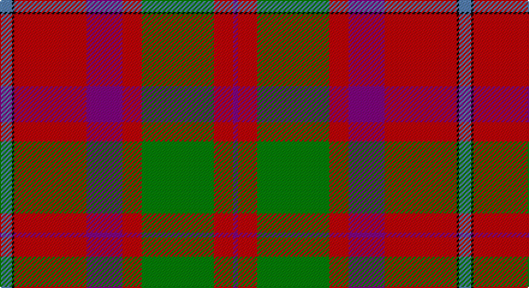

This page is one **sett** — a single exact thread-count. It belongs to the [tartan](/setts/t5k1r30p15r8g30r8p2/)
(the same proportion at any scale), whose colour order is pattern [BKRBRGRB](/stripes/bkrbrgrb/).

Part of the [Shaw of Tordarroch](/tartans/shaw-of-tordarroch/) tartan — the named design grouping this sett with its other cloths.

Sourced from weddslist.  It is a [8 stripe tartan](/stripes/stripes8/).

Original link http://www.weddslist.com/cgi-bin/tartans/pg.pl?source=sts

## Also known as

This cloth is also recorded under:

- Shaw Red of Tordarroch Dress (Clan 2
- Shaw of Tordarroch Green
- Shaw of Tordarroch Green (Clan
- Shaw of Tordarroch Red

## Thread count
B/10 K2 R60 P30 R16 G60 R16 P/4

One full sett is **382 threads**.

## Palette

Palette: <strong>Ingles Buchan</strong> <small style="color:#888">(1 of 5 colours)</small>
<table><thead><tr><th>Colour</th><th>Threads</th><th>Shade</th><th>Base</th><th>OKLCh</th></tr></thead><tbody><tr><td>B/</td><td style="text-align:right;font-variant-numeric:tabular-nums">10</td><td><code style="background-color:#5480B0;">#5480B0</code> <small style="color:#888">#5480B0</small></td><td>B <code style="background-color:#2A418A;">#2A418A</code></td><td><small style="color:#888">oklch(58.8% 0.089 251.5)</small></td></tr><tr><td>K</td><td style="text-align:right;font-variant-numeric:tabular-nums">2</td><td><code style="background-color:#000000;">#000000</code> <small style="color:#888">#000000</small></td><td>K <code style="background-color:#000000;">#000000</code></td><td><small style="color:#888">oklch(0.0% 0.000 0.0)</small></td></tr><tr><td>R</td><td style="text-align:right;font-variant-numeric:tabular-nums">60</td><td><code style="background-color:#C00000;">#C00000</code> <small style="color:#888">#C00000</small></td><td>R <code style="background-color:#CC0000;">#CC0000</code></td><td><small style="color:#888">oklch(50.7% 0.208 29.2)</small></td></tr><tr><td>P</td><td style="text-align:right;font-variant-numeric:tabular-nums">30</td><td><code style="background-color:#800080;">#800080</code> <small style="color:#888">#800080</small></td><td>B <code style="background-color:#2A418A;">#2A418A</code></td><td><small style="color:#888">oklch(42.1% 0.193 328.4)</small></td></tr><tr><td>R</td><td style="text-align:right;font-variant-numeric:tabular-nums">16</td><td><code style="background-color:#C00000;">#C00000</code> <small style="color:#888">#C00000</small></td><td>R <code style="background-color:#CC0000;">#CC0000</code></td><td><small style="color:#888">oklch(50.7% 0.208 29.2)</small></td></tr><tr><td>G</td><td style="text-align:right;font-variant-numeric:tabular-nums">60</td><td><code style="background-color:#008000;">#008000</code> <small style="color:#888">#008000</small></td><td>G <code style="background-color:#006100;">#006100</code></td><td><small style="color:#888">oklch(52.0% 0.177 142.5)</small></td></tr><tr><td>R</td><td style="text-align:right;font-variant-numeric:tabular-nums">16</td><td><code style="background-color:#C00000;">#C00000</code> <small style="color:#888">#C00000</small></td><td>R <code style="background-color:#CC0000;">#CC0000</code></td><td><small style="color:#888">oklch(50.7% 0.208 29.2)</small></td></tr><tr><td>P/</td><td style="text-align:right;font-variant-numeric:tabular-nums">4</td><td><code style="background-color:#800080;">#800080</code> <small style="color:#888">#800080</small></td><td>B <code style="background-color:#2A418A;">#2A418A</code></td><td><small style="color:#888">oklch(42.1% 0.193 328.4)</small></td></tr></tbody></table>

# Sample pattern

## Compared to the master

This cloth is one sett of its design; the master sett (the exemplar the design is anchored on) is below for comparison.

<figure style="margin:0"><figcaption style="color:#888;font-size:smaller">this sett</figcaption></figure>
<figure style="margin:0"><figcaption style="color:#888;font-size:smaller"><a href="/setts/t5k1r30dp15r8g30r8dp2/">master sett →</a></figcaption></figure>

## Nearest tartans

The nearest existing variants by ΔTartan distance, with this tartan at the top so the swatches line up against it.

ΔTartan

Tartan

Sett

—

<a href="/ttd/edit/#slug=t5k1r30p15r8g30r8p2~x2">Shaw of Tordarroch</a> <a class="nn-out" href="/variants/s8/t5k1r30p15r8g30r8p2~x2/" title="open its dictionary page">↗</a>

0.31

<a href="/ttd/edit/#slug=t5k1r30dp15r8g30r8dp2~x2&amp;base=t5k1r30p15r8g30r8p2~x2">Shaw Red of Tordarroch Dress (Clan 2</a> <a class="nn-out" href="/variants/s8/t5k1r30dp15r8g30r8dp2~x2/" title="open its dictionary page">↗</a>

0.35

<a href="/ttd/edit/#slug=t5k1r30dp15r8g30r8dp2&amp;base=t5k1r30p15r8g30r8p2~x2">Shaw of Tordarroch Clan Tartan</a> <a class="nn-out" href="/variants/s8/t5k1r30dp15r8g30r8dp2/" title="open its dictionary page">↗</a>

0.50

<a href="/ttd/edit/#slug=lb5k1r30dp15r8dg30r8dp2&amp;base=t5k1r30p15r8g30r8p2~x2">Shaw</a> <a class="nn-out" href="/variants/s8/lb5k1r30dp15r8dg30r8dp2/" title="open its dictionary page">↗</a>

1.08

<a href="/ttd/edit/#slug=r6b22r6g20ly2r45b2w5~x2&amp;base=t5k1r30p15r8g30r8p2~x2">Elbrick Dress (Personal)</a> <a class="nn-out" href="/variants/s8/r6b22r6g20ly2r45b2w5~x2/" title="open its dictionary page">↗</a>

1.10

<a href="/ttd/edit/#slug=db2r49db51r9w2r9g51r49db2~x2&amp;base=t5k1r30p15r8g30r8p2~x2">Unidentified 20</a> <a class="nn-out" href="/variants/s9/db2r49db51r9w2r9g51r49db2~x2/" title="open its dictionary page">↗</a>

1.12

<a href="/ttd/edit/#slug=db3t1r30db32r3w1r3g23r31db3w1&amp;base=t5k1r30p15r8g30r8p2~x2">MacDonald of Glenaladale</a> <a class="nn-out" href="/variants/s11/db3t1r30db32r3w1r3g23r31db3w1/" title="open its dictionary page">↗</a>

1.15

<a href="/ttd/edit/#slug=r25db7r3g13t1k2~x4&amp;base=t5k1r30p15r8g30r8p2~x2">MacPhail</a> <a class="nn-out" href="/variants/s6/r25db7r3g13t1k2~x4/" title="open its dictionary page">↗</a>

1.17

<a href="/ttd/edit/#slug=w3g15db18r30g1r2~x2&amp;base=t5k1r30p15r8g30r8p2~x2">Ruthven</a> <a class="nn-out" href="/variants/s6/w3g15db18r30g1r2~x2/" title="open its dictionary page">↗</a>

1.18

<a href="/ttd/edit/#slug=n47r8k22r7lb3r24n9r10lo3~x2&amp;base=t5k1r30p15r8g30r8p2~x2">Ulster Ancestry (Fashion)</a> <a class="nn-out" href="/variants/s9/n47r8k22r7lb3r24n9r10lo3~x2/" title="open its dictionary page">↗</a>

1.18

<a href="/ttd/edit/#slug=r27y4k4y4k4t6lo1~x4&amp;base=t5k1r30p15r8g30r8p2~x2">MacLeay</a> <a class="nn-out" href="/variants/s7/r27y4k4y4k4t6lo1~x4/" title="open its dictionary page">↗</a>

## Neighbour map

Every grey dot is one of 14360 variants placed by the first two principal components of the ΔTartan feature space (44% of its variance). Red is this tartan; blue dots are its nearest — click one to open its page.

<svg viewBox="0 0 640 380" role="img" style="max-width:100%;height:auto;border:1px solid #e0e0e0;border-radius:4px;display:block" xmlns="http://www.w3.org/2000/svg"><image href="/nn/cloud.v1.png" width="640" height="380"/><a href="/variants/s8/t5k1r30dp15r8g30r8dp2~x2/"><circle cx="285.2" cy="136.0" r="4" fill="#3465a4"><title>Shaw Red of Tordarroch Dress (Clan 2</title></circle></a><a href="/variants/s8/t5k1r30dp15r8g30r8dp2/"><circle cx="293.5" cy="138.1" r="4" fill="#3465a4"><title>Shaw of Tordarroch Clan Tartan</title></circle></a><a href="/variants/s8/lb5k1r30dp15r8dg30r8dp2/"><circle cx="274.6" cy="130.4" r="4" fill="#3465a4"><title>Shaw</title></circle></a><a href="/variants/s8/r6b22r6g20ly2r45b2w5~x2/"><circle cx="307.7" cy="128.6" r="4" fill="#3465a4"><title>Elbrick Dress (Personal)</title></circle></a><a href="/variants/s9/db2r49db51r9w2r9g51r49db2~x2/"><circle cx="328.9" cy="152.3" r="4" fill="#3465a4"><title>Unidentified 20</title></circle></a><a href="/variants/s11/db3t1r30db32r3w1r3g23r31db3w1/"><circle cx="325.9" cy="106.5" r="4" fill="#3465a4"><title>MacDonald of Glenaladale</title></circle></a><a href="/variants/s6/r25db7r3g13t1k2~x4/"><circle cx="327.3" cy="143.1" r="4" fill="#3465a4"><title>MacPhail</title></circle></a><a href="/variants/s6/w3g15db18r30g1r2~x2/"><circle cx="298.5" cy="157.0" r="4" fill="#3465a4"><title>Ruthven</title></circle></a><a href="/variants/s9/n47r8k22r7lb3r24n9r10lo3~x2/"><circle cx="253.2" cy="156.3" r="4" fill="#3465a4"><title>Ulster Ancestry (Fashion)</title></circle></a><a href="/variants/s7/r27y4k4y4k4t6lo1~x4/"><circle cx="324.3" cy="117.2" r="4" fill="#3465a4"><title>MacLeay</title></circle></a><circle cx="284.2" cy="134.1" r="5" fill="#c00000"/></svg>

ID: /variants/s8/t5k1r30p15r8g30r8p2~x2/
