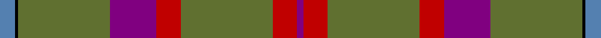
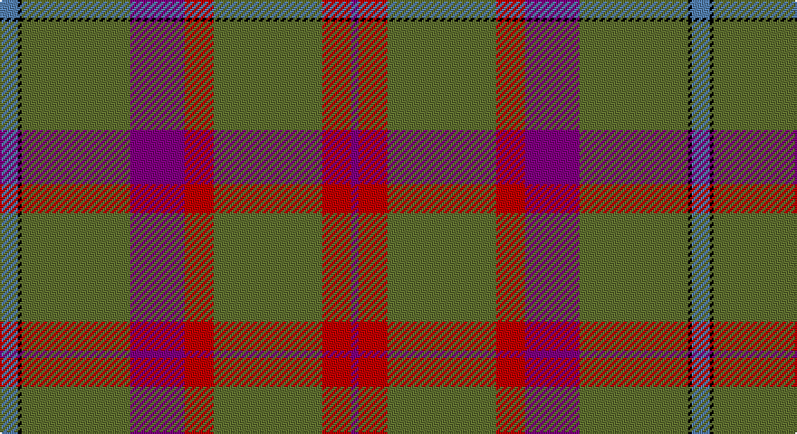

This page is one **sett** — a single exact thread-count. It belongs to the [tartan](/setts/t5k1y30p15r8y30r8p2/)
(the same proportion at any scale), whose colour order is pattern [BKGBRGRB](/stripes/bkgbrgrb/).

Part of the [Shaw of Tordarroch Hunting](/tartans/shaw-of-tordarroch-hunting/) tartan — the named design grouping this sett with its other cloths.

Sourced from weddslist.  It is a [8 stripe tartan](/stripes/stripes8/).

Original link http://www.weddslist.com/cgi-bin/tartans/pg.pl?source=sts

## Also known as

This cloth is also recorded under:

- Shaw of Tordarroch, hunting

## Thread count
B/10 K2 G60 P30 R16 G60 R16 P/4

One full sett is **382 threads**.

## Palette

Palette: <strong>Ingles Buchan</strong> <small style="color:#888">(1 of 5 colours)</small>
<table><thead><tr><th>Colour</th><th>Threads</th><th>Shade</th><th>Base</th><th>OKLCh</th></tr></thead><tbody><tr><td>B/</td><td style="text-align:right;font-variant-numeric:tabular-nums">10</td><td><code style="background-color:#5480B0;">#5480B0</code> <small style="color:#888">#5480B0</small></td><td>B <code style="background-color:#2A418A;">#2A418A</code></td><td><small style="color:#888">oklch(58.8% 0.089 251.5)</small></td></tr><tr><td>K</td><td style="text-align:right;font-variant-numeric:tabular-nums">2</td><td><code style="background-color:#000000;">#000000</code> <small style="color:#888">#000000</small></td><td>K <code style="background-color:#000000;">#000000</code></td><td><small style="color:#888">oklch(0.0% 0.000 0.0)</small></td></tr><tr><td>G</td><td style="text-align:right;font-variant-numeric:tabular-nums">60</td><td><code style="background-color:#607030;">#607030</code> <small style="color:#888">#607030</small></td><td>G <code style="background-color:#006100;">#006100</code></td><td><small style="color:#888">oklch(51.7% 0.091 121.3)</small></td></tr><tr><td>P</td><td style="text-align:right;font-variant-numeric:tabular-nums">30</td><td><code style="background-color:#800080;">#800080</code> <small style="color:#888">#800080</small></td><td>B <code style="background-color:#2A418A;">#2A418A</code></td><td><small style="color:#888">oklch(42.1% 0.193 328.4)</small></td></tr><tr><td>R</td><td style="text-align:right;font-variant-numeric:tabular-nums">16</td><td><code style="background-color:#C00000;">#C00000</code> <small style="color:#888">#C00000</small></td><td>R <code style="background-color:#CC0000;">#CC0000</code></td><td><small style="color:#888">oklch(50.7% 0.208 29.2)</small></td></tr><tr><td>G</td><td style="text-align:right;font-variant-numeric:tabular-nums">60</td><td><code style="background-color:#607030;">#607030</code> <small style="color:#888">#607030</small></td><td>G <code style="background-color:#006100;">#006100</code></td><td><small style="color:#888">oklch(51.7% 0.091 121.3)</small></td></tr><tr><td>R</td><td style="text-align:right;font-variant-numeric:tabular-nums">16</td><td><code style="background-color:#C00000;">#C00000</code> <small style="color:#888">#C00000</small></td><td>R <code style="background-color:#CC0000;">#CC0000</code></td><td><small style="color:#888">oklch(50.7% 0.208 29.2)</small></td></tr><tr><td>P/</td><td style="text-align:right;font-variant-numeric:tabular-nums">4</td><td><code style="background-color:#800080;">#800080</code> <small style="color:#888">#800080</small></td><td>B <code style="background-color:#2A418A;">#2A418A</code></td><td><small style="color:#888">oklch(42.1% 0.193 328.4)</small></td></tr></tbody></table>

# Sample pattern

## Compared to the master

This cloth is one sett of its design; the master sett (the exemplar the design is anchored on) is below for comparison.

<figure style="margin:0"><figcaption style="color:#888;font-size:smaller">this sett</figcaption></figure>
<figure style="margin:0"><figcaption style="color:#888;font-size:smaller"><a href="/setts/t5k1y30dp15r8y30r8dp2/">master sett →</a></figcaption></figure>

## Nearest tartans

The nearest existing variants by ΔTartan distance, with this tartan at the top so the swatches line up against it.

ΔTartan

Tartan

Sett

—

<a href="/ttd/edit/#slug=t5k1y30p15r8y30r8p2~x2">Shaw of Tordarroch, hunting</a> <a class="nn-out" href="/variants/s8/t5k1y30p15r8y30r8p2~x2/" title="open its dictionary page">↗</a>

0.39

<a href="/ttd/edit/#slug=t5k1y30dp15r8y30r8dp2&amp;base=t5k1y30p15r8y30r8p2~x2">Shaw of Tordarroch Hunting Clan Tartan</a> <a class="nn-out" href="/variants/s8/t5k1y30dp15r8y30r8dp2/" title="open its dictionary page">↗</a>

1.50

<a href="/ttd/edit/#slug=dg2dy32dy12k10r1db16r2~x2&amp;base=t5k1y30p15r8y30r8p2~x2">MacWilliam Htg</a> <a class="nn-out" href="/variants/s7/dg2dy32dy12k10r1db16r2~x2/" title="open its dictionary page">↗</a>

1.52

<a href="/ttd/edit/#slug=k3y3lo2y30k2y3m12y6mi6k3y3~x2&amp;base=t5k1y30p15r8y30r8p2~x2">McAlifyfe (Personal)</a> <a class="nn-out" href="/variants/s11/k3y3lo2y30k2y3m12y6mi6k3y3~x2/" title="open its dictionary page">↗</a>

1.57

<a href="/ttd/edit/#slug=dy48dp11g16ly16dy11r3dy11~x2&amp;base=t5k1y30p15r8y30r8p2~x2">Shannon (?)</a> <a class="nn-out" href="/variants/s7/dy48dp11g16ly16dy11r3dy11~x2/" title="open its dictionary page">↗</a>

1.61

<a href="/ttd/edit/#slug=lri13lr2n38k13n8k8n17k2n17k4o11&amp;base=t5k1y30p15r8y30r8p2~x2">Bute Heather, Grey (Fashion)</a> <a class="nn-out" href="/variants/s11/lri13lr2n38k13n8k8n17k2n17k4o11/" title="open its dictionary page">↗</a>

1.61

<a href="/ttd/edit/#slug=t5k1g30db15r8g30r8db2~x2&amp;base=t5k1y30p15r8y30r8p2~x2">Shaw of Tordarroch Green (Htg) (Clan</a> <a class="nn-out" href="/variants/s8/t5k1g30db15r8g30r8db2~x2/" title="open its dictionary page">↗</a>

1.63

<a href="/ttd/edit/#slug=dp3k1g16r5g6r5g14r16lo2~x2&amp;base=t5k1y30p15r8y30r8p2~x2">Fulton</a> <a class="nn-out" href="/variants/s9/dp3k1g16r5g6r5g14r16lo2~x2/" title="open its dictionary page">↗</a>

1.66

<a href="/ttd/edit/#slug=y47w6r24w3dp5lo3~x2&amp;base=t5k1y30p15r8y30r8p2~x2">Duminiak (Trevose, Pennsylvania)</a> <a class="nn-out" href="/variants/s6/y47w6r24w3dp5lo3~x2/" title="open its dictionary page">↗</a>

1.66

<a href="/ttd/edit/#slug=n36dr10lo2dr5g2dr5lo10n5lo2n10w2~x2&amp;base=t5k1y30p15r8y30r8p2~x2">Toyokawa Check</a> <a class="nn-out" href="/variants/s11/n36dr10lo2dr5g2dr5lo10n5lo2n10w2~x2/" title="open its dictionary page">↗</a>

1.70

<a href="/ttd/edit/#slug=r26n4r1p2dg1n4dg14w2~x2&amp;base=t5k1y30p15r8y30r8p2~x2">Redpath, Robert A (Personal)</a> <a class="nn-out" href="/variants/s8/r26n4r1p2dg1n4dg14w2~x2/" title="open its dictionary page">↗</a>

## Neighbour map

Every grey dot is one of 14360 variants placed by the first two principal components of the ΔTartan feature space (44% of its variance). Red is this tartan; blue dots are its nearest — click one to open its page.

<svg viewBox="0 0 640 380" role="img" style="max-width:100%;height:auto;border:1px solid #e0e0e0;border-radius:4px;display:block" xmlns="http://www.w3.org/2000/svg"><image href="/nn/cloud.v1.png" width="640" height="380"/><a href="/variants/s8/t5k1y30dp15r8y30r8dp2/"><circle cx="398.9" cy="164.5" r="4" fill="#3465a4"><title>Shaw of Tordarroch Hunting Clan Tartan</title></circle></a><a href="/variants/s7/dg2dy32dy12k10r1db16r2~x2/"><circle cx="412.2" cy="178.8" r="4" fill="#3465a4"><title>MacWilliam Htg</title></circle></a><a href="/variants/s11/k3y3lo2y30k2y3m12y6mi6k3y3~x2/"><circle cx="373.1" cy="147.1" r="4" fill="#3465a4"><title>McAlifyfe (Personal)</title></circle></a><a href="/variants/s7/dy48dp11g16ly16dy11r3dy11~x2/"><circle cx="330.3" cy="181.8" r="4" fill="#3465a4"><title>Shannon (?)</title></circle></a><a href="/variants/s11/lri13lr2n38k13n8k8n17k2n17k4o11/"><circle cx="332.8" cy="167.4" r="4" fill="#3465a4"><title>Bute Heather, Grey (Fashion)</title></circle></a><a href="/variants/s8/t5k1g30db15r8g30r8db2~x2/"><circle cx="364.8" cy="161.6" r="4" fill="#3465a4"><title>Shaw of Tordarroch Green (Htg) (Clan</title></circle></a><a href="/variants/s9/dp3k1g16r5g6r5g14r16lo2~x2/"><circle cx="324.3" cy="191.3" r="4" fill="#3465a4"><title>Fulton</title></circle></a><a href="/variants/s6/y47w6r24w3dp5lo3~x2/"><circle cx="334.6" cy="167.2" r="4" fill="#3465a4"><title>Duminiak (Trevose, Pennsylvania)</title></circle></a><a href="/variants/s11/n36dr10lo2dr5g2dr5lo10n5lo2n10w2~x2/"><circle cx="384.0" cy="158.0" r="4" fill="#3465a4"><title>Toyokawa Check</title></circle></a><a href="/variants/s8/r26n4r1p2dg1n4dg14w2~x2/"><circle cx="346.6" cy="140.2" r="4" fill="#3465a4"><title>Redpath, Robert A (Personal)</title></circle></a><circle cx="387.6" cy="159.0" r="5" fill="#c00000"/></svg>

ID: /variants/s8/t5k1y30p15r8y30r8p2~x2/
