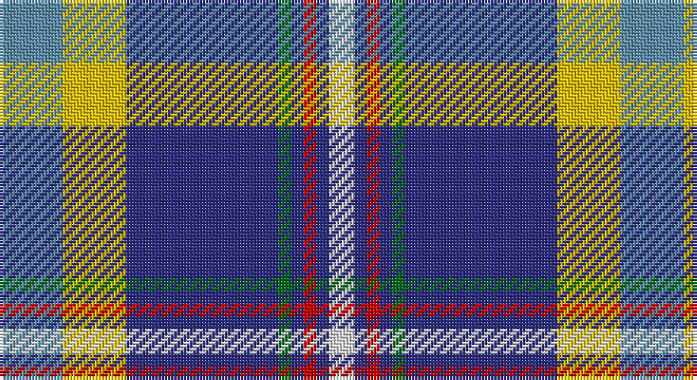

This page is one **sett** — a single exact thread-count. It belongs to the [tartan](/setts/t5ly5db12g1db1r1db1w2/)
(the same proportion at any scale), whose colour order is pattern [BYBGBRBW](/stripes/bybgbrbw/).

Sourced from register-of-tartans.  It is a [8 stripe tartan](/stripes/stripes8/).

Original link https://www.tartanregister.gov.uk/tartanDetails.aspx?ref=4795

## Also known as

This cloth is also recorded under:

- Yorkshire C.C.C.
- Yorkshire, C.C.C.

2 attestations — the source records this cloth was collapsed from (oldest owns this page)

<ul>
<li>01/01/2002 — Hodgkinson (register-of-tartans, <a href="https://www.tartanregister.gov.uk/tartanDetails.aspx?ref=4795">record</a>)</li>
<li>pre 2002 — Hodgkinson (Name) (tartans-authority, <a href="http://www.tartansauthority.com/tartan-ferret/display/670/">record</a>)</li>
</ul>

## Register references

External register numbers recorded for this tartan.

- Scottish Register of Tartans: [4795](https://www.tartanregister.gov.uk/tartanDetails.aspx?ref=4795)
- Scottish Tartans Authority (ITI): 670
- Scottish Tartans World Register: 670

## Thread count
B/20 Y20 DB48 Ga4 DB4 R4 DB4 LN/8

One full sett is **196 threads**.

## Palette

Palette: <strong>Tartan Register</strong>
<table><thead><tr><th>Colour</th><th>Threads</th><th>Shade</th><th>Base</th><th>OKLCh</th></tr></thead><tbody><tr><td>B/</td><td style="text-align:right;font-variant-numeric:tabular-nums">20</td><td><code style="background-color:#5C8CA8;">#5C8CA8</code> <small style="color:#888">#5C8CA8</small></td><td>B <code style="background-color:#2A418A;">#2A418A</code></td><td><small style="color:#888">oklch(61.7% 0.067 235.0)</small></td></tr><tr><td>Y</td><td style="text-align:right;font-variant-numeric:tabular-nums">20</td><td><code style="background-color:#E8C000;">#E8C000</code> <small style="color:#888">#E8C000</small></td><td>Y <code style="background-color:#F2BF00;">#F2BF00</code></td><td><small style="color:#888">oklch(81.9% 0.168 93.7)</small></td></tr><tr><td>DB</td><td style="text-align:right;font-variant-numeric:tabular-nums">48</td><td><code style="background-color:#2C2C80;">#2C2C80</code> <small style="color:#888">#2C2C80</small></td><td>B <code style="background-color:#2A418A;">#2A418A</code></td><td><small style="color:#888">oklch(35.0% 0.138 276.6)</small></td></tr><tr><td>Ga</td><td style="text-align:right;font-variant-numeric:tabular-nums">4</td><td><code style="background-color:#006818;">#006818</code> <small style="color:#888">#006818</small></td><td>G <code style="background-color:#006100;">#006100</code></td><td><small style="color:#888">oklch(45.0% 0.142 145.0)</small></td></tr><tr><td>DB</td><td style="text-align:right;font-variant-numeric:tabular-nums">4</td><td><code style="background-color:#2C2C80;">#2C2C80</code> <small style="color:#888">#2C2C80</small></td><td>B <code style="background-color:#2A418A;">#2A418A</code></td><td><small style="color:#888">oklch(35.0% 0.138 276.6)</small></td></tr><tr><td>R</td><td style="text-align:right;font-variant-numeric:tabular-nums">4</td><td><code style="background-color:#C80000;">#C80000</code> <small style="color:#888">#C80000</small></td><td>R <code style="background-color:#CC0000;">#CC0000</code></td><td><small style="color:#888">oklch(52.3% 0.215 29.2)</small></td></tr><tr><td>DB</td><td style="text-align:right;font-variant-numeric:tabular-nums">4</td><td><code style="background-color:#2C2C80;">#2C2C80</code> <small style="color:#888">#2C2C80</small></td><td>B <code style="background-color:#2A418A;">#2A418A</code></td><td><small style="color:#888">oklch(35.0% 0.138 276.6)</small></td></tr><tr><td>LN/</td><td style="text-align:right;font-variant-numeric:tabular-nums">8</td><td><code style="background-color:#E0E0E0;">#E0E0E0</code> <small style="color:#888">#E0E0E0</small></td><td>W <code style="background-color:#F7F7F7;">#F7F7F7</code></td><td><small style="color:#888">oklch(90.7% 0.000 89.9)</small></td></tr></tbody></table>

# Sample pattern

## Nearest tartans

The nearest existing variants by ΔTartan distance, with this tartan at the top so the swatches line up against it.

ΔTartan

Tartan

Sett

—

<a href="/ttd/edit/#slug=t5ly5db12g1db1r1db1w2~x4">Hodgkinson</a> <a class="nn-out" href="/variants/s8/t5ly5db12g1db1r1db1w2~x4/" title="open its dictionary page">↗</a>

0.42

<a href="/ttd/edit/#slug=t5ly5db12g1db1r1db1w2~x2&amp;base=t5ly5db12g1db1r1db1w2~x4">Yorkshire, C.C.C.</a> <a class="nn-out" href="/variants/s8/t5ly5db12g1db1r1db1w2~x2/" title="open its dictionary page">↗</a>

0.91

<a href="/ttd/edit/#slug=r4w4g4ly4db5ly1db1ly1db16p4~x2&amp;base=t5ly5db12g1db1r1db1w2~x4">Yukon</a> <a class="nn-out" href="/variants/s10/r4w4g4ly4db5ly1db1ly1db16p4~x2/" title="open its dictionary page">↗</a>

0.94

<a href="/ttd/edit/#slug=r3dt25k6lb20ly2lb2w3~x2&amp;base=t5ly5db12g1db1r1db1w2~x4">Madras College (Corporate)</a> <a class="nn-out" href="/variants/s7/r3dt25k6lb20ly2lb2w3~x2/" title="open its dictionary page">↗</a>

0.95

<a href="/ttd/edit/#slug=dp4db16ly1db1ly1db5ly4g4w4r4~x2&amp;base=t5ly5db12g1db1r1db1w2~x4">Yukon #1906 District Tartan</a> <a class="nn-out" href="/variants/s10/dp4db16ly1db1ly1db5ly4g4w4r4~x2/" title="open its dictionary page">↗</a>

1.07

<a href="/ttd/edit/#slug=dp4db20ly1db2ly1db4ly4dg4w4r4~x2&amp;base=t5ly5db12g1db1r1db1w2~x4">Yukon (asymmetric)</a> <a class="nn-out" href="/variants/s10/dp4db20ly1db2ly1db4ly4dg4w4r4~x2/" title="open its dictionary page">↗</a>

1.08

<a href="/ttd/edit/#slug=b49lb11lo7k16lbi5b20lb10k6t5~x2&amp;base=t5ly5db12g1db1r1db1w2~x4">State Seal of Louisiana (Fashion)</a> <a class="nn-out" href="/variants/s9/b49lb11lo7k16lbi5b20lb10k6t5~x2/" title="open its dictionary page">↗</a>

1.09

<a href="/ttd/edit/#slug=r4w4g4ly4db4ly1db2ly1db20p4~x2&amp;base=t5ly5db12g1db1r1db1w2~x4">Yukon</a> <a class="nn-out" href="/variants/s10/r4w4g4ly4db4ly1db2ly1db20p4~x2/" title="open its dictionary page">↗</a>

1.10

<a href="/ttd/edit/#slug=db46ly4db4ly4db6k16o66w11r6&amp;base=t5ly5db12g1db1r1db1w2~x4">Scottish Association for N.S. (Corp)</a> <a class="nn-out" href="/variants/s9/db46ly4db4ly4db6k16o66w11r6/" title="open its dictionary page">↗</a>

1.10

<a href="/ttd/edit/#slug=db4w3db17lb10k1dp5k1lb6dg3~x2&amp;base=t5ly5db12g1db1r1db1w2~x4">Queen Margaret University</a> <a class="nn-out" href="/variants/s9/db4w3db17lb10k1dp5k1lb6dg3~x2/" title="open its dictionary page">↗</a>

1.12

<a href="/ttd/edit/#slug=db4r2db31k10g4w21g2~x2&amp;base=t5ly5db12g1db1r1db1w2~x4">Sinclair Dress (Dance)</a> <a class="nn-out" href="/variants/s7/db4r2db31k10g4w21g2~x2/" title="open its dictionary page">↗</a>

## Neighbour map

Every grey dot is one of 14360 variants placed by the first two principal components of the ΔTartan feature space (44% of its variance). Red is this tartan; blue dots are its nearest — click one to open its page.

<svg viewBox="0 0 640 380" role="img" style="max-width:100%;height:auto;border:1px solid #e0e0e0;border-radius:4px;display:block" xmlns="http://www.w3.org/2000/svg"><image href="/nn/cloud.v1.png" width="640" height="380"/><a href="/variants/s8/t5ly5db12g1db1r1db1w2~x2/"><circle cx="210.0" cy="136.0" r="4" fill="#3465a4"><title>Yorkshire, C.C.C.</title></circle></a><a href="/variants/s10/r4w4g4ly4db5ly1db1ly1db16p4~x2/"><circle cx="201.6" cy="118.7" r="4" fill="#3465a4"><title>Yukon</title></circle></a><a href="/variants/s7/r3dt25k6lb20ly2lb2w3~x2/"><circle cx="171.5" cy="140.8" r="4" fill="#3465a4"><title>Madras College (Corporate)</title></circle></a><a href="/variants/s10/dp4db16ly1db1ly1db5ly4g4w4r4~x2/"><circle cx="198.1" cy="117.4" r="4" fill="#3465a4"><title>Yukon #1906 District Tartan</title></circle></a><a href="/variants/s10/dp4db20ly1db2ly1db4ly4dg4w4r4~x2/"><circle cx="248.0" cy="105.2" r="4" fill="#3465a4"><title>Yukon (asymmetric)</title></circle></a><a href="/variants/s9/b49lb11lo7k16lbi5b20lb10k6t5~x2/"><circle cx="213.2" cy="153.7" r="4" fill="#3465a4"><title>State Seal of Louisiana (Fashion)</title></circle></a><a href="/variants/s10/r4w4g4ly4db4ly1db2ly1db20p4~x2/"><circle cx="248.3" cy="103.8" r="4" fill="#3465a4"><title>Yukon</title></circle></a><a href="/variants/s9/db46ly4db4ly4db6k16o66w11r6/"><circle cx="194.0" cy="111.7" r="4" fill="#3465a4"><title>Scottish Association for N.S. (Corp)</title></circle></a><a href="/variants/s9/db4w3db17lb10k1dp5k1lb6dg3~x2/"><circle cx="169.2" cy="128.3" r="4" fill="#3465a4"><title>Queen Margaret University</title></circle></a><a href="/variants/s7/db4r2db31k10g4w21g2~x2/"><circle cx="213.2" cy="144.0" r="4" fill="#3465a4"><title>Sinclair Dress (Dance)</title></circle></a><circle cx="202.5" cy="132.5" r="5" fill="#c00000"/></svg>

ID: /variants/s8/t5ly5db12g1db1r1db1w2~x4/
