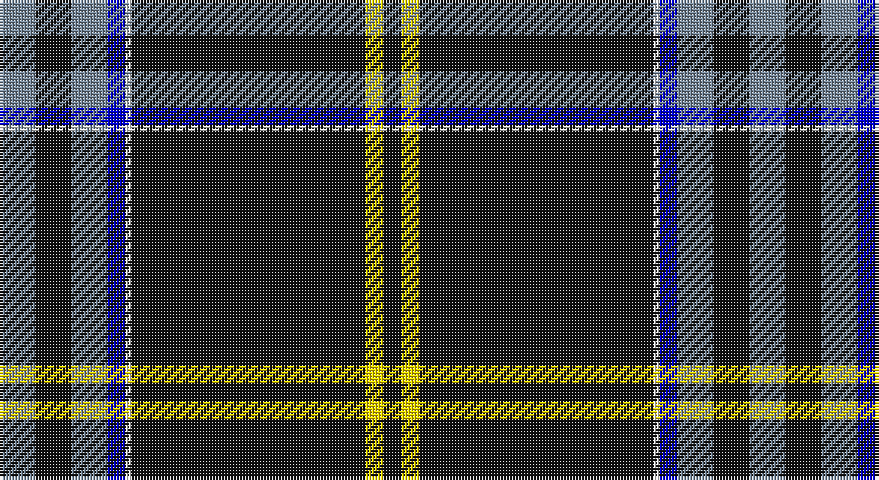

This page is one **sett** — a single exact thread-count. It belongs to the [tartan](/setts/t6k6t6db3w1k39ly3k3/)
(the same proportion at any scale), whose colour order is pattern [BKBBWKYK](/stripes/bkbbwkyk/).

Part of the [Washington County Sheriff’s Office](/tartans/washington-county-sheriff-s-office/) tartan — the named design grouping this sett with its other cloths.

Sourced from register-of-tartans.  It is a [8 stripe tartan](/stripes/stripes8/).

Original link https://www.tartanregister.gov.uk/tartanDetails.aspx?ref=10361

## Also known as

This cloth is also recorded under:

- Washington County Sheriff's Office

## Register references

External register numbers recorded for this tartan.

- Scottish Register of Tartans: [10361](https://www.tartanregister.gov.uk/tartanDetails.aspx?ref=10361)

## Thread count
N/12 K12 N12 B6 W2 K78 Y6 K/6

One full sett is **250 threads**.

## Palette

Palette: <strong>Tartan Register</strong> <small style="color:#888">(4 of 5 colours)</small>
<table><thead><tr><th>Colour</th><th>Threads</th><th>Shade</th><th>Base</th><th>OKLCh</th></tr></thead><tbody><tr><td>N/</td><td style="text-align:right;font-variant-numeric:tabular-nums">12</td><td><code style="background-color:#778899;">#778899</code> <small style="color:#888">#778899</small></td><td>B <code style="background-color:#2A418A;">#2A418A</code></td><td><small style="color:#888">oklch(61.9% 0.032 248.4)</small></td></tr><tr><td>K</td><td style="text-align:right;font-variant-numeric:tabular-nums">12</td><td><code style="background-color:#101010;">#101010</code> <small style="color:#888">#101010</small></td><td>K <code style="background-color:#000000;">#000000</code></td><td><small style="color:#888">oklch(17.3% 0.000 89.9)</small></td></tr><tr><td>N</td><td style="text-align:right;font-variant-numeric:tabular-nums">12</td><td><code style="background-color:#778899;">#778899</code> <small style="color:#888">#778899</small></td><td>B <code style="background-color:#2A418A;">#2A418A</code></td><td><small style="color:#888">oklch(61.9% 0.032 248.4)</small></td></tr><tr><td>B</td><td style="text-align:right;font-variant-numeric:tabular-nums">6</td><td><code style="background-color:#0000CD;">#0000CD</code> <small style="color:#888">#0000CD</small></td><td>B <code style="background-color:#2A418A;">#2A418A</code></td><td><small style="color:#888">oklch(38.3% 0.266 264.1)</small></td></tr><tr><td>W</td><td style="text-align:right;font-variant-numeric:tabular-nums">2</td><td><code style="background-color:#FFFFFF;">#FFFFFF</code> <small style="color:#888">#FFFFFF</small></td><td>W <code style="background-color:#F7F7F7;">#F7F7F7</code></td><td><small style="color:#888">oklch(100.0% 0.000 89.9)</small></td></tr><tr><td>K</td><td style="text-align:right;font-variant-numeric:tabular-nums">78</td><td><code style="background-color:#101010;">#101010</code> <small style="color:#888">#101010</small></td><td>K <code style="background-color:#000000;">#000000</code></td><td><small style="color:#888">oklch(17.3% 0.000 89.9)</small></td></tr><tr><td>Y</td><td style="text-align:right;font-variant-numeric:tabular-nums">6</td><td><code style="background-color:#FFD700;">#FFD700</code> <small style="color:#888">#FFD700</small></td><td>Y <code style="background-color:#F2BF00;">#F2BF00</code></td><td><small style="color:#888">oklch(88.7% 0.182 95.3)</small></td></tr><tr><td>K/</td><td style="text-align:right;font-variant-numeric:tabular-nums">6</td><td><code style="background-color:#101010;">#101010</code> <small style="color:#888">#101010</small></td><td>K <code style="background-color:#000000;">#000000</code></td><td><small style="color:#888">oklch(17.3% 0.000 89.9)</small></td></tr></tbody></table>

# Sample pattern

## Nearest tartans

The nearest existing variants by ΔTartan distance, with this tartan at the top so the swatches line up against it.

ΔTartan

Tartan

Sett

—

<a href="/ttd/edit/#slug=t6k6t6db3w1k39ly3k3~x2">Washington County Sheriff’s Office (Oregon)</a> <a class="nn-out" href="/variants/s8/t6k6t6db3w1k39ly3k3~x2/" title="open its dictionary page">↗</a>

0.44

<a href="/ttd/edit/#slug=lb6k6lb6b3w1k39lo3k3~x2&amp;base=t6k6t6db3w1k39ly3k3~x2">Washington County Sheriff's Office</a> <a class="nn-out" href="/variants/s8/lb6k6lb6b3w1k39lo3k3~x2/" title="open its dictionary page">↗</a>

1.09

<a href="/ttd/edit/#slug=k31w1k2w2dt3k2t4w2~x4&amp;base=t6k6t6db3w1k39ly3k3~x2">Capco</a> <a class="nn-out" href="/variants/s8/k31w1k2w2dt3k2t4w2~x4/" title="open its dictionary page">↗</a>

1.12

<a href="/ttd/edit/#slug=r5k1w3k6n5k2ly3k45n4k2ly3~x2&amp;base=t6k6t6db3w1k39ly3k3~x2">Williams Dress (Personal)</a> <a class="nn-out" href="/variants/s11/r5k1w3k6n5k2ly3k45n4k2ly3~x2/" title="open its dictionary page">↗</a>

1.16

<a href="/ttd/edit/#slug=k49r1lp4db5dg5ly5~x2&amp;base=t6k6t6db3w1k39ly3k3~x2">CREATeGlasgow</a> <a class="nn-out" href="/variants/s6/k49r1lp4db5dg5ly5~x2/" title="open its dictionary page">↗</a>

1.21

<a href="/ttd/edit/#slug=r5k1w3k6t5k2ly3k45t4k2ly3~x2&amp;base=t6k6t6db3w1k39ly3k3~x2">Williams Dress (Carolinas) (Personal)</a> <a class="nn-out" href="/variants/s11/r5k1w3k6t5k2ly3k45t4k2ly3~x2/" title="open its dictionary page">↗</a>

1.23

<a href="/ttd/edit/#slug=db8r1k6r1lo8r1k45lo1~x2&amp;base=t6k6t6db3w1k39ly3k3~x2">degli Uberti, Baron of Cartsburn (Personal)</a> <a class="nn-out" href="/variants/s8/db8r1k6r1lo8r1k45lo1~x2/" title="open its dictionary page">↗</a>

1.26

<a href="/ttd/edit/#slug=db5ly1g7r1db45r5ly3db4ly3~x2&amp;base=t6k6t6db3w1k39ly3k3~x2">Brooks Brothers Signature</a> <a class="nn-out" href="/variants/s9/db5ly1g7r1db45r5ly3db4ly3~x2/" title="open its dictionary page">↗</a>

1.27

<a href="/ttd/edit/#slug=k75r10g7ly3db2w5~x2&amp;base=t6k6t6db3w1k39ly3k3~x2">Charlotte Fire Department</a> <a class="nn-out" href="/variants/s6/k75r10g7ly3db2w5~x2/" title="open its dictionary page">↗</a>

1.28

<a href="/ttd/edit/#slug=w3dt9ly1lb3dp9lb1dt40dp2~x2&amp;base=t6k6t6db3w1k39ly3k3~x2">Parkin</a> <a class="nn-out" href="/variants/s8/w3dt9ly1lb3dp9lb1dt40dp2~x2/" title="open its dictionary page">↗</a>

1.30

<a href="/ttd/edit/#slug=k78r10dg7ly3t2w5~x2&amp;base=t6k6t6db3w1k39ly3k3~x2">Charlotte Fire Department</a> <a class="nn-out" href="/variants/s6/k78r10dg7ly3t2w5~x2/" title="open its dictionary page">↗</a>

## Neighbour map

Every grey dot is one of 14360 variants placed by the first two principal components of the ΔTartan feature space (44% of its variance). Red is this tartan; blue dots are its nearest — click one to open its page.

<svg viewBox="0 0 640 380" role="img" style="max-width:100%;height:auto;border:1px solid #e0e0e0;border-radius:4px;display:block" xmlns="http://www.w3.org/2000/svg"><image href="/nn/cloud.v1.png" width="640" height="380"/><a href="/variants/s8/lb6k6lb6b3w1k39lo3k3~x2/"><circle cx="437.2" cy="99.2" r="4" fill="#3465a4"><title>Washington County Sheriff's Office</title></circle></a><a href="/variants/s8/k31w1k2w2dt3k2t4w2~x4/"><circle cx="483.1" cy="117.3" r="4" fill="#3465a4"><title>Capco</title></circle></a><a href="/variants/s11/r5k1w3k6n5k2ly3k45n4k2ly3~x2/"><circle cx="444.6" cy="69.1" r="4" fill="#3465a4"><title>Williams Dress (Personal)</title></circle></a><a href="/variants/s6/k49r1lp4db5dg5ly5~x2/"><circle cx="432.9" cy="90.5" r="4" fill="#3465a4"><title>CREATeGlasgow</title></circle></a><a href="/variants/s11/r5k1w3k6t5k2ly3k45t4k2ly3~x2/"><circle cx="434.8" cy="63.6" r="4" fill="#3465a4"><title>Williams Dress (Carolinas) (Personal)</title></circle></a><a href="/variants/s8/db8r1k6r1lo8r1k45lo1~x2/"><circle cx="498.9" cy="118.5" r="4" fill="#3465a4"><title>degli Uberti, Baron of Cartsburn (Personal)</title></circle></a><a href="/variants/s9/db5ly1g7r1db45r5ly3db4ly3~x2/"><circle cx="481.0" cy="103.7" r="4" fill="#3465a4"><title>Brooks Brothers Signature</title></circle></a><a href="/variants/s6/k75r10g7ly3db2w5~x2/"><circle cx="454.5" cy="97.1" r="4" fill="#3465a4"><title>Charlotte Fire Department</title></circle></a><a href="/variants/s8/w3dt9ly1lb3dp9lb1dt40dp2~x2/"><circle cx="473.4" cy="109.7" r="4" fill="#3465a4"><title>Parkin</title></circle></a><a href="/variants/s6/k78r10dg7ly3t2w5~x2/"><circle cx="460.1" cy="93.5" r="4" fill="#3465a4"><title>Charlotte Fire Department</title></circle></a><circle cx="446.4" cy="105.7" r="5" fill="#c00000"/></svg>

ID: /variants/s8/t6k6t6db3w1k39ly3k3~x2/
