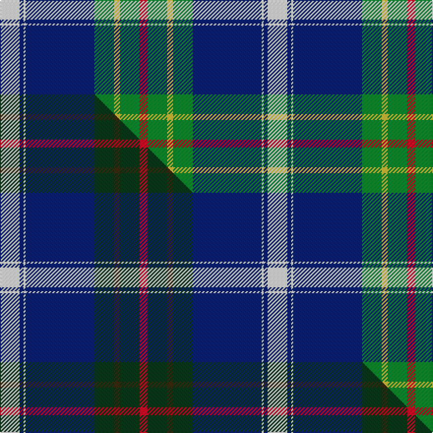

This is one **variant** — a specific cloth: this exact thread count and colourway, with its own
provenance below. It is one weaving of the [sett](/setts/w10db2w1db35g10ly3g10r4/) (the scale-free proportion — the
same cloth at any scale or shade), whose colour order is pattern [RGYGBWBW](/stripes/rgygbwbw/).

Part of the [Sandelin](/tartans/sandelin/) tartan — the named design grouping this sett with its other cloths.

Sourced from register-of-tartans.  It is a [8 stripe tartan](/stripes/stripes8/).

Original link [https://www.tartanregister.gov.uk/tartanDetails.aspx?ref=5395](https://www.tartanregister.gov.uk/tartanDetails.aspx?ref=5395)

2 attestations — the source records this cloth was collapsed from (oldest owns this page)

<ul>
<li>01/01/2007 — Sandelin (Personal) (register-of-tartans, <a href="https://www.tartanregister.gov.uk/tartanDetails.aspx?ref=5395">record</a>)  <em>A family (Martin Sandelin) restricted tartan.</em></li>
<li>pre 2007 — Sandelin (Personal) (tartans-authority, <a href="https://www.tartanregister.gov.uk/tartanDetails.aspx?ref=7145">record</a>)  <em>STWR notes: A family (Martin Sandelin) restricted tartan</em></li>
</ul>

Dataset <small>— provenance for this record, inherited from the source manifest</small>

<dl class="dataset-prov">
<dt>source</dt><dd><a href="/sources/register-of-tartans/">Scottish Register of Tartans</a></dd>
<dt>data captured from</dt><dd><a href="https://github.com/thetartan/tartan-database/blob/master/data/register-of-tartans/data.csv">https://github.com/thetartan/tartan-database/blob/master/data/register-of-tartans/data.csv</a></dd>
<dt>data date</dt><dd>2007 <small>(this record)</small></dd>
<dt>licence</dt><dd><a href="https://www.tartanregister.gov.uk/copyright">Crown copyright</a></dd>
</dl>

Capture chain <small>— the hands this data passed through, oldest first; each capture carries its own licence</small>

<ol class="capture-chain">
<li><a href="https://www.tartanregister.gov.uk/">Scottish Register of Tartans</a> · <a href="https://www.tartanregister.gov.uk/copyright">Crown copyright</a> <small>the living register — still published by National Records of Scotland</small></li>
<li><a href="https://github.com/thetartan/tartan-database">thetartan/tartan-database</a> <small>2016-2017</small> · <a href="https://creativecommons.org/licenses/by-nc-nd/4.0/">CC BY-NC-ND 4.0</a> <small>Levko Kravets's frozen compilation — the capture we vendored, and where its CC licence text came from</small></li>
<li>this dictionary <small>captured 2026-06-10 · commit 5bf86c7566</small> <small>each re-capture is a git commit to data/sources</small></li>
</ol>

## Register references

External register numbers recorded for this tartan.

- Scottish Register of Tartans: [5395](https://www.tartanregister.gov.uk/tartanDetails.aspx?ref=5395)
- Scottish Tartans Authority (ITI): 7145

## Thread count
W/20 DB4 W2 DB70 G20 LY6 G20 R/8

One full sett is **272 threads**.

## Palette
<table><thead><tr><th>Colour</th><th>Shade</th><th>OKLCh</th></tr></thead><tbody><tr><td>DB</td><td><code style="background-color:#082077;">#082077</code> <small style="color:#888">#082077</small></td><td><small style="color:#888">oklch(30.0% 0.149 265.1)</small></td></tr><tr><td>LY</td><td><code style="background-color:#DCBC32;">#DCBC32</code> <small style="color:#888">#DCBC32</small></td><td><small style="color:#888">oklch(80.0% 0.150 95.2)</small></td></tr><tr><td>G</td><td><code style="background-color:#008B2A;">#008B2A</code> <small style="color:#888">#008B2A</small></td><td><small style="color:#888">oklch(55.4% 0.170 145.9)</small></td></tr><tr><td>W</td><td><code style="background-color:#F7F7F7;">#F7F7F7</code> <small style="color:#888">#F7F7F7</small></td><td><small style="color:#888">oklch(97.6% 0.000 89.9)</small></td></tr><tr><td>R</td><td><code style="background-color:#D60020;">#D60020</code> <small style="color:#888">#D60020</small></td><td><small style="color:#888">oklch(55.2% 0.224 25.5)</small></td></tr></tbody></table>

# Sample pattern

## Compared to the master

This cloth is one sett of its design; the master sett (the exemplar the design is anchored on) is below for comparison.

Its **ΔTartan distance** from the master is **0.15** — the same measure the nearest-tartans table ranks by (0 is identical; a re-scale of the same cloth is near 0, a recolour or a different proportion further).

<figure class="master-compare" style="margin:0">

this sett
master sett ★

<figcaption style="color:#888;font-size:smaller">One weave of this sett against the <a href="/setts/w10db2w1db35dg10dy3dg10r4/">master sett ★</a>, split on the diagonal: a shared proportion runs seamlessly across it with only the shades shifting; a different proportion breaks on it.</figcaption>
</figure>

## Nearest tartan variants

The nearest existing variants by ΔTartan distance, with this cloth at the top so the swatches line up against it.

ΔTartan

Threads

Variant

Sett

—

272

<a href="/variants/s8/w10db2w1db35g10ly3g10r4~x2/">Sandelin (Personal)</a>

<a href="/ttd/edit/#slug=w10db2w1db35dg10dy3dg10r4~x2&amp;base=w10db2w1db35g10ly3g10r4~x2" title="compare in the TTD">0.15</a>

272

<a href="/variants/s8/w10db2w1db35dg10dy3dg10r4~x2/">Sandelin #2 (Personal)</a>

<a href="/ttd/edit/#slug=db30r2db4w1o11g4y2g22~x2&amp;base=w10db2w1db35g10ly3g10r4~x2" title="compare in the TTD">1.23</a>

200

<a href="/variants/s8/db30r2db4w1o11g4y2g22~x2/">Yorkland</a>

<a href="/ttd/edit/#slug=db3r3db36g17y2g21w2r3~x2&amp;base=w10db2w1db35g10ly3g10r4~x2" title="compare in the TTD">1.61</a>

336

<a href="/variants/s8/db3r3db36g17y2g21w2r3~x2/">Singh Name Tartan</a>

<a href="/ttd/edit/#slug=db33k1db5k8g8r2g15y1w2~x2&amp;base=w10db2w1db35g10ly3g10r4~x2" title="compare in the TTD">1.84</a>

230

<a href="/variants/s9/db33k1db5k8g8r2g15y1w2~x2/">Mulcahy (Name)</a>

<a href="/ttd/edit/#slug=w2db40g22y3g2r3g2w2~x2&amp;base=w10db2w1db35g10ly3g10r4~x2" title="compare in the TTD">2.18</a>

296

<a href="/variants/s8/w2db40g22y3g2r3g2w2~x2/">Tartan Day SA</a>

<a href="/ttd/edit/#slug=g4y2g24w12db26r1~x2&amp;base=w10db2w1db35g10ly3g10r4~x2" title="compare in the TTD">2.25</a>

266

<a href="/variants/s6/g4y2g24w12db26r1~x2/">Vancouver Centennial Commemorative Tartan</a>

<a href="/ttd/edit/#slug=w2ly4db1ly1db40n6g18r2g2w1~x2&amp;base=w10db2w1db35g10ly3g10r4~x2" title="compare in the TTD">2.27</a>

302

<a href="/variants/s10/w2ly4db1ly1db40n6g18r2g2w1~x2/">O'Mahony, The (Commemorative)</a>

<a href="/ttd/edit/#slug=lb13g2lb12k8r1dt35ly1~x2&amp;base=w10db2w1db35g10ly3g10r4~x2" title="compare in the TTD">2.33</a>

260

<a href="/variants/s7/lb13g2lb12k8r1dt35ly1~x2/">Spirit of South Lanarkshire (Distric</a>

<a href="/ttd/edit/#slug=lb13g2lb12k8r1dt35ly1~x2~g2408144&amp;base=w10db2w1db35g10ly3g10r4~x2" title="compare in the TTD">2.33</a>

260

<a href="/variants/s7/lb13g2lb12k8r1dt35ly1~x2~g2408144/">Spirit of South Lanarkshire</a>

<a href="/ttd/edit/#slug=r3w6r2g32db36k2db4y2~x2&amp;base=w10db2w1db35g10ly3g10r4~x2" title="compare in the TTD">2.33</a>

338

<a href="/variants/s8/r3w6r2g32db36k2db4y2~x2/">Canadian Centennial District Tartan</a>

## Neighbour map

Every grey dot is one of 13621 variants placed by the first two principal components of the ΔTartan feature space (42% of its variance). Red is this tartan; blue dots are its nearest — click one to open its page.

<svg viewBox="0 0 640 380" role="img" style="max-width:100%;height:auto;border:1px solid #e0e0e0;border-radius:4px;display:block" xmlns="http://www.w3.org/2000/svg"><image href="/nn/cloud.v1.png" width="640" height="380"/><a href="/variants/s8/w10db2w1db35dg10dy3dg10r4~x2/"><circle cx="269.1" cy="118.0" r="4" fill="#3465a4"><title>Sandelin #2 (Personal)</title></circle></a><a href="/variants/s8/db30r2db4w1o11g4y2g22~x2/"><circle cx="261.1" cy="126.0" r="4" fill="#3465a4"><title>Yorkland</title></circle></a><a href="/variants/s8/db3r3db36g17y2g21w2r3~x2/"><circle cx="275.2" cy="156.9" r="4" fill="#3465a4"><title>Singh Name Tartan</title></circle></a><a href="/variants/s9/db33k1db5k8g8r2g15y1w2~x2/"><circle cx="247.0" cy="87.6" r="4" fill="#3465a4"><title>Mulcahy (Name)</title></circle></a><a href="/variants/s8/w2db40g22y3g2r3g2w2~x2/"><circle cx="305.9" cy="128.2" r="4" fill="#3465a4"><title>Tartan Day SA</title></circle></a><a href="/variants/s6/g4y2g24w12db26r1~x2/"><circle cx="218.1" cy="161.2" r="4" fill="#3465a4"><title>Vancouver Centennial Commemorative Tartan</title></circle></a><a href="/variants/s10/w2ly4db1ly1db40n6g18r2g2w1~x2/"><circle cx="301.0" cy="73.2" r="4" fill="#3465a4"><title>O'Mahony, The (Commemorative)</title></circle></a><a href="/variants/s7/lb13g2lb12k8r1dt35ly1~x2/"><circle cx="228.3" cy="93.2" r="4" fill="#3465a4"><title>Spirit of South Lanarkshire (Distric</title></circle></a><a href="/variants/s7/lb13g2lb12k8r1dt35ly1~x2~g2408144/"><circle cx="228.0" cy="93.1" r="4" fill="#3465a4"><title>Spirit of South Lanarkshire</title></circle></a><a href="/variants/s8/r3w6r2g32db36k2db4y2~x2/"><circle cx="218.7" cy="114.4" r="4" fill="#3465a4"><title>Canadian Centennial District Tartan</title></circle></a><circle cx="259.6" cy="118.2" r="5" fill="#c00000"/><text x="320" y="376" text-anchor="middle" font-size="11" fill="#999">ground</text><text x="11" y="190" text-anchor="middle" font-size="11" fill="#999" transform="rotate(-90 11 190)">complexity</text></svg>

ID: /variants/s8/w10db2w1db35g10ly3g10r4~x2/
