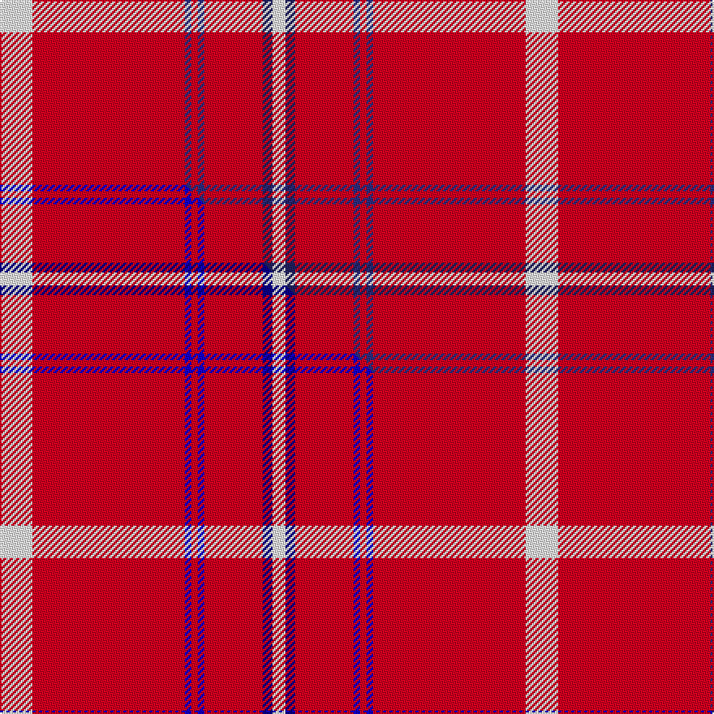

This page is one **sett** — a single exact thread-count. It belongs to the [tartan](/setts/w10r47dbi2r2dbi2r18db3w4/)
(the same proportion at any scale), whose colour order is pattern [WBRBRBRW](/stripes/wbrbrbrw/).

Part of the [Swiss National](/tartans/swiss-national/) tartan — the named design grouping this sett with its other cloths.

Sourced from tartans-authority.  It is a [8 stripe tartan](/stripes/stripes8/).

Original link http://www.tartansauthority.com/tartan-ferret/display/10491/

## Register references

External register numbers recorded for this tartan.

- Scottish Register of Tartans: [10491](https://www.tartanregister.gov.uk/tartanDetails?ref=10491)
- Scottish Tartans Authority (ITI): 10491

## Thread count
W/20 R94 DBi4 R4 DBi4 R36 DB6 W/8

One full sett is **324 threads**.

## Palette
<table><thead><tr><th>Colour</th><th>Shade</th><th>OKLCh</th></tr></thead><tbody><tr><td>DB</td><td><code style="background-color:#2C2C80;">#2C2C80</code> <small style="color:#888">#2C2C80</small></td><td><small style="color:#888">oklch(35.0% 0.138 276.6)</small></td></tr><tr><td>DB</td><td><code style="background-color:#202060;">#202060</code> <small style="color:#888">#202060</small></td><td><small style="color:#888">oklch(28.9% 0.111 276.9)</small></td></tr><tr><td>W</td><td><code style="background-color:#F7F7F7;">#F7F7F7</code> <small style="color:#888">#F7F7F7</small></td><td><small style="color:#888">oklch(97.6% 0.000 89.9)</small></td></tr><tr><td>R</td><td><code style="background-color:#D60020;">#D60020</code> <small style="color:#888">#D60020</small></td><td><small style="color:#888">oklch(55.2% 0.224 25.5)</small></td></tr></tbody></table>

# Sample pattern

## Compared to the master

This cloth is one sett of its design; the master sett (the exemplar the design is anchored on) is below for comparison.

Its **ΔTartan distance** from the master is **0.02** — the same measure the nearest-tartans table ranks by (0 is identical; a re-scale of the same cloth is near 0, a recolour or a different proportion further).

<figure class="master-compare" style="margin:0">

this sett
master sett ★

<figcaption style="color:#888;font-size:smaller">One weave of this sett against the <a href="/setts/w10r47b2r2b2r18db3w4/">master sett ★</a>, split on the diagonal: a shared proportion runs seamlessly across it with only the shades shifting; a different proportion breaks on it.</figcaption>
</figure>

## Nearest tartan variants

The nearest existing variants by ΔTartan distance, with this cloth at the top so the swatches line up against it.

ΔTartan

Threads

Variant

Sett

—

324

<a href="/variants/s8/w10r47dbi2r2dbi2r18db3w4~x2~dbi1406275-db1204274/">Swiss National (Fashion)</a>

<a href="/ttd/edit/#slug=w10r47b2r2b2r18db3w4~x2~b1611266-db1108266&amp;base=w10r47dbi2r2dbi2r18db3w4~x2~dbi1406275-db1204274" title="compare in the TTD">0.02</a>

324

<a href="/variants/s8/w10r47b2r2b2r18db3w4~x2~b1511266-db1108266/">Swiss National</a>

<a href="/ttd/edit/#slug=r52dg2r2dg2r3w3db2w2db2~x4&amp;base=w10r47dbi2r2dbi2r18db3w4~x2~dbi1406275-db1204274" title="compare in the TTD">1.68</a>

344

<a href="/variants/s9/r52dg2r2dg2r3w3db2w2db2~x4/">Prince of Denmark (Corporate)</a>

<a href="/ttd/edit/#slug=r80w7k2w2k2r3k7r2b12k2~x2&amp;base=w10r47dbi2r2dbi2r18db3w4~x2~dbi1406275-db1204274" title="compare in the TTD">2.23</a>

312

<a href="/variants/s10/r80w7k2w2k2r3k7r2b12k2~x2/">Masai Shuka 05 (Artefact)</a>

<a href="/ttd/edit/#slug=g2r28db6r5db2r2db2r11w2~x2&amp;base=w10r47dbi2r2dbi2r18db3w4~x2~dbi1406275-db1204274" title="compare in the TTD">2.42</a>

232

<a href="/variants/s9/g2r28db6r5db2r2db2r11w2~x2/">Rose</a>

<a href="/ttd/edit/#slug=g2r28db6r5db2r2db2r11w2&amp;base=w10r47dbi2r2dbi2r18db3w4~x2~dbi1406275-db1204274" title="compare in the TTD">2.42</a>

116

<a href="/variants/s9/g2r28db6r5db2r2db2r11w2/">Rose</a>

<a href="/ttd/edit/#slug=r51dy2r2dy2r3w3db2w2db2w8~x2&amp;base=w10r47dbi2r2dbi2r18db3w4~x2~dbi1406275-db1204274" title="compare in the TTD">2.47</a>

190

<a href="/variants/s10/r51dy2r2dy2r3w3db2w2db2w8~x2/">Prince of Denmark</a>

<a href="/ttd/edit/#slug=g4r32db9r6db2r3db2r12w3~x2&amp;base=w10r47dbi2r2dbi2r18db3w4~x2~dbi1406275-db1204274" title="compare in the TTD">2.58</a>

278

<a href="/variants/s9/g4r32db9r6db2r3db2r12w3~x2/">Rose</a>

<a href="/ttd/edit/#slug=r92db10r8w3r8g4r8lo3~x2&amp;base=w10r47dbi2r2dbi2r18db3w4~x2~dbi1406275-db1204274" title="compare in the TTD">2.64</a>

354

<a href="/variants/s8/r92db10r8w3r8g4r8lo3~x2/">Burnett of Leys</a>

<a href="/ttd/edit/#slug=r51lr2k11ly3r11ly3r11g3~x2&amp;base=w10r47dbi2r2dbi2r18db3w4~x2~dbi1406275-db1204274" title="compare in the TTD">2.70</a>

272

<a href="/variants/s8/r51lr2k11ly3r11ly3r11g3~x2/">Hackston (Green stripe) (Portrait)</a>

<a href="/ttd/edit/#slug=r68db26r5y3r5g3r13n3~x2&amp;base=w10r47dbi2r2dbi2r18db3w4~x2~dbi1406275-db1204274" title="compare in the TTD">2.73</a>

362

<a href="/variants/s8/r68db26r5y3r5g3r13n3~x2/">De Nardi (Personal)</a>

## Neighbour map

Every grey dot is one of 13620 variants placed by the first two principal components of the ΔTartan feature space (42% of its variance). Red is this tartan; blue dots are its nearest — click one to open its page.

<svg viewBox="0 0 640 380" role="img" style="max-width:100%;height:auto;border:1px solid #e0e0e0;border-radius:4px;display:block" xmlns="http://www.w3.org/2000/svg"><image href="/nn/cloud.v1.png" width="640" height="380"/><a href="/variants/s8/w10r47b2r2b2r18db3w4~x2~b1511266-db1108266/"><circle cx="486.9" cy="117.7" r="4" fill="#3465a4"><title>Swiss National</title></circle></a><a href="/variants/s9/r52dg2r2dg2r3w3db2w2db2~x4/"><circle cx="570.3" cy="83.7" r="4" fill="#3465a4"><title>Prince of Denmark (Corporate)</title></circle></a><a href="/variants/s10/r80w7k2w2k2r3k7r2b12k2~x2/"><circle cx="438.3" cy="42.9" r="4" fill="#3465a4"><title>Masai Shuka 05 (Artefact)</title></circle></a><a href="/variants/s9/g2r28db6r5db2r2db2r11w2~x2/"><circle cx="487.3" cy="143.8" r="4" fill="#3465a4"><title>Rose</title></circle></a><a href="/variants/s9/g2r28db6r5db2r2db2r11w2/"><circle cx="487.3" cy="143.8" r="4" fill="#3465a4"><title>Rose</title></circle></a><a href="/variants/s10/r51dy2r2dy2r3w3db2w2db2w8~x2/"><circle cx="474.1" cy="81.0" r="4" fill="#3465a4"><title>Prince of Denmark</title></circle></a><a href="/variants/s9/g4r32db9r6db2r3db2r12w3~x2/"><circle cx="447.3" cy="144.7" r="4" fill="#3465a4"><title>Rose</title></circle></a><a href="/variants/s8/r92db10r8w3r8g4r8lo3~x2/"><circle cx="616.2" cy="88.7" r="4" fill="#3465a4"><title>Burnett of Leys</title></circle></a><a href="/variants/s8/r51lr2k11ly3r11ly3r11g3~x2/"><circle cx="454.8" cy="90.4" r="4" fill="#3465a4"><title>Hackston (Green stripe) (Portrait)</title></circle></a><a href="/variants/s8/r68db26r5y3r5g3r13n3~x2/"><circle cx="471.9" cy="114.2" r="4" fill="#3465a4"><title>De Nardi (Personal)</title></circle></a><circle cx="494.1" cy="119.6" r="5" fill="#c00000"/><text x="320" y="376" text-anchor="middle" font-size="11" fill="#999">ground</text><text x="11" y="190" text-anchor="middle" font-size="11" fill="#999" transform="rotate(-90 11 190)">complexity</text></svg>

ID: /variants/s8/w10r47dbi2r2dbi2r18db3w4~x2~dbi1406275-db1204274/
