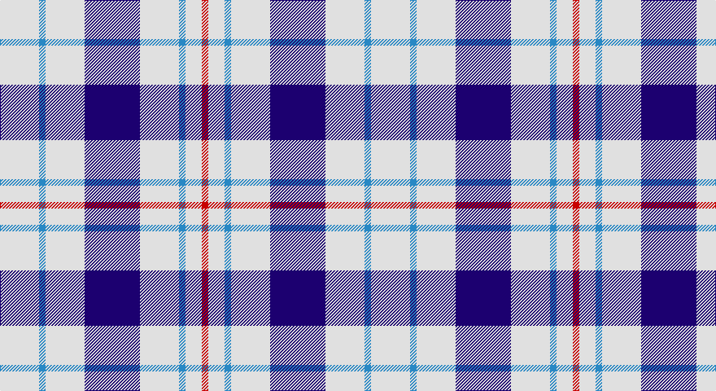

This page is one **sett** — a single exact thread-count. It belongs to the [tartan](/setts/w12t2w12db17w12t2w5r2/)
(the same proportion at any scale), whose colour order is pattern [RWBWBWBW](/stripes/rwbwbwbw/).

Part of the [Milne Royal Blue Dress](/tartans/milne-royal-blue-dress/) tartan — the named design grouping this sett with its other cloths.

Sourced from register-of-tartans.  It is a [8 stripe tartan](/stripes/stripes8/).

Original link https://www.tartanregister.gov.uk/tartanDetails.aspx?ref=2957

## Also known as

This cloth is also recorded under:

- Milne Dress, Royal Blue

2 attestations — the source records this cloth was collapsed from (oldest owns this page)

<ul>
<li>01/01/2005 — Milne Royal Blue Dress (Dance) (register-of-tartans, <a href="https://www.tartanregister.gov.uk/tartanDetails.aspx?ref=2957">record</a>)</li>
<li>pre 2005 — Milne Dress, Royal Blue (Dance) (tartans-authority, <a href="http://www.tartansauthority.com/tartan-ferret/display/6547/">record</a>)</li>
</ul>

## Register references

External register numbers recorded for this tartan.

- Scottish Register of Tartans: [2957](https://www.tartanregister.gov.uk/tartanDetails.aspx?ref=2957)
- Scottish Tartans Authority (ITI): 6547

## Thread count
LN/48 B8 LN48 DB68 LN48 B8 LN20 R/8

One full sett is **456 threads**.

## Palette

Palette: <strong>Tartan Register</strong>
<table><thead><tr><th>Colour</th><th>Threads</th><th>Shade</th><th>Base</th><th>OKLCh</th></tr></thead><tbody><tr><td>LN/</td><td style="text-align:right;font-variant-numeric:tabular-nums">48</td><td><code style="background-color:#E0E0E0;">#E0E0E0</code> <small style="color:#888">#E0E0E0</small></td><td>W <code style="background-color:#F7F7F7;">#F7F7F7</code></td><td><small style="color:#888">oklch(90.7% 0.000 89.9)</small></td></tr><tr><td>B</td><td style="text-align:right;font-variant-numeric:tabular-nums">8</td><td><code style="background-color:#2888C4;">#2888C4</code> <small style="color:#888">#2888C4</small></td><td>B <code style="background-color:#2A418A;">#2A418A</code></td><td><small style="color:#888">oklch(60.1% 0.125 241.5)</small></td></tr><tr><td>LN</td><td style="text-align:right;font-variant-numeric:tabular-nums">48</td><td><code style="background-color:#E0E0E0;">#E0E0E0</code> <small style="color:#888">#E0E0E0</small></td><td>W <code style="background-color:#F7F7F7;">#F7F7F7</code></td><td><small style="color:#888">oklch(90.7% 0.000 89.9)</small></td></tr><tr><td>DB</td><td style="text-align:right;font-variant-numeric:tabular-nums">68</td><td><code style="background-color:#1C0070;">#1C0070</code> <small style="color:#888">#1C0070</small></td><td>B <code style="background-color:#2A418A;">#2A418A</code></td><td><small style="color:#888">oklch(26.3% 0.162 277.1)</small></td></tr><tr><td>LN</td><td style="text-align:right;font-variant-numeric:tabular-nums">48</td><td><code style="background-color:#E0E0E0;">#E0E0E0</code> <small style="color:#888">#E0E0E0</small></td><td>W <code style="background-color:#F7F7F7;">#F7F7F7</code></td><td><small style="color:#888">oklch(90.7% 0.000 89.9)</small></td></tr><tr><td>B</td><td style="text-align:right;font-variant-numeric:tabular-nums">8</td><td><code style="background-color:#2888C4;">#2888C4</code> <small style="color:#888">#2888C4</small></td><td>B <code style="background-color:#2A418A;">#2A418A</code></td><td><small style="color:#888">oklch(60.1% 0.125 241.5)</small></td></tr><tr><td>LN</td><td style="text-align:right;font-variant-numeric:tabular-nums">20</td><td><code style="background-color:#E0E0E0;">#E0E0E0</code> <small style="color:#888">#E0E0E0</small></td><td>W <code style="background-color:#F7F7F7;">#F7F7F7</code></td><td><small style="color:#888">oklch(90.7% 0.000 89.9)</small></td></tr><tr><td>R/</td><td style="text-align:right;font-variant-numeric:tabular-nums">8</td><td><code style="background-color:#C80000;">#C80000</code> <small style="color:#888">#C80000</small></td><td>R <code style="background-color:#CC0000;">#CC0000</code></td><td><small style="color:#888">oklch(52.3% 0.215 29.2)</small></td></tr></tbody></table>

# Sample pattern

## Nearest tartans

The nearest existing variants by ΔTartan distance, with this tartan at the top so the swatches line up against it.

ΔTartan

Tartan

Sett

—

<a href="/ttd/edit/#slug=w12t2w12db17w12t2w5r2~x4">Milne Royal Blue Dress (Dance)</a> <a class="nn-out" href="/variants/s8/w12t2w12db17w12t2w5r2~x4/" title="open its dictionary page">↗</a>

0.55

<a href="/ttd/edit/#slug=w24n5w24db36w28n6w12r6&amp;base=w12t2w12db17w12t2w5r2~x4">Milne Royal Blue Dress Fashion Tartan</a> <a class="nn-out" href="/variants/s8/w24n5w24db36w28n6w12r6/" title="open its dictionary page">↗</a>

1.12

<a href="/ttd/edit/#slug=w13r3w2k5w2r3w13db8~x2&amp;base=w12t2w12db17w12t2w5r2~x4">Boswell Dress Personal Tartan</a> <a class="nn-out" href="/variants/s8/w13r3w2k5w2r3w13db8~x2/" title="open its dictionary page">↗</a>

1.35

<a href="/ttd/edit/#slug=w7db16w20db3w3ly3~x2&amp;base=w12t2w12db17w12t2w5r2~x4">Unidentified (Shirt)</a> <a class="nn-out" href="/variants/s6/w7db16w20db3w3ly3~x2/" title="open its dictionary page">↗</a>

1.49

<a href="/ttd/edit/#slug=w5db16w5db16w33r3~x2&amp;base=w12t2w12db17w12t2w5r2~x4">Buchanan Dress Blue (Dance)</a> <a class="nn-out" href="/variants/s6/w5db16w5db16w33r3~x2/" title="open its dictionary page">↗</a>

1.51

<a href="/ttd/edit/#slug=w12db2w12m17w12db2w5r2~x4&amp;base=w12t2w12db17w12t2w5r2~x4">Milne Purple Dress (Dance)</a> <a class="nn-out" href="/variants/s8/w12db2w12m17w12db2w5r2~x4/" title="open its dictionary page">↗</a>

1.57

<a href="/ttd/edit/#slug=w1b3w3b1w5k1w2k3lo1~x4&amp;base=w12t2w12db17w12t2w5r2~x4">Henderson Dress (Dance)</a> <a class="nn-out" href="/variants/s9/w1b3w3b1w5k1w2k3lo1~x4/" title="open its dictionary page">↗</a>

1.58

<a href="/ttd/edit/#slug=w5r3w26db21w3db8ly3~x2&amp;base=w12t2w12db17w12t2w5r2~x4">MacPherson, Blue &amp; White</a> <a class="nn-out" href="/variants/s7/w5r3w26db21w3db8ly3~x2/" title="open its dictionary page">↗</a>

1.60

<a href="/ttd/edit/#slug=b12ly1w16b1w1b14w3b14r2~x4&amp;base=w12t2w12db17w12t2w5r2~x4">Orlando Dress, City of (District)</a> <a class="nn-out" href="/variants/s9/b12ly1w16b1w1b14w3b14r2~x4/" title="open its dictionary page">↗</a>

1.62

<a href="/ttd/edit/#slug=w5k3w26db21w3db8ly3~x2&amp;base=w12t2w12db17w12t2w5r2~x4">MacPherson Dress Blue (Dance)</a> <a class="nn-out" href="/variants/s7/w5k3w26db21w3db8ly3~x2/" title="open its dictionary page">↗</a>

1.71

<a href="/ttd/edit/#slug=w24g2w8db5ly4db5ly4~x2&amp;base=w12t2w12db17w12t2w5r2~x4">Clackson Arisaid (Name?)</a> <a class="nn-out" href="/variants/s7/w24g2w8db5ly4db5ly4~x2/" title="open its dictionary page">↗</a>

## Neighbour map

Every grey dot is one of 14360 variants placed by the first two principal components of the ΔTartan feature space (44% of its variance). Red is this tartan; blue dots are its nearest — click one to open its page.

<svg viewBox="0 0 640 380" role="img" style="max-width:100%;height:auto;border:1px solid #e0e0e0;border-radius:4px;display:block" xmlns="http://www.w3.org/2000/svg"><image href="/nn/cloud.v1.png" width="640" height="380"/><a href="/variants/s8/w24n5w24db36w28n6w12r6/"><circle cx="261.3" cy="202.6" r="4" fill="#3465a4"><title>Milne Royal Blue Dress Fashion Tartan</title></circle></a><a href="/variants/s8/w13r3w2k5w2r3w13db8~x2/"><circle cx="245.4" cy="191.5" r="4" fill="#3465a4"><title>Boswell Dress Personal Tartan</title></circle></a><a href="/variants/s6/w7db16w20db3w3ly3~x2/"><circle cx="285.1" cy="219.6" r="4" fill="#3465a4"><title>Unidentified (Shirt)</title></circle></a><a href="/variants/s6/w5db16w5db16w33r3~x2/"><circle cx="282.6" cy="195.7" r="4" fill="#3465a4"><title>Buchanan Dress Blue (Dance)</title></circle></a><a href="/variants/s8/w12db2w12m17w12db2w5r2~x4/"><circle cx="296.4" cy="183.9" r="4" fill="#3465a4"><title>Milne Purple Dress (Dance)</title></circle></a><a href="/variants/s9/w1b3w3b1w5k1w2k3lo1~x4/"><circle cx="173.3" cy="206.1" r="4" fill="#3465a4"><title>Henderson Dress (Dance)</title></circle></a><a href="/variants/s7/w5r3w26db21w3db8ly3~x2/"><circle cx="240.9" cy="178.8" r="4" fill="#3465a4"><title>MacPherson, Blue &amp; White</title></circle></a><a href="/variants/s9/b12ly1w16b1w1b14w3b14r2~x4/"><circle cx="339.5" cy="160.7" r="4" fill="#3465a4"><title>Orlando Dress, City of (District)</title></circle></a><a href="/variants/s7/w5k3w26db21w3db8ly3~x2/"><circle cx="234.0" cy="178.1" r="4" fill="#3465a4"><title>MacPherson Dress Blue (Dance)</title></circle></a><a href="/variants/s7/w24g2w8db5ly4db5ly4~x2/"><circle cx="303.2" cy="162.2" r="4" fill="#3465a4"><title>Clackson Arisaid (Name?)</title></circle></a><circle cx="280.4" cy="189.0" r="5" fill="#c00000"/></svg>

ID: /variants/s8/w12t2w12db17w12t2w5r2~x4/
