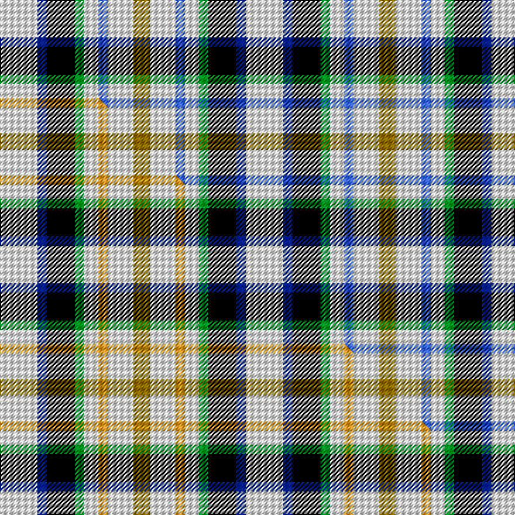

This is one **variant** — a specific cloth: this exact thread count and colourway, with its own
provenance below. It is one weaving of the [sett](/tartans/m/ma/maclaren-3/) (the scale-free proportion — the
same cloth at any scale or shade), whose colour order is pattern [GWBWGKBW](/stripes/gwbwgkbw/).

Part of the [MacLaren](/tartans/m/ma/maclaren-3/) tartan — the named design grouping this sett with its other cloths.

Sourced from weddslist.  It is a [8 stripe tartan](/stripes/stripes8/).

Original link [http://www.weddslist.com/cgi-bin/tartans/pg.pl?source=sts](http://www.weddslist.com/cgi-bin/tartans/pg.pl?source=sts)

Dataset <small>— provenance for this record, inherited from the source manifest</small>

<dl class="dataset-prov">
<dt>source</dt><dd><a href="/sources/weddslist/">Weddslist</a></dd>
<dt>data captured from</dt><dd><a href="https://github.com/thetartan/tartan-database/blob/master/data/weddslist/data.csv">https://github.com/thetartan/tartan-database/blob/master/data/weddslist/data.csv</a></dd>
<dt>data date</dt><dd>2016-11-17 <small>(dataset default)</small></dd>
<dt>licence</dt><dd><a href="https://creativecommons.org/licenses/by-nc-nd/4.0/">CC BY-NC-ND 4.0</a></dd>
</dl>

Capture chain <small>— the hands this data passed through, oldest first; each capture carries its own licence</small>

<ol class="capture-chain">
<li><a href="https://www.weddslist.com/tartans/">Weddslist</a> <small>the living privately compiled reference</small></li>
<li><a href="https://github.com/thetartan/tartan-database">thetartan/tartan-database</a> <small>2016-2017</small> · <a href="https://creativecommons.org/licenses/by-nc-nd/4.0/">CC BY-NC-ND 4.0</a> <small>Levko Kravets's frozen compilation — the capture we vendored, and where its CC licence text came from</small></li>
<li>this dictionary <small>captured 2026-06-10 · commit 5bf86c7566</small> <small>each re-capture is a git commit to data/sources</small></li>
</ol>

## Thread count
W/32 DB8 K24 G8 W12 B8 W22 Y/14

One full sett is **210 threads**.

## Palette
<table><thead><tr><th>Colour</th><th>Shade</th><th>OKLCh</th></tr></thead><tbody><tr><td>DB</td><td><code style="background-color:#082077;">#082077</code> <small style="color:#888">#082077</small></td><td><small style="color:#888">oklch(30.0% 0.149 265.1)</small></td></tr><tr><td>G</td><td><code style="background-color:#008B2A;">#008B2A</code> <small style="color:#888">#008B2A</small></td><td><small style="color:#888">oklch(55.4% 0.170 145.9)</small></td></tr><tr><td>K</td><td><code style="background-color:#000000;">#000000</code> <small style="color:#888">#000000</small></td><td><small style="color:#888">oklch(0.0% 0.000 0.0)</small></td></tr><tr><td>W</td><td><code style="background-color:#F7F7F7;">#F7F7F7</code> <small style="color:#888">#F7F7F7</small></td><td><small style="color:#888">oklch(97.6% 0.000 89.9)</small></td></tr><tr><td>B</td><td><code style="background-color:#466CC8;">#466CC8</code> <small style="color:#888">#466CC8</small></td><td><small style="color:#888">oklch(55.1% 0.149 265.0)</small></td></tr><tr><td>Y</td><td><code style="background-color:#8B6E00;">#8B6E00</code> <small style="color:#888">#8B6E00</small></td><td><small style="color:#888">oklch(55.1% 0.113 90.4)</small></td></tr></tbody></table>

# Sample pattern

[Sample sheet (PDF)](swatch.pdf) — the woven sample, thread count and palette on one printable A4, rendered on demand (the same sheet the TTD print page downloads).

## Compared to the master

This cloth is one sett of its design; the master sett (the exemplar the design is anchored on) is below for comparison.

Its **ΔTartan distance** from the master is **0.30** — the same measure the nearest-tartans table ranks by (0 is identical; a re-scale of the same cloth is near 0, a recolour or a different proportion further).

<figure class="master-compare" style="margin:0">

this sett
master sett ★

<figcaption style="color:#888;font-size:smaller">One weave of this sett against the <a href="/setts/w16db4k12g4w6lo4w11y7/">master sett ★</a>, split on the diagonal: a shared proportion runs seamlessly across it with only the shades shifting; a different proportion breaks on it.</figcaption>
</figure>

## Nearest tartan variants

The nearest existing variants by ΔTartan distance, with this cloth at the top so the swatches line up against it.

ΔTartan

Threads

Variant

Sett

—

210

<a href="/variants/s8/w16db4k12g4w6b4w11y7~x2/">MacLaren</a>

<a href="/ttd/edit/#slug=w16db4k12g4w6lo4w11y7~x2&amp;base=w16db4k12g4w6b4w11y7~x2" title="compare in the TTD">0.30</a>

210

<a href="/variants/s8/w16db4k12g4w6lo4w11y7~x2/">MacLaren (D.C Dalgliesh version)</a>

<a href="/ttd/edit/#slug=w16db4k12dg4w6lo4w11y7~x2&amp;base=w16db4k12g4w6b4w11y7~x2" title="compare in the TTD">0.33</a>

210

<a href="/variants/s8/w16db4k12dg4w6lo4w11y7~x2/">MacLaren Dress (Dance)</a>

<a href="/ttd/edit/#slug=w8b2k6dg2w3o2w6ly4~x4&amp;base=w16db4k12g4w6b4w11y7~x2" title="compare in the TTD">0.44</a>

216

<a href="/variants/s8/w8b2k6dg2w3o2w6ly4~x4/">MacLaren Albino (Dance)</a>

<a href="/ttd/edit/#slug=dr4wi2w8dg2w8k3wi2db4~x4~wi90-w8504057&amp;base=w16db4k12g4w6b4w11y7~x2" title="compare in the TTD">2.01</a>

232

<a href="/variants/s8/dr4wi2w8dg2w8k3wi2db4~x4~wi90-w8504057/">Desang (Corporate)</a>

<a href="/ttd/edit/#slug=dr4wi2w8dg2w8k3wi2db4~x2~wi90-w8504057&amp;base=w16db4k12g4w6b4w11y7~x2" title="compare in the TTD">2.01</a>

116

<a href="/variants/s8/dr4wi2w8dg2w8k3wi2db4~x2~wi90-w8504057/">Desang</a>

<a href="/ttd/edit/#slug=w4k1w4g6k4w5r1lb2~x2&amp;base=w16db4k12g4w6b4w11y7~x2" title="compare in the TTD">2.58</a>

96

<a href="/variants/s8/w4k1w4g6k4w5r1lb2~x2/">MacDuff Dress</a>

<a href="/ttd/edit/#slug=b8w13r3w2k5~x2&amp;base=w16db4k12g4w6b4w11y7~x2" title="compare in the TTD">3.15</a>

98

<a href="/variants/s5/b8w13r3w2k5~x2/">Boswell Dress (Personal)</a>

<a href="/ttd/edit/#slug=k6w11lb11r13db17w10k2w4~x2&amp;base=w16db4k12g4w6b4w11y7~x2" title="compare in the TTD">3.31</a>

276

<a href="/variants/s8/k6w11lb11r13db17w10k2w4~x2/">Edinburgh Tatttoo Dress (Corporate)</a>

<a href="/ttd/edit/#slug=k3db10ly5db16g3w16g5w3~x2&amp;base=w16db4k12g4w6b4w11y7~x2" title="compare in the TTD">3.48</a>

232

<a href="/variants/s8/k3db10ly5db16g3w16g5w3~x2/">Ship Hector, The (Commemorative)</a>

<a href="/ttd/edit/#slug=k4db9y6db22g4w20g6w4&amp;base=w16db4k12g4w6b4w11y7~x2" title="compare in the TTD">3.67</a>

142

<a href="/variants/s8/k4db9y6db22g4w20g6w4/">Ship Hector</a>

## Neighbour map

Every grey dot is one of 13662 variants placed by the first two principal components of the ΔTartan feature space (42% of its variance). Red is this tartan; blue dots are its nearest — click one to open its page. The map is a flat projection of a many-dimensional space — [how to read it](/posts/neighbourhood-maps/).

<svg viewBox="0 0 640 380" role="img" style="max-width:100%;height:auto;border:1px solid #e0e0e0;border-radius:4px;display:block" xmlns="http://www.w3.org/2000/svg"><image href="/nn/cloud.v1.png" width="640" height="380"/><a href="/variants/s8/w16db4k12g4w6lo4w11y7~x2/"><circle cx="98.1" cy="214.1" r="4" fill="#3465a4"><title>MacLaren (D.C Dalgliesh version)</title></circle></a><a href="/variants/s8/w16db4k12dg4w6lo4w11y7~x2/"><circle cx="97.8" cy="213.3" r="4" fill="#3465a4"><title>MacLaren Dress (Dance)</title></circle></a><a href="/variants/s8/w8b2k6dg2w3o2w6ly4~x4/"><circle cx="97.6" cy="214.8" r="4" fill="#3465a4"><title>MacLaren Albino (Dance)</title></circle></a><a href="/variants/s8/dr4wi2w8dg2w8k3wi2db4~x4~wi90-w8504057/"><circle cx="101.3" cy="215.4" r="4" fill="#3465a4"><title>Desang (Corporate)</title></circle></a><a href="/variants/s8/dr4wi2w8dg2w8k3wi2db4~x2~wi90-w8504057/"><circle cx="101.3" cy="215.4" r="4" fill="#3465a4"><title>Desang</title></circle></a><a href="/variants/s8/w4k1w4g6k4w5r1lb2~x2/"><circle cx="114.0" cy="217.3" r="4" fill="#3465a4"><title>MacDuff Dress</title></circle></a><a href="/variants/s5/b8w13r3w2k5~x2/"><circle cx="170.0" cy="230.2" r="4" fill="#3465a4"><title>Boswell Dress (Personal)</title></circle></a><a href="/variants/s8/k6w11lb11r13db17w10k2w4~x2/"><circle cx="65.8" cy="210.2" r="4" fill="#3465a4"><title>Edinburgh Tatttoo Dress (Corporate)</title></circle></a><a href="/variants/s8/k3db10ly5db16g3w16g5w3~x2/"><circle cx="112.5" cy="205.6" r="4" fill="#3465a4"><title>Ship Hector, The (Commemorative)</title></circle></a><a href="/variants/s8/k4db9y6db22g4w20g6w4/"><circle cx="111.4" cy="199.9" r="4" fill="#3465a4"><title>Ship Hector</title></circle></a><circle cx="97.6" cy="214.5" r="5" fill="#c00000"/><text x="320" y="376" text-anchor="middle" font-size="11" fill="#999">ground</text><text x="11" y="190" text-anchor="middle" font-size="11" fill="#999" transform="rotate(-90 11 190)">complexity</text></svg>

ID: /variants/s8/w16db4k12g4w6b4w11y7~x2/
