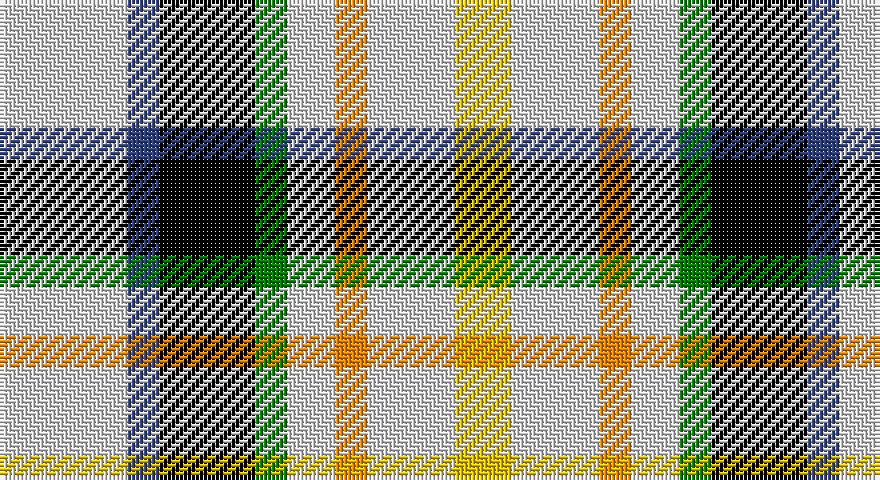

This page is one **sett** — a single exact thread-count. It belongs to the [tartan](/setts/w16db4k12g4w6lo4w11ly7/)
(the same proportion at any scale), whose colour order is pattern [WBKGWYWY](/stripes/wbkgwywy/).

Part of the [MacLaren](/tartans/maclaren/) tartan — the named design grouping this sett with its other cloths.

Sourced from weddslist.  It is a [8 stripe tartan](/stripes/stripes8/).

Original link http://www.weddslist.com/cgi-bin/tartans/pg.pl?source=sts

## Also known as

This cloth is also recorded under:

- MacLaren #2

## Thread count
LN/32 B8 K24 G8 LN12 O8 LN22 Y/14

One full sett is **210 threads**.

## Palette

Palette: <strong>Tartan Register</strong> <small style="color:#888">(2 of 6 colours)</small>
<table><thead><tr><th>Colour</th><th>Threads</th><th>Shade</th><th>Base</th><th>OKLCh</th></tr></thead><tbody><tr><td>LN/</td><td style="text-align:right;font-variant-numeric:tabular-nums">32</td><td><code style="background-color:#E0E0E0;">#E0E0E0</code> <small style="color:#888">#E0E0E0</small></td><td>W <code style="background-color:#F7F7F7;">#F7F7F7</code></td><td><small style="color:#888">oklch(90.7% 0.000 89.9)</small></td></tr><tr><td>B</td><td style="text-align:right;font-variant-numeric:tabular-nums">8</td><td><code style="background-color:#304080;">#304080</code> <small style="color:#888">#304080</small></td><td>B <code style="background-color:#2A418A;">#2A418A</code></td><td><small style="color:#888">oklch(39.4% 0.109 270.2)</small></td></tr><tr><td>K</td><td style="text-align:right;font-variant-numeric:tabular-nums">24</td><td><code style="background-color:#000000;">#000000</code> <small style="color:#888">#000000</small></td><td>K <code style="background-color:#000000;">#000000</code></td><td><small style="color:#888">oklch(0.0% 0.000 0.0)</small></td></tr><tr><td>G</td><td style="text-align:right;font-variant-numeric:tabular-nums">8</td><td><code style="background-color:#008000;">#008000</code> <small style="color:#888">#008000</small></td><td>G <code style="background-color:#006100;">#006100</code></td><td><small style="color:#888">oklch(52.0% 0.177 142.5)</small></td></tr><tr><td>LN</td><td style="text-align:right;font-variant-numeric:tabular-nums">12</td><td><code style="background-color:#E0E0E0;">#E0E0E0</code> <small style="color:#888">#E0E0E0</small></td><td>W <code style="background-color:#F7F7F7;">#F7F7F7</code></td><td><small style="color:#888">oklch(90.7% 0.000 89.9)</small></td></tr><tr><td>O</td><td style="text-align:right;font-variant-numeric:tabular-nums">8</td><td><code style="background-color:#FF8500;">#FF8500</code> <small style="color:#888">#FF8500</small></td><td>Y <code style="background-color:#F2BF00;">#F2BF00</code></td><td><small style="color:#888">oklch(74.0% 0.183 55.1)</small></td></tr><tr><td>LN</td><td style="text-align:right;font-variant-numeric:tabular-nums">22</td><td><code style="background-color:#E0E0E0;">#E0E0E0</code> <small style="color:#888">#E0E0E0</small></td><td>W <code style="background-color:#F7F7F7;">#F7F7F7</code></td><td><small style="color:#888">oklch(90.7% 0.000 89.9)</small></td></tr><tr><td>Y/</td><td style="text-align:right;font-variant-numeric:tabular-nums">14</td><td><code style="background-color:#F0C000;">#F0C000</code> <small style="color:#888">#F0C000</small></td><td>Y <code style="background-color:#F2BF00;">#F2BF00</code></td><td><small style="color:#888">oklch(82.7% 0.169 90.5)</small></td></tr></tbody></table>

# Sample pattern

## Compared to the master

This cloth is one sett of its design; the master sett (the exemplar the design is anchored on) is below for comparison.

<figure style="margin:0"><figcaption style="color:#888;font-size:smaller">this sett</figcaption></figure>
<figure style="margin:0"><figcaption style="color:#888;font-size:smaller"><a href="/setts/db12k4g4r1g4k1lo1/">master sett →</a></figcaption></figure>

## Nearest tartans

The nearest existing variants by ΔTartan distance, with this tartan at the top so the swatches line up against it.

ΔTartan

Tartan

Sett

—

<a href="/ttd/edit/#slug=w16db4k12g4w6lo4w11ly7~x2">MacLaren</a> <a class="nn-out" href="/variants/s8/w16db4k12g4w6lo4w11ly7~x2/" title="open its dictionary page">↗</a>

0.30

<a href="/ttd/edit/#slug=w16db4k12dg4w6lo4w11ly7~x2&amp;base=w16db4k12g4w6lo4w11ly7~x2">MacLaren Dress (Dance)</a> <a class="nn-out" href="/variants/s8/w16db4k12dg4w6lo4w11ly7~x2/" title="open its dictionary page">↗</a>

0.33

<a href="/ttd/edit/#slug=w16db4k12dg4w6r4w11ly7~x2&amp;base=w16db4k12g4w6lo4w11ly7~x2">MacLaren (D.C Dalgliesh version)</a> <a class="nn-out" href="/variants/s8/w16db4k12dg4w6r4w11ly7~x2/" title="open its dictionary page">↗</a>

0.71

<a href="/ttd/edit/#slug=lb8db2k6dg2lb3o2lb6ly4~x4&amp;base=w16db4k12g4w6lo4w11ly7~x2">MacLaren Albino (Dance)</a> <a class="nn-out" href="/variants/s8/lb8db2k6dg2lb3o2lb6ly4~x4/" title="open its dictionary page">↗</a>

0.88

<a href="/ttd/edit/#slug=dr4w2lb8dg2lb8k3w2db4~x2&amp;base=w16db4k12g4w6lo4w11ly7~x2">Desang</a> <a class="nn-out" href="/variants/s8/dr4w2lb8dg2lb8k3w2db4~x2/" title="open its dictionary page">↗</a>

1.03

<a href="/ttd/edit/#slug=db4w2k3lb8g2lb8w2r4~x4&amp;base=w16db4k12g4w6lo4w11ly7~x2">Desang (Corporate)</a> <a class="nn-out" href="/variants/s8/db4w2k3lb8g2lb8w2r4~x4/" title="open its dictionary page">↗</a>

1.26

<a href="/ttd/edit/#slug=w4k1w4dg6k4w5r1t2~x2&amp;base=w16db4k12g4w6lo4w11ly7~x2">MacDuff Dress</a> <a class="nn-out" href="/variants/s8/w4k1w4dg6k4w5r1t2~x2/" title="open its dictionary page">↗</a>

1.27

<a href="/ttd/edit/#slug=w4k1w4g6k4w5r1t2~x2&amp;base=w16db4k12g4w6lo4w11ly7~x2">MacDuff, dress</a> <a class="nn-out" href="/variants/s8/w4k1w4g6k4w5r1t2~x2/" title="open its dictionary page">↗</a>

1.65

<a href="/ttd/edit/#slug=dg3b12dg12w12dg2w12dg3~x2&amp;base=w16db4k12g4w6lo4w11ly7~x2">Game Fair (Corporate)</a> <a class="nn-out" href="/variants/s7/dg3b12dg12w12dg2w12dg3~x2/" title="open its dictionary page">↗</a>

1.92

<a href="/ttd/edit/#slug=k13ly4g15w4r13w4g15w4db13~x2&amp;base=w16db4k12g4w6lo4w11ly7~x2">Spirit of 1994</a> <a class="nn-out" href="/variants/s9/k13ly4g15w4r13w4g15w4db13~x2/" title="open its dictionary page">↗</a>

1.94

<a href="/ttd/edit/#slug=lb12k3lbi3k3lb13t6k17r3~x2&amp;base=w16db4k12g4w6lo4w11ly7~x2">Mitsukoshi (Corporate)</a> <a class="nn-out" href="/variants/s8/lb12k3lbi3k3lb13t6k17r3~x2/" title="open its dictionary page">↗</a>

## Neighbour map

Every grey dot is one of 14360 variants placed by the first two principal components of the ΔTartan feature space (44% of its variance). Red is this tartan; blue dots are its nearest — click one to open its page.

<svg viewBox="0 0 640 380" role="img" style="max-width:100%;height:auto;border:1px solid #e0e0e0;border-radius:4px;display:block" xmlns="http://www.w3.org/2000/svg"><image href="/nn/cloud.v1.png" width="640" height="380"/><a href="/variants/s8/w16db4k12dg4w6lo4w11ly7~x2/"><circle cx="101.2" cy="197.1" r="4" fill="#3465a4"><title>MacLaren Dress (Dance)</title></circle></a><a href="/variants/s8/w16db4k12dg4w6r4w11ly7~x2/"><circle cx="101.6" cy="196.4" r="4" fill="#3465a4"><title>MacLaren (D.C Dalgliesh version)</title></circle></a><a href="/variants/s8/lb8db2k6dg2lb3o2lb6ly4~x4/"><circle cx="100.2" cy="201.9" r="4" fill="#3465a4"><title>MacLaren Albino (Dance)</title></circle></a><a href="/variants/s8/dr4w2lb8dg2lb8k3w2db4~x2/"><circle cx="91.6" cy="191.7" r="4" fill="#3465a4"><title>Desang</title></circle></a><a href="/variants/s8/db4w2k3lb8g2lb8w2r4~x4/"><circle cx="96.5" cy="191.9" r="4" fill="#3465a4"><title>Desang (Corporate)</title></circle></a><a href="/variants/s8/w4k1w4dg6k4w5r1t2~x2/"><circle cx="119.6" cy="206.1" r="4" fill="#3465a4"><title>MacDuff Dress</title></circle></a><a href="/variants/s8/w4k1w4g6k4w5r1t2~x2/"><circle cx="112.7" cy="204.2" r="4" fill="#3465a4"><title>MacDuff, dress</title></circle></a><a href="/variants/s7/dg3b12dg12w12dg2w12dg3~x2/"><circle cx="86.4" cy="194.8" r="4" fill="#3465a4"><title>Game Fair (Corporate)</title></circle></a><a href="/variants/s9/k13ly4g15w4r13w4g15w4db13~x2/"><circle cx="14.0" cy="201.4" r="4" fill="#3465a4"><title>Spirit of 1994</title></circle></a><a href="/variants/s8/lb12k3lbi3k3lb13t6k17r3~x2/"><circle cx="130.8" cy="191.1" r="4" fill="#3465a4"><title>Mitsukoshi (Corporate)</title></circle></a><circle cx="94.7" cy="194.8" r="5" fill="#c00000"/></svg>

ID: /variants/s8/w16db4k12g4w6lo4w11ly7~x2/
