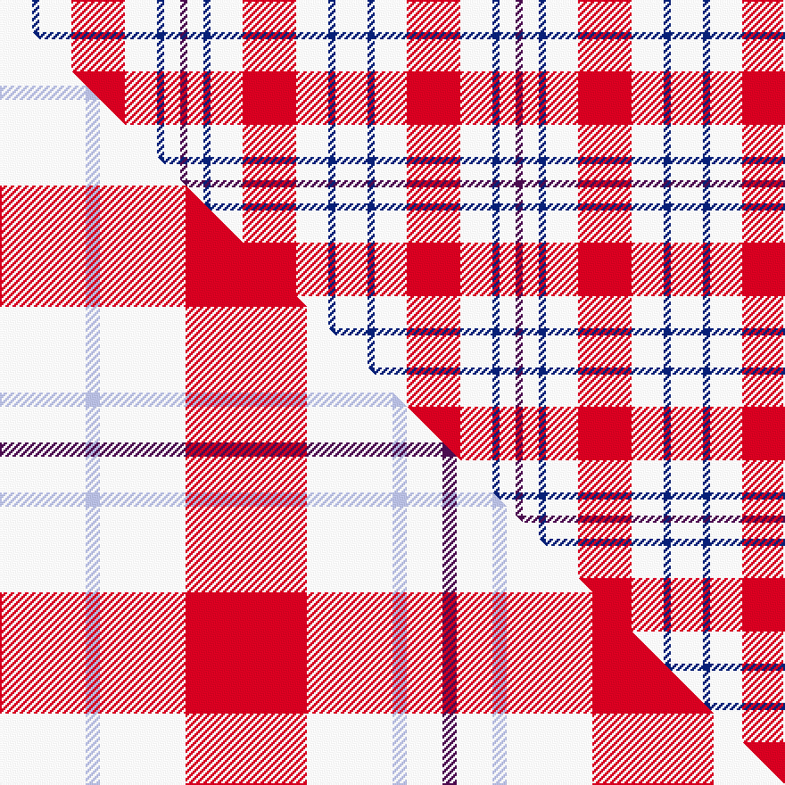

This page is one **sett** — a single exact thread-count. It belongs to the [tartan](/setts/w18db4w18r30w18db4w9dp4/)
(the same proportion at any scale), whose colour order is pattern [BWBWRWBW](/stripes/bwbwrwbw/).

Part of the [Milne, Dress](/tartans/milne-dress/) tartan — the named design grouping this sett with its other cloths.

Sourced from weddslist.  It is a [8 stripe tartan](/stripes/stripes8/).

Original link http://www.weddslist.com/cgi-bin/tartans/pg.pl?source=sts

## Provenance

Earliest known date: pre 2003 Milnes are usually regarded as being a Sept of the Gordons or of the Ogilvys.

2 attestations — the source records this cloth was collapsed from (oldest owns this page)

<ul>
<li>undated — Milne, dress (weddslist, <a href="http://www.weddslist.com/cgi-bin/tartans/pg.pl?source=sts">record</a>) </li>
<li>undated — Milne Dress Family Tartan (house-of-tartan, <a href="http://www.house-of-tartan.scotland.net/house/TartanViewjs.asp?colr=Def&tnam=634">record</a>) </li>
</ul>

## Thread count
W/18 DB4 W18 R30 W18 DB4 W9 DP/4

One full sett is **188 threads**.

## Palette
<table><thead><tr><th>Colour</th><th>Shade</th><th>OKLCh</th></tr></thead><tbody><tr><td>DB</td><td><code style="background-color:#082077;">#082077</code> <small style="color:#888">#082077</small></td><td><small style="color:#888">oklch(30.0% 0.149 265.1)</small></td></tr><tr><td>W</td><td><code style="background-color:#F7F7F7;">#F7F7F7</code> <small style="color:#888">#F7F7F7</small></td><td><small style="color:#888">oklch(97.6% 0.000 89.9)</small></td></tr><tr><td>DP</td><td><code style="background-color:#4B0B4F;">#4B0B4F</code> <small style="color:#888">#4B0B4F</small></td><td><small style="color:#888">oklch(30.1% 0.125 325.4)</small></td></tr><tr><td>R</td><td><code style="background-color:#D60020;">#D60020</code> <small style="color:#888">#D60020</small></td><td><small style="color:#888">oklch(55.2% 0.224 25.5)</small></td></tr></tbody></table>

# Sample pattern

## Compared to the master

This cloth is one sett of its design; the master sett (the exemplar the design is anchored on) is below for comparison.

Its **ΔTartan distance** from the master is **0.36** — the same measure the nearest-tartans table ranks by (0 is identical; a re-scale of the same cloth is near 0, a recolour or a different proportion further).

<figure class="master-compare" style="margin:0">

this sett
master sett ★

<figcaption style="color:#888;font-size:smaller">One weave of this sett against the <a href="/setts/w12lb2w12r17w12lb2w5dp2/">master sett ★</a>, split on the diagonal: a shared proportion runs seamlessly across it with only the shades shifting; a different proportion breaks on it.</figcaption>
</figure>

## Nearest tartan variants

The nearest existing variants by ΔTartan distance, with this cloth at the top so the swatches line up against it.

ΔTartan

Threads

Variant

Sett

—

188

<a href="/variants/s8/w18db4w18r30w18db4w9dp4/">Milne, dress</a>

<a href="/ttd/edit/#slug=w12lb2w12r17w12lb2w5dp2~x4&amp;base=w18db4w18r30w18db4w9dp4" title="compare in the TTD">0.36</a>

456

<a href="/variants/s8/w12lb2w12r17w12lb2w5dp2~x4/">Milne, Dress (Dance)</a>

<a href="/ttd/edit/#slug=w12dg2w12r17w12dg2w5p2~x4&amp;base=w18db4w18r30w18db4w9dp4" title="compare in the TTD">0.92</a>

456

<a href="/variants/s8/w12dg2w12r17w12dg2w5p2~x4/">Milne (Personal)</a>

<a href="/ttd/edit/#slug=w12db2w12o17w12db2w5r2~x4&amp;base=w18db4w18r30w18db4w9dp4" title="compare in the TTD">1.89</a>

456

<a href="/variants/s8/w12db2w12o17w12db2w5r2~x4/">Milne Purple Dress (Dance)</a>

<a href="/ttd/edit/#slug=w12r2w12g17w12r2w5b2~x4&amp;base=w18db4w18r30w18db4w9dp4" title="compare in the TTD">2.25</a>

456

<a href="/variants/s8/w12r2w12g17w12r2w5b2~x4/">Milne, Green (Dance)</a>

<a href="/ttd/edit/#slug=w14lb3w14y1dg20w15lb3w7dp3~x2&amp;base=w18db4w18r30w18db4w9dp4" title="compare in the TTD">2.40</a>

286

<a href="/variants/s9/w14lb3w14y1dg20w15lb3w7dp3~x2/">Milne dress green</a>

<a href="/ttd/edit/#slug=w5db16w5db16w33r3~x2&amp;base=w18db4w18r30w18db4w9dp4" title="compare in the TTD">2.43</a>

296

<a href="/variants/s6/w5db16w5db16w33r3~x2/">Buchanan Dress, Blue (Dance)</a>

<a href="/ttd/edit/#slug=db1w4r1w1y1w4db1~x12&amp;base=w18db4w18r30w18db4w9dp4" title="compare in the TTD">2.62</a>

288

<a href="/variants/s7/db1w4r1w1y1w4db1~x12/">Justus dress</a>

<a href="/ttd/edit/#slug=w24t5w24db36w28t6w12r6&amp;base=w18db4w18r30w18db4w9dp4" title="compare in the TTD">2.63</a>

252

<a href="/variants/s8/w24t5w24db36w28t6w12r6/">Milne Royal Blue Dress Fashion Tartan</a>

<a href="/ttd/edit/#slug=w12lb2w12db17w12lb2w5r2~x4&amp;base=w18db4w18r30w18db4w9dp4" title="compare in the TTD">2.68</a>

456

<a href="/variants/s8/w12lb2w12db17w12lb2w5r2~x4/">Milne Royal Blue Dress (Dance)</a>

<a href="/ttd/edit/#slug=w5dp3w26r20w3r8y3~x2&amp;base=w18db4w18r30w18db4w9dp4" title="compare in the TTD">2.81</a>

256

<a href="/variants/s7/w5dp3w26r20w3r8y3~x2/">MacPherson Dress Red (Dance)</a>

## Neighbour map

Every grey dot is one of 13620 variants placed by the first two principal components of the ΔTartan feature space (42% of its variance). Red is this tartan; blue dots are its nearest — click one to open its page.

<svg viewBox="0 0 640 380" role="img" style="max-width:100%;height:auto;border:1px solid #e0e0e0;border-radius:4px;display:block" xmlns="http://www.w3.org/2000/svg"><image href="/nn/cloud.v1.png" width="640" height="380"/><a href="/variants/s8/w12lb2w12r17w12lb2w5dp2~x4/"><circle cx="335.8" cy="220.4" r="4" fill="#3465a4"><title>Milne, Dress (Dance)</title></circle></a><a href="/variants/s8/w12dg2w12r17w12dg2w5p2~x4/"><circle cx="322.1" cy="215.4" r="4" fill="#3465a4"><title>Milne (Personal)</title></circle></a><a href="/variants/s8/w12db2w12o17w12db2w5r2~x4/"><circle cx="324.4" cy="220.2" r="4" fill="#3465a4"><title>Milne Purple Dress (Dance)</title></circle></a><a href="/variants/s8/w12r2w12g17w12r2w5b2~x4/"><circle cx="327.8" cy="226.9" r="4" fill="#3465a4"><title>Milne, Green (Dance)</title></circle></a><a href="/variants/s9/w14lb3w14y1dg20w15lb3w7dp3~x2/"><circle cx="311.0" cy="172.0" r="4" fill="#3465a4"><title>Milne dress green</title></circle></a><a href="/variants/s6/w5db16w5db16w33r3~x2/"><circle cx="306.6" cy="221.0" r="4" fill="#3465a4"><title>Buchanan Dress, Blue (Dance)</title></circle></a><a href="/variants/s7/db1w4r1w1y1w4db1~x12/"><circle cx="319.1" cy="244.9" r="4" fill="#3465a4"><title>Justus dress</title></circle></a><a href="/variants/s8/w24t5w24db36w28t6w12r6/"><circle cx="280.0" cy="229.3" r="4" fill="#3465a4"><title>Milne Royal Blue Dress Fashion Tartan</title></circle></a><a href="/variants/s8/w12lb2w12db17w12lb2w5r2~x4/"><circle cx="305.4" cy="217.1" r="4" fill="#3465a4"><title>Milne Royal Blue Dress (Dance)</title></circle></a><a href="/variants/s7/w5dp3w26r20w3r8y3~x2/"><circle cx="273.2" cy="196.1" r="4" fill="#3465a4"><title>MacPherson Dress Red (Dance)</title></circle></a><circle cx="285.9" cy="220.6" r="5" fill="#c00000"/><text x="320" y="376" text-anchor="middle" font-size="11" fill="#999">ground</text><text x="11" y="190" text-anchor="middle" font-size="11" fill="#999" transform="rotate(-90 11 190)">complexity</text></svg>

ID: /variants/s8/w18db4w18r30w18db4w9dp4/
