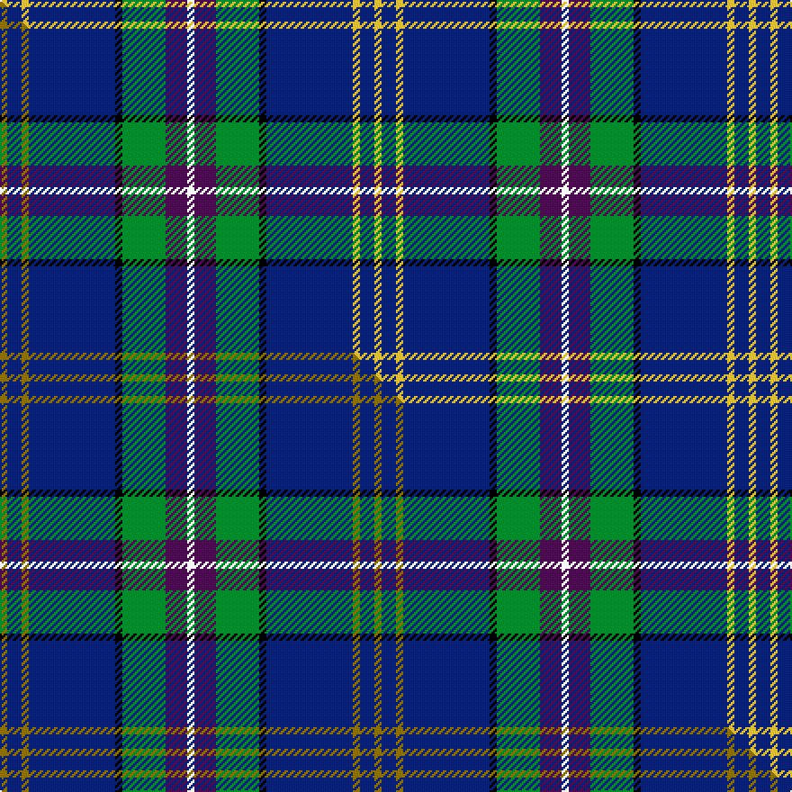

This is one **variant** — a specific cloth: this exact thread count and colourway, with its own
provenance below. It is one weaving of the [sett](/setts/w1dp3g6k1db12ly1db2ly1/) (the scale-free proportion — the
same cloth at any scale or shade), whose colour order is pattern [WBGKBYBY](/stripes/wbgkbyby/).

Part of the [Lambert, Patrice](/tartans/l/la/lambert-patrice/) tartan — the named design grouping this sett with its other cloths.

Sourced from tartans-authority.  It is a [8 stripe tartan](/stripes/stripes8/).

Original link [https://www.tartanregister.gov.uk/tartanDetails.aspx?ref=10433](https://www.tartanregister.gov.uk/tartanDetails.aspx?ref=10433)

Dataset <small>— provenance for this record, inherited from the source manifest</small>

<dl class="dataset-prov">
<dt>source</dt><dd><a href="/sources/tartans-authority/">Scottish Tartans Authority</a></dd>
<dt>data captured from</dt><dd><a href="https://github.com/thetartan/tartan-database/blob/master/data/tartans-authority/data.csv">https://github.com/thetartan/tartan-database/blob/master/data/tartans-authority/data.csv</a></dd>
<dt>data date</dt><dd>2nd June 2011 <small>(this record)</small></dd>
<dt>licence</dt><dd><a href="https://creativecommons.org/licenses/by-nc-nd/4.0/">CC BY-NC-ND 4.0</a></dd>
</dl>

Capture chain <small>— the hands this data passed through, oldest first; each capture carries its own licence</small>

<ol class="capture-chain">
<li><a href="https://www.tartansauthority.com/">Scottish Tartans Authority</a> <small>the heritage body's archive — its tartan-ferret record browser is retired (links repaired to the SRT, above)</small></li>
<li><a href="https://github.com/thetartan/tartan-database">thetartan/tartan-database</a> <small>2016-2017</small> · <a href="https://creativecommons.org/licenses/by-nc-nd/4.0/">CC BY-NC-ND 4.0</a> <small>Levko Kravets's frozen compilation — the capture we vendored, and where its CC licence text came from</small></li>
<li>this dictionary <small>captured 2026-06-10 · commit 5bf86c7566</small> <small>each re-capture is a git commit to data/sources</small></li>
</ol>

## Register references

External register numbers recorded for this tartan.

- Scottish Register of Tartans: [10433](https://www.tartanregister.gov.uk/tartanDetails?ref=10433)
- Scottish Tartans Authority (ITI): 10433

## Thread count
LY/4 DB8 LY4 DB48 K4 G24 DP12 W/4

One full sett is **208 threads**.

## Palette
<table><thead><tr><th>Colour</th><th>Shade</th><th>OKLCh</th></tr></thead><tbody><tr><td>DB</td><td><code style="background-color:#082077;">#082077</code> <small style="color:#888">#082077</small></td><td><small style="color:#888">oklch(30.0% 0.149 265.1)</small></td></tr><tr><td>DP</td><td><code style="background-color:#4B0B4F;">#4B0B4F</code> <small style="color:#888">#4B0B4F</small></td><td><small style="color:#888">oklch(30.1% 0.125 325.4)</small></td></tr><tr><td>G</td><td><code style="background-color:#008B2A;">#008B2A</code> <small style="color:#888">#008B2A</small></td><td><small style="color:#888">oklch(55.4% 0.170 145.9)</small></td></tr><tr><td>K</td><td><code style="background-color:#000000;">#000000</code> <small style="color:#888">#000000</small></td><td><small style="color:#888">oklch(0.0% 0.000 0.0)</small></td></tr><tr><td>W</td><td><code style="background-color:#F7F7F7;">#F7F7F7</code> <small style="color:#888">#F7F7F7</small></td><td><small style="color:#888">oklch(97.6% 0.000 89.9)</small></td></tr><tr><td>LY</td><td><code style="background-color:#DCBC32;">#DCBC32</code> <small style="color:#888">#DCBC32</small></td><td><small style="color:#888">oklch(80.0% 0.150 95.2)</small></td></tr></tbody></table>

# Sample pattern

## Compared to the master

This cloth is one sett of its design; the master sett (the exemplar the design is anchored on) is below for comparison.

Its **ΔTartan distance** from the master is **0.04** — the same measure the nearest-tartans table ranks by (0 is identical; a re-scale of the same cloth is near 0, a recolour or a different proportion further).

<figure class="master-compare" style="margin:0">

this sett
master sett ★

<figcaption style="color:#888;font-size:smaller">One weave of this sett against the <a href="/setts/y1db2y1db12k1g6dp3w1/">master sett ★</a>, split on the diagonal: a shared proportion runs seamlessly across it with only the shades shifting; a different proportion breaks on it.</figcaption>
</figure>

## Nearest tartan variants

The nearest existing variants by ΔTartan distance, with this cloth at the top so the swatches line up against it.

ΔTartan

Threads

Variant

Sett

—

208

<a href="/variants/s8/w1dp3g6k1db12ly1db2ly1~x4/">Lambert, Patrice (Personal)</a>

<a href="/ttd/edit/#slug=y1db2y1db12k1g6dp3w1~x4&amp;base=w1dp3g6k1db12ly1db2ly1~x4" title="compare in the TTD">0.04</a>

208

<a href="/variants/s8/y1db2y1db12k1g6dp3w1~x4/">Lambert, Patrice (Personal)</a>

<a href="/ttd/edit/#slug=dp4db2lb8db25k8g13y4~x2&amp;base=w1dp3g6k1db12ly1db2ly1~x4" title="compare in the TTD">1.53</a>

240

<a href="/variants/s7/dp4db2lb8db25k8g13y4~x2/">Renfrewshire Tartan</a>

<a href="/ttd/edit/#slug=dy4g13k8db25lb8db2dp4~x2&amp;base=w1dp3g6k1db12ly1db2ly1~x4" title="compare in the TTD">1.53</a>

240

<a href="/variants/s7/dy4g13k8db25lb8db2dp4~x2/">Renfrewshire</a>

<a href="/ttd/edit/#slug=k4t24k2dg13t2k3~x4~t2405244-dg1806142&amp;base=w1dp3g6k1db12ly1db2ly1~x4" title="compare in the TTD">1.68</a>

356

<a href="/variants/s6/k4t24k2dg13t2k3~x4~t2405244-dg1806142/">Vance (Family Association) Corporate Family Tartan</a>

<a href="/ttd/edit/#slug=db38r5k5g5w5y5db5r5w5~x2&amp;base=w1dp3g6k1db12ly1db2ly1~x4" title="compare in the TTD">1.86</a>

226

<a href="/variants/s9/db38r5k5g5w5y5db5r5w5~x2/">Eljamel, Sam (Personal)</a>

<a href="/ttd/edit/#slug=r3w6r2dg32db36k2db4y2~x2&amp;base=w1dp3g6k1db12ly1db2ly1~x4" title="compare in the TTD">1.98</a>

338

<a href="/variants/s8/r3w6r2dg32db36k2db4y2~x2/">Canadian Centennial</a>

<a href="/ttd/edit/#slug=r3w6r2g32db36k2db4y2~x2&amp;base=w1dp3g6k1db12ly1db2ly1~x4" title="compare in the TTD">1.98</a>

338

<a href="/variants/s8/r3w6r2g32db36k2db4y2~x2/">Canadian Centennial District Tartan</a>

<a href="/ttd/edit/#slug=db50k10db6k10db6g5lp5g5o8g23w5~x2&amp;base=w1dp3g6k1db12ly1db2ly1~x4" title="compare in the TTD">2.08</a>

422

<a href="/variants/s11/db50k10db6k10db6g5lp5g5o8g23w5~x2/">Scottish Hockey Union (Sports)</a>

<a href="/ttd/edit/#slug=db4do5g19dp5do5k5do5db36w3~x2&amp;base=w1dp3g6k1db12ly1db2ly1~x4" title="compare in the TTD">2.08</a>

334

<a href="/variants/s9/db4do5g19dp5do5k5do5db36w3~x2/">Suzugamine (Corporate)</a>

<a href="/ttd/edit/#slug=r4db24w2g13db2k3~x4&amp;base=w1dp3g6k1db12ly1db2ly1~x4" title="compare in the TTD">2.16</a>

356

<a href="/variants/s6/r4db24w2g13db2k3~x4/">Vance (Family Association)</a>

## Neighbour map

Every grey dot is one of 13656 variants placed by the first two principal components of the ΔTartan feature space (42% of its variance). Red is this tartan; blue dots are its nearest — click one to open its page. The map is a flat projection of a many-dimensional space — [how to read it](/posts/neighbourhood-maps/).

<svg viewBox="0 0 640 380" role="img" style="max-width:100%;height:auto;border:1px solid #e0e0e0;border-radius:4px;display:block" xmlns="http://www.w3.org/2000/svg"><image href="/nn/cloud.v1.png" width="640" height="380"/><a href="/variants/s8/y1db2y1db12k1g6dp3w1~x4/"><circle cx="226.5" cy="139.7" r="4" fill="#3465a4"><title>Lambert, Patrice (Personal)</title></circle></a><a href="/variants/s7/dp4db2lb8db25k8g13y4~x2/"><circle cx="136.8" cy="160.3" r="4" fill="#3465a4"><title>Renfrewshire Tartan</title></circle></a><a href="/variants/s7/dy4g13k8db25lb8db2dp4~x2/"><circle cx="139.3" cy="161.0" r="4" fill="#3465a4"><title>Renfrewshire</title></circle></a><a href="/variants/s6/k4t24k2dg13t2k3~x4~t2405244-dg1806142/"><circle cx="241.7" cy="162.3" r="4" fill="#3465a4"><title>Vance (Family Association) Corporate Family Tartan</title></circle></a><a href="/variants/s9/db38r5k5g5w5y5db5r5w5~x2/"><circle cx="196.3" cy="127.3" r="4" fill="#3465a4"><title>Eljamel, Sam (Personal)</title></circle></a><a href="/variants/s8/r3w6r2dg32db36k2db4y2~x2/"><circle cx="241.5" cy="118.5" r="4" fill="#3465a4"><title>Canadian Centennial</title></circle></a><a href="/variants/s8/r3w6r2g32db36k2db4y2~x2/"><circle cx="218.6" cy="114.3" r="4" fill="#3465a4"><title>Canadian Centennial District Tartan</title></circle></a><a href="/variants/s11/db50k10db6k10db6g5lp5g5o8g23w5~x2/"><circle cx="163.1" cy="128.6" r="4" fill="#3465a4"><title>Scottish Hockey Union (Sports)</title></circle></a><a href="/variants/s9/db4do5g19dp5do5k5do5db36w3~x2/"><circle cx="199.6" cy="140.7" r="4" fill="#3465a4"><title>Suzugamine (Corporate)</title></circle></a><a href="/variants/s6/r4db24w2g13db2k3~x4/"><circle cx="247.0" cy="160.2" r="4" fill="#3465a4"><title>Vance (Family Association)</title></circle></a><circle cx="211.7" cy="135.0" r="5" fill="#c00000"/><text x="320" y="376" text-anchor="middle" font-size="11" fill="#999">ground</text><text x="11" y="190" text-anchor="middle" font-size="11" fill="#999" transform="rotate(-90 11 190)">complexity</text></svg>

ID: /variants/s8/w1dp3g6k1db12ly1db2ly1~x4/
