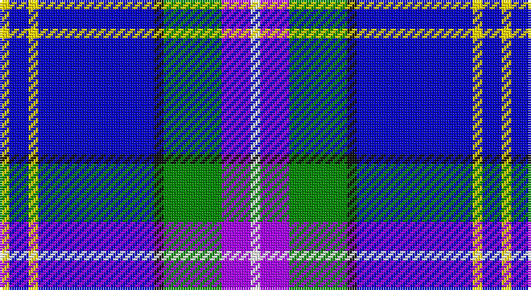

This page is one **sett** — a single exact thread-count. It belongs to the [tartan](/setts/w1p3g6k1db12ly1db2ly1/)
(the same proportion at any scale), whose colour order is pattern [WBGKBYBY](/stripes/wbgkbyby/).

Sourced from register-of-tartans.  It is a [8 stripe tartan](/stripes/stripes8/).

Original link https://www.tartanregister.gov.uk/tartanDetails.aspx?ref=10433

## Register references

External register numbers recorded for this tartan.

- Scottish Register of Tartans: [10433](https://www.tartanregister.gov.uk/tartanDetails.aspx?ref=10433)

## Thread count
Y/4 B8 Y4 B48 K4 G24 P12 W/4

One full sett is **208 threads**.

## Palette

Palette: <strong>Tartan Register</strong>
<table><thead><tr><th>Colour</th><th>Threads</th><th>Shade</th><th>Base</th><th>OKLCh</th></tr></thead><tbody><tr><td>Y/</td><td style="text-align:right;font-variant-numeric:tabular-nums">4</td><td><code style="background-color:#FFE600;">#FFE600</code> <small style="color:#888">#FFE600</small></td><td>Y <code style="background-color:#F2BF00;">#F2BF00</code></td><td><small style="color:#888">oklch(91.7% 0.192 101.4)</small></td></tr><tr><td>B</td><td style="text-align:right;font-variant-numeric:tabular-nums">8</td><td><code style="background-color:#0000CD;">#0000CD</code> <small style="color:#888">#0000CD</small></td><td>B <code style="background-color:#2A418A;">#2A418A</code></td><td><small style="color:#888">oklch(38.3% 0.266 264.1)</small></td></tr><tr><td>Y</td><td style="text-align:right;font-variant-numeric:tabular-nums">4</td><td><code style="background-color:#FFE600;">#FFE600</code> <small style="color:#888">#FFE600</small></td><td>Y <code style="background-color:#F2BF00;">#F2BF00</code></td><td><small style="color:#888">oklch(91.7% 0.192 101.4)</small></td></tr><tr><td>B</td><td style="text-align:right;font-variant-numeric:tabular-nums">48</td><td><code style="background-color:#0000CD;">#0000CD</code> <small style="color:#888">#0000CD</small></td><td>B <code style="background-color:#2A418A;">#2A418A</code></td><td><small style="color:#888">oklch(38.3% 0.266 264.1)</small></td></tr><tr><td>K</td><td style="text-align:right;font-variant-numeric:tabular-nums">4</td><td><code style="background-color:#101010;">#101010</code> <small style="color:#888">#101010</small></td><td>K <code style="background-color:#000000;">#000000</code></td><td><small style="color:#888">oklch(17.3% 0.000 89.9)</small></td></tr><tr><td>G</td><td style="text-align:right;font-variant-numeric:tabular-nums">24</td><td><code style="background-color:#008B00;">#008B00</code> <small style="color:#888">#008B00</small></td><td>G <code style="background-color:#006100;">#006100</code></td><td><small style="color:#888">oklch(55.2% 0.188 142.5)</small></td></tr><tr><td>P</td><td style="text-align:right;font-variant-numeric:tabular-nums">12</td><td><code style="background-color:#AA00FF;">#AA00FF</code> <small style="color:#888">#AA00FF</small></td><td>B <code style="background-color:#2A418A;">#2A418A</code></td><td><small style="color:#888">oklch(58.1% 0.299 307.0)</small></td></tr><tr><td>W/</td><td style="text-align:right;font-variant-numeric:tabular-nums">4</td><td><code style="background-color:#FFFFFF;">#FFFFFF</code> <small style="color:#888">#FFFFFF</small></td><td>W <code style="background-color:#F7F7F7;">#F7F7F7</code></td><td><small style="color:#888">oklch(100.0% 0.000 89.9)</small></td></tr></tbody></table>

# Sample pattern

## Nearest tartans

The nearest existing variants by ΔTartan distance, with this tartan at the top so the swatches line up against it.

ΔTartan

Tartan

Sett

—

<a href="/ttd/edit/#slug=w1p3g6k1db12ly1db2ly1~x4">Lambert, Patrice (Personal)</a> <a class="nn-out" href="/variants/s8/w1p3g6k1db12ly1db2ly1~x4/" title="open its dictionary page">↗</a>

1.14

<a href="/variants/s9/lbi5w3lb7lbi5lb27b8db43wi3lb3/">Queensferry High School: Ferry Fling</a>

1.29

<a href="/ttd/edit/#slug=m1g2t10r1db15w1~x4&amp;base=w1p3g6k1db12ly1db2ly1~x4">Oren Peterson</a> <a class="nn-out" href="/variants/s6/m1g2t10r1db15w1~x4/" title="open its dictionary page">↗</a>

1.46

<a href="/ttd/edit/#slug=ly6db3k3db36k10n18db6k2g4k3~x2&amp;base=w1p3g6k1db12ly1db2ly1~x4">Dinwiddie Hunting</a> <a class="nn-out" href="/variants/s10/ly6db3k3db36k10n18db6k2g4k3~x2/" title="open its dictionary page">↗</a>

1.48

<a href="/ttd/edit/#slug=dp8dg31r4lo4db17b64w4&amp;base=w1p3g6k1db12ly1db2ly1~x4">Manx National #2</a> <a class="nn-out" href="/variants/s7/dp8dg31r4lo4db17b64w4/" title="open its dictionary page">↗</a>

1.53

<a href="/ttd/edit/#slug=r4lb3db6b4db24k6g4db2lb23db23g4~x2&amp;base=w1p3g6k1db12ly1db2ly1~x4">New Millennium</a> <a class="nn-out" href="/variants/s11/r4lb3db6b4db24k6g4db2lb23db23g4~x2/" title="open its dictionary page">↗</a>

1.53

<a href="/ttd/edit/#slug=db30b10lb10db5m3ly3g3~x2&amp;base=w1p3g6k1db12ly1db2ly1~x4">Wrigglesworth (Name)</a> <a class="nn-out" href="/variants/s7/db30b10lb10db5m3ly3g3~x2/" title="open its dictionary page">↗</a>

1.59

<a href="/ttd/edit/#slug=db35r2k16ly2b25w2b6~x2&amp;base=w1p3g6k1db12ly1db2ly1~x4">Unidentified #23</a> <a class="nn-out" href="/variants/s7/db35r2k16ly2b25w2b6~x2/" title="open its dictionary page">↗</a>

1.62

<a href="/ttd/edit/#slug=b6k8b6g12db29w3db4~x2&amp;base=w1p3g6k1db12ly1db2ly1~x4">Dickson (Kirkcudbrightshire)</a> <a class="nn-out" href="/variants/s7/b6k8b6g12db29w3db4~x2/" title="open its dictionary page">↗</a>

1.62

<a href="/ttd/edit/#slug=db40r3k10lo2lr15w2lr4~x2&amp;base=w1p3g6k1db12ly1db2ly1~x4">U.S. Forces Thurso (Military)</a> <a class="nn-out" href="/variants/s7/db40r3k10lo2lr15w2lr4~x2/" title="open its dictionary page">↗</a>

1.65

<a href="/ttd/edit/#slug=g2db14lg6lr1g1lr6r1~x4&amp;base=w1p3g6k1db12ly1db2ly1~x4">Loch Ness in Scotland</a> <a class="nn-out" href="/variants/s7/g2db14lg6lr1g1lr6r1~x4/" title="open its dictionary page">↗</a>

## Neighbour map

Every grey dot is one of 14360 variants placed by the first two principal components of the ΔTartan feature space (44% of its variance). Red is this tartan; blue dots are its nearest — click one to open its page.

<svg viewBox="0 0 640 380" role="img" style="max-width:100%;height:auto;border:1px solid #e0e0e0;border-radius:4px;display:block" xmlns="http://www.w3.org/2000/svg"><image href="/nn/cloud.v1.png" width="640" height="380"/><a href="/variants/s9/lbi5w3lb7lbi5lb27b8db43wi3lb3/"><circle cx="165.8" cy="112.5" r="4" fill="#3465a4"><title>Queensferry High School: Ferry Fling</title></circle></a><a href="/variants/s6/m1g2t10r1db15w1~x4/"><circle cx="245.7" cy="144.8" r="4" fill="#3465a4"><title>Oren Peterson</title></circle></a><a href="/variants/s10/ly6db3k3db36k10n18db6k2g4k3~x2/"><circle cx="237.8" cy="134.0" r="4" fill="#3465a4"><title>Dinwiddie Hunting</title></circle></a><a href="/variants/s7/dp8dg31r4lo4db17b64w4/"><circle cx="196.2" cy="119.1" r="4" fill="#3465a4"><title>Manx National #2</title></circle></a><a href="/variants/s11/r4lb3db6b4db24k6g4db2lb23db23g4~x2/"><circle cx="212.3" cy="133.4" r="4" fill="#3465a4"><title>New Millennium</title></circle></a><a href="/variants/s7/db30b10lb10db5m3ly3g3~x2/"><circle cx="238.1" cy="160.4" r="4" fill="#3465a4"><title>Wrigglesworth (Name)</title></circle></a><a href="/variants/s7/db35r2k16ly2b25w2b6~x2/"><circle cx="177.7" cy="139.7" r="4" fill="#3465a4"><title>Unidentified #23</title></circle></a><a href="/variants/s7/b6k8b6g12db29w3db4~x2/"><circle cx="191.7" cy="191.9" r="4" fill="#3465a4"><title>Dickson (Kirkcudbrightshire)</title></circle></a><a href="/variants/s7/db40r3k10lo2lr15w2lr4~x2/"><circle cx="259.3" cy="121.2" r="4" fill="#3465a4"><title>U.S. Forces Thurso (Military)</title></circle></a><a href="/variants/s7/g2db14lg6lr1g1lr6r1~x4/"><circle cx="199.8" cy="157.5" r="4" fill="#3465a4"><title>Loch Ness in Scotland</title></circle></a><circle cx="202.8" cy="133.9" r="5" fill="#c00000"/></svg>

ID: /variants/s8/w1p3g6k1db12ly1db2ly1~x4/
