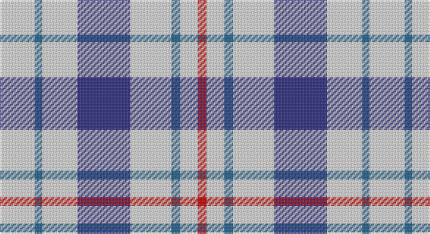

This page is one **sett** — a single exact thread-count. It belongs to the [tartan](/setts/w24n5w24db36w28n6w12r6/)
(the same proportion at any scale), whose colour order is pattern [RWBWBWBW](/stripes/rwbwbwbw/).

Part of the [Milne Royal Blue Dress](/tartans/milne-royal-blue-dress/) tartan — the named design grouping this sett with its other cloths.

Sourced from house-of-tartan.  It is a [8 stripe tartan](/stripes/stripes8/).

Original link http://www.house-of-tartan.scotland.net/house/TartanViewjs.asp?colr=Def&tnam=6547

## Provenance

Earliest known date: 01/01/2005 A Dance version of #634 (original Scottish Tartans Authority reference) reputed to be a personal tartan./Threadcount and colours aren't 100% original. Generated manually./

## Also known as

This cloth is also recorded under:

- Milne Dress, Royal Blue

## Thread count
LN/24 B5 LN24 DB36 LN28 B6 LN12 R/6

One full sett is **252 threads**.

## Palette

Palette: <strong>Tartan Register</strong> <small style="color:#888">(3 of 4 colours)</small>
<table><thead><tr><th>Colour</th><th>Threads</th><th>Shade</th><th>Base</th><th>OKLCh</th></tr></thead><tbody><tr><td>LN/</td><td style="text-align:right;font-variant-numeric:tabular-nums">24</td><td><code style="background-color:#E0E0E0;">#E0E0E0</code> <small style="color:#888">#E0E0E0</small></td><td>W <code style="background-color:#F7F7F7;">#F7F7F7</code></td><td><small style="color:#888">oklch(90.7% 0.000 89.9)</small></td></tr><tr><td>B</td><td style="text-align:right;font-variant-numeric:tabular-nums">5</td><td><code style="background-color:#20608C;">#20608C</code> <small style="color:#888">#20608C</small></td><td>B <code style="background-color:#2A418A;">#2A418A</code></td><td><small style="color:#888">oklch(47.0% 0.096 243.0)</small></td></tr><tr><td>LN</td><td style="text-align:right;font-variant-numeric:tabular-nums">24</td><td><code style="background-color:#E0E0E0;">#E0E0E0</code> <small style="color:#888">#E0E0E0</small></td><td>W <code style="background-color:#F7F7F7;">#F7F7F7</code></td><td><small style="color:#888">oklch(90.7% 0.000 89.9)</small></td></tr><tr><td>DB</td><td style="text-align:right;font-variant-numeric:tabular-nums">36</td><td><code style="background-color:#2C2C80;">#2C2C80</code> <small style="color:#888">#2C2C80</small></td><td>B <code style="background-color:#2A418A;">#2A418A</code></td><td><small style="color:#888">oklch(35.0% 0.138 276.6)</small></td></tr><tr><td>LN</td><td style="text-align:right;font-variant-numeric:tabular-nums">28</td><td><code style="background-color:#E0E0E0;">#E0E0E0</code> <small style="color:#888">#E0E0E0</small></td><td>W <code style="background-color:#F7F7F7;">#F7F7F7</code></td><td><small style="color:#888">oklch(90.7% 0.000 89.9)</small></td></tr><tr><td>B</td><td style="text-align:right;font-variant-numeric:tabular-nums">6</td><td><code style="background-color:#20608C;">#20608C</code> <small style="color:#888">#20608C</small></td><td>B <code style="background-color:#2A418A;">#2A418A</code></td><td><small style="color:#888">oklch(47.0% 0.096 243.0)</small></td></tr><tr><td>LN</td><td style="text-align:right;font-variant-numeric:tabular-nums">12</td><td><code style="background-color:#E0E0E0;">#E0E0E0</code> <small style="color:#888">#E0E0E0</small></td><td>W <code style="background-color:#F7F7F7;">#F7F7F7</code></td><td><small style="color:#888">oklch(90.7% 0.000 89.9)</small></td></tr><tr><td>R/</td><td style="text-align:right;font-variant-numeric:tabular-nums">6</td><td><code style="background-color:#C80000;">#C80000</code> <small style="color:#888">#C80000</small></td><td>R <code style="background-color:#CC0000;">#CC0000</code></td><td><small style="color:#888">oklch(52.3% 0.215 29.2)</small></td></tr></tbody></table>

# Sample pattern

## Compared to the master

This cloth is one sett of its design; the master sett (the exemplar the design is anchored on) is below for comparison.

<figure style="margin:0"><figcaption style="color:#888;font-size:smaller">this sett</figcaption></figure>
<figure style="margin:0"><figcaption style="color:#888;font-size:smaller"><a href="/setts/w12t2w12db17w12t2w5r2/">master sett →</a></figcaption></figure>

## Nearest tartans

The nearest existing variants by ΔTartan distance, with this tartan at the top so the swatches line up against it.

ΔTartan

Tartan

Sett

—

<a href="/ttd/edit/#slug=w24n5w24db36w28n6w12r6">Milne Royal Blue Dress Fashion Tartan</a> <a class="nn-out" href="/variants/s8/w24n5w24db36w28n6w12r6/" title="open its dictionary page">↗</a>

0.55

<a href="/ttd/edit/#slug=w12t2w12db17w12t2w5r2~x4&amp;base=w24n5w24db36w28n6w12r6">Milne Royal Blue Dress (Dance)</a> <a class="nn-out" href="/variants/s8/w12t2w12db17w12t2w5r2~x4/" title="open its dictionary page">↗</a>

0.90

<a href="/ttd/edit/#slug=w13r3w2k5w2r3w13db8~x2&amp;base=w24n5w24db36w28n6w12r6">Boswell Dress Personal Tartan</a> <a class="nn-out" href="/variants/s8/w13r3w2k5w2r3w13db8~x2/" title="open its dictionary page">↗</a>

1.24

<a href="/ttd/edit/#slug=w1b3w3b1w5k1w2k3lo1~x4&amp;base=w24n5w24db36w28n6w12r6">Henderson Dress (Dance)</a> <a class="nn-out" href="/variants/s9/w1b3w3b1w5k1w2k3lo1~x4/" title="open its dictionary page">↗</a>

1.29

<a href="/ttd/edit/#slug=w7db16w20db3w3ly3~x2&amp;base=w24n5w24db36w28n6w12r6">Unidentified (Shirt)</a> <a class="nn-out" href="/variants/s6/w7db16w20db3w3ly3~x2/" title="open its dictionary page">↗</a>

1.36

<a href="/ttd/edit/#slug=w12db2w12m17w12db2w5r2~x4&amp;base=w24n5w24db36w28n6w12r6">Milne Purple Dress (Dance)</a> <a class="nn-out" href="/variants/s8/w12db2w12m17w12db2w5r2~x4/" title="open its dictionary page">↗</a>

1.53

<a href="/ttd/edit/#slug=w5k5w10r2w10dp8w15dp8lb3k3~x2&amp;base=w24n5w24db36w28n6w12r6">Dijkgraaf, Markus Jack (Personal)</a> <a class="nn-out" href="/variants/s10/w5k5w10r2w10dp8w15dp8lb3k3~x2/" title="open its dictionary page">↗</a>

1.57

<a href="/ttd/edit/#slug=w5r3w26db21w3db8ly3~x2&amp;base=w24n5w24db36w28n6w12r6">MacPherson, Blue &amp; White</a> <a class="nn-out" href="/variants/s7/w5r3w26db21w3db8ly3~x2/" title="open its dictionary page">↗</a>

1.61

<a href="/ttd/edit/#slug=w18db4w18r30w18db4w9p4&amp;base=w24n5w24db36w28n6w12r6">Milne, dress</a> <a class="nn-out" href="/variants/s8/w18db4w18r30w18db4w9p4/" title="open its dictionary page">↗</a>

1.62

<a href="/ttd/edit/#slug=w18db4w18r30w18db4w9dp4&amp;base=w24n5w24db36w28n6w12r6">Milne Dress Family Tartan</a> <a class="nn-out" href="/variants/s8/w18db4w18r30w18db4w9dp4/" title="open its dictionary page">↗</a>

1.63

<a href="/ttd/edit/#slug=w12dg2w12r17w12dg2w5b2~x4&amp;base=w24n5w24db36w28n6w12r6">Milne (Personal)</a> <a class="nn-out" href="/variants/s8/w12dg2w12r17w12dg2w5b2~x4/" title="open its dictionary page">↗</a>

## Neighbour map

Every grey dot is one of 14360 variants placed by the first two principal components of the ΔTartan feature space (44% of its variance). Red is this tartan; blue dots are its nearest — click one to open its page.

<svg viewBox="0 0 640 380" role="img" style="max-width:100%;height:auto;border:1px solid #e0e0e0;border-radius:4px;display:block" xmlns="http://www.w3.org/2000/svg"><image href="/nn/cloud.v1.png" width="640" height="380"/><a href="/variants/s8/w12t2w12db17w12t2w5r2~x4/"><circle cx="280.4" cy="189.0" r="4" fill="#3465a4"><title>Milne Royal Blue Dress (Dance)</title></circle></a><a href="/variants/s8/w13r3w2k5w2r3w13db8~x2/"><circle cx="245.4" cy="191.5" r="4" fill="#3465a4"><title>Boswell Dress Personal Tartan</title></circle></a><a href="/variants/s9/w1b3w3b1w5k1w2k3lo1~x4/"><circle cx="173.3" cy="206.1" r="4" fill="#3465a4"><title>Henderson Dress (Dance)</title></circle></a><a href="/variants/s6/w7db16w20db3w3ly3~x2/"><circle cx="285.1" cy="219.6" r="4" fill="#3465a4"><title>Unidentified (Shirt)</title></circle></a><a href="/variants/s8/w12db2w12m17w12db2w5r2~x4/"><circle cx="296.4" cy="183.9" r="4" fill="#3465a4"><title>Milne Purple Dress (Dance)</title></circle></a><a href="/variants/s10/w5k5w10r2w10dp8w15dp8lb3k3~x2/"><circle cx="188.5" cy="169.8" r="4" fill="#3465a4"><title>Dijkgraaf, Markus Jack (Personal)</title></circle></a><a href="/variants/s7/w5r3w26db21w3db8ly3~x2/"><circle cx="240.9" cy="178.8" r="4" fill="#3465a4"><title>MacPherson, Blue &amp; White</title></circle></a><a href="/variants/s8/w18db4w18r30w18db4w9p4/"><circle cx="269.3" cy="190.7" r="4" fill="#3465a4"><title>Milne, dress</title></circle></a><a href="/variants/s8/w18db4w18r30w18db4w9dp4/"><circle cx="268.3" cy="189.8" r="4" fill="#3465a4"><title>Milne Dress Family Tartan</title></circle></a><a href="/variants/s8/w12dg2w12r17w12dg2w5b2~x4/"><circle cx="297.9" cy="183.0" r="4" fill="#3465a4"><title>Milne (Personal)</title></circle></a><circle cx="261.3" cy="202.6" r="5" fill="#c00000"/></svg>

ID: /variants/s8/w24n5w24db36w28n6w12r6/
