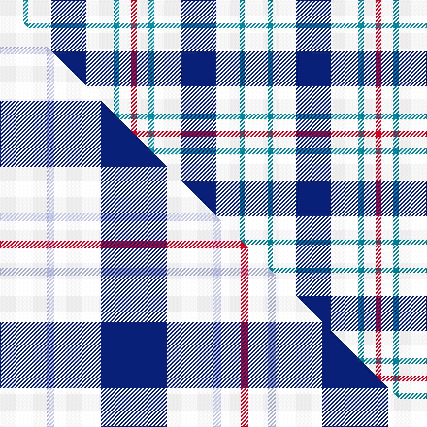

This is one **variant** — a specific cloth: this exact thread count and colourway, with its own
provenance below. It is one weaving of the [sett](/setts/w24t5w24db36w28t6w12r6/) (the scale-free proportion — the
same cloth at any scale or shade), whose colour order is pattern [RWBWBWBW](/stripes/rwbwbwbw/).

Part of the [Milne Royal Blue Dress](/tartans/milne-royal-blue-dress/) tartan — the named design grouping this sett with its other cloths.

Sourced from house-of-tartan.  It is a [8 stripe tartan](/stripes/stripes8/).

Original link [http://www.house-of-tartan.scotland.net/house/TartanViewjs.asp?colr=Def&tnam=6547](http://www.house-of-tartan.scotland.net/house/TartanViewjs.asp?colr=Def&tnam=6547)

## Provenance

Earliest known date: 01/01/2005 A Dance version of #634 (original Scottish Tartans Authority reference) reputed to be a personal tartan./Threadcount and colours aren't 100% original. Generated manually./

Dataset <small>— provenance for this record, inherited from the source manifest</small>

<dl class="dataset-prov">
<dt>source</dt><dd><a href="/sources/house-of-tartan/">House of Tartan</a></dd>
<dt>data captured from</dt><dd><a href="https://github.com/thetartan/tartan-database/blob/master/data/house-of-tartan/data.csv">https://github.com/thetartan/tartan-database/blob/master/data/house-of-tartan/data.csv</a></dd>
<dt>data date</dt><dd>01/01/2005 <small>(this record)</small></dd>
<dt>licence</dt><dd><a href="https://creativecommons.org/licenses/by-nc-nd/4.0/">CC BY-NC-ND 4.0</a></dd>
</dl>

Capture chain <small>— the hands this data passed through, oldest first; each capture carries its own licence</small>

<ol class="capture-chain">
<li><a href="http://www.house-of-tartan.scotland.net/">House of Tartan</a> <small>the weaver/retailer's database — the site is now offline; the URL is kept as the ultimate source's identity</small></li>
<li><a href="https://github.com/thetartan/tartan-database">thetartan/tartan-database</a> <small>2016-2017</small> · <a href="https://creativecommons.org/licenses/by-nc-nd/4.0/">CC BY-NC-ND 4.0</a> <small>Levko Kravets's frozen compilation — the capture we vendored, and where its CC licence text came from</small></li>
<li>this dictionary <small>captured 2026-06-10 · commit 5bf86c7566</small> <small>each re-capture is a git commit to data/sources</small></li>
</ol>

## Thread count
W/24 T5 W24 DB36 W28 T6 W12 R/6

One full sett is **252 threads**.

## Palette
<table><thead><tr><th>Colour</th><th>Shade</th><th>OKLCh</th></tr></thead><tbody><tr><td>T</td><td><code style="background-color:#00879F;">#00879F</code> <small style="color:#888">#00879F</small></td><td><small style="color:#888">oklch(57.4% 0.102 216.1)</small></td></tr><tr><td>DB</td><td><code style="background-color:#082077;">#082077</code> <small style="color:#888">#082077</small></td><td><small style="color:#888">oklch(30.0% 0.149 265.1)</small></td></tr><tr><td>W</td><td><code style="background-color:#F7F7F7;">#F7F7F7</code> <small style="color:#888">#F7F7F7</small></td><td><small style="color:#888">oklch(97.6% 0.000 89.9)</small></td></tr><tr><td>R</td><td><code style="background-color:#D60020;">#D60020</code> <small style="color:#888">#D60020</small></td><td><small style="color:#888">oklch(55.2% 0.224 25.5)</small></td></tr></tbody></table>

# Sample pattern

## Compared to the master

This cloth is one sett of its design; the master sett (the exemplar the design is anchored on) is below for comparison.

Its **ΔTartan distance** from the master is **0.23** — the same measure the nearest-tartans table ranks by (0 is identical; a re-scale of the same cloth is near 0, a recolour or a different proportion further).

<figure class="master-compare" style="margin:0">

this sett
master sett ★

<figcaption style="color:#888;font-size:smaller">One weave of this sett against the <a href="/setts/w12lb2w12db17w12lb2w5r2/">master sett ★</a>, split on the diagonal: a shared proportion runs seamlessly across it with only the shades shifting; a different proportion breaks on it.</figcaption>
</figure>

## Nearest tartan variants

The nearest existing variants by ΔTartan distance, with this cloth at the top so the swatches line up against it.

ΔTartan

Threads

Variant

Sett

—

252

<a href="/variants/s8/w24t5w24db36w28t6w12r6/">Milne Royal Blue Dress Fashion Tartan</a>

<a href="/ttd/edit/#slug=w12lb2w12db17w12lb2w5r2~x4&amp;base=w24t5w24db36w28t6w12r6" title="compare in the TTD">0.23</a>

456

<a href="/variants/s8/w12lb2w12db17w12lb2w5r2~x4/">Milne Royal Blue Dress (Dance)</a>

<a href="/ttd/edit/#slug=w12db2w12o17w12db2w5r2~x4&amp;base=w24t5w24db36w28t6w12r6" title="compare in the TTD">2.22</a>

456

<a href="/variants/s8/w12db2w12o17w12db2w5r2~x4/">Milne Purple Dress (Dance)</a>

<a href="/ttd/edit/#slug=db1w4r1w1y1w4db1~x12&amp;base=w24t5w24db36w28t6w12r6" title="compare in the TTD">2.51</a>

288

<a href="/variants/s7/db1w4r1w1y1w4db1~x12/">Justus dress</a>

<a href="/ttd/edit/#slug=w18db4w18r30w18db4w9dp4&amp;base=w24t5w24db36w28t6w12r6" title="compare in the TTD">2.63</a>

188

<a href="/variants/s8/w18db4w18r30w18db4w9dp4/">Milne Dress Family Tartan</a>

<a href="/ttd/edit/#slug=w12r2w12g17w12r2w5b2~x4&amp;base=w24t5w24db36w28t6w12r6" title="compare in the TTD">2.67</a>

456

<a href="/variants/s8/w12r2w12g17w12r2w5b2~x4/">Milne, Green (Dance)</a>

<a href="/ttd/edit/#slug=w12dg2w12r17w12dg2w5p2~x4&amp;base=w24t5w24db36w28t6w12r6" title="compare in the TTD">2.69</a>

456

<a href="/variants/s8/w12dg2w12r17w12dg2w5p2~x4/">Milne (Personal)</a>

<a href="/ttd/edit/#slug=w12lb2w12r17w12lb2w5dp2~x4&amp;base=w24t5w24db36w28t6w12r6" title="compare in the TTD">2.75</a>

456

<a href="/variants/s8/w12lb2w12r17w12lb2w5dp2~x4/">Milne, Dress (Dance)</a>

<a href="/ttd/edit/#slug=w7db16w20db3w3y3~x2&amp;base=w24t5w24db36w28t6w12r6" title="compare in the TTD">2.85</a>

188

<a href="/variants/s6/w7db16w20db3w3y3~x2/">Unidentified (Shirt)</a>

<a href="/ttd/edit/#slug=w5db16w5db16w33r3~x2&amp;base=w24t5w24db36w28t6w12r6" title="compare in the TTD">2.90</a>

296

<a href="/variants/s6/w5db16w5db16w33r3~x2/">Buchanan Dress, Blue (Dance)</a>

<a href="/ttd/edit/#slug=w5r3w26db21w3db8y3~x2&amp;base=w24t5w24db36w28t6w12r6" title="compare in the TTD">3.02</a>

260

<a href="/variants/s7/w5r3w26db21w3db8y3~x2/">MacPherson Blue/White Clan Tartan</a>

## Neighbour map

Every grey dot is one of 13621 variants placed by the first two principal components of the ΔTartan feature space (42% of its variance). Red is this tartan; blue dots are its nearest — click one to open its page.

<svg viewBox="0 0 640 380" role="img" style="max-width:100%;height:auto;border:1px solid #e0e0e0;border-radius:4px;display:block" xmlns="http://www.w3.org/2000/svg"><image href="/nn/cloud.v1.png" width="640" height="380"/><a href="/variants/s8/w12lb2w12db17w12lb2w5r2~x4/"><circle cx="305.5" cy="217.7" r="4" fill="#3465a4"><title>Milne Royal Blue Dress (Dance)</title></circle></a><a href="/variants/s8/w12db2w12o17w12db2w5r2~x4/"><circle cx="324.5" cy="220.8" r="4" fill="#3465a4"><title>Milne Purple Dress (Dance)</title></circle></a><a href="/variants/s7/db1w4r1w1y1w4db1~x12/"><circle cx="319.3" cy="245.7" r="4" fill="#3465a4"><title>Justus dress</title></circle></a><a href="/variants/s8/w18db4w18r30w18db4w9dp4/"><circle cx="286.1" cy="221.3" r="4" fill="#3465a4"><title>Milne Dress Family Tartan</title></circle></a><a href="/variants/s8/w12r2w12g17w12r2w5b2~x4/"><circle cx="328.0" cy="227.6" r="4" fill="#3465a4"><title>Milne, Green (Dance)</title></circle></a><a href="/variants/s8/w12dg2w12r17w12dg2w5p2~x4/"><circle cx="322.3" cy="216.1" r="4" fill="#3465a4"><title>Milne (Personal)</title></circle></a><a href="/variants/s8/w12lb2w12r17w12lb2w5dp2~x4/"><circle cx="335.9" cy="221.1" r="4" fill="#3465a4"><title>Milne, Dress (Dance)</title></circle></a><a href="/variants/s6/w7db16w20db3w3y3~x2/"><circle cx="317.8" cy="254.7" r="4" fill="#3465a4"><title>Unidentified (Shirt)</title></circle></a><a href="/variants/s6/w5db16w5db16w33r3~x2/"><circle cx="306.8" cy="221.7" r="4" fill="#3465a4"><title>Buchanan Dress, Blue (Dance)</title></circle></a><a href="/variants/s7/w5r3w26db21w3db8y3~x2/"><circle cx="251.4" cy="202.8" r="4" fill="#3465a4"><title>MacPherson Blue/White Clan Tartan</title></circle></a><circle cx="280.2" cy="230.0" r="5" fill="#c00000"/><text x="320" y="376" text-anchor="middle" font-size="11" fill="#999">ground</text><text x="11" y="190" text-anchor="middle" font-size="11" fill="#999" transform="rotate(-90 11 190)">complexity</text></svg>

ID: /variants/s8/w24t5w24db36w28t6w12r6/
