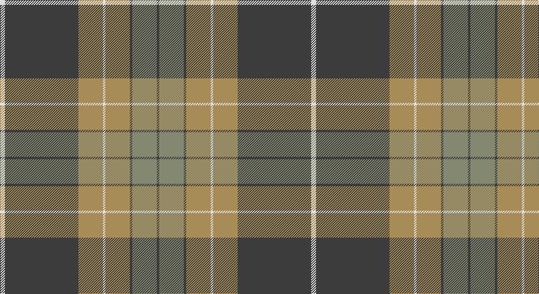

This page is one **sett** — a single exact thread-count. It belongs to the [tartan](/setts/w2do30lo10w1lo10do1y10do1/)
(the same proportion at any scale), whose colour order is pattern [BGBYWYBW](/stripes/bgbywybw/).

Sourced from register-of-tartans.  It is a [8 stripe tartan](/stripes/stripes8/).

Original link https://www.tartanregister.gov.uk/tartanDetails.aspx?ref=1140

2 attestations — the source records this cloth was collapsed from (oldest owns this page)

<ul>
<li>01/01/1978 — Evergreen (register-of-tartans, <a href="https://www.tartanregister.gov.uk/tartanDetails.aspx?ref=1140">record</a>)</li>
<li>pre 1978 — Evergreen (Fashion) (tartans-authority, <a href="http://www.tartansauthority.com/tartan-ferret/display/4830/">record</a>)</li>
</ul>

## Register references

External register numbers recorded for this tartan.

- Scottish Register of Tartans: [1140](https://www.tartanregister.gov.uk/tartanDetails.aspx?ref=1140)
- Scottish Tartans Authority (ITI): 4830

## Thread count
LN/8 N120 LT40 LN4 LT40 N4 Na40 N/4

One full sett is **508 threads**.

## Palette

Palette: <strong>Tartan Dictionary</strong> <small style="color:#888">(1 of 4 colours)</small>
<table><thead><tr><th>Colour</th><th>Threads</th><th>Shade</th><th>Base</th><th>OKLCh</th></tr></thead><tbody><tr><td>LN/</td><td style="text-align:right;font-variant-numeric:tabular-nums">8</td><td><code style="background-color:#E0E0E0;">#E0E0E0</code> <small style="color:#888">#E0E0E0</small></td><td>W <code style="background-color:#F7F7F7;">#F7F7F7</code></td><td><small style="color:#888">oklch(90.7% 0.000 89.9)</small></td></tr><tr><td>N</td><td style="text-align:right;font-variant-numeric:tabular-nums">120</td><td><code style="background-color:#3C3C3C;">#3C3C3C</code> <small style="color:#888">#3C3C3C</small></td><td>B <code style="background-color:#2A418A;">#2A418A</code></td><td><small style="color:#888">oklch(35.6% 0.000 89.9)</small></td></tr><tr><td>LT</td><td style="text-align:right;font-variant-numeric:tabular-nums">40</td><td><code style="background-color:#A88C58;">#A88C58</code> <small style="color:#888">#A88C58</small></td><td>Y <code style="background-color:#F2BF00;">#F2BF00</code></td><td><small style="color:#888">oklch(65.4% 0.077 82.1)</small></td></tr><tr><td>LN</td><td style="text-align:right;font-variant-numeric:tabular-nums">4</td><td><code style="background-color:#E0E0E0;">#E0E0E0</code> <small style="color:#888">#E0E0E0</small></td><td>W <code style="background-color:#F7F7F7;">#F7F7F7</code></td><td><small style="color:#888">oklch(90.7% 0.000 89.9)</small></td></tr><tr><td>LT</td><td style="text-align:right;font-variant-numeric:tabular-nums">40</td><td><code style="background-color:#A88C58;">#A88C58</code> <small style="color:#888">#A88C58</small></td><td>Y <code style="background-color:#F2BF00;">#F2BF00</code></td><td><small style="color:#888">oklch(65.4% 0.077 82.1)</small></td></tr><tr><td>N</td><td style="text-align:right;font-variant-numeric:tabular-nums">4</td><td><code style="background-color:#3C3C3C;">#3C3C3C</code> <small style="color:#888">#3C3C3C</small></td><td>B <code style="background-color:#2A418A;">#2A418A</code></td><td><small style="color:#888">oklch(35.6% 0.000 89.9)</small></td></tr><tr><td>Na</td><td style="text-align:right;font-variant-numeric:tabular-nums">40</td><td><code style="background-color:#848870;">#848870</code> <small style="color:#888">#848870</small></td><td>G <code style="background-color:#006100;">#006100</code></td><td><small style="color:#888">oklch(61.7% 0.035 115.1)</small></td></tr><tr><td>N/</td><td style="text-align:right;font-variant-numeric:tabular-nums">4</td><td><code style="background-color:#3C3C3C;">#3C3C3C</code> <small style="color:#888">#3C3C3C</small></td><td>B <code style="background-color:#2A418A;">#2A418A</code></td><td><small style="color:#888">oklch(35.6% 0.000 89.9)</small></td></tr></tbody></table>

# Sample pattern

## Nearest tartans

The nearest existing variants by ΔTartan distance, with this tartan at the top so the swatches line up against it.

ΔTartan

Tartan

Sett

—

<a href="/ttd/edit/#slug=w2do30lo10w1lo10do1y10do1~x4">Evergreen</a> <a class="nn-out" href="/variants/s8/w2do30lo10w1lo10do1y10do1~x4/" title="open its dictionary page">↗</a>

1.04

<a href="/ttd/edit/#slug=dt44y8dt8y22lr4y4lr11y2w2~x2&amp;base=w2do30lo10w1lo10do1y10do1~x4">Titanium</a> <a class="nn-out" href="/variants/s9/dt44y8dt8y22lr4y4lr11y2w2~x2/" title="open its dictionary page">↗</a>

1.15

<a href="/ttd/edit/#slug=g36t2m2t2m2t2m30dg1m1dg4~x2&amp;base=w2do30lo10w1lo10do1y10do1~x4">Connaught (Lochcarron)</a> <a class="nn-out" href="/variants/s10/g36t2m2t2m2t2m30dg1m1dg4~x2/" title="open its dictionary page">↗</a>

1.18

<a href="/ttd/edit/#slug=r6db2r1db8r3db16g28w2g4~x2&amp;base=w2do30lo10w1lo10do1y10do1~x4">George (Personal)</a> <a class="nn-out" href="/variants/s9/r6db2r1db8r3db16g28w2g4~x2/" title="open its dictionary page">↗</a>

1.23

<a href="/ttd/edit/#slug=n3m2n30m1w18o14m2o3~x2&amp;base=w2do30lo10w1lo10do1y10do1~x4">Bannockbane Variant</a> <a class="nn-out" href="/variants/s8/n3m2n30m1w18o14m2o3~x2/" title="open its dictionary page">↗</a>

1.24

<a href="/ttd/edit/#slug=y36k2y2k2y3k12t10r20~x2&amp;base=w2do30lo10w1lo10do1y10do1~x4">Georgia, State of (District)</a> <a class="nn-out" href="/variants/s8/y36k2y2k2y3k12t10r20~x2/" title="open its dictionary page">↗</a>

1.26

<a href="/ttd/edit/#slug=o9w9o9n25o1w1o1w1g3~x2&amp;base=w2do30lo10w1lo10do1y10do1~x4">Ailsa, Grey (Fashion)</a> <a class="nn-out" href="/variants/s9/o9w9o9n25o1w1o1w1g3~x2/" title="open its dictionary page">↗</a>

1.30

<a href="/ttd/edit/#slug=do8o4w2o4do1o12dg9do24r4~x2&amp;base=w2do30lo10w1lo10do1y10do1~x4">Willsher Wedding (Personal)</a> <a class="nn-out" href="/variants/s9/do8o4w2o4do1o12dg9do24r4~x2/" title="open its dictionary page">↗</a>

1.33

<a href="/ttd/edit/#slug=o2k1lo14o6lo2k10o2lo6o28k1lo2~x2&amp;base=w2do30lo10w1lo10do1y10do1~x4">State Seal of Rhode Island (Fash.)</a> <a class="nn-out" href="/variants/s11/o2k1lo14o6lo2k10o2lo6o28k1lo2~x2/" title="open its dictionary page">↗</a>

1.33

<a href="/ttd/edit/#slug=lo4g4db2g29w1db12g2lo16g4db2~x2&amp;base=w2do30lo10w1lo10do1y10do1~x4">Unidentified (Pahls)</a> <a class="nn-out" href="/variants/s10/lo4g4db2g29w1db12g2lo16g4db2~x2/" title="open its dictionary page">↗</a>

1.34

<a href="/ttd/edit/#slug=y35k3db2k5db3k1db20k3w3~x2&amp;base=w2do30lo10w1lo10do1y10do1~x4">Unidentified (School)</a> <a class="nn-out" href="/variants/s9/y35k3db2k5db3k1db20k3w3~x2/" title="open its dictionary page">↗</a>

## Neighbour map

Every grey dot is one of 14360 variants placed by the first two principal components of the ΔTartan feature space (44% of its variance). Red is this tartan; blue dots are its nearest — click one to open its page.

<svg viewBox="0 0 640 380" role="img" style="max-width:100%;height:auto;border:1px solid #e0e0e0;border-radius:4px;display:block" xmlns="http://www.w3.org/2000/svg"><image href="/nn/cloud.v1.png" width="640" height="380"/><a href="/variants/s9/dt44y8dt8y22lr4y4lr11y2w2~x2/"><circle cx="326.1" cy="158.7" r="4" fill="#3465a4"><title>Titanium</title></circle></a><a href="/variants/s10/g36t2m2t2m2t2m30dg1m1dg4~x2/"><circle cx="348.8" cy="108.8" r="4" fill="#3465a4"><title>Connaught (Lochcarron)</title></circle></a><a href="/variants/s9/r6db2r1db8r3db16g28w2g4~x2/"><circle cx="306.2" cy="150.1" r="4" fill="#3465a4"><title>George (Personal)</title></circle></a><a href="/variants/s8/n3m2n30m1w18o14m2o3~x2/"><circle cx="290.7" cy="136.4" r="4" fill="#3465a4"><title>Bannockbane Variant</title></circle></a><a href="/variants/s8/y36k2y2k2y3k12t10r20~x2/"><circle cx="289.7" cy="167.3" r="4" fill="#3465a4"><title>Georgia, State of (District)</title></circle></a><a href="/variants/s9/o9w9o9n25o1w1o1w1g3~x2/"><circle cx="297.1" cy="148.9" r="4" fill="#3465a4"><title>Ailsa, Grey (Fashion)</title></circle></a><a href="/variants/s9/do8o4w2o4do1o12dg9do24r4~x2/"><circle cx="285.3" cy="157.0" r="4" fill="#3465a4"><title>Willsher Wedding (Personal)</title></circle></a><a href="/variants/s11/o2k1lo14o6lo2k10o2lo6o28k1lo2~x2/"><circle cx="351.4" cy="140.5" r="4" fill="#3465a4"><title>State Seal of Rhode Island (Fash.)</title></circle></a><a href="/variants/s10/lo4g4db2g29w1db12g2lo16g4db2~x2/"><circle cx="341.0" cy="151.0" r="4" fill="#3465a4"><title>Unidentified (Pahls)</title></circle></a><a href="/variants/s9/y35k3db2k5db3k1db20k3w3~x2/"><circle cx="331.5" cy="131.0" r="4" fill="#3465a4"><title>Unidentified (School)</title></circle></a><circle cx="336.9" cy="147.4" r="5" fill="#c00000"/></svg>

ID: /variants/s8/w2do30lo10w1lo10do1y10do1~x4/
