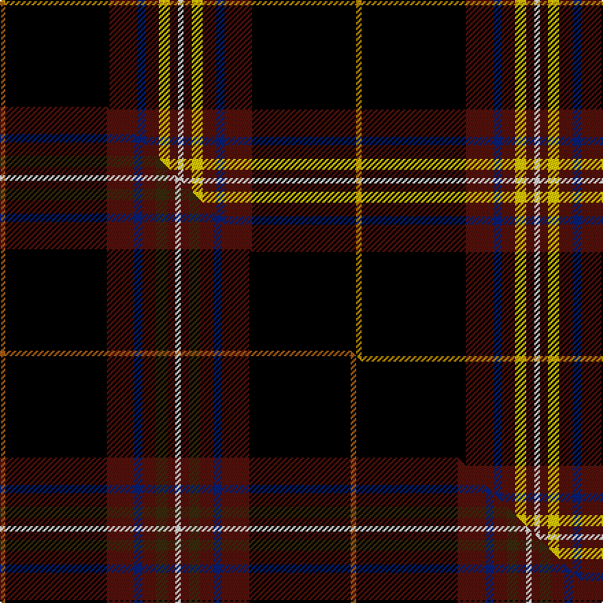

This page is one **sett** — a single exact thread-count. It belongs to the [tartan](/setts/w2dr3lyi4dr5db3dr10k38ly2/)
(the same proportion at any scale), whose colour order is pattern [WBYBBBKY](/stripes/wbybbbky/).

Part of the [Westin Kierland](/tartans/westin-kierland/) tartan — the named design grouping this sett with its other cloths.

Sourced from tartans-authority.  It is a [8 stripe tartan](/stripes/stripes8/).

Original link http://www.tartansauthority.com/tartan-ferret/display/8699/

## Register references

External register numbers recorded for this tartan.

- Scottish Register of Tartans: [8699](https://www.tartanregister.gov.uk/tartanDetails?ref=8699)
- Scottish Tartans Authority (ITI): 8699

## Thread count
LY/4 K76 DR20 DB6 DR10 LYi8 DR6 W/4

One full sett is **260 threads**.

## Palette
<table><thead><tr><th>Colour</th><th>Shade</th><th>OKLCh</th></tr></thead><tbody><tr><td>DB</td><td><code style="background-color:#082077;">#082077</code> <small style="color:#888">#082077</small></td><td><small style="color:#888">oklch(30.0% 0.149 265.1)</small></td></tr><tr><td>DR</td><td><code style="background-color:#55120C;">#55120C</code> <small style="color:#888">#55120C</small></td><td><small style="color:#888">oklch(30.0% 0.099 29.3)</small></td></tr><tr><td>LY</td><td><code style="background-color:#BC8C00;">#BC8C00</code> <small style="color:#888">#BC8C00</small></td><td><small style="color:#888">oklch(66.8% 0.137 84.1)</small></td></tr><tr><td>K</td><td><code style="background-color:#000000;">#000000</code> <small style="color:#888">#000000</small></td><td><small style="color:#888">oklch(0.0% 0.000 0.0)</small></td></tr><tr><td>W</td><td><code style="background-color:#F7F7F7;">#F7F7F7</code> <small style="color:#888">#F7F7F7</small></td><td><small style="color:#888">oklch(97.6% 0.000 89.9)</small></td></tr><tr><td>LY</td><td><code style="background-color:#FCCC00;">#FCCC00</code> <small style="color:#888">#FCCC00</small></td><td><small style="color:#888">oklch(86.2% 0.176 91.5)</small></td></tr></tbody></table>

# Sample pattern

## Compared to the master

This cloth is one sett of its design; the master sett (the exemplar the design is anchored on) is below for comparison.

Its **ΔTartan distance** from the master is **0.64** — the same measure the nearest-tartans table ranks by (0 is identical; a re-scale of the same cloth is near 0, a recolour or a different proportion further).

<figure class="master-compare" style="margin:0">

this sett
master sett ★

<figcaption style="color:#888;font-size:smaller">One weave of this sett against the <a href="/setts/o2k37dr10db3dr5dy4dr3w2/">master sett ★</a>, split on the diagonal: a shared proportion runs seamlessly across it with only the shades shifting; a different proportion breaks on it.</figcaption>
</figure>

## Nearest tartan variants

The nearest existing variants by ΔTartan distance, with this cloth at the top so the swatches line up against it.

ΔTartan

Threads

Variant

Sett

—

260

<a href="/variants/s8/w2dr3lyi4dr5db3dr10k38ly2~x2~lyi3407090-ly2705081/">Westin Kierland (Corporate)</a>

<a href="/ttd/edit/#slug=o2k37dr10db3dr5dy4dr3w2~x2&amp;base=w2dr3lyi4dr5db3dr10k38ly2~x2~lyi3407090-ly2705081" title="compare in the TTD">0.64</a>

256

<a href="/variants/s8/o2k37dr10db3dr5dy4dr3w2~x2/">Westin Kierland</a>

<a href="/ttd/edit/#slug=o2k37r10db3r5dy4r3w2~x2&amp;base=w2dr3lyi4dr5db3dr10k38ly2~x2~lyi3407090-ly2705081" title="compare in the TTD">0.69</a>

256

<a href="/variants/s8/o2k37r10db3r5dy4r3w2~x2/">Westin Kierland</a>

<a href="/ttd/edit/#slug=k30db3k4dp2k2dp2k2dg10r6k2r3w2~x2&amp;base=w2dr3lyi4dr5db3dr10k38ly2~x2~lyi3407090-ly2705081" title="compare in the TTD">2.32</a>

208

<a href="/variants/s12/k30db3k4dp2k2dp2k2dg10r6k2r3w2~x2/">Braveheart Commemorative Tartan</a>

<a href="/ttd/edit/#slug=k2dr3k36n2k5n7ly3lb5g2~x2&amp;base=w2dr3lyi4dr5db3dr10k38ly2~x2~lyi3407090-ly2705081" title="compare in the TTD">2.47</a>

252

<a href="/variants/s9/k2dr3k36n2k5n7ly3lb5g2~x2/">Victory</a>

<a href="/ttd/edit/#slug=lo8k50n15dg6n6db3n6lo2~x2&amp;base=w2dr3lyi4dr5db3dr10k38ly2~x2~lyi3407090-ly2705081" title="compare in the TTD">2.65</a>

364

<a href="/variants/s8/lo8k50n15dg6n6db3n6lo2~x2/">Royal College of G.P.s (Corporate)</a>

<a href="/ttd/edit/#slug=k65do9o11k5t2lo2ly5k2lo13~x2~do1001060&amp;base=w2dr3lyi4dr5db3dr10k38ly2~x2~lyi3407090-ly2705081" title="compare in the TTD">2.66</a>

300

<a href="/variants/s9/k65dg9o11k5t2lo2ly5k2lo13~x2~dg1001060/">Down Irish County Tartan</a>

<a href="/ttd/edit/#slug=k50g6db6r6n6w3~x2&amp;base=w2dr3lyi4dr5db3dr10k38ly2~x2~lyi3407090-ly2705081" title="compare in the TTD">2.73</a>

202

<a href="/variants/s6/k50g6db6r6n6w3~x2/">Friends of Nordegg</a>

<a href="/ttd/edit/#slug=k43b3k7dg3k2dg3k2g11r6k2r3w3~x2&amp;base=w2dr3lyi4dr5db3dr10k38ly2~x2~lyi3407090-ly2705081" title="compare in the TTD">2.75</a>

260

<a href="/variants/s12/k43b3k7dg3k2dg3k2g11r6k2r3w3~x2/">Braveheart - ( Warrior)</a>

<a href="/ttd/edit/#slug=k60w2r10dg6w4r15y10~x2&amp;base=w2dr3lyi4dr5db3dr10k38ly2~x2~lyi3407090-ly2705081" title="compare in the TTD">2.80</a>

288

<a href="/variants/s7/k60w2r10dg6w4r15y10~x2/">Iberia Dress, Black (Fashion)</a>

<a href="/ttd/edit/#slug=db6w3r14k3y2k2w2k38w2k2y2~x2&amp;base=w2dr3lyi4dr5db3dr10k38ly2~x2~lyi3407090-ly2705081" title="compare in the TTD">2.81</a>

288

<a href="/variants/s11/db6w3r14k3y2k2w2k38w2k2y2~x2/">Norwegian Night</a>

## Neighbour map

Every grey dot is one of 13620 variants placed by the first two principal components of the ΔTartan feature space (42% of its variance). Red is this tartan; blue dots are its nearest — click one to open its page.

<svg viewBox="0 0 640 380" role="img" style="max-width:100%;height:auto;border:1px solid #e0e0e0;border-radius:4px;display:block" xmlns="http://www.w3.org/2000/svg"><image href="/nn/cloud.v1.png" width="640" height="380"/><a href="/variants/s8/o2k37dr10db3dr5dy4dr3w2~x2/"><circle cx="284.8" cy="96.8" r="4" fill="#3465a4"><title>Westin Kierland</title></circle></a><a href="/variants/s8/o2k37r10db3r5dy4r3w2~x2/"><circle cx="252.2" cy="82.2" r="4" fill="#3465a4"><title>Westin Kierland</title></circle></a><a href="/variants/s12/k30db3k4dp2k2dp2k2dg10r6k2r3w2~x2/"><circle cx="252.4" cy="79.7" r="4" fill="#3465a4"><title>Braveheart Commemorative Tartan</title></circle></a><a href="/variants/s9/k2dr3k36n2k5n7ly3lb5g2~x2/"><circle cx="305.7" cy="80.4" r="4" fill="#3465a4"><title>Victory</title></circle></a><a href="/variants/s8/lo8k50n15dg6n6db3n6lo2~x2/"><circle cx="255.7" cy="102.4" r="4" fill="#3465a4"><title>Royal College of G.P.s (Corporate)</title></circle></a><a href="/variants/s9/k65dg9o11k5t2lo2ly5k2lo13~x2~dg1001060/"><circle cx="296.8" cy="50.1" r="4" fill="#3465a4"><title>Down Irish County Tartan</title></circle></a><a href="/variants/s6/k50g6db6r6n6w3~x2/"><circle cx="298.6" cy="105.3" r="4" fill="#3465a4"><title>Friends of Nordegg</title></circle></a><a href="/variants/s12/k43b3k7dg3k2dg3k2g11r6k2r3w3~x2/"><circle cx="284.5" cy="56.1" r="4" fill="#3465a4"><title>Braveheart - ( Warrior)</title></circle></a><a href="/variants/s7/k60w2r10dg6w4r15y10~x2/"><circle cx="272.9" cy="91.6" r="4" fill="#3465a4"><title>Iberia Dress, Black (Fashion)</title></circle></a><a href="/variants/s11/db6w3r14k3y2k2w2k38w2k2y2~x2/"><circle cx="270.1" cy="74.1" r="4" fill="#3465a4"><title>Norwegian Night</title></circle></a><circle cx="266.5" cy="89.3" r="5" fill="#c00000"/><text x="320" y="376" text-anchor="middle" font-size="11" fill="#999">ground</text><text x="11" y="190" text-anchor="middle" font-size="11" fill="#999" transform="rotate(-90 11 190)">complexity</text></svg>

ID: /variants/s8/w2dr3lyi4dr5db3dr10k38ly2~x2~lyi3407090-ly2705081/
