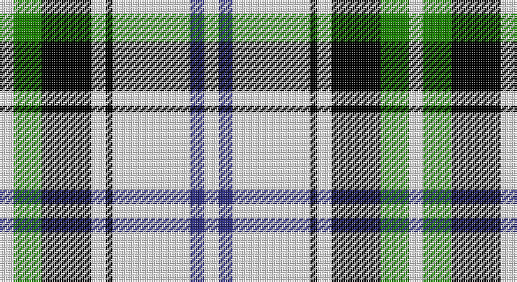

This page is one **sett** — a single exact thread-count. It belongs to the [tartan](/setts/w2g4k7w2k1w11db2w2/)
(the same proportion at any scale), whose colour order is pattern [WBWKWKGW](/stripes/wbwkwkgw/).

Part of the [Forbes](/tartans/forbes-2/) tartan — the named design grouping this sett with its other cloths.

Sourced from tartans-authority.  It is a [8 stripe tartan](/stripes/stripes8/).

Original link http://www.tartansauthority.com/tartan-ferret/display/3490/

## Register references

External register numbers recorded for this tartan.

- Scottish Tartans Authority (ITI): 3490

## Thread count
W/8 G16 K28 W8 K4 W44 DB8 W/8

One full sett is **232 threads**.

## Palette

Palette: <strong>Tartan Register</strong> <small style="color:#888">(3 of 4 colours)</small>
<table><thead><tr><th>Colour</th><th>Threads</th><th>Shade</th><th>Base</th><th>OKLCh</th></tr></thead><tbody><tr><td>W/</td><td style="text-align:right;font-variant-numeric:tabular-nums">8</td><td><code style="background-color:#F8F8F8;">#F8F8F8</code> <small style="color:#888">#F8F8F8</small></td><td>W <code style="background-color:#F7F7F7;">#F7F7F7</code></td><td><small style="color:#888">oklch(97.9% 0.000 89.9)</small></td></tr><tr><td>G</td><td style="text-align:right;font-variant-numeric:tabular-nums">16</td><td><code style="background-color:#188400;">#188400</code> <small style="color:#888">#188400</small></td><td>G <code style="background-color:#006100;">#006100</code></td><td><small style="color:#888">oklch(53.4% 0.177 141.3)</small></td></tr><tr><td>K</td><td style="text-align:right;font-variant-numeric:tabular-nums">28</td><td><code style="background-color:#000000;">#000000</code> <small style="color:#888">#000000</small></td><td>K <code style="background-color:#000000;">#000000</code></td><td><small style="color:#888">oklch(0.0% 0.000 0.0)</small></td></tr><tr><td>W</td><td style="text-align:right;font-variant-numeric:tabular-nums">8</td><td><code style="background-color:#F8F8F8;">#F8F8F8</code> <small style="color:#888">#F8F8F8</small></td><td>W <code style="background-color:#F7F7F7;">#F7F7F7</code></td><td><small style="color:#888">oklch(97.9% 0.000 89.9)</small></td></tr><tr><td>K</td><td style="text-align:right;font-variant-numeric:tabular-nums">4</td><td><code style="background-color:#000000;">#000000</code> <small style="color:#888">#000000</small></td><td>K <code style="background-color:#000000;">#000000</code></td><td><small style="color:#888">oklch(0.0% 0.000 0.0)</small></td></tr><tr><td>W</td><td style="text-align:right;font-variant-numeric:tabular-nums">44</td><td><code style="background-color:#F8F8F8;">#F8F8F8</code> <small style="color:#888">#F8F8F8</small></td><td>W <code style="background-color:#F7F7F7;">#F7F7F7</code></td><td><small style="color:#888">oklch(97.9% 0.000 89.9)</small></td></tr><tr><td>DB</td><td style="text-align:right;font-variant-numeric:tabular-nums">8</td><td><code style="background-color:#2C2C80;">#2C2C80</code> <small style="color:#888">#2C2C80</small></td><td>B <code style="background-color:#2A418A;">#2A418A</code></td><td><small style="color:#888">oklch(35.0% 0.138 276.6)</small></td></tr><tr><td>W/</td><td style="text-align:right;font-variant-numeric:tabular-nums">8</td><td><code style="background-color:#F8F8F8;">#F8F8F8</code> <small style="color:#888">#F8F8F8</small></td><td>W <code style="background-color:#F7F7F7;">#F7F7F7</code></td><td><small style="color:#888">oklch(97.9% 0.000 89.9)</small></td></tr></tbody></table>

# Sample pattern

## Compared to the master

This cloth is one sett of its design; the master sett (the exemplar the design is anchored on) is below for comparison.

<figure style="margin:0"><figcaption style="color:#888;font-size:smaller">this sett</figcaption></figure>
<figure style="margin:0"><figcaption style="color:#888;font-size:smaller"><a href="/setts/k46r8lb1r8k8lb6o6lb14o1lb6/">master sett →</a></figcaption></figure>

## Nearest tartans

The nearest existing variants by ΔTartan distance, with this tartan at the top so the swatches line up against it.

ΔTartan

Tartan

Sett

—

<a href="/ttd/edit/#slug=w2g4k7w2k1w11db2w2~x4">Forbes - 1880 (Clans Originaux)</a> <a class="nn-out" href="/variants/s8/w2g4k7w2k1w11db2w2~x4/" title="open its dictionary page">↗</a>

1.00

<a href="/ttd/edit/#slug=w3p3w30k20w3k9ly3~x2&amp;base=w2g4k7w2k1w11db2w2~x4">MacPherson Dress (1951)</a> <a class="nn-out" href="/variants/s7/w3p3w30k20w3k9ly3~x2/" title="open its dictionary page">↗</a>

1.07

<a href="/ttd/edit/#slug=k4w1k1w9g1w1g1w1o4~x4&amp;base=w2g4k7w2k1w11db2w2~x4">Puffin (Personal)</a> <a class="nn-out" href="/variants/s9/k4w1k1w9g1w1g1w1o4~x4/" title="open its dictionary page">↗</a>

1.12

<a href="/ttd/edit/#slug=k22w16g2w14g2w16k22r3~x2&amp;base=w2g4k7w2k1w11db2w2~x4">Kierson</a> <a class="nn-out" href="/variants/s8/k22w16g2w14g2w16k22r3~x2/" title="open its dictionary page">↗</a>

1.18

<a href="/ttd/edit/#slug=ly9k32g6w20ly3w9k5~x2&amp;base=w2g4k7w2k1w11db2w2~x4">Black and White Golf</a> <a class="nn-out" href="/variants/s7/ly9k32g6w20ly3w9k5~x2/" title="open its dictionary page">↗</a>

1.19

<a href="/ttd/edit/#slug=k3w1k1w6g1w1g1w1o3~x4&amp;base=w2g4k7w2k1w11db2w2~x4">Puffin</a> <a class="nn-out" href="/variants/s9/k3w1k1w6g1w1g1w1o3~x4/" title="open its dictionary page">↗</a>

1.19

<a href="/ttd/edit/#slug=k9w4k2w4k2w30k9w4db14ly2~x2&amp;base=w2g4k7w2k1w11db2w2~x4">Hannay</a> <a class="nn-out" href="/variants/s10/k9w4k2w4k2w30k9w4db14ly2~x2/" title="open its dictionary page">↗</a>

1.23

<a href="/ttd/edit/#slug=k9lb4k2lb4k2lb30k9lb4b14lo2~x2&amp;base=w2g4k7w2k1w11db2w2~x4">Hannay (Clan)</a> <a class="nn-out" href="/variants/s10/k9lb4k2lb4k2lb30k9lb4b14lo2~x2/" title="open its dictionary page">↗</a>

1.25

<a href="/ttd/edit/#slug=k9w4k2w4k2w29k9w4b14lo2~x2&amp;base=w2g4k7w2k1w11db2w2~x4">Hannay</a> <a class="nn-out" href="/variants/s10/k9w4k2w4k2w29k9w4b14lo2~x2/" title="open its dictionary page">↗</a>

1.26

<a href="/ttd/edit/#slug=r1lb12k1w2k5r1~x4&amp;base=w2g4k7w2k1w11db2w2~x4">Rui (Personal)</a> <a class="nn-out" href="/variants/s6/r1lb12k1w2k5r1~x4/" title="open its dictionary page">↗</a>

1.29

<a href="/ttd/edit/#slug=w1m2w17k11w2k4ly1~x4&amp;base=w2g4k7w2k1w11db2w2~x4">MacPherson - 1842 (VS) Dress</a> <a class="nn-out" href="/variants/s7/w1m2w17k11w2k4ly1~x4/" title="open its dictionary page">↗</a>

## Neighbour map

Every grey dot is one of 14360 variants placed by the first two principal components of the ΔTartan feature space (44% of its variance). Red is this tartan; blue dots are its nearest — click one to open its page.

<svg viewBox="0 0 640 380" role="img" style="max-width:100%;height:auto;border:1px solid #e0e0e0;border-radius:4px;display:block" xmlns="http://www.w3.org/2000/svg"><image href="/nn/cloud.v1.png" width="640" height="380"/><a href="/variants/s7/w3p3w30k20w3k9ly3~x2/"><circle cx="246.6" cy="164.5" r="4" fill="#3465a4"><title>MacPherson Dress (1951)</title></circle></a><a href="/variants/s9/k4w1k1w9g1w1g1w1o4~x4/"><circle cx="213.5" cy="147.5" r="4" fill="#3465a4"><title>Puffin (Personal)</title></circle></a><a href="/variants/s8/k22w16g2w14g2w16k22r3~x2/"><circle cx="209.3" cy="183.7" r="4" fill="#3465a4"><title>Kierson</title></circle></a><a href="/variants/s7/ly9k32g6w20ly3w9k5~x2/"><circle cx="177.1" cy="174.5" r="4" fill="#3465a4"><title>Black and White Golf</title></circle></a><a href="/variants/s9/k3w1k1w6g1w1g1w1o3~x4/"><circle cx="171.3" cy="182.2" r="4" fill="#3465a4"><title>Puffin</title></circle></a><a href="/variants/s10/k9w4k2w4k2w30k9w4db14ly2~x2/"><circle cx="242.1" cy="131.7" r="4" fill="#3465a4"><title>Hannay</title></circle></a><a href="/variants/s10/k9lb4k2lb4k2lb30k9lb4b14lo2~x2/"><circle cx="251.5" cy="131.9" r="4" fill="#3465a4"><title>Hannay (Clan)</title></circle></a><a href="/variants/s10/k9w4k2w4k2w29k9w4b14lo2~x2/"><circle cx="233.2" cy="128.7" r="4" fill="#3465a4"><title>Hannay</title></circle></a><a href="/variants/s6/r1lb12k1w2k5r1~x4/"><circle cx="259.6" cy="153.0" r="4" fill="#3465a4"><title>Rui (Personal)</title></circle></a><a href="/variants/s7/w1m2w17k11w2k4ly1~x4/"><circle cx="280.8" cy="140.6" r="4" fill="#3465a4"><title>MacPherson - 1842 (VS) Dress</title></circle></a><circle cx="224.0" cy="163.7" r="5" fill="#c00000"/></svg>

ID: /variants/s8/w2g4k7w2k1w11db2w2~x4/
