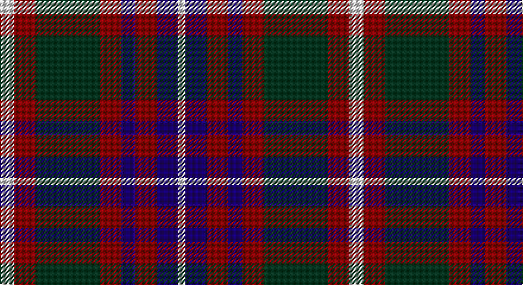

This page is one **sett** — a single exact thread-count. It belongs to the [tartan](/setts/w2r3dg9r3db2r3db3w1/)
(the same proportion at any scale), whose colour order is pattern [WBRBRGRW](/stripes/wbrbrgrw/).

Sourced from tartans-authority.  It is a [8 stripe tartan](/stripes/stripes8/).

Original link http://www.tartansauthority.com/tartan-ferret/display/2702/

## Provenance

Earliest known date: 1995 Utah state tartan was commissioned by Garry Bryant, KdeB, KCR, SC, designed by Dr. Phil Smith and adopted by a joint committee of the state's Scottish Societies and made official by Senate Resolution. A combination of the Logan and Skene tartans to honour the first two fur trappers to enter Utah. Sample in STA Johnston Collection. Tartan Society notes add: It is the Logan Tartan TS399 with a white over check added and a blue substituted for a white. Ephraim Logan was an early visitor to Cache Valley in northern Utah in 1824 naming the river after his clan/family name. Official threadcount tripled.

## Also known as

This cloth is also recorded under:

- Utah State

3 attestations — the source records this cloth was collapsed from (oldest owns this page)

<ul>
<li>1995 — Utah (US State) (tartans-authority, <a href="http://www.tartansauthority.com/tartan-ferret/display/2702/">record</a>)</li>
<li>01/01/1997 — Utah (register-of-tartans, <a href="https://www.tartanregister.gov.uk/tartanDetails.aspx?ref=4826">record</a>)</li>
<li>undated — Utah State American District Tartan (house-of-tartan, <a href="http://www.house-of-tartan.scotland.net/house/TartanViewjs.asp?colr=Def&tnam=2702">record</a>)</li>
</ul>

## Register references

External register numbers recorded for this tartan.

- Scottish Register of Tartans: [4826](https://www.tartanregister.gov.uk/tartanDetails.aspx?ref=4826)
- Scottish Tartans Authority (ITI): 2702
- Scottish Tartans World Register: 2702

## Thread count
LN/12 DR18 DG54 DR18 DB12 DR18 DB18 LN/6

One full sett is **294 threads**.

## Palette

Palette: <strong>Tartan Register</strong>
<table><thead><tr><th>Colour</th><th>Threads</th><th>Shade</th><th>Base</th><th>OKLCh</th></tr></thead><tbody><tr><td>LN/</td><td style="text-align:right;font-variant-numeric:tabular-nums">12</td><td><code style="background-color:#E0E0E0;">#E0E0E0</code> <small style="color:#888">#E0E0E0</small></td><td>W <code style="background-color:#F7F7F7;">#F7F7F7</code></td><td><small style="color:#888">oklch(90.7% 0.000 89.9)</small></td></tr><tr><td>DR</td><td style="text-align:right;font-variant-numeric:tabular-nums">18</td><td><code style="background-color:#880000;">#880000</code> <small style="color:#888">#880000</small></td><td>R <code style="background-color:#CC0000;">#CC0000</code></td><td><small style="color:#888">oklch(39.4% 0.162 29.2)</small></td></tr><tr><td>DG</td><td style="text-align:right;font-variant-numeric:tabular-nums">54</td><td><code style="background-color:#003820;">#003820</code> <small style="color:#888">#003820</small></td><td>G <code style="background-color:#006100;">#006100</code></td><td><small style="color:#888">oklch(30.0% 0.070 158.3)</small></td></tr><tr><td>DR</td><td style="text-align:right;font-variant-numeric:tabular-nums">18</td><td><code style="background-color:#880000;">#880000</code> <small style="color:#888">#880000</small></td><td>R <code style="background-color:#CC0000;">#CC0000</code></td><td><small style="color:#888">oklch(39.4% 0.162 29.2)</small></td></tr><tr><td>DB</td><td style="text-align:right;font-variant-numeric:tabular-nums">12</td><td><code style="background-color:#1C0070;">#1C0070</code> <small style="color:#888">#1C0070</small></td><td>B <code style="background-color:#2A418A;">#2A418A</code></td><td><small style="color:#888">oklch(26.3% 0.162 277.1)</small></td></tr><tr><td>DR</td><td style="text-align:right;font-variant-numeric:tabular-nums">18</td><td><code style="background-color:#880000;">#880000</code> <small style="color:#888">#880000</small></td><td>R <code style="background-color:#CC0000;">#CC0000</code></td><td><small style="color:#888">oklch(39.4% 0.162 29.2)</small></td></tr><tr><td>DB</td><td style="text-align:right;font-variant-numeric:tabular-nums">18</td><td><code style="background-color:#1C0070;">#1C0070</code> <small style="color:#888">#1C0070</small></td><td>B <code style="background-color:#2A418A;">#2A418A</code></td><td><small style="color:#888">oklch(26.3% 0.162 277.1)</small></td></tr><tr><td>LN/</td><td style="text-align:right;font-variant-numeric:tabular-nums">6</td><td><code style="background-color:#E0E0E0;">#E0E0E0</code> <small style="color:#888">#E0E0E0</small></td><td>W <code style="background-color:#F7F7F7;">#F7F7F7</code></td><td><small style="color:#888">oklch(90.7% 0.000 89.9)</small></td></tr></tbody></table>

# Sample pattern

## Nearest tartans

The nearest existing variants by ΔTartan distance, with this tartan at the top so the swatches line up against it.

ΔTartan

Tartan

Sett

—

<a href="/ttd/edit/#slug=w2r3dg9r3db2r3db3w1~x6">Utah (US State)</a> <a class="nn-out" href="/variants/s8/w2r3dg9r3db2r3db3w1~x6/" title="open its dictionary page">↗</a>

0.76

<a href="/ttd/edit/#slug=ly6g3ly3g22k23dp23k4~x2&amp;base=w2r3dg9r3db2r3db3w1~x6">Gordon of Esslemont Family Tartan</a> <a class="nn-out" href="/variants/s7/ly6g3ly3g22k23dp23k4~x2/" title="open its dictionary page">↗</a>

0.78

<a href="/variants/s10/g19w2g4k13dp12k3~x2/">Wilson's No.158</a>

0.80

<a href="/ttd/edit/#slug=dp17k18w2g17k3g17w2k18dp17g3~x2&amp;base=w2r3dg9r3db2r3db3w1~x6">Wilson's No.076</a> <a class="nn-out" href="/variants/s10/dp17k18w2g17k3g17w2k18dp17g3~x2/" title="open its dictionary page">↗</a>

0.82

<a href="/variants/s10/g19ly2g4k13dp12k3~x2/">Wilson's No.160</a>

0.86

<a href="/ttd/edit/#slug=oi4db19oi3k20o24db3~x2&amp;base=w2r3dg9r3db2r3db3w1~x6">Edinburgh International Conference Centre</a> <a class="nn-out" href="/variants/s6/oi4db19oi3k20o24db3~x2/" title="open its dictionary page">↗</a>

0.89

<a href="/ttd/edit/#slug=ly6dg3ly3dg22k23dp23k4~x2&amp;base=w2r3dg9r3db2r3db3w1~x6">Gordon of Esslemont</a> <a class="nn-out" href="/variants/s7/ly6dg3ly3dg22k23dp23k4~x2/" title="open its dictionary page">↗</a>

0.90

<a href="/ttd/edit/#slug=g12k2m12k3o12k16o12k3m6~x2&amp;base=w2r3dg9r3db2r3db3w1~x6">Borthwick Family Tartan</a> <a class="nn-out" href="/variants/s9/g12k2m12k3o12k16o12k3m6~x2/" title="open its dictionary page">↗</a>

0.93

<a href="/ttd/edit/#slug=dp16k17g18w2k5w2g18k17dp16k3~x2&amp;base=w2r3dg9r3db2r3db3w1~x6">Wilson's No.175</a> <a class="nn-out" href="/variants/s10/dp16k17g18w2k5w2g18k17dp16k3~x2/" title="open its dictionary page">↗</a>

0.94

<a href="/ttd/edit/#slug=dg12k2r12k3o12k16o12k3r6~x2&amp;base=w2r3dg9r3db2r3db3w1~x6">Borthwick</a> <a class="nn-out" href="/variants/s9/dg12k2r12k3o12k16o12k3r6~x2/" title="open its dictionary page">↗</a>

0.97

<a href="/ttd/edit/#slug=ly5g22dp15dpi11dp5g2~x2&amp;base=w2r3dg9r3db2r3db3w1~x6">Scottish Ballet</a> <a class="nn-out" href="/variants/s6/ly5g22dp15dpi11dp5g2~x2/" title="open its dictionary page">↗</a>

## Neighbour map

Every grey dot is one of 14360 variants placed by the first two principal components of the ΔTartan feature space (44% of its variance). Red is this tartan; blue dots are its nearest — click one to open its page.

<svg viewBox="0 0 640 380" role="img" style="max-width:100%;height:auto;border:1px solid #e0e0e0;border-radius:4px;display:block" xmlns="http://www.w3.org/2000/svg"><image href="/nn/cloud.v1.png" width="640" height="380"/><a href="/variants/s7/ly6g3ly3g22k23dp23k4~x2/"><circle cx="143.4" cy="212.0" r="4" fill="#3465a4"><title>Gordon of Esslemont Family Tartan</title></circle></a><a href="/variants/s10/g19w2g4k13dp12k3~x2/"><circle cx="163.2" cy="205.7" r="4" fill="#3465a4"><title>Wilson's No.158</title></circle></a><a href="/variants/s10/dp17k18w2g17k3g17w2k18dp17g3~x2/"><circle cx="155.0" cy="208.0" r="4" fill="#3465a4"><title>Wilson's No.076</title></circle></a><a href="/variants/s10/g19ly2g4k13dp12k3~x2/"><circle cx="167.0" cy="207.4" r="4" fill="#3465a4"><title>Wilson's No.160</title></circle></a><a href="/variants/s6/oi4db19oi3k20o24db3~x2/"><circle cx="153.2" cy="224.2" r="4" fill="#3465a4"><title>Edinburgh International Conference Centre</title></circle></a><a href="/variants/s7/ly6dg3ly3dg22k23dp23k4~x2/"><circle cx="148.6" cy="218.3" r="4" fill="#3465a4"><title>Gordon of Esslemont</title></circle></a><a href="/variants/s9/g12k2m12k3o12k16o12k3m6~x2/"><circle cx="124.0" cy="223.8" r="4" fill="#3465a4"><title>Borthwick Family Tartan</title></circle></a><a href="/variants/s10/dp16k17g18w2k5w2g18k17dp16k3~x2/"><circle cx="164.5" cy="216.5" r="4" fill="#3465a4"><title>Wilson's No.175</title></circle></a><a href="/variants/s9/dg12k2r12k3o12k16o12k3r6~x2/"><circle cx="127.8" cy="226.4" r="4" fill="#3465a4"><title>Borthwick</title></circle></a><a href="/variants/s6/ly5g22dp15dpi11dp5g2~x2/"><circle cx="194.5" cy="214.0" r="4" fill="#3465a4"><title>Scottish Ballet</title></circle></a><circle cx="158.4" cy="207.5" r="5" fill="#c00000"/></svg>

ID: /variants/s8/w2r3dg9r3db2r3db3w1~x6/
