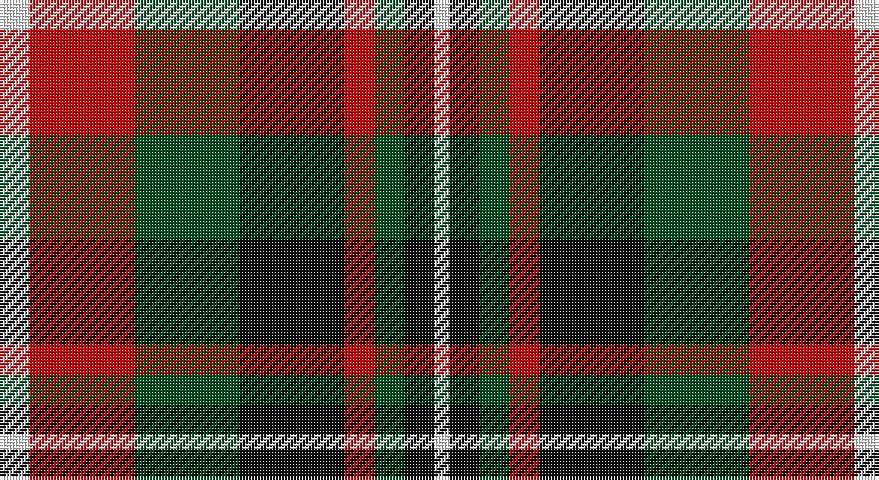

This page is one **sett** — a single exact thread-count. It belongs to the [tartan](/setts/w2r7dg7k7r2dg2k2w1/)
(the same proportion at any scale), whose colour order is pattern [WKGRKGRW](/stripes/wkgrkgrw/).

Sourced from register-of-tartans.  It is a [8 stripe tartan](/stripes/stripes8/).

Original link https://www.tartanregister.gov.uk/tartanDetails.aspx?ref=11618

## Register references

External register numbers recorded for this tartan.

- Scottish Register of Tartans: [11618](https://www.tartanregister.gov.uk/tartanDetails.aspx?ref=11618)

## Thread count
W/10 R35 G35 K35 R10 G10 K10 W/5

One full sett is **285 threads**.

## Palette

Palette: <strong>Tartan Register</strong>
<table><thead><tr><th>Colour</th><th>Threads</th><th>Shade</th><th>Base</th><th>OKLCh</th></tr></thead><tbody><tr><td>W/</td><td style="text-align:right;font-variant-numeric:tabular-nums">10</td><td><code style="background-color:#FFFFFF;">#FFFFFF</code> <small style="color:#888">#FFFFFF</small></td><td>W <code style="background-color:#F7F7F7;">#F7F7F7</code></td><td><small style="color:#888">oklch(100.0% 0.000 89.9)</small></td></tr><tr><td>R</td><td style="text-align:right;font-variant-numeric:tabular-nums">35</td><td><code style="background-color:#DC0000;">#DC0000</code> <small style="color:#888">#DC0000</small></td><td>R <code style="background-color:#CC0000;">#CC0000</code></td><td><small style="color:#888">oklch(56.2% 0.230 29.2)</small></td></tr><tr><td>G</td><td style="text-align:right;font-variant-numeric:tabular-nums">35</td><td><code style="background-color:#005020;">#005020</code> <small style="color:#888">#005020</small></td><td>G <code style="background-color:#006100;">#006100</code></td><td><small style="color:#888">oklch(37.7% 0.105 149.6)</small></td></tr><tr><td>K</td><td style="text-align:right;font-variant-numeric:tabular-nums">35</td><td><code style="background-color:#101010;">#101010</code> <small style="color:#888">#101010</small></td><td>K <code style="background-color:#000000;">#000000</code></td><td><small style="color:#888">oklch(17.3% 0.000 89.9)</small></td></tr><tr><td>R</td><td style="text-align:right;font-variant-numeric:tabular-nums">10</td><td><code style="background-color:#DC0000;">#DC0000</code> <small style="color:#888">#DC0000</small></td><td>R <code style="background-color:#CC0000;">#CC0000</code></td><td><small style="color:#888">oklch(56.2% 0.230 29.2)</small></td></tr><tr><td>G</td><td style="text-align:right;font-variant-numeric:tabular-nums">10</td><td><code style="background-color:#005020;">#005020</code> <small style="color:#888">#005020</small></td><td>G <code style="background-color:#006100;">#006100</code></td><td><small style="color:#888">oklch(37.7% 0.105 149.6)</small></td></tr><tr><td>K</td><td style="text-align:right;font-variant-numeric:tabular-nums">10</td><td><code style="background-color:#101010;">#101010</code> <small style="color:#888">#101010</small></td><td>K <code style="background-color:#000000;">#000000</code></td><td><small style="color:#888">oklch(17.3% 0.000 89.9)</small></td></tr><tr><td>W/</td><td style="text-align:right;font-variant-numeric:tabular-nums">5</td><td><code style="background-color:#FFFFFF;">#FFFFFF</code> <small style="color:#888">#FFFFFF</small></td><td>W <code style="background-color:#F7F7F7;">#F7F7F7</code></td><td><small style="color:#888">oklch(100.0% 0.000 89.9)</small></td></tr></tbody></table>

# Sample pattern

## Nearest tartans

The nearest existing variants by ΔTartan distance, with this tartan at the top so the swatches line up against it.

ΔTartan

Tartan

Sett

—

<a href="/ttd/edit/#slug=w2r7dg7k7r2dg2k2w1~x5">Al Suwaidi of Abu Dhabi (Personal)</a> <a class="nn-out" href="/variants/s8/w2r7dg7k7r2dg2k2w1~x5/" title="open its dictionary page">↗</a>

0.82

<a href="/ttd/edit/#slug=lb13k3lb3k3lb3k15dy18r3~x2&amp;base=w2r7dg7k7r2dg2k2w1~x5">Holden Brown (Corporate)</a> <a class="nn-out" href="/variants/s8/lb13k3lb3k3lb3k15dy18r3~x2/" title="open its dictionary page">↗</a>

1.07

<a href="/ttd/edit/#slug=g12k2r12k3y12k16y12k3r6~x2&amp;base=w2r7dg7k7r2dg2k2w1~x5">Borthwick</a> <a class="nn-out" href="/variants/s9/g12k2r12k3y12k16y12k3r6~x2/" title="open its dictionary page">↗</a>

1.09

<a href="/ttd/edit/#slug=lb23k4lb4k4lb4k22o23lo5~x2&amp;base=w2r7dg7k7r2dg2k2w1~x5">Aberlour</a> <a class="nn-out" href="/variants/s8/lb23k4lb4k4lb4k22o23lo5~x2/" title="open its dictionary page">↗</a>

1.09

<a href="/ttd/edit/#slug=dp13r8lb5dg24lb5r10lb5r10~x2&amp;base=w2r7dg7k7r2dg2k2w1~x5">Chaudhri (Name)</a> <a class="nn-out" href="/variants/s8/dp13r8lb5dg24lb5r10lb5r10~x2/" title="open its dictionary page">↗</a>

1.16

<a href="/ttd/edit/#slug=dg12k2r12k3n12k16n12k3r6~x2&amp;base=w2r7dg7k7r2dg2k2w1~x5">Borthwick Hunting</a> <a class="nn-out" href="/variants/s9/dg12k2r12k3n12k16n12k3r6~x2/" title="open its dictionary page">↗</a>

1.18

<a href="/ttd/edit/#slug=k14w2k3o14lb6r14k2r3~x2&amp;base=w2r7dg7k7r2dg2k2w1~x5">Raytheon</a> <a class="nn-out" href="/variants/s8/k14w2k3o14lb6r14k2r3~x2/" title="open its dictionary page">↗</a>

1.19

<a href="/ttd/edit/#slug=ly6g3ly3g22k23dp23k4~x2&amp;base=w2r7dg7k7r2dg2k2w1~x5">Gordon of Esslemont Family Tartan</a> <a class="nn-out" href="/variants/s7/ly6g3ly3g22k23dp23k4~x2/" title="open its dictionary page">↗</a>

1.20

<a href="/ttd/edit/#slug=lb2k2r14dg15k8lb7r14k2lb2&amp;base=w2r7dg7k7r2dg2k2w1~x5">Montrose</a> <a class="nn-out" href="/variants/s9/lb2k2r14dg15k8lb7r14k2lb2/" title="open its dictionary page">↗</a>

1.21

<a href="/ttd/edit/#slug=r1g6ly1r2ly1r2ly1db6ly1~x8&amp;base=w2r7dg7k7r2dg2k2w1~x5">Stevenson (Name)</a> <a class="nn-out" href="/variants/s9/r1g6ly1r2ly1r2ly1db6ly1~x8/" title="open its dictionary page">↗</a>

1.21

<a href="/ttd/edit/#slug=r33g17db50g17r11g17r9k7&amp;base=w2r7dg7k7r2dg2k2w1~x5">Carnegie</a> <a class="nn-out" href="/variants/s8/r33g17db50g17r11g17r9k7/" title="open its dictionary page">↗</a>

## Neighbour map

Every grey dot is one of 14360 variants placed by the first two principal components of the ΔTartan feature space (44% of its variance). Red is this tartan; blue dots are its nearest — click one to open its page.

<svg viewBox="0 0 640 380" role="img" style="max-width:100%;height:auto;border:1px solid #e0e0e0;border-radius:4px;display:block" xmlns="http://www.w3.org/2000/svg"><image href="/nn/cloud.v1.png" width="640" height="380"/><a href="/variants/s8/lb13k3lb3k3lb3k15dy18r3~x2/"><circle cx="132.4" cy="196.7" r="4" fill="#3465a4"><title>Holden Brown (Corporate)</title></circle></a><a href="/variants/s9/g12k2r12k3y12k16y12k3r6~x2/"><circle cx="99.9" cy="215.3" r="4" fill="#3465a4"><title>Borthwick</title></circle></a><a href="/variants/s8/lb23k4lb4k4lb4k22o23lo5~x2/"><circle cx="130.3" cy="193.0" r="4" fill="#3465a4"><title>Aberlour</title></circle></a><a href="/variants/s8/dp13r8lb5dg24lb5r10lb5r10~x2/"><circle cx="119.8" cy="232.3" r="4" fill="#3465a4"><title>Chaudhri (Name)</title></circle></a><a href="/variants/s9/dg12k2r12k3n12k16n12k3r6~x2/"><circle cx="110.8" cy="219.4" r="4" fill="#3465a4"><title>Borthwick Hunting</title></circle></a><a href="/variants/s8/k14w2k3o14lb6r14k2r3~x2/"><circle cx="107.1" cy="180.2" r="4" fill="#3465a4"><title>Raytheon</title></circle></a><a href="/variants/s7/ly6g3ly3g22k23dp23k4~x2/"><circle cx="143.4" cy="212.0" r="4" fill="#3465a4"><title>Gordon of Esslemont Family Tartan</title></circle></a><a href="/variants/s9/lb2k2r14dg15k8lb7r14k2lb2/"><circle cx="158.4" cy="185.1" r="4" fill="#3465a4"><title>Montrose</title></circle></a><a href="/variants/s9/r1g6ly1r2ly1r2ly1db6ly1~x8/"><circle cx="114.3" cy="198.6" r="4" fill="#3465a4"><title>Stevenson (Name)</title></circle></a><a href="/variants/s8/r33g17db50g17r11g17r9k7/"><circle cx="157.8" cy="222.2" r="4" fill="#3465a4"><title>Carnegie</title></circle></a><circle cx="111.1" cy="205.0" r="5" fill="#c00000"/></svg>

ID: /variants/s8/w2r7dg7k7r2dg2k2w1~x5/
