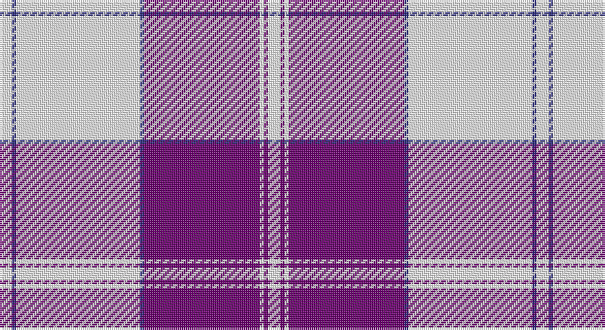

This page is one **sett** — a single exact thread-count. It belongs to the [tartan](/setts/w3db1w30db1dp28w1dp1w3/)
(the same proportion at any scale), whose colour order is pattern [WBWBBWBW](/stripes/wbwbbwbw/).

Sourced from register-of-tartans.  It is a [8 stripe tartan](/stripes/stripes8/).

Original link https://www.tartanregister.gov.uk/tartanDetails.aspx?ref=1046

## Provenance

Earliest known date: 1984 Revised version

## Also known as

This cloth is also recorded under:

- Dunlop, dress

3 attestations — the source records this cloth was collapsed from (oldest owns this page)

<ul>
<li>01/01/1982 — Dunlop Dress (register-of-tartans, <a href="https://www.tartanregister.gov.uk/tartanDetails.aspx?ref=1046">record</a>)</li>
<li>1982 — Dunlop Dress (Clan) (tartans-authority, <a href="http://www.tartansauthority.com/tartan-ferret/display/1784/">record</a>)</li>
<li>undated — Dunlop Dress Family Tartan (house-of-tartan, <a href="http://www.house-of-tartan.scotland.net/house/TartanViewjs.asp?colr=Def&tnam=1784">record</a>)</li>
</ul>

## Register references

External register numbers recorded for this tartan.

- Scottish Register of Tartans: [1046](https://www.tartanregister.gov.uk/tartanDetails.aspx?ref=1046)
- Scottish Tartans Authority (ITI): 1784
- Scottish Tartans World Register: 1784

## Thread count
W/6 DB2 W60 DB2 P56 W2 P2 W/6

One full sett is **260 threads**.

## Palette

Palette: <strong>Tartan Register</strong>
<table><thead><tr><th>Colour</th><th>Threads</th><th>Shade</th><th>Base</th><th>OKLCh</th></tr></thead><tbody><tr><td>W/</td><td style="text-align:right;font-variant-numeric:tabular-nums">6</td><td><code style="background-color:#FCFCFC;">#FCFCFC</code> <small style="color:#888">#FCFCFC</small></td><td>W <code style="background-color:#F7F7F7;">#F7F7F7</code></td><td><small style="color:#888">oklch(99.1% 0.000 89.9)</small></td></tr><tr><td>DB</td><td style="text-align:right;font-variant-numeric:tabular-nums">2</td><td><code style="background-color:#2C2C80;">#2C2C80</code> <small style="color:#888">#2C2C80</small></td><td>B <code style="background-color:#2A418A;">#2A418A</code></td><td><small style="color:#888">oklch(35.0% 0.138 276.6)</small></td></tr><tr><td>W</td><td style="text-align:right;font-variant-numeric:tabular-nums">60</td><td><code style="background-color:#FCFCFC;">#FCFCFC</code> <small style="color:#888">#FCFCFC</small></td><td>W <code style="background-color:#F7F7F7;">#F7F7F7</code></td><td><small style="color:#888">oklch(99.1% 0.000 89.9)</small></td></tr><tr><td>DB</td><td style="text-align:right;font-variant-numeric:tabular-nums">2</td><td><code style="background-color:#2C2C80;">#2C2C80</code> <small style="color:#888">#2C2C80</small></td><td>B <code style="background-color:#2A418A;">#2A418A</code></td><td><small style="color:#888">oklch(35.0% 0.138 276.6)</small></td></tr><tr><td>P</td><td style="text-align:right;font-variant-numeric:tabular-nums">56</td><td><code style="background-color:#6C0070;">#6C0070</code> <small style="color:#888">#6C0070</small></td><td>B <code style="background-color:#2A418A;">#2A418A</code></td><td><small style="color:#888">oklch(37.6% 0.174 326.5)</small></td></tr><tr><td>W</td><td style="text-align:right;font-variant-numeric:tabular-nums">2</td><td><code style="background-color:#FCFCFC;">#FCFCFC</code> <small style="color:#888">#FCFCFC</small></td><td>W <code style="background-color:#F7F7F7;">#F7F7F7</code></td><td><small style="color:#888">oklch(99.1% 0.000 89.9)</small></td></tr><tr><td>P</td><td style="text-align:right;font-variant-numeric:tabular-nums">2</td><td><code style="background-color:#6C0070;">#6C0070</code> <small style="color:#888">#6C0070</small></td><td>B <code style="background-color:#2A418A;">#2A418A</code></td><td><small style="color:#888">oklch(37.6% 0.174 326.5)</small></td></tr><tr><td>W/</td><td style="text-align:right;font-variant-numeric:tabular-nums">6</td><td><code style="background-color:#FCFCFC;">#FCFCFC</code> <small style="color:#888">#FCFCFC</small></td><td>W <code style="background-color:#F7F7F7;">#F7F7F7</code></td><td><small style="color:#888">oklch(99.1% 0.000 89.9)</small></td></tr></tbody></table>

# Sample pattern

## Nearest tartans

The nearest existing variants by ΔTartan distance, with this tartan at the top so the swatches line up against it.

ΔTartan

Tartan

Sett

—

<a href="/ttd/edit/#slug=w3db1w30db1dp28w1dp1w3~x2">Dunlop Dress</a> <a class="nn-out" href="/variants/s8/w3db1w30db1dp28w1dp1w3~x2/" title="open its dictionary page">↗</a>

0.49

<a href="/ttd/edit/#slug=w3db1w30db1p28w1p1w3~x2&amp;base=w3db1w30db1dp28w1dp1w3~x2">Dunlop, dress</a> <a class="nn-out" href="/variants/s8/w3db1w30db1p28w1p1w3~x2/" title="open its dictionary page">↗</a>

1.49

<a href="/ttd/edit/#slug=t2dp1k1dp20w20dp1w2~x4&amp;base=w3db1w30db1dp28w1dp1w3~x2">Cunningham Dress Purple (Dance) Fashion Tartan</a> <a class="nn-out" href="/variants/s7/t2dp1k1dp20w20dp1w2~x4/" title="open its dictionary page">↗</a>

1.53

<a href="/ttd/edit/#slug=w5dp2w34dp34k2dp2t4~x2&amp;base=w3db1w30db1dp28w1dp1w3~x2">Cunningham Dress Purple (Dance)</a> <a class="nn-out" href="/variants/s7/w5dp2w34dp34k2dp2t4~x2/" title="open its dictionary page">↗</a>

1.70

<a href="/ttd/edit/#slug=w102db20w4db4w4db4dg20r18db3r10w4&amp;base=w3db1w30db1dp28w1dp1w3~x2">Grotto Dove (Dance)</a> <a class="nn-out" href="/variants/s11/w102db20w4db4w4db4dg20r18db3r10w4/" title="open its dictionary page">↗</a>

1.77

<a href="/ttd/edit/#slug=r2w28db4w2k6w2r4k1r2w1~x2&amp;base=w3db1w30db1dp28w1dp1w3~x2">Rothesay, Dress (VS)</a> <a class="nn-out" href="/variants/s10/r2w28db4w2k6w2r4k1r2w1~x2/" title="open its dictionary page">↗</a>

1.80

<a href="/ttd/edit/#slug=w4m1w2m3w24r5m3r1m1r1m20w2~x2&amp;base=w3db1w30db1dp28w1dp1w3~x2">Menzies Dress, Cerise (Dance)</a> <a class="nn-out" href="/variants/s12/w4m1w2m3w24r5m3r1m1r1m20w2~x2/" title="open its dictionary page">↗</a>

1.85

<a href="/ttd/edit/#slug=dp42lb2w2lb2dp5t12w32dp4~x2&amp;base=w3db1w30db1dp28w1dp1w3~x2">Longniddry Dress (Dance)</a> <a class="nn-out" href="/variants/s8/dp42lb2w2lb2dp5t12w32dp4~x2/" title="open its dictionary page">↗</a>

1.87

<a href="/ttd/edit/#slug=k3r1k1w20k10r2k2w2k2r2~x4&amp;base=w3db1w30db1dp28w1dp1w3~x2">Buckleigh Dress (Fashion)</a> <a class="nn-out" href="/variants/s10/k3r1k1w20k10r2k2w2k2r2~x4/" title="open its dictionary page">↗</a>

1.92

<a href="/ttd/edit/#slug=dp42db2w2db2dp5t12w32dp4~x2&amp;base=w3db1w30db1dp28w1dp1w3~x2">Longniddry Dress District Tartan</a> <a class="nn-out" href="/variants/s8/dp42db2w2db2dp5t12w32dp4~x2/" title="open its dictionary page">↗</a>

1.92

<a href="/ttd/edit/#slug=r49b16k2w3b2w2b3r2~x2&amp;base=w3db1w30db1dp28w1dp1w3~x2">Irn Bru</a> <a class="nn-out" href="/variants/s8/r49b16k2w3b2w2b3r2~x2/" title="open its dictionary page">↗</a>

## Neighbour map

Every grey dot is one of 14360 variants placed by the first two principal components of the ΔTartan feature space (44% of its variance). Red is this tartan; blue dots are its nearest — click one to open its page.

<svg viewBox="0 0 640 380" role="img" style="max-width:100%;height:auto;border:1px solid #e0e0e0;border-radius:4px;display:block" xmlns="http://www.w3.org/2000/svg"><image href="/nn/cloud.v1.png" width="640" height="380"/><a href="/variants/s8/w3db1w30db1p28w1p1w3~x2/"><circle cx="375.1" cy="107.8" r="4" fill="#3465a4"><title>Dunlop, dress</title></circle></a><a href="/variants/s7/t2dp1k1dp20w20dp1w2~x4/"><circle cx="299.7" cy="120.4" r="4" fill="#3465a4"><title>Cunningham Dress Purple (Dance) Fashion Tartan</title></circle></a><a href="/variants/s7/w5dp2w34dp34k2dp2t4~x2/"><circle cx="279.0" cy="124.5" r="4" fill="#3465a4"><title>Cunningham Dress Purple (Dance)</title></circle></a><a href="/variants/s11/w102db20w4db4w4db4dg20r18db3r10w4/"><circle cx="338.9" cy="63.0" r="4" fill="#3465a4"><title>Grotto Dove (Dance)</title></circle></a><a href="/variants/s10/r2w28db4w2k6w2r4k1r2w1~x2/"><circle cx="360.9" cy="78.2" r="4" fill="#3465a4"><title>Rothesay, Dress (VS)</title></circle></a><a href="/variants/s12/w4m1w2m3w24r5m3r1m1r1m20w2~x2/"><circle cx="331.2" cy="103.1" r="4" fill="#3465a4"><title>Menzies Dress, Cerise (Dance)</title></circle></a><a href="/variants/s8/dp42lb2w2lb2dp5t12w32dp4~x2/"><circle cx="291.8" cy="122.4" r="4" fill="#3465a4"><title>Longniddry Dress (Dance)</title></circle></a><a href="/variants/s10/k3r1k1w20k10r2k2w2k2r2~x4/"><circle cx="284.1" cy="119.5" r="4" fill="#3465a4"><title>Buckleigh Dress (Fashion)</title></circle></a><a href="/variants/s8/dp42db2w2db2dp5t12w32dp4~x2/"><circle cx="291.5" cy="123.1" r="4" fill="#3465a4"><title>Longniddry Dress District Tartan</title></circle></a><a href="/variants/s8/r49b16k2w3b2w2b3r2~x2/"><circle cx="401.1" cy="90.4" r="4" fill="#3465a4"><title>Irn Bru</title></circle></a><circle cx="361.3" cy="101.7" r="5" fill="#c00000"/></svg>

ID: /variants/s8/w3db1w30db1dp28w1dp1w3~x2/
