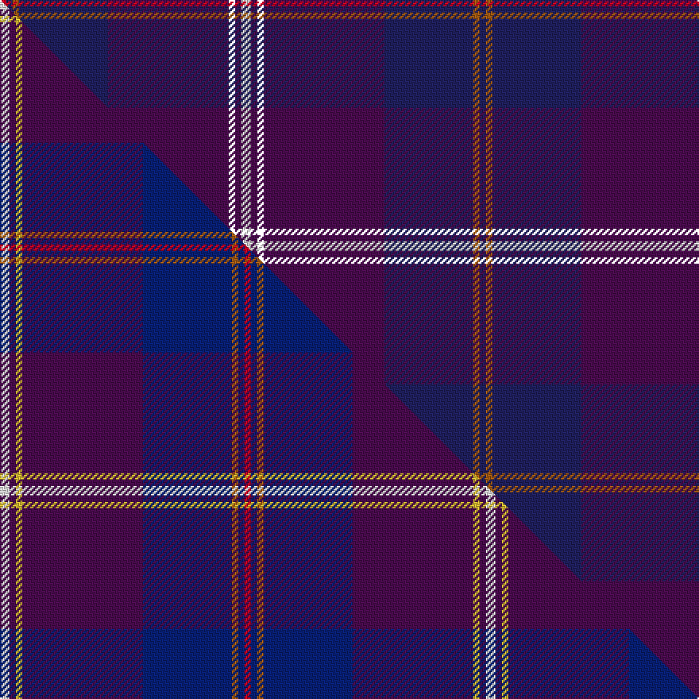

This page is one **sett** — a single exact thread-count. It belongs to the [tartan](/setts/w3dp2k2dp38db28o2db2r2/)
(the same proportion at any scale), whose colour order is pattern [BRBBKBWBKBBRBR](/stripes/brbbkbwbkbbrbr/).

Part of the [Gretna Gold](/tartans/gretna-gold/) tartan — the named design grouping this sett with its other cloths.

Sourced from house-of-tartan.  It is a [14 stripe tartan](/stripes/stripes14/).

Original link http://www.house-of-tartan.scotland.net/house/TartanViewjs.asp?colr=Def&tnam=6032

## Provenance

Earliest known date: 01/01/2003 Presumably a fashion tartan. Lochcarron swatch.

## Thread count
R/4 DB4 O4 DB56 DP76 K4 DP4 W6 DP4 K4 DP76 DB56 O4 DB/4

One full sett is **604 threads**.

## Palette
<table><thead><tr><th>Colour</th><th>Shade</th><th>OKLCh</th></tr></thead><tbody><tr><td>DB</td><td><code style="background-color:#2C2C80;">#2C2C80</code> <small style="color:#888">#2C2C80</small></td><td><small style="color:#888">oklch(35.0% 0.138 276.6)</small></td></tr><tr><td>DB</td><td><code style="background-color:#202060;">#202060</code> <small style="color:#888">#202060</small></td><td><small style="color:#888">oklch(28.9% 0.111 276.9)</small></td></tr><tr><td>W</td><td><code style="background-color:#E0E0E0;">#E0E0E0</code> <small style="color:#888">#E0E0E0</small></td><td><small style="color:#888">oklch(90.7% 0.000 89.9)</small></td></tr><tr><td>LO</td><td><code style="background-color:#FF9C34;">#FF9C34</code> <small style="color:#888">#FF9C34</small></td><td><small style="color:#888">oklch(77.9% 0.161 61.8)</small></td></tr><tr><td>O</td><td><code style="background-color:#A65C11;">#A65C11</code> <small style="color:#888">#A65C11</small></td><td><small style="color:#888">oklch(55.0% 0.125 58.3)</small></td></tr><tr><td>DP</td><td><code style="background-color:#4B0B4F;">#4B0B4F</code> <small style="color:#888">#4B0B4F</small></td><td><small style="color:#888">oklch(30.1% 0.125 325.4)</small></td></tr><tr><td>R</td><td><code style="background-color:#D60020;">#D60020</code> <small style="color:#888">#D60020</small></td><td><small style="color:#888">oklch(55.2% 0.224 25.5)</small></td></tr><tr><td>W</td><td><code style="background-color:#FCFCFC;">#FCFCFC</code> <small style="color:#888">#FCFCFC</small></td><td><small style="color:#888">oklch(99.1% 0.000 89.9)</small></td></tr></tbody></table>

# Sample pattern

## Compared to the master

This cloth is one sett of its design; the master sett (the exemplar the design is anchored on) is below for comparison.

Its **ΔTartan distance** from the master is **0.61** — the same measure the nearest-tartans table ranks by (0 is identical; a re-scale of the same cloth is near 0, a recolour or a different proportion further).

<figure class="master-compare" style="margin:0">

this sett
master sett ★

<figcaption style="color:#888;font-size:smaller">One weave of this sett against the <a href="/setts/w3dp2ly2dp38db28o2db2r2/">master sett ★</a>, split on the diagonal: a shared proportion runs seamlessly across it with only the shades shifting; a different proportion breaks on it.</figcaption>
</figure>

## Nearest tartan variants

The nearest existing variants by ΔTartan distance, with this cloth at the top so the swatches line up against it.

ΔTartan

Threads

Variant

Sett

—

604

<a href="/variants/s8/w3dp2k2dp38db28o2db2r2~x2~w3600000-db1204274/">Gretna Gold Fashion Tartan</a>

<a href="/ttd/edit/#slug=w3dp2ly2dp38dt28o2dt2r2~x2~dt1204274&amp;base=w3dp2k2dp38db28o2db2r2~x2~w3600000-db1204274" title="compare in the TTD">0.60</a>

306

<a href="/variants/s8/w3dp2ly2dp38db28o2db2r2~x2~db1204274/">Gretna Gold</a>

<a href="/ttd/edit/#slug=db20w1dp8lb1r2k3r2lb1dp20db8~x2&amp;base=w3dp2k2dp38db28o2db2r2~x2~w3600000-db1204274" title="compare in the TTD">2.94</a>

208

<a href="/variants/s10/db20w1dp8lb1r2k3r2lb1dp20db8~x2/">Custer (Personal)</a>

<a href="/ttd/edit/#slug=db64r3k3r3dp61dg5dp6~x2&amp;base=w3dp2k2dp38db28o2db2r2~x2~w3600000-db1204274" title="compare in the TTD">2.95</a>

440

<a href="/variants/s7/db64r3k3r3dp61dg5dp6~x2/">Rutherford, John (Personal)</a>

<a href="/ttd/edit/#slug=db2k1db4dt5dp3dt20k8db4k1db2k1db33k1db1~x2~db1406275-dt1204274&amp;base=w3dp2k2dp38db28o2db2r2~x2~w3600000-db1204274" title="compare in the TTD">3.71</a>

338

<a href="/variants/s14/dbi2k1dbi4db5dp3db20k8dbi4k1dbi2k1dbi33k1dbi1~x2~dbi1406275-db1204274/">Payne</a>

<a href="/ttd/edit/#slug=db2k1db4dt5dp3dt20k8db4k1db2k1db33ly1db1~x2~db1406275-dt1204274&amp;base=w3dp2k2dp38db28o2db2r2~x2~w3600000-db1204274" title="compare in the TTD">3.86</a>

338

<a href="/variants/s14/dbi2k1dbi4db5dp3db20k8dbi4k1dbi2k1dbi33ly1dbi1~x2~dbi1406275-db1204274/">Payne (Name)</a>

## Neighbour map

Every grey dot is one of 13620 variants placed by the first two principal components of the ΔTartan feature space (42% of its variance). Red is this tartan; blue dots are its nearest — click one to open its page.

<svg viewBox="0 0 640 380" role="img" style="max-width:100%;height:auto;border:1px solid #e0e0e0;border-radius:4px;display:block" xmlns="http://www.w3.org/2000/svg"><image href="/nn/cloud.v1.png" width="640" height="380"/><a href="/variants/s8/w3dp2ly2dp38db28o2db2r2~x2~db1204274/"><circle cx="398.4" cy="130.4" r="4" fill="#3465a4"><title>Gretna Gold</title></circle></a><a href="/variants/s10/db20w1dp8lb1r2k3r2lb1dp20db8~x2/"><circle cx="272.7" cy="123.1" r="4" fill="#3465a4"><title>Custer (Personal)</title></circle></a><a href="/variants/s7/db64r3k3r3dp61dg5dp6~x2/"><circle cx="434.7" cy="169.9" r="4" fill="#3465a4"><title>Rutherford, John (Personal)</title></circle></a><a href="/variants/s14/dbi2k1dbi4db5dp3db20k8dbi4k1dbi2k1dbi33k1dbi1~x2~dbi1406275-db1204274/"><circle cx="442.3" cy="120.1" r="4" fill="#3465a4"><title>Payne</title></circle></a><a href="/variants/s14/dbi2k1dbi4db5dp3db20k8dbi4k1dbi2k1dbi33ly1dbi1~x2~dbi1406275-db1204274/"><circle cx="422.7" cy="113.3" r="4" fill="#3465a4"><title>Payne (Name)</title></circle></a><circle cx="418.8" cy="131.5" r="5" fill="#c00000"/><text x="320" y="376" text-anchor="middle" font-size="11" fill="#999">ground</text><text x="11" y="190" text-anchor="middle" font-size="11" fill="#999" transform="rotate(-90 11 190)">complexity</text></svg>

ID: /variants/s8/w3dp2k2dp38db28o2db2r2~x2~w3600000-db1204274/
