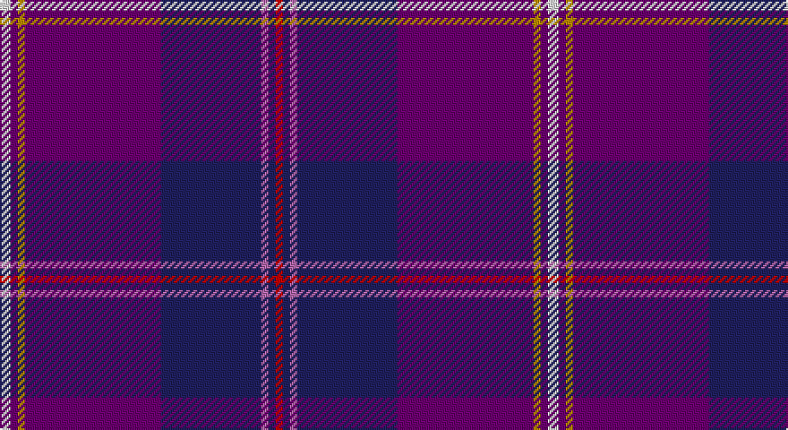

This page is one **sett** — a single exact thread-count. It belongs to the [tartan](/setts/w3dp2lo2dp38db28m2db2r2/)
(the same proportion at any scale), whose colour order is pattern [RBRBBYBW](/stripes/rbrbbybw/).

Part of the [Gretna Gold](/tartans/gretna-gold/) tartan — the named design grouping this sett with its other cloths.

Sourced from tartans-authority.  It is a [8 stripe tartan](/stripes/stripes8/).

Original link http://www.tartansauthority.com/tartan-ferret/display/6032/

## Register references

External register numbers recorded for this tartan.

- Scottish Tartans Authority (ITI): 6032

## Thread count
LN/6 Pa4 DY4 Pa76 DB56 P4 DB4 R/4

One full sett is **306 threads**.

## Palette

Palette: <strong>Tartan Register</strong> <small style="color:#888">(5 of 6 colours)</small>
<table><thead><tr><th>Colour</th><th>Threads</th><th>Shade</th><th>Base</th><th>OKLCh</th></tr></thead><tbody><tr><td>LN/</td><td style="text-align:right;font-variant-numeric:tabular-nums">6</td><td><code style="background-color:#E0E0E0;">#E0E0E0</code> <small style="color:#888">#E0E0E0</small></td><td>W <code style="background-color:#F7F7F7;">#F7F7F7</code></td><td><small style="color:#888">oklch(90.7% 0.000 89.9)</small></td></tr><tr><td>Pa</td><td style="text-align:right;font-variant-numeric:tabular-nums">4</td><td><code style="background-color:#6C0070;">#6C0070</code> <small style="color:#888">#6C0070</small></td><td>B <code style="background-color:#2A418A;">#2A418A</code></td><td><small style="color:#888">oklch(37.6% 0.174 326.5)</small></td></tr><tr><td>DY</td><td style="text-align:right;font-variant-numeric:tabular-nums">4</td><td><code style="background-color:#BC8C00;">#BC8C00</code> <small style="color:#888">#BC8C00</small></td><td>Y <code style="background-color:#F2BF00;">#F2BF00</code></td><td><small style="color:#888">oklch(66.8% 0.137 84.1)</small></td></tr><tr><td>Pa</td><td style="text-align:right;font-variant-numeric:tabular-nums">76</td><td><code style="background-color:#6C0070;">#6C0070</code> <small style="color:#888">#6C0070</small></td><td>B <code style="background-color:#2A418A;">#2A418A</code></td><td><small style="color:#888">oklch(37.6% 0.174 326.5)</small></td></tr><tr><td>DB</td><td style="text-align:right;font-variant-numeric:tabular-nums">56</td><td><code style="background-color:#202060;">#202060</code> <small style="color:#888">#202060</small></td><td>B <code style="background-color:#2A418A;">#2A418A</code></td><td><small style="color:#888">oklch(28.9% 0.111 276.9)</small></td></tr><tr><td>P</td><td style="text-align:right;font-variant-numeric:tabular-nums">4</td><td><code style="background-color:#B468AC;">#B468AC</code> <small style="color:#888">#B468AC</small></td><td>R <code style="background-color:#CC0000;">#CC0000</code></td><td><small style="color:#888">oklch(62.5% 0.131 330.9)</small></td></tr><tr><td>DB</td><td style="text-align:right;font-variant-numeric:tabular-nums">4</td><td><code style="background-color:#202060;">#202060</code> <small style="color:#888">#202060</small></td><td>B <code style="background-color:#2A418A;">#2A418A</code></td><td><small style="color:#888">oklch(28.9% 0.111 276.9)</small></td></tr><tr><td>R/</td><td style="text-align:right;font-variant-numeric:tabular-nums">4</td><td><code style="background-color:#C80000;">#C80000</code> <small style="color:#888">#C80000</small></td><td>R <code style="background-color:#CC0000;">#CC0000</code></td><td><small style="color:#888">oklch(52.3% 0.215 29.2)</small></td></tr></tbody></table>

# Sample pattern

## Nearest tartans

The nearest existing variants by ΔTartan distance, with this tartan at the top so the swatches line up against it.

ΔTartan

Tartan

Sett

—

<a href="/ttd/edit/#slug=w3dp2lo2dp38db28m2db2r2~x2">Gretna Gold (Fashion)</a> <a class="nn-out" href="/variants/s8/w3dp2lo2dp38db28m2db2r2~x2/" title="open its dictionary page">↗</a>

1.04

<a href="/ttd/edit/#slug=dp46db12lo3db3lb3dp11dbi5db2dbi7w2~x2&amp;base=w3dp2lo2dp38db28m2db2r2~x2">Diamond Jubilee (Lochcarron) (Comm.)</a> <a class="nn-out" href="/variants/s10/dp46db12lo3db3lb3dp11dbi5db2dbi7w2~x2/" title="open its dictionary page">↗</a>

1.25

<a href="/ttd/edit/#slug=k3g2m3db30dp32w3~x2&amp;base=w3dp2lo2dp38db28m2db2r2~x2">Pride of Glencoe</a> <a class="nn-out" href="/variants/s6/k3g2m3db30dp32w3~x2/" title="open its dictionary page">↗</a>

1.30

<a href="/ttd/edit/#slug=db20w1dp8t1r2k3r2t1dp20db8~x2&amp;base=w3dp2lo2dp38db28m2db2r2~x2">Custer (Personal)</a> <a class="nn-out" href="/variants/s10/db20w1dp8t1r2k3r2t1dp20db8~x2/" title="open its dictionary page">↗</a>

1.40

<a href="/variants/s14/w3dp2lo2dp38db28m2db2r2~x2/">Gretna Gold</a>

1.45

<a href="/variants/s14/w3dp2k2dp38db28m2db2r2~x2/">Gretna Gold Fashion Tartan</a>

1.53

<a href="/ttd/edit/#slug=db2w2dp16lg2dp2r5db37dp6lg2db2~x2&amp;base=w3dp2lo2dp38db28m2db2r2~x2">Pride of Fife</a> <a class="nn-out" href="/variants/s10/db2w2dp16lg2dp2r5db37dp6lg2db2~x2/" title="open its dictionary page">↗</a>

1.71

<a href="/ttd/edit/#slug=g1db30dp32db1r5db1ri4db1r2w1~x2&amp;base=w3dp2lo2dp38db28m2db2r2~x2">Gill, Anil (Personal)</a> <a class="nn-out" href="/variants/s10/g1db30dp32db1r5db1ri4db1r2w1~x2/" title="open its dictionary page">↗</a>

1.74

<a href="/ttd/edit/#slug=dp10ly3dp8db42g5o5~x2&amp;base=w3dp2lo2dp38db28m2db2r2~x2">Cheadle (Personal)</a> <a class="nn-out" href="/variants/s6/dp10ly3dp8db42g5o5~x2/" title="open its dictionary page">↗</a>

1.77

<a href="/ttd/edit/#slug=r16db2o6r3k4t2db40t6~x2&amp;base=w3dp2lo2dp38db28m2db2r2~x2">St. Leonards (Corporate)</a> <a class="nn-out" href="/variants/s8/r16db2o6r3k4t2db40t6~x2/" title="open its dictionary page">↗</a>

1.78

<a href="/ttd/edit/#slug=w2r3dbi12db3dbi3db28r3db3ly2~x2&amp;base=w3dp2lo2dp38db28m2db2r2~x2">Royal Scottish Corporation</a> <a class="nn-out" href="/variants/s9/w2r3dbi12db3dbi3db28r3db3ly2~x2/" title="open its dictionary page">↗</a>

## Neighbour map

Every grey dot is one of 14360 variants placed by the first two principal components of the ΔTartan feature space (44% of its variance). Red is this tartan; blue dots are its nearest — click one to open its page.

<svg viewBox="0 0 640 380" role="img" style="max-width:100%;height:auto;border:1px solid #e0e0e0;border-radius:4px;display:block" xmlns="http://www.w3.org/2000/svg"><image href="/nn/cloud.v1.png" width="640" height="380"/><a href="/variants/s10/dp46db12lo3db3lb3dp11dbi5db2dbi7w2~x2/"><circle cx="382.6" cy="112.1" r="4" fill="#3465a4"><title>Diamond Jubilee (Lochcarron) (Comm.)</title></circle></a><a href="/variants/s6/k3g2m3db30dp32w3~x2/"><circle cx="301.8" cy="170.5" r="4" fill="#3465a4"><title>Pride of Glencoe</title></circle></a><a href="/variants/s10/db20w1dp8t1r2k3r2t1dp20db8~x2/"><circle cx="304.0" cy="144.7" r="4" fill="#3465a4"><title>Custer (Personal)</title></circle></a><a href="/variants/s14/w3dp2lo2dp38db28m2db2r2~x2/"><circle cx="367.5" cy="124.2" r="4" fill="#3465a4"><title>Gretna Gold</title></circle></a><a href="/variants/s14/w3dp2k2dp38db28m2db2r2~x2/"><circle cx="369.3" cy="126.2" r="4" fill="#3465a4"><title>Gretna Gold Fashion Tartan</title></circle></a><a href="/variants/s10/db2w2dp16lg2dp2r5db37dp6lg2db2~x2/"><circle cx="373.0" cy="150.6" r="4" fill="#3465a4"><title>Pride of Fife</title></circle></a><a href="/variants/s10/g1db30dp32db1r5db1ri4db1r2w1~x2/"><circle cx="290.8" cy="80.1" r="4" fill="#3465a4"><title>Gill, Anil (Personal)</title></circle></a><a href="/variants/s6/dp10ly3dp8db42g5o5~x2/"><circle cx="356.2" cy="186.5" r="4" fill="#3465a4"><title>Cheadle (Personal)</title></circle></a><a href="/variants/s8/r16db2o6r3k4t2db40t6~x2/"><circle cx="318.2" cy="137.0" r="4" fill="#3465a4"><title>St. Leonards (Corporate)</title></circle></a><a href="/variants/s9/w2r3dbi12db3dbi3db28r3db3ly2~x2/"><circle cx="341.2" cy="156.7" r="4" fill="#3465a4"><title>Royal Scottish Corporation</title></circle></a><circle cx="345.9" cy="130.5" r="5" fill="#c00000"/></svg>

ID: /variants/s8/w3dp2lo2dp38db28m2db2r2~x2/
