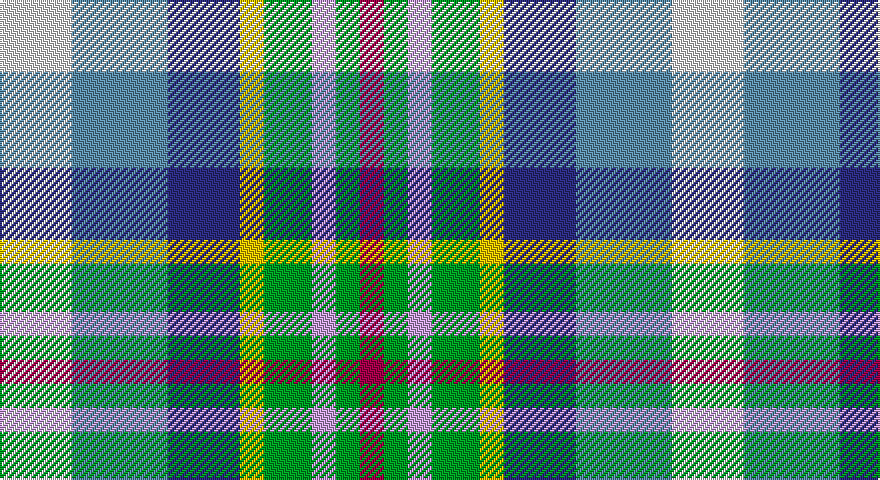

This page is one **sett** — a single exact thread-count. It belongs to the [tartan](/setts/w3t4db3ly1g2lp1g1m1/)
(the same proportion at any scale), whose colour order is pattern [RGWGYBBW](/stripes/rgwgybbw/).

Part of the [Queensland](/tartans/queensland/) tartan — the named design grouping this sett with its other cloths.

Sourced from tartans-authority.  It is a [8 stripe tartan](/stripes/stripes8/).

Original link http://www.tartansauthority.com/tartan-ferret/display/2618/

## Register references

External register numbers recorded for this tartan.

- Scottish Tartans Authority (ITI): 2618

## Thread count
LN/36 B48 DB36 Y12 G24 LP12 G12 R/12

One full sett is **336 threads**.

## Palette

Palette: <strong>Tartan Register</strong> <small style="color:#888">(6 of 7 colours)</small>
<table><thead><tr><th>Colour</th><th>Threads</th><th>Shade</th><th>Base</th><th>OKLCh</th></tr></thead><tbody><tr><td>LN/</td><td style="text-align:right;font-variant-numeric:tabular-nums">36</td><td><code style="background-color:#E0E0E0;">#E0E0E0</code> <small style="color:#888">#E0E0E0</small></td><td>W <code style="background-color:#F7F7F7;">#F7F7F7</code></td><td><small style="color:#888">oklch(90.7% 0.000 89.9)</small></td></tr><tr><td>B</td><td style="text-align:right;font-variant-numeric:tabular-nums">48</td><td><code style="background-color:#5C8CA8;">#5C8CA8</code> <small style="color:#888">#5C8CA8</small></td><td>B <code style="background-color:#2A418A;">#2A418A</code></td><td><small style="color:#888">oklch(61.7% 0.067 235.0)</small></td></tr><tr><td>DB</td><td style="text-align:right;font-variant-numeric:tabular-nums">36</td><td><code style="background-color:#2C2C80;">#2C2C80</code> <small style="color:#888">#2C2C80</small></td><td>B <code style="background-color:#2A418A;">#2A418A</code></td><td><small style="color:#888">oklch(35.0% 0.138 276.6)</small></td></tr><tr><td>Y</td><td style="text-align:right;font-variant-numeric:tabular-nums">12</td><td><code style="background-color:#E8C000;">#E8C000</code> <small style="color:#888">#E8C000</small></td><td>Y <code style="background-color:#F2BF00;">#F2BF00</code></td><td><small style="color:#888">oklch(81.9% 0.168 93.7)</small></td></tr><tr><td>G</td><td style="text-align:right;font-variant-numeric:tabular-nums">24</td><td><code style="background-color:#009C24;">#009C24</code> <small style="color:#888">#009C24</small></td><td>G <code style="background-color:#006100;">#006100</code></td><td><small style="color:#888">oklch(60.2% 0.192 144.5)</small></td></tr><tr><td>LP</td><td style="text-align:right;font-variant-numeric:tabular-nums">12</td><td><code style="background-color:#C49CD8;">#C49CD8</code> <small style="color:#888">#C49CD8</small></td><td>W <code style="background-color:#F7F7F7;">#F7F7F7</code></td><td><small style="color:#888">oklch(75.0% 0.095 314.2)</small></td></tr><tr><td>G</td><td style="text-align:right;font-variant-numeric:tabular-nums">12</td><td><code style="background-color:#009C24;">#009C24</code> <small style="color:#888">#009C24</small></td><td>G <code style="background-color:#006100;">#006100</code></td><td><small style="color:#888">oklch(60.2% 0.192 144.5)</small></td></tr><tr><td>R/</td><td style="text-align:right;font-variant-numeric:tabular-nums">12</td><td><code style="background-color:#A00048;">#A00048</code> <small style="color:#888">#A00048</small></td><td>R <code style="background-color:#CC0000;">#CC0000</code></td><td><small style="color:#888">oklch(45.4% 0.182 5.3)</small></td></tr></tbody></table>

# Sample pattern

## Compared to the master

This cloth is one sett of its design; the master sett (the exemplar the design is anchored on) is below for comparison.

<figure style="margin:0"><figcaption style="color:#888;font-size:smaller">this sett</figcaption></figure>
<figure style="margin:0"><figcaption style="color:#888;font-size:smaller"><a href="/setts/w18t22db15ly6g10lp5g6r5/">master sett →</a></figcaption></figure>

## Nearest tartans

The nearest existing variants by ΔTartan distance, with this tartan at the top so the swatches line up against it.

ΔTartan

Tartan

Sett

—

<a href="/ttd/edit/#slug=w3t4db3ly1g2lp1g1m1~x12">Queensland (District)</a> <a class="nn-out" href="/variants/s8/w3t4db3ly1g2lp1g1m1~x12/" title="open its dictionary page">↗</a>

0.26

<a href="/ttd/edit/#slug=w18t22db15ly6g10lp5g6r5~x2&amp;base=w3t4db3ly1g2lp1g1m1~x12">Queensland</a> <a class="nn-out" href="/variants/s8/w18t22db15ly6g10lp5g6r5~x2/" title="open its dictionary page">↗</a>

0.98

<a href="/ttd/edit/#slug=lb18t18db10w3o15oi3ly8~x2&amp;base=w3t4db3ly1g2lp1g1m1~x12">Isle of Jura</a> <a class="nn-out" href="/variants/s7/lb18t18db10w3o15oi3ly8~x2/" title="open its dictionary page">↗</a>

1.38

<a href="/ttd/edit/#slug=y8o8lg7lr5lb2k2lb2k2lb2~x4&amp;base=w3t4db3ly1g2lp1g1m1~x12">Somerset (District)</a> <a class="nn-out" href="/variants/s9/y8o8lg7lr5lb2k2lb2k2lb2~x4/" title="open its dictionary page">↗</a>

1.38

<a href="/ttd/edit/#slug=dg2o13dg12w3lb10w3lb12g13r2~x2&amp;base=w3t4db3ly1g2lp1g1m1~x12">Mounth The.. Corporate Tartan</a> <a class="nn-out" href="/variants/s9/dg2o13dg12w3lb10w3lb12g13r2~x2/" title="open its dictionary page">↗</a>

1.47

<a href="/ttd/edit/#slug=dg14lb14db12lr8dy3k3dy3k5~x2&amp;base=w3t4db3ly1g2lp1g1m1~x12">Somerset #2</a> <a class="nn-out" href="/variants/s8/dg14lb14db12lr8dy3k3dy3k5~x2/" title="open its dictionary page">↗</a>

1.49

<a href="/ttd/edit/#slug=db3ly3y15b8w8db6y15b6ly3dg6r3~x2&amp;base=w3t4db3ly1g2lp1g1m1~x12">Saltcoats (Saskatchewan)</a> <a class="nn-out" href="/variants/s11/db3ly3y15b8w8db6y15b6ly3dg6r3~x2/" title="open its dictionary page">↗</a>

1.50

<a href="/ttd/edit/#slug=w2k1gi4r2gi2r4g5k1ly2~x6&amp;base=w3t4db3ly1g2lp1g1m1~x12">Ellis (Personal)</a> <a class="nn-out" href="/variants/s9/w2k1gi4r2gi2r4g5k1ly2~x6/" title="open its dictionary page">↗</a>

1.52

<a href="/ttd/edit/#slug=g5db3t3g5w4ly2t1ly2db1r1~x6&amp;base=w3t4db3ly1g2lp1g1m1~x12">Northern College (Ontario)</a> <a class="nn-out" href="/variants/s10/g5db3t3g5w4ly2t1ly2db1r1~x6/" title="open its dictionary page">↗</a>

1.59

<a href="/ttd/edit/#slug=db3ly3o15t8w7db6o15t6ly3dg6r3~x2&amp;base=w3t4db3ly1g2lp1g1m1~x12">Saltcoats (Saskatchewan) (District?)</a> <a class="nn-out" href="/variants/s11/db3ly3o15t8w7db6o15t6ly3dg6r3~x2/" title="open its dictionary page">↗</a>

1.67

<a href="/ttd/edit/#slug=b5dg9o2ly2db6t14w3~x4&amp;base=w3t4db3ly1g2lp1g1m1~x12">Manx National</a> <a class="nn-out" href="/variants/s7/b5dg9o2ly2db6t14w3~x4/" title="open its dictionary page">↗</a>

## Neighbour map

Every grey dot is one of 14360 variants placed by the first two principal components of the ΔTartan feature space (44% of its variance). Red is this tartan; blue dots are its nearest — click one to open its page.

<svg viewBox="0 0 640 380" role="img" style="max-width:100%;height:auto;border:1px solid #e0e0e0;border-radius:4px;display:block" xmlns="http://www.w3.org/2000/svg"><image href="/nn/cloud.v1.png" width="640" height="380"/><a href="/variants/s8/w18t22db15ly6g10lp5g6r5~x2/"><circle cx="14.0" cy="188.9" r="4" fill="#3465a4"><title>Queensland</title></circle></a><a href="/variants/s7/lb18t18db10w3o15oi3ly8~x2/"><circle cx="14.0" cy="176.7" r="4" fill="#3465a4"><title>Isle of Jura</title></circle></a><a href="/variants/s9/y8o8lg7lr5lb2k2lb2k2lb2~x4/"><circle cx="14.0" cy="205.4" r="4" fill="#3465a4"><title>Somerset (District)</title></circle></a><a href="/variants/s9/dg2o13dg12w3lb10w3lb12g13r2~x2/"><circle cx="54.2" cy="187.1" r="4" fill="#3465a4"><title>Mounth The.. Corporate Tartan</title></circle></a><a href="/variants/s8/dg14lb14db12lr8dy3k3dy3k5~x2/"><circle cx="14.0" cy="202.9" r="4" fill="#3465a4"><title>Somerset #2</title></circle></a><a href="/variants/s11/db3ly3y15b8w8db6y15b6ly3dg6r3~x2/"><circle cx="53.7" cy="171.7" r="4" fill="#3465a4"><title>Saltcoats (Saskatchewan)</title></circle></a><a href="/variants/s9/w2k1gi4r2gi2r4g5k1ly2~x6/"><circle cx="14.0" cy="198.8" r="4" fill="#3465a4"><title>Ellis (Personal)</title></circle></a><a href="/variants/s10/g5db3t3g5w4ly2t1ly2db1r1~x6/"><circle cx="51.6" cy="195.2" r="4" fill="#3465a4"><title>Northern College (Ontario)</title></circle></a><a href="/variants/s11/db3ly3o15t8w7db6o15t6ly3dg6r3~x2/"><circle cx="64.9" cy="174.8" r="4" fill="#3465a4"><title>Saltcoats (Saskatchewan) (District?)</title></circle></a><a href="/variants/s7/b5dg9o2ly2db6t14w3~x4/"><circle cx="80.1" cy="184.9" r="4" fill="#3465a4"><title>Manx National</title></circle></a><circle cx="14.0" cy="194.5" r="5" fill="#c00000"/></svg>

ID: /variants/s8/w3t4db3ly1g2lp1g1m1~x12/
