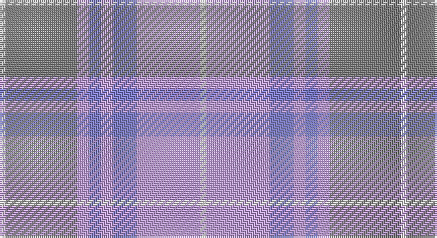

This page is one **sett** — a single exact thread-count. It belongs to the [tartan](/setts/w3y36lp6b6lp6b12lp32w3/)
(the same proportion at any scale), whose colour order is pattern [WGWBWBWW](/stripes/wgwbwbww/).

Part of the [Tenmaya](/tartans/tenmaya/) tartan — the named design grouping this sett with its other cloths.

Sourced from weddslist.  It is a [8 stripe tartan](/stripes/stripes8/).

Original link http://www.weddslist.com/cgi-bin/tartans/pg.pl?source=sts

## Also known as

This cloth is also recorded under:

- Tenmaya Check

## Thread count
LN/3 N36 LP6 B6 LP6 B12 LP32 LN/3

One full sett is **202 threads**.

## Palette

Palette: <strong>Tartan Register</strong> <small style="color:#888">(2 of 4 colours)</small>
<table><thead><tr><th>Colour</th><th>Threads</th><th>Shade</th><th>Base</th><th>OKLCh</th></tr></thead><tbody><tr><td>LN/</td><td style="text-align:right;font-variant-numeric:tabular-nums">3</td><td><code style="background-color:#E0E0E0;">#E0E0E0</code> <small style="color:#888">#E0E0E0</small></td><td>W <code style="background-color:#F7F7F7;">#F7F7F7</code></td><td><small style="color:#888">oklch(90.7% 0.000 89.9)</small></td></tr><tr><td>N</td><td style="text-align:right;font-variant-numeric:tabular-nums">36</td><td><code style="background-color:#808080;">#808080</code> <small style="color:#888">#808080</small></td><td>G <code style="background-color:#006100;">#006100</code></td><td><small style="color:#888">oklch(60.0% 0.000 89.9)</small></td></tr><tr><td>LP</td><td style="text-align:right;font-variant-numeric:tabular-nums">6</td><td><code style="background-color:#C0A0E0;">#C0A0E0</code> <small style="color:#888">#C0A0E0</small></td><td>W <code style="background-color:#F7F7F7;">#F7F7F7</code></td><td><small style="color:#888">oklch(75.7% 0.096 307.0)</small></td></tr><tr><td>B</td><td style="text-align:right;font-variant-numeric:tabular-nums">6</td><td><code style="background-color:#8080D0;">#8080D0</code> <small style="color:#888">#8080D0</small></td><td>B <code style="background-color:#2A418A;">#2A418A</code></td><td><small style="color:#888">oklch(63.4% 0.119 282.5)</small></td></tr><tr><td>LP</td><td style="text-align:right;font-variant-numeric:tabular-nums">6</td><td><code style="background-color:#C0A0E0;">#C0A0E0</code> <small style="color:#888">#C0A0E0</small></td><td>W <code style="background-color:#F7F7F7;">#F7F7F7</code></td><td><small style="color:#888">oklch(75.7% 0.096 307.0)</small></td></tr><tr><td>B</td><td style="text-align:right;font-variant-numeric:tabular-nums">12</td><td><code style="background-color:#8080D0;">#8080D0</code> <small style="color:#888">#8080D0</small></td><td>B <code style="background-color:#2A418A;">#2A418A</code></td><td><small style="color:#888">oklch(63.4% 0.119 282.5)</small></td></tr><tr><td>LP</td><td style="text-align:right;font-variant-numeric:tabular-nums">32</td><td><code style="background-color:#C0A0E0;">#C0A0E0</code> <small style="color:#888">#C0A0E0</small></td><td>W <code style="background-color:#F7F7F7;">#F7F7F7</code></td><td><small style="color:#888">oklch(75.7% 0.096 307.0)</small></td></tr><tr><td>LN/</td><td style="text-align:right;font-variant-numeric:tabular-nums">3</td><td><code style="background-color:#E0E0E0;">#E0E0E0</code> <small style="color:#888">#E0E0E0</small></td><td>W <code style="background-color:#F7F7F7;">#F7F7F7</code></td><td><small style="color:#888">oklch(90.7% 0.000 89.9)</small></td></tr></tbody></table>

# Sample pattern

## Compared to the master

This cloth is one sett of its design; the master sett (the exemplar the design is anchored on) is below for comparison.

<figure style="margin:0"><figcaption style="color:#888;font-size:smaller">this sett</figcaption></figure>
<figure style="margin:0"><figcaption style="color:#888;font-size:smaller"><a href="/setts/lb1o12r1dt1r1dt2r5lb1/">master sett →</a></figcaption></figure>

## Nearest tartans

The nearest existing variants by ΔTartan distance, with this tartan at the top so the swatches line up against it.

ΔTartan

Tartan

Sett

—

<a href="/ttd/edit/#slug=w3y36lp6b6lp6b12lp32w3">Tenmaya</a> <a class="nn-out" href="/variants/s8/w3y36lp6b6lp6b12lp32w3/" title="open its dictionary page">↗</a>

1.39

<a href="/ttd/edit/#slug=lo5y22m15lp11m5y2~x2&amp;base=w3y36lp6b6lp6b12lp32w3">Scottish Ballet</a> <a class="nn-out" href="/variants/s6/lo5y22m15lp11m5y2~x2/" title="open its dictionary page">↗</a>

1.99

<a href="/variants/s10/o5n3o22r3n6ni17r2ni4r2ni4~x2/">Clyde</a>

2.07

<a href="/ttd/edit/#slug=k3lr15t3lr4t3lr4t10y30w3~x2&amp;base=w3y36lp6b6lp6b12lp32w3">Highland Road (Fashion)</a> <a class="nn-out" href="/variants/s9/k3lr15t3lr4t3lr4t10y30w3~x2/" title="open its dictionary page">↗</a>

2.10

<a href="/ttd/edit/#slug=o24n3o3n3o3n20lr22n4~x2&amp;base=w3y36lp6b6lp6b12lp32w3">Turnberry (MacArthur)</a> <a class="nn-out" href="/variants/s8/o24n3o3n3o3n20lr22n4~x2/" title="open its dictionary page">↗</a>

2.26

<a href="/ttd/edit/#slug=lb1y1lb1y7t7lb1t1lb1~x6&amp;base=w3y36lp6b6lp6b12lp32w3">Auld Lang Syne (Fashion)</a> <a class="nn-out" href="/variants/s8/lb1y1lb1y7t7lb1t1lb1~x6/" title="open its dictionary page">↗</a>

2.28

<a href="/ttd/edit/#slug=lr2m24lo14lr25lo14lr25ly20lr2~x2&amp;base=w3y36lp6b6lp6b12lp32w3">Froach's Grian</a> <a class="nn-out" href="/variants/s8/lr2m24lo14lr25lo14lr25ly20lr2~x2/" title="open its dictionary page">↗</a>

2.29

<a href="/ttd/edit/#slug=t20dt4y5n14ly1t2~x2&amp;base=w3y36lp6b6lp6b12lp32w3">Riley's Theme</a> <a class="nn-out" href="/variants/s6/t20dt4y5n14ly1t2~x2/" title="open its dictionary page">↗</a>

2.33

<a href="/ttd/edit/#slug=lri3lb3lri1y25lri15lr5lb4ly2~x2&amp;base=w3y36lp6b6lp6b12lp32w3">Rikaco Morning Dew #2</a> <a class="nn-out" href="/variants/s8/lri3lb3lri1y25lri15lr5lb4ly2~x2/" title="open its dictionary page">↗</a>

2.38

<a href="/ttd/edit/#slug=g2t15lr5g2t2g7w2~x4&amp;base=w3y36lp6b6lp6b12lp32w3">Chambers Bay</a> <a class="nn-out" href="/variants/s7/g2t15lr5g2t2g7w2~x4/" title="open its dictionary page">↗</a>

2.39

<a href="/ttd/edit/#slug=y25p3y8p13lyi8lr2ly11y2p3~x2&amp;base=w3y36lp6b6lp6b12lp32w3">Organic</a> <a class="nn-out" href="/variants/s9/y25p3y8p13lyi8lr2ly11y2p3~x2/" title="open its dictionary page">↗</a>

## Neighbour map

Every grey dot is one of 14360 variants placed by the first two principal components of the ΔTartan feature space (44% of its variance). Red is this tartan; blue dots are its nearest — click one to open its page.

<svg viewBox="0 0 640 380" role="img" style="max-width:100%;height:auto;border:1px solid #e0e0e0;border-radius:4px;display:block" xmlns="http://www.w3.org/2000/svg"><image href="/nn/cloud.v1.png" width="640" height="380"/><a href="/variants/s6/lo5y22m15lp11m5y2~x2/"><circle cx="309.4" cy="266.6" r="4" fill="#3465a4"><title>Scottish Ballet</title></circle></a><a href="/variants/s10/o5n3o22r3n6ni17r2ni4r2ni4~x2/"><circle cx="338.3" cy="236.9" r="4" fill="#3465a4"><title>Clyde</title></circle></a><a href="/variants/s9/k3lr15t3lr4t3lr4t10y30w3~x2/"><circle cx="268.2" cy="202.1" r="4" fill="#3465a4"><title>Highland Road (Fashion)</title></circle></a><a href="/variants/s8/o24n3o3n3o3n20lr22n4~x2/"><circle cx="346.6" cy="283.0" r="4" fill="#3465a4"><title>Turnberry (MacArthur)</title></circle></a><a href="/variants/s8/lb1y1lb1y7t7lb1t1lb1~x6/"><circle cx="318.4" cy="249.5" r="4" fill="#3465a4"><title>Auld Lang Syne (Fashion)</title></circle></a><a href="/variants/s8/lr2m24lo14lr25lo14lr25ly20lr2~x2/"><circle cx="267.0" cy="245.3" r="4" fill="#3465a4"><title>Froach's Grian</title></circle></a><a href="/variants/s6/t20dt4y5n14ly1t2~x2/"><circle cx="345.0" cy="208.6" r="4" fill="#3465a4"><title>Riley's Theme</title></circle></a><a href="/variants/s8/lri3lb3lri1y25lri15lr5lb4ly2~x2/"><circle cx="374.3" cy="191.3" r="4" fill="#3465a4"><title>Rikaco Morning Dew #2</title></circle></a><a href="/variants/s7/g2t15lr5g2t2g7w2~x4/"><circle cx="305.5" cy="243.8" r="4" fill="#3465a4"><title>Chambers Bay</title></circle></a><a href="/variants/s9/y25p3y8p13lyi8lr2ly11y2p3~x2/"><circle cx="269.3" cy="190.9" r="4" fill="#3465a4"><title>Organic</title></circle></a><circle cx="341.0" cy="227.7" r="5" fill="#c00000"/></svg>

ID: /variants/s8/w3y36lp6b6lp6b12lp32w3/
