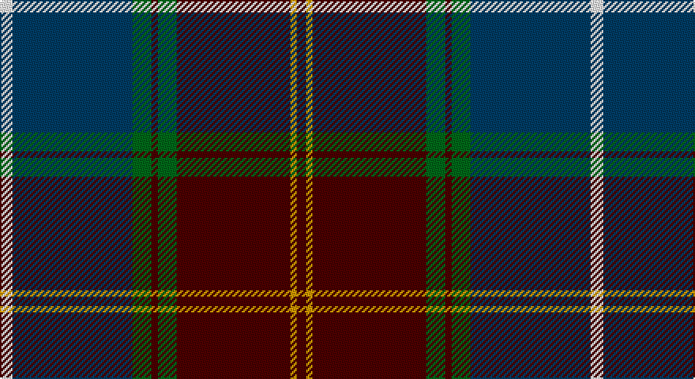

This page is one **sett** — a single exact thread-count. It belongs to the [tartan](/setts/w4dt38g6dr2g6dr36lo2dr3/)
(the same proportion at any scale), whose colour order is pattern [BYBGBGBW](/stripes/bybgbgbw/).

Part of the [Scotland 2000](/tartans/scotland-2000/) tartan — the named design grouping this sett with its other cloths.

Sourced from register-of-tartans.  It is a [8 stripe tartan](/stripes/stripes8/).

Original link https://www.tartanregister.gov.uk/tartanDetails.aspx?ref=3677

## Register references

External register numbers recorded for this tartan.

- Scottish Register of Tartans: [3677](https://www.tartanregister.gov.uk/tartanDetails.aspx?ref=3677)
- Scottish Tartans Authority (ITI): 2514
- Scottish Tartans World Register: 2514

## Thread count
W/8 DB76 G12 DR4 G12 DR72 DY4 DR/6

One full sett is **374 threads**.

## Palette

Palette: <strong>Tartan Register</strong> <small style="color:#888">(4 of 5 colours)</small>
<table><thead><tr><th>Colour</th><th>Threads</th><th>Shade</th><th>Base</th><th>OKLCh</th></tr></thead><tbody><tr><td>W/</td><td style="text-align:right;font-variant-numeric:tabular-nums">8</td><td><code style="background-color:#FFFFFF;">#FFFFFF</code> <small style="color:#888">#FFFFFF</small></td><td>W <code style="background-color:#F7F7F7;">#F7F7F7</code></td><td><small style="color:#888">oklch(100.0% 0.000 89.9)</small></td></tr><tr><td>DB</td><td style="text-align:right;font-variant-numeric:tabular-nums">76</td><td><code style="background-color:#003C64;">#003C64</code> <small style="color:#888">#003C64</small></td><td>B <code style="background-color:#2A418A;">#2A418A</code></td><td><small style="color:#888">oklch(34.5% 0.089 246.0)</small></td></tr><tr><td>G</td><td style="text-align:right;font-variant-numeric:tabular-nums">12</td><td><code style="background-color:#006818;">#006818</code> <small style="color:#888">#006818</small></td><td>G <code style="background-color:#006100;">#006100</code></td><td><small style="color:#888">oklch(45.0% 0.142 145.0)</small></td></tr><tr><td>DR</td><td style="text-align:right;font-variant-numeric:tabular-nums">4</td><td><code style="background-color:#4C0000;">#4C0000</code> <small style="color:#888">#4C0000</small></td><td>B <code style="background-color:#2A418A;">#2A418A</code></td><td><small style="color:#888">oklch(26.2% 0.107 29.2)</small></td></tr><tr><td>G</td><td style="text-align:right;font-variant-numeric:tabular-nums">12</td><td><code style="background-color:#006818;">#006818</code> <small style="color:#888">#006818</small></td><td>G <code style="background-color:#006100;">#006100</code></td><td><small style="color:#888">oklch(45.0% 0.142 145.0)</small></td></tr><tr><td>DR</td><td style="text-align:right;font-variant-numeric:tabular-nums">72</td><td><code style="background-color:#4C0000;">#4C0000</code> <small style="color:#888">#4C0000</small></td><td>B <code style="background-color:#2A418A;">#2A418A</code></td><td><small style="color:#888">oklch(26.2% 0.107 29.2)</small></td></tr><tr><td>DY</td><td style="text-align:right;font-variant-numeric:tabular-nums">4</td><td><code style="background-color:#D09800;">#D09800</code> <small style="color:#888">#D09800</small></td><td>Y <code style="background-color:#F2BF00;">#F2BF00</code></td><td><small style="color:#888">oklch(71.4% 0.147 82.1)</small></td></tr><tr><td>DR/</td><td style="text-align:right;font-variant-numeric:tabular-nums">6</td><td><code style="background-color:#4C0000;">#4C0000</code> <small style="color:#888">#4C0000</small></td><td>B <code style="background-color:#2A418A;">#2A418A</code></td><td><small style="color:#888">oklch(26.2% 0.107 29.2)</small></td></tr></tbody></table>

# Sample pattern

## Nearest tartans

The nearest existing variants by ΔTartan distance, with this tartan at the top so the swatches line up against it.

ΔTartan

Tartan

Sett

—

<a href="/ttd/edit/#slug=w4dt38g6dr2g6dr36lo2dr3~x2">Scotland 2000</a> <a class="nn-out" href="/variants/s8/w4dt38g6dr2g6dr36lo2dr3~x2/" title="open its dictionary page">↗</a>

0.62

<a href="/ttd/edit/#slug=lb4dt38g6dr2g6dr36lo2dr3~x2&amp;base=w4dt38g6dr2g6dr36lo2dr3~x2">Scotland 2000 (Commemorative)</a> <a class="nn-out" href="/variants/s8/lb4dt38g6dr2g6dr36lo2dr3~x2/" title="open its dictionary page">↗</a>

0.79

<a href="/ttd/edit/#slug=w4dt38g6r2g6r38lo2r3~x2&amp;base=w4dt38g6dr2g6dr36lo2dr3~x2">21st Century (Fashion)</a> <a class="nn-out" href="/variants/s8/w4dt38g6r2g6r38lo2r3~x2/" title="open its dictionary page">↗</a>

0.95

<a href="/ttd/edit/#slug=dp3r3dp34g18lo2g18lb2r3~x2&amp;base=w4dt38g6dr2g6dr36lo2dr3~x2">Singh</a> <a class="nn-out" href="/variants/s8/dp3r3dp34g18lo2g18lb2r3~x2/" title="open its dictionary page">↗</a>

1.01

<a href="/variants/s7/m5yii2k30yi26y2yi2ki4~x2/">Milne-Murtagh (2009)</a>

1.05

<a href="/ttd/edit/#slug=r5t2k30n26ly2n2db4~x2&amp;base=w4dt38g6dr2g6dr36lo2dr3~x2">Milne-Murtaugh (Personal)</a> <a class="nn-out" href="/variants/s7/r5t2k30n26ly2n2db4~x2/" title="open its dictionary page">↗</a>

1.10

<a href="/ttd/edit/#slug=g28k1g1k6w1k6dp1k1dp4r3dp14~x4&amp;base=w4dt38g6dr2g6dr36lo2dr3~x2">New Hampshire</a> <a class="nn-out" href="/variants/s11/g28k1g1k6w1k6dp1k1dp4r3dp14~x4/" title="open its dictionary page">↗</a>

1.11

<a href="/ttd/edit/#slug=w2db2r18db2dg20r2db40r2dg12db3r9ly2~x2&amp;base=w4dt38g6dr2g6dr36lo2dr3~x2">Kormylo (Personal)</a> <a class="nn-out" href="/variants/s12/w2db2r18db2dg20r2db40r2dg12db3r9ly2~x2/" title="open its dictionary page">↗</a>

1.12

<a href="/ttd/edit/#slug=r2y18k2y3k20dy30w2~x2&amp;base=w4dt38g6dr2g6dr36lo2dr3~x2">Bennett, J P. (Personal)</a> <a class="nn-out" href="/variants/s7/r2y18k2y3k20dy30w2~x2/" title="open its dictionary page">↗</a>

1.14

<a href="/ttd/edit/#slug=db46ly4db4ly4db6k16n66lb11r6&amp;base=w4dt38g6dr2g6dr36lo2dr3~x2">Scottish Association for Neurological Sciences</a> <a class="nn-out" href="/variants/s9/db46ly4db4ly4db6k16n66lb11r6/" title="open its dictionary page">↗</a>

1.15

<a href="/ttd/edit/#slug=b9w2dg30o6r2o2r2o6~x2&amp;base=w4dt38g6dr2g6dr36lo2dr3~x2">Ware/Warr (Name)</a> <a class="nn-out" href="/variants/s8/b9w2dg30o6r2o2r2o6~x2/" title="open its dictionary page">↗</a>

## Neighbour map

Every grey dot is one of 14360 variants placed by the first two principal components of the ΔTartan feature space (44% of its variance). Red is this tartan; blue dots are its nearest — click one to open its page.

<svg viewBox="0 0 640 380" role="img" style="max-width:100%;height:auto;border:1px solid #e0e0e0;border-radius:4px;display:block" xmlns="http://www.w3.org/2000/svg"><image href="/nn/cloud.v1.png" width="640" height="380"/><a href="/variants/s8/lb4dt38g6dr2g6dr36lo2dr3~x2/"><circle cx="292.7" cy="157.5" r="4" fill="#3465a4"><title>Scotland 2000 (Commemorative)</title></circle></a><a href="/variants/s8/w4dt38g6r2g6r38lo2r3~x2/"><circle cx="291.3" cy="145.8" r="4" fill="#3465a4"><title>21st Century (Fashion)</title></circle></a><a href="/variants/s8/dp3r3dp34g18lo2g18lb2r3~x2/"><circle cx="287.8" cy="155.2" r="4" fill="#3465a4"><title>Singh</title></circle></a><a href="/variants/s7/m5yii2k30yi26y2yi2ki4~x2/"><circle cx="243.1" cy="148.9" r="4" fill="#3465a4"><title>Milne-Murtagh (2009)</title></circle></a><a href="/variants/s7/r5t2k30n26ly2n2db4~x2/"><circle cx="235.0" cy="144.9" r="4" fill="#3465a4"><title>Milne-Murtaugh (Personal)</title></circle></a><a href="/variants/s11/g28k1g1k6w1k6dp1k1dp4r3dp14~x4/"><circle cx="274.5" cy="106.9" r="4" fill="#3465a4"><title>New Hampshire</title></circle></a><a href="/variants/s12/w2db2r18db2dg20r2db40r2dg12db3r9ly2~x2/"><circle cx="248.8" cy="120.7" r="4" fill="#3465a4"><title>Kormylo (Personal)</title></circle></a><a href="/variants/s7/r2y18k2y3k20dy30w2~x2/"><circle cx="231.9" cy="173.1" r="4" fill="#3465a4"><title>Bennett, J P. (Personal)</title></circle></a><a href="/variants/s9/db46ly4db4ly4db6k16n66lb11r6/"><circle cx="215.7" cy="128.5" r="4" fill="#3465a4"><title>Scottish Association for Neurological Sciences</title></circle></a><a href="/variants/s8/b9w2dg30o6r2o2r2o6~x2/"><circle cx="276.6" cy="145.4" r="4" fill="#3465a4"><title>Ware/Warr (Name)</title></circle></a><circle cx="274.2" cy="147.9" r="5" fill="#c00000"/></svg>

ID: /variants/s8/w4dt38g6dr2g6dr36lo2dr3~x2/
