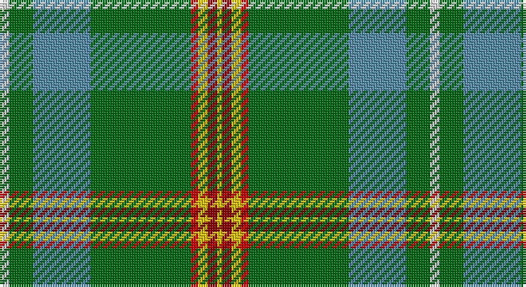

This page is one **sett** — a single exact thread-count. It belongs to the [tartan](/setts/w4g10t24g42r3ly4ri4ly2/)
(the same proportion at any scale), whose colour order is pattern [WGBGRYRY](/stripes/wgbgryry/).

Part of the [Muskoka](/tartans/muskoka/) tartan — the named design grouping this sett with its other cloths.

Sourced from house-of-tartan.  It is a [8 stripe tartan](/stripes/stripes8/).

Original link http://www.house-of-tartan.scotland.net/house/TartanViewjs.asp?colr=Def&tnam=1799

## Provenance

Earliest known date: pre 2003 A note in the Highland Society of London collection reads, 'Murray (Tullibardine) This piece of cloth was made in 1794'. The sample is woven at 54 threads to the inch. The full sett measures 15 and one quarter inches. (A. Nisbet, 1988).

## Thread count
LN/4 G10 B24 G42 R3 Y4 DR4 Ya/2

One full sett is **180 threads**.

## Palette

Palette: <strong>Tartan Register</strong>
<table><thead><tr><th>Colour</th><th>Threads</th><th>Shade</th><th>Base</th><th>OKLCh</th></tr></thead><tbody><tr><td>LN/</td><td style="text-align:right;font-variant-numeric:tabular-nums">4</td><td><code style="background-color:#E0E0E0;">#E0E0E0</code> <small style="color:#888">#E0E0E0</small></td><td>W <code style="background-color:#F7F7F7;">#F7F7F7</code></td><td><small style="color:#888">oklch(90.7% 0.000 89.9)</small></td></tr><tr><td>G</td><td style="text-align:right;font-variant-numeric:tabular-nums">10</td><td><code style="background-color:#006818;">#006818</code> <small style="color:#888">#006818</small></td><td>G <code style="background-color:#006100;">#006100</code></td><td><small style="color:#888">oklch(45.0% 0.142 145.0)</small></td></tr><tr><td>B</td><td style="text-align:right;font-variant-numeric:tabular-nums">24</td><td><code style="background-color:#5C8CA8;">#5C8CA8</code> <small style="color:#888">#5C8CA8</small></td><td>B <code style="background-color:#2A418A;">#2A418A</code></td><td><small style="color:#888">oklch(61.7% 0.067 235.0)</small></td></tr><tr><td>G</td><td style="text-align:right;font-variant-numeric:tabular-nums">42</td><td><code style="background-color:#006818;">#006818</code> <small style="color:#888">#006818</small></td><td>G <code style="background-color:#006100;">#006100</code></td><td><small style="color:#888">oklch(45.0% 0.142 145.0)</small></td></tr><tr><td>R</td><td style="text-align:right;font-variant-numeric:tabular-nums">3</td><td><code style="background-color:#C80000;">#C80000</code> <small style="color:#888">#C80000</small></td><td>R <code style="background-color:#CC0000;">#CC0000</code></td><td><small style="color:#888">oklch(52.3% 0.215 29.2)</small></td></tr><tr><td>Y</td><td style="text-align:right;font-variant-numeric:tabular-nums">4</td><td><code style="background-color:#E8C000;">#E8C000</code> <small style="color:#888">#E8C000</small></td><td>Y <code style="background-color:#F2BF00;">#F2BF00</code></td><td><small style="color:#888">oklch(81.9% 0.168 93.7)</small></td></tr><tr><td>DR</td><td style="text-align:right;font-variant-numeric:tabular-nums">4</td><td><code style="background-color:#880000;">#880000</code> <small style="color:#888">#880000</small></td><td>R <code style="background-color:#CC0000;">#CC0000</code></td><td><small style="color:#888">oklch(39.4% 0.162 29.2)</small></td></tr><tr><td>Ya/</td><td style="text-align:right;font-variant-numeric:tabular-nums">2</td><td><code style="background-color:#E8C000;">#E8C000</code> <small style="color:#888">#E8C000</small></td><td>Y <code style="background-color:#F2BF00;">#F2BF00</code></td><td><small style="color:#888">oklch(81.9% 0.168 93.7)</small></td></tr></tbody></table>

# Sample pattern

## Compared to the master

This cloth is one sett of its design; the master sett (the exemplar the design is anchored on) is below for comparison.

<figure style="margin:0"><figcaption style="color:#888;font-size:smaller">this sett</figcaption></figure>
<figure style="margin:0"><figcaption style="color:#888;font-size:smaller"><a href="/setts/w2g5t10g20r1ly2ri2ly1/">master sett →</a></figcaption></figure>

## Nearest tartans

The nearest existing variants by ΔTartan distance, with this tartan at the top so the swatches line up against it.

ΔTartan

Tartan

Sett

—

<a href="/ttd/edit/#slug=w4g10t24g42r3ly4ri4ly2">Muskoka Canadian Tartan</a> <a class="nn-out" href="/variants/s8/w4g10t24g42r3ly4ri4ly2/" title="open its dictionary page">↗</a>

0.54

<a href="/ttd/edit/#slug=w4g10t24g42r3y4ri4ly2&amp;base=w4g10t24g42r3ly4ri4ly2">Muskoka</a> <a class="nn-out" href="/variants/s8/w4g10t24g42r3y4ri4ly2/" title="open its dictionary page">↗</a>

1.12

<a href="/ttd/edit/#slug=w3r4db13g37b3k3ly2~x2&amp;base=w4g10t24g42r3ly4ri4ly2">Washington</a> <a class="nn-out" href="/variants/s7/w3r4db13g37b3k3ly2~x2/" title="open its dictionary page">↗</a>

1.13

<a href="/ttd/edit/#slug=w3r4db13g37t3k3ly2~x2&amp;base=w4g10t24g42r3ly4ri4ly2">Washington District Tartan</a> <a class="nn-out" href="/variants/s7/w3r4db13g37t3k3ly2~x2/" title="open its dictionary page">↗</a>

1.18

<a href="/ttd/edit/#slug=dp4g13db5ly3t6ly3db5n6g28w2~x2&amp;base=w4g10t24g42r3ly4ri4ly2">Highland, Green (Corporate)</a> <a class="nn-out" href="/variants/s10/dp4g13db5ly3t6ly3db5n6g28w2~x2/" title="open its dictionary page">↗</a>

1.26

<a href="/ttd/edit/#slug=db2dy12k1b5w3b5k1g30ly2~x2&amp;base=w4g10t24g42r3ly4ri4ly2">St Brigid's Parish Triple Celebratio</a> <a class="nn-out" href="/variants/s9/db2dy12k1b5w3b5k1g30ly2~x2/" title="open its dictionary page">↗</a>

1.39

<a href="/ttd/edit/#slug=k3g34b10g5r2k8dy2w3~x2&amp;base=w4g10t24g42r3ly4ri4ly2">Lambert Kai (Personal)</a> <a class="nn-out" href="/variants/s8/k3g34b10g5r2k8dy2w3~x2/" title="open its dictionary page">↗</a>

1.40

<a href="/ttd/edit/#slug=g22r3w1g2r3t16k3ly2~x4&amp;base=w4g10t24g42r3ly4ri4ly2">Stirling University (Corporate)</a> <a class="nn-out" href="/variants/s8/g22r3w1g2r3t16k3ly2~x4/" title="open its dictionary page">↗</a>

1.43

<a href="/variants/s8/g22r3k1g2r3t16ki3ly2~x4/">Stirling, University of Corporate Univ Tartan</a>

1.45

<a href="/ttd/edit/#slug=ly2g16t2w2t2w2t6g7r2w1t1p1~x2&amp;base=w4g10t24g42r3ly4ri4ly2">Fredericton</a> <a class="nn-out" href="/variants/s12/ly2g16t2w2t2w2t6g7r2w1t1p1~x2/" title="open its dictionary page">↗</a>

1.52

<a href="/ttd/edit/#slug=w1g12gi1k2m2k1gi16r1gi16g1k1ly1~x2&amp;base=w4g10t24g42r3ly4ri4ly2">Walsh (Name)</a> <a class="nn-out" href="/variants/s12/w1g12gi1k2m2k1gi16r1gi16g1k1ly1~x2/" title="open its dictionary page">↗</a>

## Neighbour map

Every grey dot is one of 14360 variants placed by the first two principal components of the ΔTartan feature space (44% of its variance). Red is this tartan; blue dots are its nearest — click one to open its page.

<svg viewBox="0 0 640 380" role="img" style="max-width:100%;height:auto;border:1px solid #e0e0e0;border-radius:4px;display:block" xmlns="http://www.w3.org/2000/svg"><image href="/nn/cloud.v1.png" width="640" height="380"/><a href="/variants/s8/w4g10t24g42r3y4ri4ly2/"><circle cx="302.0" cy="124.1" r="4" fill="#3465a4"><title>Muskoka</title></circle></a><a href="/variants/s7/w3r4db13g37b3k3ly2~x2/"><circle cx="269.5" cy="108.4" r="4" fill="#3465a4"><title>Washington</title></circle></a><a href="/variants/s7/w3r4db13g37t3k3ly2~x2/"><circle cx="282.8" cy="115.5" r="4" fill="#3465a4"><title>Washington District Tartan</title></circle></a><a href="/variants/s10/dp4g13db5ly3t6ly3db5n6g28w2~x2/"><circle cx="232.5" cy="129.2" r="4" fill="#3465a4"><title>Highland, Green (Corporate)</title></circle></a><a href="/variants/s9/db2dy12k1b5w3b5k1g30ly2~x2/"><circle cx="258.4" cy="90.5" r="4" fill="#3465a4"><title>St Brigid's Parish Triple Celebratio</title></circle></a><a href="/variants/s8/k3g34b10g5r2k8dy2w3~x2/"><circle cx="299.8" cy="136.0" r="4" fill="#3465a4"><title>Lambert Kai (Personal)</title></circle></a><a href="/variants/s8/g22r3w1g2r3t16k3ly2~x4/"><circle cx="249.9" cy="124.2" r="4" fill="#3465a4"><title>Stirling University (Corporate)</title></circle></a><a href="/variants/s8/g22r3k1g2r3t16ki3ly2~x4/"><circle cx="249.9" cy="125.0" r="4" fill="#3465a4"><title>Stirling, University of Corporate Univ Tartan</title></circle></a><a href="/variants/s12/ly2g16t2w2t2w2t6g7r2w1t1p1~x2/"><circle cx="252.0" cy="117.0" r="4" fill="#3465a4"><title>Fredericton</title></circle></a><a href="/variants/s12/w1g12gi1k2m2k1gi16r1gi16g1k1ly1~x2/"><circle cx="326.3" cy="119.5" r="4" fill="#3465a4"><title>Walsh (Name)</title></circle></a><circle cx="292.3" cy="117.9" r="5" fill="#c00000"/></svg>

ID: /variants/s8/w4g10t24g42r3ly4ri4ly2/
