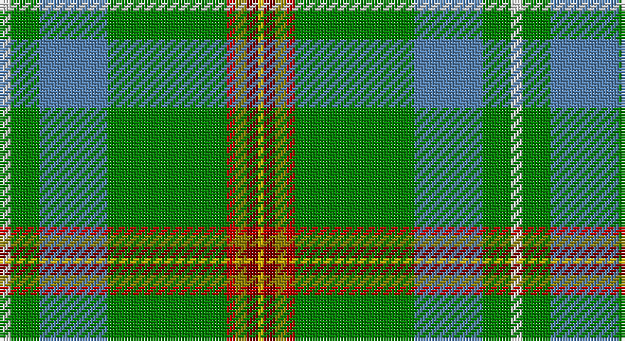

This page is one **sett** — a single exact thread-count. It belongs to the [tartan](/setts/w4g10t24g42r3y4ri4ly2/)
(the same proportion at any scale), whose colour order is pattern [WGBGRGRY](/stripes/wgbgrgry/).

Sourced from weddslist.  It is a [8 stripe tartan](/stripes/stripes8/).

Original link http://www.weddslist.com/cgi-bin/tartans/pg.pl?source=sts

## Thread count
LN/4 G10 B24 G42 R3 LG4 DR4 Y/2

One full sett is **180 threads**.

## Palette

Palette: <strong>Tartan Dictionary</strong> <small style="color:#888">(1 of 7 colours)</small>
<table><thead><tr><th>Colour</th><th>Threads</th><th>Shade</th><th>Base</th><th>OKLCh</th></tr></thead><tbody><tr><td>LN/</td><td style="text-align:right;font-variant-numeric:tabular-nums">4</td><td><code style="background-color:#E0E0E0;">#E0E0E0</code> <small style="color:#888">#E0E0E0</small></td><td>W <code style="background-color:#F7F7F7;">#F7F7F7</code></td><td><small style="color:#888">oklch(90.7% 0.000 89.9)</small></td></tr><tr><td>G</td><td style="text-align:right;font-variant-numeric:tabular-nums">10</td><td><code style="background-color:#008000;">#008000</code> <small style="color:#888">#008000</small></td><td>G <code style="background-color:#006100;">#006100</code></td><td><small style="color:#888">oklch(52.0% 0.177 142.5)</small></td></tr><tr><td>B</td><td style="text-align:right;font-variant-numeric:tabular-nums">24</td><td><code style="background-color:#5480B0;">#5480B0</code> <small style="color:#888">#5480B0</small></td><td>B <code style="background-color:#2A418A;">#2A418A</code></td><td><small style="color:#888">oklch(58.8% 0.089 251.5)</small></td></tr><tr><td>G</td><td style="text-align:right;font-variant-numeric:tabular-nums">42</td><td><code style="background-color:#008000;">#008000</code> <small style="color:#888">#008000</small></td><td>G <code style="background-color:#006100;">#006100</code></td><td><small style="color:#888">oklch(52.0% 0.177 142.5)</small></td></tr><tr><td>R</td><td style="text-align:right;font-variant-numeric:tabular-nums">3</td><td><code style="background-color:#C00000;">#C00000</code> <small style="color:#888">#C00000</small></td><td>R <code style="background-color:#CC0000;">#CC0000</code></td><td><small style="color:#888">oklch(50.7% 0.208 29.2)</small></td></tr><tr><td>LG</td><td style="text-align:right;font-variant-numeric:tabular-nums">4</td><td><code style="background-color:#908000;">#908000</code> <small style="color:#888">#908000</small></td><td>G <code style="background-color:#006100;">#006100</code></td><td><small style="color:#888">oklch(59.6% 0.124 100.6)</small></td></tr><tr><td>DR</td><td style="text-align:right;font-variant-numeric:tabular-nums">4</td><td><code style="background-color:#800000;">#800000</code> <small style="color:#888">#800000</small></td><td>R <code style="background-color:#CC0000;">#CC0000</code></td><td><small style="color:#888">oklch(37.7% 0.155 29.2)</small></td></tr><tr><td>Y/</td><td style="text-align:right;font-variant-numeric:tabular-nums">2</td><td><code style="background-color:#F0C000;">#F0C000</code> <small style="color:#888">#F0C000</small></td><td>Y <code style="background-color:#F2BF00;">#F2BF00</code></td><td><small style="color:#888">oklch(82.7% 0.169 90.5)</small></td></tr></tbody></table>

# Sample pattern

## Nearest tartans

The nearest existing variants by ΔTartan distance, with this tartan at the top so the swatches line up against it.

ΔTartan

Tartan

Sett

—

<a href="/ttd/edit/#slug=w4g10t24g42r3y4ri4ly2">Muskoka</a> <a class="nn-out" href="/variants/s8/w4g10t24g42r3y4ri4ly2/" title="open its dictionary page">↗</a>

0.54

<a href="/ttd/edit/#slug=w4g10t24g42r3ly4ri4ly2&amp;base=w4g10t24g42r3y4ri4ly2">Muskoka Canadian Tartan</a> <a class="nn-out" href="/variants/s8/w4g10t24g42r3ly4ri4ly2/" title="open its dictionary page">↗</a>

1.28

<a href="/ttd/edit/#slug=w1g12gi1k2m2k1gi16r1gi16g1k1ly1~x2&amp;base=w4g10t24g42r3y4ri4ly2">Walsh (Name)</a> <a class="nn-out" href="/variants/s12/w1g12gi1k2m2k1gi16r1gi16g1k1ly1~x2/" title="open its dictionary page">↗</a>

1.36

<a href="/ttd/edit/#slug=gi62o3gi3o31k4g5t5r3~x2&amp;base=w4g10t24g42r3y4ri4ly2">Sheffield, City of (District)</a> <a class="nn-out" href="/variants/s8/gi62o3gi3o31k4g5t5r3~x2/" title="open its dictionary page">↗</a>

1.49

<a href="/ttd/edit/#slug=db2dy12k1b5w3b5k1g30ly2~x2&amp;base=w4g10t24g42r3y4ri4ly2">St Brigid's Parish Triple Celebratio</a> <a class="nn-out" href="/variants/s9/db2dy12k1b5w3b5k1g30ly2~x2/" title="open its dictionary page">↗</a>

1.50

<a href="/ttd/edit/#slug=dp4g13db5ly3t6ly3db5n6g28w2~x2&amp;base=w4g10t24g42r3y4ri4ly2">Highland, Green (Corporate)</a> <a class="nn-out" href="/variants/s10/dp4g13db5ly3t6ly3db5n6g28w2~x2/" title="open its dictionary page">↗</a>

1.56

<a href="/ttd/edit/#slug=w3r4db13g37b3k3ly2~x2&amp;base=w4g10t24g42r3y4ri4ly2">Washington</a> <a class="nn-out" href="/variants/s7/w3r4db13g37b3k3ly2~x2/" title="open its dictionary page">↗</a>

1.58

<a href="/ttd/edit/#slug=ly2g16t2w2t2w2t6g7r2w1t1p1~x2&amp;base=w4g10t24g42r3y4ri4ly2">Fredericton</a> <a class="nn-out" href="/variants/s12/ly2g16t2w2t2w2t6g7r2w1t1p1~x2/" title="open its dictionary page">↗</a>

1.58

<a href="/ttd/edit/#slug=w3r4db13g37t3k3ly2~x2&amp;base=w4g10t24g42r3y4ri4ly2">Washington District Tartan</a> <a class="nn-out" href="/variants/s7/w3r4db13g37t3k3ly2~x2/" title="open its dictionary page">↗</a>

1.64

<a href="/ttd/edit/#slug=g6ti22g6dy20ly1g45t1w5~x2&amp;base=w4g10t24g42r3y4ri4ly2">Elbrick Hunting (Personal)</a> <a class="nn-out" href="/variants/s8/g6ti22g6dy20ly1g45t1w5~x2/" title="open its dictionary page">↗</a>

1.67

<a href="/ttd/edit/#slug=g50dg3k3dg9db7dg2w4dg2r5dg2g8dg5ly4~x2&amp;base=w4g10t24g42r3y4ri4ly2">Irish American</a> <a class="nn-out" href="/variants/s13/g50dg3k3dg9db7dg2w4dg2r5dg2g8dg5ly4~x2/" title="open its dictionary page">↗</a>

## Neighbour map

Every grey dot is one of 14360 variants placed by the first two principal components of the ΔTartan feature space (44% of its variance). Red is this tartan; blue dots are its nearest — click one to open its page.

<svg viewBox="0 0 640 380" role="img" style="max-width:100%;height:auto;border:1px solid #e0e0e0;border-radius:4px;display:block" xmlns="http://www.w3.org/2000/svg"><image href="/nn/cloud.v1.png" width="640" height="380"/><a href="/variants/s8/w4g10t24g42r3ly4ri4ly2/"><circle cx="292.3" cy="117.9" r="4" fill="#3465a4"><title>Muskoka Canadian Tartan</title></circle></a><a href="/variants/s12/w1g12gi1k2m2k1gi16r1gi16g1k1ly1~x2/"><circle cx="326.3" cy="119.5" r="4" fill="#3465a4"><title>Walsh (Name)</title></circle></a><a href="/variants/s8/gi62o3gi3o31k4g5t5r3~x2/"><circle cx="364.0" cy="142.1" r="4" fill="#3465a4"><title>Sheffield, City of (District)</title></circle></a><a href="/variants/s9/db2dy12k1b5w3b5k1g30ly2~x2/"><circle cx="258.4" cy="90.5" r="4" fill="#3465a4"><title>St Brigid's Parish Triple Celebratio</title></circle></a><a href="/variants/s10/dp4g13db5ly3t6ly3db5n6g28w2~x2/"><circle cx="232.5" cy="129.2" r="4" fill="#3465a4"><title>Highland, Green (Corporate)</title></circle></a><a href="/variants/s7/w3r4db13g37b3k3ly2~x2/"><circle cx="269.5" cy="108.4" r="4" fill="#3465a4"><title>Washington</title></circle></a><a href="/variants/s12/ly2g16t2w2t2w2t6g7r2w1t1p1~x2/"><circle cx="252.0" cy="117.0" r="4" fill="#3465a4"><title>Fredericton</title></circle></a><a href="/variants/s7/w3r4db13g37t3k3ly2~x2/"><circle cx="282.8" cy="115.5" r="4" fill="#3465a4"><title>Washington District Tartan</title></circle></a><a href="/variants/s8/g6ti22g6dy20ly1g45t1w5~x2/"><circle cx="345.3" cy="127.6" r="4" fill="#3465a4"><title>Elbrick Hunting (Personal)</title></circle></a><a href="/variants/s13/g50dg3k3dg9db7dg2w4dg2r5dg2g8dg5ly4~x2/"><circle cx="314.9" cy="83.7" r="4" fill="#3465a4"><title>Irish American</title></circle></a><circle cx="302.0" cy="124.1" r="5" fill="#c00000"/></svg>

ID: /variants/s8/w4g10t24g42r3y4ri4ly2/
