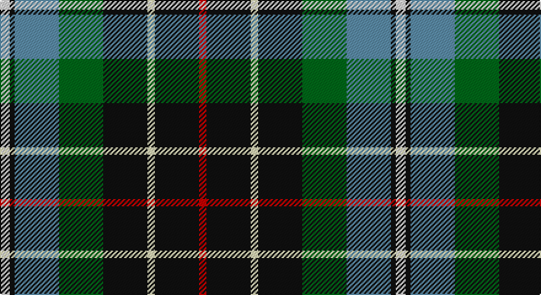

This page is one **sett** — a single exact thread-count. It belongs to the [tartan](/setts/w4k2t18g18k18wi3k18r3/)
(the same proportion at any scale), whose colour order is pattern [RKWKGBKW](/stripes/rkwkgbkw/).

Part of the [Hislop](/tartans/hislop/) tartan — the named design grouping this sett with its other cloths.

Sourced from tartans-authority.  It is a [8 stripe tartan](/stripes/stripes8/).

Original link http://www.tartansauthority.com/tartan-ferret/display/2137/

## Also known as

This cloth is also recorded under:

- Hislop hunting

## Register references

External register numbers recorded for this tartan.

- Scottish Tartans Authority (ITI): 2137

## Thread count
LN/8 K4 B36 G36 K36 W6 K36 R/6

One full sett is **322 threads**.

## Palette

Palette: <strong>Tartan Register</strong> <small style="color:#888">(5 of 6 colours)</small>
<table><thead><tr><th>Colour</th><th>Threads</th><th>Shade</th><th>Base</th><th>OKLCh</th></tr></thead><tbody><tr><td>LN/</td><td style="text-align:right;font-variant-numeric:tabular-nums">8</td><td><code style="background-color:#E0E0E0;">#E0E0E0</code> <small style="color:#888">#E0E0E0</small></td><td>W <code style="background-color:#F7F7F7;">#F7F7F7</code></td><td><small style="color:#888">oklch(90.7% 0.000 89.9)</small></td></tr><tr><td>K</td><td style="text-align:right;font-variant-numeric:tabular-nums">4</td><td><code style="background-color:#101010;">#101010</code> <small style="color:#888">#101010</small></td><td>K <code style="background-color:#000000;">#000000</code></td><td><small style="color:#888">oklch(17.3% 0.000 89.9)</small></td></tr><tr><td>B</td><td style="text-align:right;font-variant-numeric:tabular-nums">36</td><td><code style="background-color:#5C8CA8;">#5C8CA8</code> <small style="color:#888">#5C8CA8</small></td><td>B <code style="background-color:#2A418A;">#2A418A</code></td><td><small style="color:#888">oklch(61.7% 0.067 235.0)</small></td></tr><tr><td>G</td><td style="text-align:right;font-variant-numeric:tabular-nums">36</td><td><code style="background-color:#006818;">#006818</code> <small style="color:#888">#006818</small></td><td>G <code style="background-color:#006100;">#006100</code></td><td><small style="color:#888">oklch(45.0% 0.142 145.0)</small></td></tr><tr><td>K</td><td style="text-align:right;font-variant-numeric:tabular-nums">36</td><td><code style="background-color:#101010;">#101010</code> <small style="color:#888">#101010</small></td><td>K <code style="background-color:#000000;">#000000</code></td><td><small style="color:#888">oklch(17.3% 0.000 89.9)</small></td></tr><tr><td>W</td><td style="text-align:right;font-variant-numeric:tabular-nums">6</td><td><code style="background-color:#E8E8B8;">#E8E8B8</code> <small style="color:#888">#E8E8B8</small></td><td>W <code style="background-color:#F7F7F7;">#F7F7F7</code></td><td><small style="color:#888">oklch(91.9% 0.063 107.6)</small></td></tr><tr><td>K</td><td style="text-align:right;font-variant-numeric:tabular-nums">36</td><td><code style="background-color:#101010;">#101010</code> <small style="color:#888">#101010</small></td><td>K <code style="background-color:#000000;">#000000</code></td><td><small style="color:#888">oklch(17.3% 0.000 89.9)</small></td></tr><tr><td>R/</td><td style="text-align:right;font-variant-numeric:tabular-nums">6</td><td><code style="background-color:#C80000;">#C80000</code> <small style="color:#888">#C80000</small></td><td>R <code style="background-color:#CC0000;">#CC0000</code></td><td><small style="color:#888">oklch(52.3% 0.215 29.2)</small></td></tr></tbody></table>

# Sample pattern

## Compared to the master

This cloth is one sett of its design; the master sett (the exemplar the design is anchored on) is below for comparison.

<figure style="margin:0"><figcaption style="color:#888;font-size:smaller">this sett</figcaption></figure>
<figure style="margin:0"><figcaption style="color:#888;font-size:smaller"><a href="/setts/r2k8ly1k8g8db8k2w2/">master sett →</a></figcaption></figure>

## Nearest tartans

The nearest existing variants by ΔTartan distance, with this tartan at the top so the swatches line up against it.

ΔTartan

Tartan

Sett

—

<a href="/ttd/edit/#slug=w4k2t18g18k18wi3k18r3~x2">Hislop (Name)</a> <a class="nn-out" href="/variants/s8/w4k2t18g18k18wi3k18r3~x2/" title="open its dictionary page">↗</a>

0.69

<a href="/ttd/edit/#slug=g16gi2p13t2k6ly2g16t2k12~x2&amp;base=w4k2t18g18k18wi3k18r3~x2">Wilson's, No 225</a> <a class="nn-out" href="/variants/s9/g16gi2p13t2k6ly2g16t2k12~x2/" title="open its dictionary page">↗</a>

0.97

<a href="/ttd/edit/#slug=r1n8k4g1g4g1k4n8ly1~x6&amp;base=w4k2t18g18k18wi3k18r3~x2">Quinn</a> <a class="nn-out" href="/variants/s9/r1n8k4g1g4g1k4n8ly1~x6/" title="open its dictionary page">↗</a>

0.97

<a href="/ttd/edit/#slug=r9g18k6g6k3ly3g6db8w3~x2&amp;base=w4k2t18g18k18wi3k18r3~x2">Bisset</a> <a class="nn-out" href="/variants/s9/r9g18k6g6k3ly3g6db8w3~x2/" title="open its dictionary page">↗</a>

1.01

<a href="/ttd/edit/#slug=k6g14t2r3t2k16ly2b16g16r3~x2&amp;base=w4k2t18g18k18wi3k18r3~x2">Unnamed 4</a> <a class="nn-out" href="/variants/s10/k6g14t2r3t2k16ly2b16g16r3~x2/" title="open its dictionary page">↗</a>

1.03

<a href="/ttd/edit/#slug=db2r1db10w1y4g8lo1g2~x4&amp;base=w4k2t18g18k18wi3k18r3~x2">Ayrshire (District)</a> <a class="nn-out" href="/variants/s8/db2r1db10w1y4g8lo1g2~x4/" title="open its dictionary page">↗</a>

1.04

<a href="/ttd/edit/#slug=k6dg14t2r3t2k16ly2b16dg16r3~x2&amp;base=w4k2t18g18k18wi3k18r3~x2">Unidentified #37</a> <a class="nn-out" href="/variants/s10/k6dg14t2r3t2k16ly2b16dg16r3~x2/" title="open its dictionary page">↗</a>

1.05

<a href="/ttd/edit/#slug=k3gi2k12db4g19r3g19db4k12gi2ly3~x2&amp;base=w4k2t18g18k18wi3k18r3~x2">Loch Lomond Millenium Comemmorative Tartan</a> <a class="nn-out" href="/variants/s11/k3gi2k12db4g19r3g19db4k12gi2ly3~x2/" title="open its dictionary page">↗</a>

1.06

<a href="/ttd/edit/#slug=o5dt30w3dg15ly8r4~x2&amp;base=w4k2t18g18k18wi3k18r3~x2">Carleton College Rugby</a> <a class="nn-out" href="/variants/s6/o5dt30w3dg15ly8r4~x2/" title="open its dictionary page">↗</a>

1.07

<a href="/ttd/edit/#slug=r2k8ly2k7ly1k1w3k2g9db8r2~x2&amp;base=w4k2t18g18k18wi3k18r3~x2">Hislop Hunting (Name)</a> <a class="nn-out" href="/variants/s11/r2k8ly2k7ly1k1w3k2g9db8r2~x2/" title="open its dictionary page">↗</a>

1.07

<a href="/ttd/edit/#slug=k10ly3k2b20k10g15k2r3w3~x2&amp;base=w4k2t18g18k18wi3k18r3~x2">McCuaig (2010) (Name)</a> <a class="nn-out" href="/variants/s9/k10ly3k2b20k10g15k2r3w3~x2/" title="open its dictionary page">↗</a>

## Neighbour map

Every grey dot is one of 14360 variants placed by the first two principal components of the ΔTartan feature space (44% of its variance). Red is this tartan; blue dots are its nearest — click one to open its page.

<svg viewBox="0 0 640 380" role="img" style="max-width:100%;height:auto;border:1px solid #e0e0e0;border-radius:4px;display:block" xmlns="http://www.w3.org/2000/svg"><image href="/nn/cloud.v1.png" width="640" height="380"/><a href="/variants/s9/g16gi2p13t2k6ly2g16t2k12~x2/"><circle cx="134.6" cy="169.8" r="4" fill="#3465a4"><title>Wilson's, No 225</title></circle></a><a href="/variants/s9/r1n8k4g1g4g1k4n8ly1~x6/"><circle cx="180.0" cy="174.7" r="4" fill="#3465a4"><title>Quinn</title></circle></a><a href="/variants/s9/r9g18k6g6k3ly3g6db8w3~x2/"><circle cx="123.3" cy="184.1" r="4" fill="#3465a4"><title>Bisset</title></circle></a><a href="/variants/s10/k6g14t2r3t2k16ly2b16g16r3~x2/"><circle cx="91.8" cy="158.3" r="4" fill="#3465a4"><title>Unnamed 4</title></circle></a><a href="/variants/s8/db2r1db10w1y4g8lo1g2~x4/"><circle cx="152.4" cy="154.1" r="4" fill="#3465a4"><title>Ayrshire (District)</title></circle></a><a href="/variants/s10/k6dg14t2r3t2k16ly2b16dg16r3~x2/"><circle cx="113.2" cy="170.5" r="4" fill="#3465a4"><title>Unidentified #37</title></circle></a><a href="/variants/s11/k3gi2k12db4g19r3g19db4k12gi2ly3~x2/"><circle cx="180.4" cy="159.6" r="4" fill="#3465a4"><title>Loch Lomond Millenium Comemmorative Tartan</title></circle></a><a href="/variants/s6/o5dt30w3dg15ly8r4~x2/"><circle cx="171.4" cy="168.8" r="4" fill="#3465a4"><title>Carleton College Rugby</title></circle></a><a href="/variants/s11/r2k8ly2k7ly1k1w3k2g9db8r2~x2/"><circle cx="105.0" cy="156.0" r="4" fill="#3465a4"><title>Hislop Hunting (Name)</title></circle></a><a href="/variants/s9/k10ly3k2b20k10g15k2r3w3~x2/"><circle cx="115.1" cy="160.5" r="4" fill="#3465a4"><title>McCuaig (2010) (Name)</title></circle></a><circle cx="145.4" cy="176.4" r="5" fill="#c00000"/></svg>

ID: /variants/s8/w4k2t18g18k18wi3k18r3~x2/
